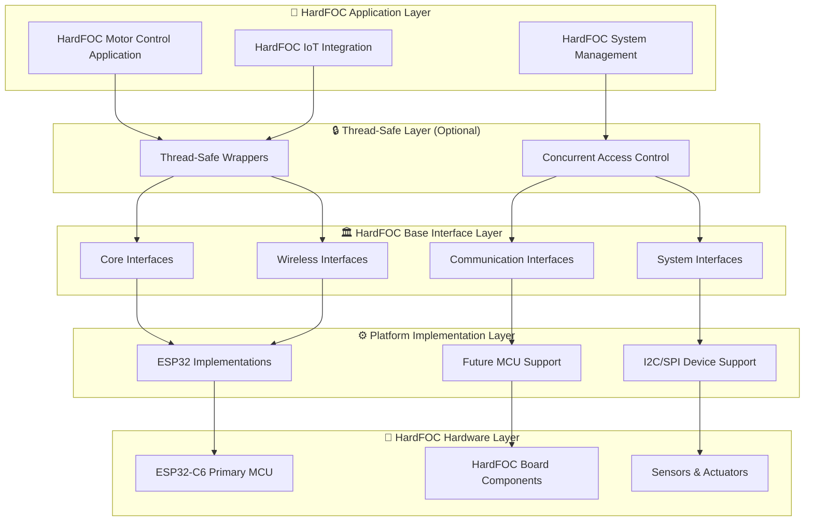

# 🚀 HardFOC Internal Interface Wrapper

<div align="center">


**🎯 Comprehensive Hardware Abstraction Layer for HardFOC Motor Controller Boards**

*A professional, platform-agnostic interface wrapper specifically designed for HardFOC motor controller boards, providing unified APIs across different MCU implementations with complete wireless, communication, and sensor support*

</div>

---

## 📚 **Table of Contents**

- [🎯 **Overview**](#-overview)
- [🏗️ **Architecture**](#️-architecture)
- [✨ **Key Features**](#-key-features)
- [🔌 **Complete Interface Support**](#-complete-interface-support)
- [🚀 **Quick Start**](#-quick-start)
- [📖 **Documentation**](#-documentation)
- [🔧 **Building**](#-building)
- [📊 **Examples**](#-examples)
- [🤝 **Contributing**](#-contributing)
- [📄 **License**](#-license)

---

## 🎯 **Overview**

The **HardFOC Internal Interface Wrapper** is a comprehensive, production-ready hardware abstraction layer specifically designed for **HardFOC motor controller boards**. It provides unified APIs across different MCU platforms while maintaining the high performance, thread safety, and extensive hardware support that HardFOC motor controller boards require, including wireless communication, sensors, and advanced peripherals.

### 🏆 **Why Choose This Wrapper for HardFOC Boards?**

- **🎯 HardFOC Optimized** - Designed specifically for HardFOC motor controller boards and their real-time requirements
- **🔌 Complete Hardware Coverage** - 14 comprehensive base interfaces covering all aspects of HardFOC boards
- **📈 Production Ready** - Professional-grade error handling, logging, and monitoring for HardFOC applications
- **🌐 Modern Connectivity** - Full WiFi and Bluetooth support for IoT-enabled HardFOC motor controller boards
- **🛡️ Industrial Grade** - Robust design for critical HardFOC motor control applications
- **📚 Extensively Documented** - Complete API documentation with HardFOC-specific examples

---

## 🏗️ **Architecture**

The wrapper follows a multi-layered architecture that maximizes flexibility, maintainability, and performance for HardFOC motor controller boards:



### 🔧 **Consistent Type System**

All interfaces use a unified type system for maximum portability and consistency across HardFOC motor controller boards:

```cpp
// Platform-agnostic type definitions for HardFOC boards
using hf_u8_t = uint8_t;    // 8-bit unsigned
using hf_u16_t = uint16_t;  // 16-bit unsigned  
using hf_u32_t = uint32_t;  // 32-bit unsigned
using hf_u64_t = uint64_t;  // 64-bit unsigned

// Hardware-specific semantic types for HardFOC applications
using hf_pin_num_t = hf_i32_t;      // GPIO pin numbers
using hf_channel_id_t = hf_u32_t;   // ADC/PWM/DMA channels
using hf_frequency_hz_t = hf_u32_t; // Frequency values in Hz
using hf_timeout_ms_t = hf_u32_t;   // Timeout values in milliseconds
```

---

## ✨ **Key Features**

### 🔌 **Comprehensive Hardware Support for HardFOC Boards**
- **14 Complete Interfaces** - From basic GPIO to advanced wireless communication for HardFOC applications
- **MCU Platform Agnostic** - Currently implemented for ESP32-C6, designed for future MCU support
- **External Hardware** - Extensive support for I2C/SPI devices and external controllers commonly used with HardFOC boards
- **Sensor Integration** - Built-in support for temperature, motor feedback, and diagnostic sensors used in HardFOC systems

### ⚡ **Performance & Reliability for HardFOC Applications**
- **Real-Time Optimized** - Designed for critical motor control timing requirements of HardFOC boards
- **Thread-Safe Options** - Optional thread-safe wrappers for concurrent HardFOC applications
- **Lazy Initialization** - Resources allocated only when needed for optimal memory usage on HardFOC boards
- **Comprehensive Error Handling** - Detailed error codes and validation across all interfaces for HardFOC reliability

### 🌐 **Modern Connectivity for HardFOC IoT Applications**
- **WiFi Support** - Complete station/AP modes with WPA3 security for HardFOC IoT integration
- **Bluetooth Integration** - Both Classic and BLE support for mobile integration with HardFOC boards
- **IoT Ready** - Built-in networking capabilities for cloud connectivity of HardFOC motor controller systems
- **Remote Monitoring** - Advanced logging with network output support for HardFOC diagnostics

### 📊 **Professional Features for HardFOC Systems**
- **Advanced Logging** - Multi-level logging with multiple output destinations for HardFOC debugging
- **Performance Monitoring** - Built-in diagnostics and performance tracking for HardFOC optimization
- **Configuration Management** - Non-volatile storage for HardFOC system settings
- **Thermal Management** - Comprehensive temperature monitoring and protection for HardFOC boards

---

## 🔌 **Complete Interface Support**

### 🏛️ **Core Interfaces for HardFOC Boards**
| Interface | Description | Key Features | HardFOC Hardware Support |
|-----------|-------------|--------------|------------------|
| [`BaseGpio`](docs/api/BaseGpio.md) | 🔌 Digital I/O Operations | Dynamic modes, interrupts, pull resistors | ESP32-C6, I2C/SPI Expanders |
| [`BaseAdc`](docs/api/BaseAdc.md) | 📊 Analog-to-Digital Conversion | Multi-channel, calibration, voltage conversion | ESP32-C6, External ADCs |
| [`BasePwm`](docs/api/BasePwm.md) | 🎛️ Pulse Width Modulation | Multi-channel, frequency control, motor drive | ESP32-C6, External Controllers |
| [`BasePio`](docs/api/BasePio.md) | 📻 Programmable I/O | Custom protocols, precise timing, encoding | ESP32-C6 RMT |

### 📡 **Communication Interfaces for HardFOC Systems**
| Interface | Description | Key Features | HardFOC Hardware Support |
|-----------|-------------|--------------|------------------|
| [`BaseI2c`](docs/api/BaseI2c.md) | 🔄 I2C Communication | Master mode, device scanning, error recovery | ESP32-C6, Software I2C |
| [`BaseSpi`](docs/api/BaseSpi.md) | ⚡ SPI Communication | Full-duplex, configurable modes, DMA support | ESP32-C6, Software SPI |
| [`BaseUart`](docs/api/BaseUart.md) | 📡 UART Communication | Async I/O, flow control, configurable parameters | ESP32-C6, USB-Serial |
| [`BaseCan`](docs/api/BaseCan.md) | 🚗 CAN Bus Communication | Standard/Extended frames, filtering, error handling | ESP32-C6 TWAI, External CAN |

### 🌐 **Wireless Interfaces for HardFOC IoT**
| Interface | Description | Key Features | HardFOC Hardware Support |
|-----------|-------------|--------------|------------------|
| [`BaseWifi`](docs/api/BaseWifi.md) | 📶 WiFi Communication | Station/AP modes, WPA3 security, mesh networking | ESP32-C6 WiFi |
| [`BaseBluetooth`](docs/api/BaseBluetooth.md) | 📲 Bluetooth Communication | Classic & BLE, pairing, service discovery | ESP32-C6 Bluetooth |

### 🛠️ **System Interfaces for HardFOC Applications**
| Interface | Description | Key Features | HardFOC Hardware Support |
|-----------|-------------|--------------|------------------|
| [`BaseNvs`](docs/api/BaseNvs.md) | 💾 Non-Volatile Storage | Key-value storage, encryption, wear leveling | ESP32-C6 Flash, External |
| [`BasePeriodicTimer`](docs/api/BasePeriodicTimer.md) | ⏰ Periodic Timers | Callback scheduling, high precision, multi-timer | ESP32-C6 Hardware Timers |
| [`BaseTemperature`](docs/api/BaseTemperature.md) | 🌡️ Temperature Sensing | Multi-sensor support, calibration, thermal protection | Internal, I2C, 1-Wire Sensors |
| [`BaseLogger`](docs/api/BaseLogger.md) | 📝 System Logging | Multi-level logging, thread-safe, network output | UART, File, Network, Memory |

### 📊 **HardFOC Implementation Status Matrix**

| **Component** | **Interface Status** | **ESP32-C6 Implementation** | **Status** | **HardFOC Use Cases** |
|---------------|---------------------|-----------------------------|-----------|-----------------------|
| **GPIO** | ✅ Complete | ✅ EspGpio | ✅ Production Ready | Enable pins, limit switches, status LEDs |
| **ADC** | ✅ Complete | ✅ EspAdc | ✅ Production Ready | Current sensing, position feedback |
| **PWM** | ✅ Complete | ✅ EspPwm | ✅ Production Ready | Motor speed control, servo control |
| **I2C** | ✅ Complete | ✅ EspI2c | ✅ Production Ready | Sensor communication, display control |
| **SPI** | ✅ Complete | ✅ EspSpi | ✅ Production Ready | High-speed motor controller communication |
| **UART** | ✅ Complete | ✅ EspUart | ✅ Production Ready | Debug output, external communication |
| **CAN** | ✅ Complete | ✅ EspCan | ✅ Production Ready | Industrial networking, multi-motor coordination |
| **WiFi** | ✅ Complete | ✅ EspWifi | ✅ Production Ready | Cloud connectivity, remote monitoring |
| **Bluetooth** | ✅ Complete | ✅ EspBluetooth | ✅ Production Ready | Mobile apps, wireless configuration |
| **NVS** | ✅ Complete | ✅ EspNvs | ✅ Production Ready | Configuration storage, calibration data |
| **Timer** | ✅ Complete | ✅ EspPeriodicTimer | ✅ Production Ready | Control loops, sensor sampling |
| **Temperature** | ✅ Complete | ✅ EspTemperature | ✅ Production Ready | Thermal monitoring, safety protection |
| **PIO** | ✅ Complete | ✅ EspPio | ✅ Production Ready | Encoder reading, custom protocols |
| **Logger** | ✅ Complete | ✅ EspLogger | ✅ Production Ready | System diagnostics, performance monitoring |

---

## 🚀 **Quick Start**

### 📋 **Prerequisites**

- **ESP-IDF v5.0+** for ESP32-C6 development
- **C++17** compatible compiler (GCC 8+ or Clang 7+)
- **CMake 3.16+** for build system management
- **HardFOC Motor Controller Board** with ESP32-C6

### ⚙️ **Installation**

1. **Clone the repository:**
```bash
git clone https://github.com/hardfoc/hf-internal-interface-wrap.git
cd hf-internal-interface-wrap
```

2. **Add to your HardFOC project:**
```cmake
# In your HardFOC project's CMakeLists.txt
idf_component_register(
    SRCS "main.cpp"
    INCLUDE_DIRS "."
    REQUIRES hf_internal_interface_wrap
)
```

3. **Include the headers:**
```cpp
// Core interfaces for HardFOC boards
#include "inc/base/BaseGpio.h"
#include "inc/base/BaseAdc.h"
#include "inc/base/BasePwm.h"
#include "inc/base/BaseWifi.h"
#include "inc/base/BaseTemperature.h"

// ESP32 implementations for HardFOC boards
#include "inc/mcu/esp32/EspGpio.h"
#include "inc/mcu/esp32/EspAdc.h"
#include "inc/mcu/esp32/EspPwm.h"
#include "inc/mcu/esp32/EspWifi.h"
#include "inc/mcu/esp32/EspTemperature.h"
```

### 🖥️ **VS Code Development Environment Setup**

The project includes a pre-configured VS Code environment for seamless HardFOC development. The `.vscode` folder contains all necessary configurations for IntelliSense, building, and flashing.

#### **Prerequisites**
- **VS Code** or **Cursor IDE** with C/C++ extension
- **ESP-IDF v5.0+** installed and sourced

#### **Quick Setup**
1. **Source ESP-IDF environment:**
   ```bash
   source ~/esp/esp-idf/export.sh
   ```

2. **Open the project in VS Code:**
   ```bash
   code .  # or open VS Code and File -> Open Folder
   ```

3. **Install C/C++ extension** if prompted

4. **Reload VS Code window** (Ctrl+Shift+P → "Developer: Reload Window")

#### **What's Pre-Configured**
- ✅ **Complete IntelliSense** for ESP-IDF and project files
- ✅ **Build and flash tasks** for all 16 examples
- ✅ **Proper include paths** and compiler settings
- ✅ **Computer agnostic** configuration (works on any system)
- ✅ **Organized task categories** (Peripheral, Sensor, Utility, etc.)

#### **Available Tasks**
- **Build Tasks**: Build any example in Debug/Release mode
- **Flash Tasks**: Flash and monitor any example
- **Utility Tasks**: Clean builds, regenerate compile commands

#### **Using Tasks**
1. Press `Ctrl+Shift+P` → "Tasks: Run Task"
2. Select from available tasks:
   - **Build GPIO Test (Release)** - Build GPIO example
   - **Flash PWM Test (Release)** - Flash PWM example
   - **Clean All Builds** - Remove all build directories

#### **Troubleshooting VS Code Setup**
- **IntelliSense not working**: Ensure ESP-IDF is sourced and reload VS Code
- **Tasks not found**: Check that you're in the workspace root
- **Path issues**: Run the toolchain update script in `.vscode/` folder

For detailed VS Code configuration information, see [`.vscode/README.md`](.vscode/README.md).

### 💡 **HardFOC Motor Controller Example**

*This example demonstrates how to integrate with a TMC9660-style motor controller using the HardFOC wrapper interfaces*

```cpp
#include "inc/mcu/esp32/EspGpio.h"
#include "inc/mcu/esp32/EspAdc.h"
#include "inc/mcu/esp32/EspPwm.h"
#include "inc/mcu/esp32/EspTemperature.h"
#include "inc/mcu/esp32/EspLogger.h"
#include "inc/mcu/esp32/EspSpi.h"

class HardFOCMotorController {
private:
    EspGpio enable_pin_;
    EspSpi motor_controller_spi_;  // For TMC9660 or similar motor controller
    EspAdc current_sensor_;
    EspTemperature temp_sensor_;
    EspLogger logger_;
    
public:
    HardFOCMotorController() 
        : enable_pin_(GPIO_NUM_2, hf_gpio_direction_t::HF_GPIO_DIRECTION_OUTPUT)
        , motor_controller_spi_(SPI2_HOST, GPIO_NUM_18, GPIO_NUM_19, GPIO_NUM_5)  // SCLK, MISO, MOSI
        , current_sensor_(ADC_UNIT_1, ADC_ATTEN_DB_11)
    {}
    
    bool initialize() {
        // Initialize all HardFOC components
        bool success = true;
        success &= (logger_.EnsureInitialized() == hf_logger_err_t::LOGGER_SUCCESS);
        success &= (enable_pin_.EnsureInitialized() == hf_gpio_err_t::GPIO_SUCCESS);
        success &= (motor_controller_spi_.EnsureInitialized() == hf_spi_err_t::SPI_SUCCESS);
        success &= (current_sensor_.EnsureInitialized() == hf_adc_err_t::ADC_SUCCESS);
        success &= (temp_sensor_.EnsureInitialized() == hf_temp_err_t::TEMP_SUCCESS);
        
        if (success) {
            // Configure motor controller via SPI (example for TMC9660-style controllers)
            configure_motor_controller();
            logger_.LogInfo("HARDFOC", "HardFOC motor controller initialized successfully");
        } else {
            logger_.LogError("HARDFOC", "HardFOC motor controller initialization failed");
        }
        
        return success;
    }
    
    void control_motor(float speed_percent) {
        // Safety checks for HardFOC operation
        float temperature, current;
        temp_sensor_.ReadTemperature(temperature);
        current_sensor_.ReadChannelV(ADC_CHANNEL_0, current);
        
        if (temperature > 85.0f) {
            logger_.LogError("HARDFOC", "HardFOC board overheating detected: %.1f°C", temperature);
            emergency_stop();
            return;
        }
        
        if (current > 10.0f) {
            logger_.LogWarn("HARDFOC", "HardFOC high current: %.2fA", current);
        }
        
        // Send velocity command to motor controller via SPI
        send_velocity_command(speed_percent);
        
        logger_.LogDebug("HARDFOC", "Motor Speed: %.1f%%, Current: %.2fA, Temp: %.1f°C", 
                        speed_percent, current, temperature);
    }
    
    void emergency_stop() {
        enable_pin_.SetInactive();
        send_stop_command();
        logger_.LogError("HARDFOC", "HardFOC emergency stop activated");
    }
    
private:
    void configure_motor_controller() {
        // Example configuration for TMC9660-style motor controller
        // Set motor parameters, current limits, etc.
        hf_u8_t config_data[] = {0x80, 0x00, 0x00, 0x01};  // Example configuration
        motor_controller_spi_.WriteRead(config_data, nullptr, sizeof(config_data));
    }
    
    void send_velocity_command(float speed_percent) {
        // Example: Convert speed percentage to motor controller velocity command
        hf_u32_t velocity = static_cast<hf_u32_t>(speed_percent * 1000);  // Example scaling
        hf_u8_t cmd[] = {0x00, 0x03,  // Velocity register (example)
                         static_cast<hf_u8_t>(velocity >> 24),
                         static_cast<hf_u8_t>(velocity >> 16),
                         static_cast<hf_u8_t>(velocity >> 8),
                         static_cast<hf_u8_t>(velocity)};
        motor_controller_spi_.WriteRead(cmd, nullptr, sizeof(cmd));
    }
    
    void send_stop_command() {
        // Example: Send immediate stop command to motor controller
        hf_u8_t stop_cmd[] = {0x00, 0x03, 0x00, 0x00, 0x00, 0x00};  // Zero velocity
        motor_controller_spi_.WriteRead(stop_cmd, nullptr, sizeof(stop_cmd));
    }
};
```

---

## 📖 **Documentation**

### 📚 **Complete API Reference for HardFOC Boards**
- [📖 **Main Documentation**](docs/index.md) - Comprehensive HardFOC system overview
- [🏛️ **Core Interfaces**](docs/index.md#-api-reference) - GPIO, ADC, PWM, PIO for HardFOC boards
- [📡 **Communication Interfaces**](docs/index.md#-api-reference) - I2C, SPI, UART, CAN for HardFOC systems
- [🌐 **Wireless Interfaces**](docs/index.md#-api-reference) - WiFi, Bluetooth for HardFOC IoT
- [🛠️ **System Interfaces**](docs/index.md#-api-reference) - NVS, Timer, Temperature, Logger for HardFOC applications

### 🎯 **API Documentation**
- [🔧 **BaseGpio API**](docs/api/BaseGpio.md) - Digital I/O interface
- [📊 **BaseAdc API**](docs/api/BaseAdc.md) - Analog-to-digital conversion interface
- [🔌 **EspGpio API**](docs/api/EspGpio.md) - ESP32-C6 GPIO implementation
- [🔧 **HardwareTypes API**](docs/api/HardwareTypes.md) - Platform-agnostic type definitions

### 📊 **HardFOC Practical Examples**
- **GPIO Control** - LED and button control for HardFOC boards
- **ADC Monitoring** - Sensor data acquisition for HardFOC systems
- **PWM Generation** - Motor speed control for HardFOC applications
- **Temperature Sensing** - Thermal monitoring for HardFOC boards

---

## 🔧 **Building**

### 🏗️ **Build Configuration for HardFOC Boards**

```bash
# Set up ESP-IDF environment for HardFOC development
. $IDF_PATH/export.sh

# Configure HardFOC project
idf.py menuconfig

# Build the HardFOC project
idf.py build

# Flash to HardFOC board and monitor
idf.py -p /dev/ttyUSB0 flash monitor
```

### ⚙️ **HardFOC Configuration Options**

The wrapper supports extensive configuration through ESP-IDF's menuconfig for HardFOC boards:

- **Interface Selection** - Enable/disable specific interfaces for HardFOC applications
- **Performance Tuning** - Optimize for speed vs. memory usage on HardFOC boards
- **Buffer Sizes** - Configure communication and logging buffers for HardFOC systems
- **Security Settings** - WiFi and Bluetooth security configuration for HardFOC IoT
- **Debug Options** - Comprehensive logging and diagnostics for HardFOC development

### 📦 **Dependencies**

```cmake
set(COMPONENT_REQUIRES
    freertos
    esp_common
    esp_hw_support
    esp_system
    log
    soc
    hal
    esp_wifi
    bt
    nvs_flash
)
```

---

## 📊 **Examples**

The ESP32 examples demonstrate all wrapper interfaces in comprehensive test suites. All examples are available in the [`examples/esp32/`](examples/esp32/) directory with a centralized configuration system.

### 🎯 **Basic HardFOC Interface Examples**
- **GPIO Control** ([`GpioComprehensiveTest.cpp`](examples/esp32/main/GpioComprehensiveTest.cpp)) - LED control and button reading for HardFOC boards
- **ADC Monitoring** ([`AdcComprehensiveTest.cpp`](examples/esp32/main/AdcComprehensiveTest.cpp)) - Sensor data acquisition for HardFOC systems
- **PWM Generation** ([`PwmComprehensiveTest.cpp`](examples/esp32/main/PwmComprehensiveTest.cpp)) - Motor speed control for HardFOC applications
- **Temperature Sensing** ([`TemperatureComprehensiveTest.cpp`](examples/esp32/main/TemperatureComprehensiveTest.cpp)) - Thermal monitoring for HardFOC boards

### 🌐 **HardFOC Wireless Examples**
- **WiFi Station** ([`WifiComprehensiveTest.cpp`](examples/esp32/main/WifiComprehensiveTest.cpp)) - Internet connectivity for HardFOC IoT
- **Bluetooth BLE** ([`BluetoothComprehensiveTest.cpp`](examples/esp32/main/BluetoothComprehensiveTest.cpp)) - Mobile app integration with HardFOC boards

### 🚀 **Advanced HardFOC Integration Examples**
- **PIO/RMT Testing** ([`PioComprehensiveTest.cpp`](examples/esp32/main/PioComprehensiveTest.cpp)) - Custom protocols and precise timing for HardFOC
- **CAN Bus Communication** ([`CanComprehensiveTest.cpp`](examples/esp32/main/CanComprehensiveTest.cpp)) - Industrial networking for HardFOC
- **NVS Storage** ([`NvsComprehensiveTest.cpp`](examples/esp32/main/NvsComprehensiveTest.cpp)) - Configuration storage for HardFOC
- **System Utilities** ([`UtilsComprehensiveTest.cpp`](examples/esp32/main/UtilsComprehensiveTest.cpp)) - Utility functions for HardFOC

### 🔧 **Building and Running Examples**

```bash
# Navigate to examples directory
cd examples/esp32

# Build an example (using centralized configuration)
./scripts/build_example.sh gpio_test Release

# Flash and monitor
./scripts/flash_example.sh gpio_test Release flash_monitor

# List all available examples
./scripts/build_example.sh list
```

For detailed information about the centralized configuration system, see [`examples/esp32/README_CENTRALIZED_CONFIG.md`](examples/esp32/README_CENTRALIZED_CONFIG.md).

---

## 🤝 **Contributing**

We welcome contributions to the HardFOC Internal Interface Wrapper! Please see our [Contributing Guide](CONTRIBUTING.md) for details on:

- 📋 **Code Standards** - Coding style and best practices for HardFOC development
- 🧪 **Testing** - Unit tests and hardware validation requirements for HardFOC boards
- 📖 **Documentation** - Documentation standards and updates for HardFOC systems
- 🐛 **Bug Reports** - How to report bugs effectively for HardFOC applications
- ✨ **Feature Requests** - Proposing new features and enhancements for HardFOC boards

### 🎯 **Development Workflow**

1. **Fork** the repository
2. **Create** a feature branch
3. **Implement** your changes with HardFOC-specific tests
4. **Document** your changes with HardFOC examples
5. **Submit** a pull request

### 📋 **Code Quality Standards for HardFOC**

- **C++17** standard compliance
- **Comprehensive documentation** for all public APIs used with HardFOC boards
- **Robust error handling** for all HardFOC operations
- **Thread safety** considerations where applicable for HardFOC applications
- **Performance optimization** for real-time HardFOC motor control applications

---

## 📄 **License**

This project is licensed under the **GNU General Public License v3.0** - see the [LICENSE](LICENSE) file for details.

### 📜 **License Summary**

- **✅ Commercial Use** - Allowed with GPL compliance
- **✅ Modification** - Allowed with source disclosure
- **✅ Distribution** - Allowed with GPL compliance
- **✅ Private Use** - Allowed
- **❌ Liability** - Limited
- **❌ Warranty** - None provided

---

<div align="center">

**🚀 Built with ❤️ for the HardFOC Community**

*Empowering innovation through comprehensive, professional hardware abstraction for HardFOC motor controller boards*

*Enabling the future of HardFOC motor control technology*

---

**🔗 Quick Links**

[📖 Documentation](docs/index.md) | [🚀 Quick Start](#-quick-start) | [📊 Examples](#-examples) | [🤝 Contributing](#-contributing)

**📞 Support**

[💬 GitHub Discussions](../../discussions) | [🐛 Issue Tracker](../../issues) | [📧 Contact](mailto:support@hardfoc.com)

</div>
