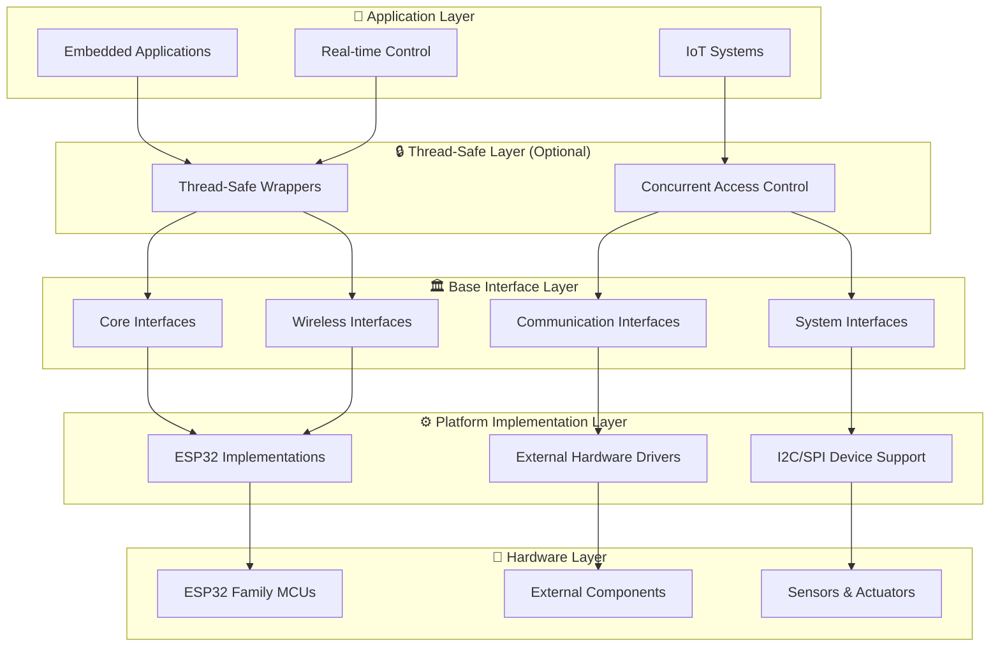

# 🚀 ESP32 Hardware Interface Wrapper

<div align="center">


**🎯 Comprehensive Hardware Abstraction Layer for ESP32 Microcontrollers**

*A professional, platform-agnostic interface wrapper providing unified APIs across ESP32 variants with complete wireless, communication, and peripheral support for embedded applications*

</div>

---

## 📚 **Table of Contents**

- [🎯 **Overview**](#-overview)
- [🏗️ **Architecture**](#️-architecture)
- [✨ **Key Features**](#-key-features)
- [🔌 **Complete Interface Support**](#-complete-interface-support)
- [🚀 **Quick Start**](#-quick-start)
- [📖 **Documentation**](#-documentation)
- [🔧 **Building**](#-building)
- [📊 **Examples**](#-examples)
- [🤝 **Contributing**](#-contributing)
- [📄 **License**](#-license)

---

## 🎯 **Overview**

The **ESP32 Hardware Interface Wrapper** is a comprehensive, production-ready hardware abstraction layer designed for **ESP32 microcontroller families**. It provides unified APIs across different ESP32 platforms while maintaining high performance, thread safety, and extensive hardware support for wireless communication, sensors, and advanced peripherals.

### 🏆 **Why Choose This Wrapper for ESP32 Projects?**

- **🎯 ESP32 Optimized** - Designed specifically for ESP32 variants (ESP32, ESP32-S2/S3, ESP32-C3/C6, ESP32-H2) and their capabilities
- **🔌 Complete Hardware Coverage** - 14 comprehensive base interfaces covering all ESP32 peripherals
- **📈 Production Ready** - Professional-grade error handling, logging, and monitoring for embedded applications
- **🌐 Modern Connectivity** - Full WiFi and Bluetooth support for IoT-enabled ESP32 projects
- **🛡️ Industrial Grade** - Robust design for critical real-time embedded applications
- **📚 Extensively Documented** - Complete API documentation with practical examples

---

## 🏗️ **Architecture**

The wrapper follows a sophisticated multi-layered architecture that maximizes flexibility, maintainability, and performance for ESP32-based embedded systems:



### 🔧 **Consistent Type System**

All interfaces use a unified type system for maximum portability and consistency across ESP32 platforms:

```cpp
// Platform-agnostic type definitions
using hf_u8_t = uint8_t;    // 8-bit unsigned
using hf_u16_t = uint16_t;  // 16-bit unsigned  
using hf_u32_t = uint32_t;  // 32-bit unsigned
using hf_u64_t = uint64_t;  // 64-bit unsigned

// Hardware abstraction types for embedded applications
using hf_pin_num_t = hf_i32_t;      // GPIO pin numbers
using hf_channel_id_t = hf_u32_t;   // ADC/PWM/DMA channels
using hf_frequency_hz_t = hf_u32_t; // Frequency values in Hz
using hf_timeout_ms_t = hf_u32_t;   // Timeout values in milliseconds
```

---

## ✨ **Key Features**

### 🔌 **Comprehensive Hardware Support for ESP32**
- **14 Complete Interfaces** - From basic GPIO to advanced wireless communication for embedded applications
- **ESP32 Family Optimized** - Full support for ESP32, ESP32-S2/S3, ESP32-C3/C6, and ESP32-H2 capabilities
- **External Hardware** - Extensive support for I2C/SPI devices and external controllers
- **Sensor Integration** - Built-in support for temperature sensors and peripheral devices

### ⚡ **Performance & Reliability for Embedded Applications**
- **Real-Time Optimized** - Designed for critical timing requirements of embedded systems
- **Thread-Safe Options** - Optional thread-safe wrappers for concurrent applications
- **Lazy Initialization** - Resources allocated only when needed for optimal memory usage
- **Comprehensive Error Handling** - Detailed error codes and validation across all interfaces

### 🌐 **Modern Connectivity for IoT Applications**
- **WiFi Support** - Complete station/AP modes with WPA3 security for IoT integration
- **Bluetooth Integration** - Both Classic and BLE support for mobile and IoT connectivity
- **IoT Ready** - Built-in networking capabilities for cloud connectivity
- **Remote Monitoring** - Advanced logging with network output support for remote diagnostics

### 📊 **Professional Features for Embedded Systems**
- **Advanced Logging** - Multi-level logging with multiple output destinations
- **Performance Monitoring** - Built-in diagnostics and performance tracking
- **Configuration Management** - Non-volatile storage for system settings
- **Thermal Management** - Comprehensive temperature monitoring and protection

---

## 🔌 **Complete Interface Support**

### 🏛️ **Core Interfaces for ESP32**
| Interface | Description | Key Features | ESP32 Hardware Support |
|-----------|-------------|--------------|------------------|
| [`BaseGpio`](docs/api/BaseGpio.md) | 🔌 Digital I/O Operations | Dynamic modes, interrupts, pull resistors | All ESP32 variants, I2C/SPI Expanders |
| [`BaseAdc`](docs/api/BaseAdc.md) | 📊 Analog-to-Digital Conversion | Multi-channel, calibration, voltage conversion | All ESP32 variants, External ADCs |
| [`BasePwm`](docs/api/BasePwm.md) | 🎛️ Pulse Width Modulation | Multi-channel, frequency control, LEDC | All ESP32 variants |
| [`BasePio`](docs/api/BasePio.md) | 📻 Programmable I/O | Custom protocols, precise timing, RMT | ESP32/ESP32-S2/S3/C6/H2 |

### 📡 **Communication Interfaces for ESP32 Systems**
| Interface | Description | Key Features | ESP32 Hardware Support |
|-----------|-------------|--------------|------------------|
| [`BaseI2c`](docs/api/BaseI2c.md) | 🔄 I2C Communication | Master mode, device scanning, error recovery | All ESP32 variants |
| [`BaseSpi`](docs/api/BaseSpi.md) | ⚡ SPI Communication | Full-duplex, configurable modes, DMA support | All ESP32 variants |
| [`BaseUart`](docs/api/BaseUart.md) | 📡 UART Communication | Async I/O, flow control, configurable parameters | All ESP32 variants |
| [`BaseCan`](docs/api/BaseCan.md) | 🚗 CAN Bus Communication | Standard/Extended frames, filtering, TWAI | ESP32/ESP32-S2/S3/C6 |

### 🌐 **Wireless Interfaces for ESP32 IoT**
| Interface | Description | Key Features | ESP32 Hardware Support |
|-----------|-------------|--------------|------------------|
| [`BaseWifi`](docs/api/BaseWifi.md) | 📶 WiFi Communication | Station/AP modes, WPA3 security, mesh networking | ESP32/ESP32-S2/S3/C3/C6 |
| [`BaseBluetooth`](docs/api/BaseBluetooth.md) | 📲 Bluetooth Communication | Classic & BLE, pairing, service discovery | ESP32/ESP32-S3/C3/C6/H2 |

### 🛠️ **System Interfaces for ESP32 Applications**
| Interface | Description | Key Features | ESP32 Hardware Support |
|-----------|-------------|--------------|------------------|
| [`BaseNvs`](docs/api/BaseNvs.md) | 💾 Non-Volatile Storage | Key-value storage, encryption, wear leveling | All ESP32 variants |
| [`BasePeriodicTimer`](docs/api/BasePeriodicTimer.md) | ⏰ Periodic Timers | Callback scheduling, high precision, multi-timer | All ESP32 variants |
| [`BaseTemperature`](docs/api/BaseTemperature.md) | 🌡️ Temperature Sensing | Multi-sensor support, calibration, thermal protection | All ESP32 variants |
| [`BaseLogger`](docs/api/BaseLogger.md) | 📝 System Logging | Multi-level logging, thread-safe, network output | All ESP32 variants |

### 📊 **ESP32 Platform Support Matrix**

| ESP32 Variant | GPIO | ADC | PWM | I2C | SPI | UART | CAN | WiFi | BT | Temp | NVS | Timer | PIO | Log |
|----------------|------|-----|-----|-----|-----|------|-----|------|----|----- |-----|-------|-----|-----|
| **ESP32** | ✅ | ✅ | ✅ | ✅ | ✅ | ✅ | ✅ | ✅ | ✅ | ✅ | ✅ | ✅ | ✅ | ✅ |
| **ESP32-S2** | ✅ | ✅ | ✅ | ✅ | ✅ | ✅ | ❌ | ✅ | ❌ | ✅ | ✅ | ✅ | ✅ | ✅ |
| **ESP32-S3** | ✅ | ✅ | ✅ | ✅ | ✅ | ✅ | ❌ | ✅ | ✅ | ✅ | ✅ | ✅ | ✅ | ✅ |
| **ESP32-C3** | ✅ | ✅ | ✅ | ✅ | ✅ | ✅ | ❌ | ✅ | ✅ | ✅ | ✅ | ✅ | ✅ | ✅ |
| **ESP32-C6** | ✅ | ✅ | ✅ | ✅ | ✅ | ✅ | ✅ | ✅ | ✅ | ✅ | ✅ | ✅ | ✅ | ✅ |
| **ESP32-H2** | ✅ | ✅ | ✅ | ✅ | ✅ | ✅ | ❌ | ❌ | ✅ | ✅ | ✅ | ✅ | ✅ | ✅ |

---

## 🚀 **Quick Start**

### 📋 **Prerequisites**

- **ESP-IDF v5.0+** for ESP32 development
- **C++17** compatible compiler (GCC 8+ or Clang 7+)
- **CMake 3.16+** for build system management
- **ESP32 development board** (any variant)

### ⚙️ **Installation**

1. **Clone the repository:**
```bash
git clone https://github.com/hardfoc/hf-internal-interface-wrap.git
cd hf-internal-interface-wrap
```

2. **Add to your HardFOC project:**
```cmake
# In your HardFOC project's CMakeLists.txt
idf_component_register(
    SRCS "main.cpp"
    INCLUDE_DIRS "."
    REQUIRES hf_internal_interface_wrap
)
```

3. **Include the headers:**
```cpp
// Core interfaces for HardFOC boards
#include "inc/base/BaseGpio.h"
#include "inc/base/BaseAdc.h"
#include "inc/base/BasePwm.h"
#include "inc/base/BaseWifi.h"
#include "inc/base/BaseTemperature.h"

// ESP32 implementations for HardFOC boards
#include "inc/mcu/esp32/EspGpio.h"
#include "inc/mcu/esp32/EspAdc.h"
#include "inc/mcu/esp32/EspPwm.h"
#include "inc/mcu/esp32/EspWifi.h"
#include "inc/mcu/esp32/EspTemperature.h"
```

### 💡 **Basic ESP32 Multi-Interface Example**

```cpp
#include "inc/mcu/esp32/EspGpio.h"
#include "inc/mcu/esp32/EspAdc.h"
#include "inc/mcu/esp32/EspPwm.h"
#include "inc/mcu/esp32/EspTemperature.h"
#include "inc/mcu/esp32/EspLogger.h"
#include "inc/mcu/esp32/EspSpi.h"

class IoTSensorController {
private:
    EspGpio led_pin_;
    EspSpi sensor_spi_;
    EspAdc voltage_monitor_;
    EspTemperature temp_sensor_;
    EspLogger logger_;
    EspPwm status_led_;
    
public:
    IoTSensorController() 
        : led_pin_(GPIO_NUM_2, hf_gpio_direction_t::HF_GPIO_DIRECTION_OUTPUT)
        , sensor_spi_(SPI2_HOST, GPIO_NUM_18, GPIO_NUM_19, GPIO_NUM_5)  // SCLK, MISO, MOSI
        , voltage_monitor_(ADC_UNIT_1, ADC_ATTEN_DB_11)
        , status_led_(LEDC_TIMER_0, LEDC_CHANNEL_0)
    {}
    
    bool initialize() {
        // Initialize all components
        bool success = true;
        success &= (logger_.EnsureInitialized() == hf_logger_err_t::LOGGER_SUCCESS);
        success &= (led_pin_.EnsureInitialized() == hf_gpio_err_t::GPIO_SUCCESS);
        success &= (sensor_spi_.EnsureInitialized() == hf_spi_err_t::SPI_SUCCESS);
        success &= (voltage_monitor_.EnsureInitialized() == hf_adc_err_t::ADC_SUCCESS);
        success &= (temp_sensor_.EnsureInitialized() == hf_temp_err_t::TEMP_SUCCESS);
        success &= (status_led_.EnsureInitialized() == hf_pwm_err_t::PWM_SUCCESS);
        
        if (success) {
            // Configure status LED PWM
            status_led_.SetFrequency(1000);  // 1kHz
            status_led_.EnableChannel(GPIO_NUM_8);
            logger_.LogInfo("SENSOR", "IoT sensor controller initialized successfully");
        } else {
            logger_.LogError("SENSOR", "IoT sensor controller initialization failed");
        }
        
        return success;
    }
    
    void monitor_system() {
        // Read system parameters
        float temperature, voltage;
        temp_sensor_.ReadTemperature(temperature);
        voltage_monitor_.ReadChannelV(ADC_CHANNEL_0, voltage);
        
        // Safety checks
        if (temperature > 70.0f) {
            logger_.LogError("SENSOR", "High temperature detected: %.1f°C", temperature);
            set_status_led_error();
            return;
        }
        
        if (voltage < 3.0f) {
            logger_.LogWarn("SENSOR", "Low voltage: %.2fV", voltage);
            set_status_led_warning();
        } else {
            set_status_led_normal();
        }
        
        // Read external sensor via SPI
        read_external_sensor();
        
        logger_.LogDebug("SENSOR", "Temp: %.1f°C, Voltage: %.2fV", temperature, voltage);
    }
    
private:
    void read_external_sensor() {
        // Example SPI sensor reading
        hf_u8_t cmd[] = {0x03, 0x00};  // Read command
        hf_u8_t response[4];
        sensor_spi_.WriteRead(cmd, response, sizeof(cmd));
        // Process sensor data...
    }
    
    void set_status_led_normal() {
        status_led_.SetDutyCycle(10);  // Low brightness for normal operation
    }
    
    void set_status_led_warning() {
        status_led_.SetDutyCycle(50);  // Medium brightness for warning
    }
    
    void set_status_led_error() {
        status_led_.SetDutyCycle(100); // Full brightness for error
    }
};
```

---

## 📖 **Documentation**

### 📚 **Complete API Reference for HardFOC Boards**
- [📖 **Main Documentation**](docs/index.md) - Comprehensive HardFOC system overview
- [🏛️ **Core Interfaces**](docs/index.md#-api-reference) - GPIO, ADC, PWM, PIO for HardFOC boards
- [📡 **Communication Interfaces**](docs/index.md#-api-reference) - I2C, SPI, UART, CAN for HardFOC systems
- [🌐 **Wireless Interfaces**](docs/index.md#-api-reference) - WiFi, Bluetooth for HardFOC IoT
- [🛠️ **System Interfaces**](docs/index.md#-api-reference) - NVS, Timer, Temperature, Logger for HardFOC applications

### 🎯 **API Documentation**
- [🔧 **BaseGpio API**](docs/api/BaseGpio.md) - Digital I/O interface
- [📊 **BaseAdc API**](docs/api/BaseAdc.md) - Analog-to-digital conversion interface
- [🔌 **EspGpio API**](docs/api/EspGpio.md) - ESP32-C6 GPIO implementation
- [🔧 **HardwareTypes API**](docs/api/HardwareTypes.md) - Platform-agnostic type definitions

### 📊 **HardFOC Practical Examples**
- **GPIO Control** - LED and button control for HardFOC boards
- **ADC Monitoring** - Sensor data acquisition for HardFOC systems
- **PWM Generation** - Motor speed control for HardFOC applications
- **Temperature Sensing** - Thermal monitoring for HardFOC boards

---

## 🔧 **Building**

### 🏗️ **Build Configuration for HardFOC Boards**

```bash
# Set up ESP-IDF environment for HardFOC development
. $IDF_PATH/export.sh

# Configure HardFOC project
idf.py menuconfig

# Build the HardFOC project
idf.py build

# Flash to HardFOC board and monitor
idf.py -p /dev/ttyUSB0 flash monitor
```

### ⚙️ **HardFOC Configuration Options**

The wrapper supports extensive configuration through ESP-IDF's menuconfig for HardFOC boards:

- **Interface Selection** - Enable/disable specific interfaces for HardFOC applications
- **Performance Tuning** - Optimize for speed vs. memory usage on HardFOC boards
- **Buffer Sizes** - Configure communication and logging buffers for HardFOC systems
- **Security Settings** - WiFi and Bluetooth security configuration for HardFOC IoT
- **Debug Options** - Comprehensive logging and diagnostics for HardFOC development

### 📦 **Dependencies**

```cmake
set(COMPONENT_REQUIRES
    freertos
    esp_common
    esp_hw_support
    esp_system
    log
    soc
    hal
    esp_wifi
    bt
    nvs_flash
)
```

---

## 📊 **Examples**

### 🎯 **Basic HardFOC Interface Examples**
- **GPIO Control** - LED control and button reading for HardFOC boards
- **ADC Monitoring** - Sensor data acquisition for HardFOC systems
- **PWM Generation** - Motor speed control for HardFOC applications
- **Temperature Sensing** - Thermal monitoring for HardFOC boards

### 🌐 **HardFOC Wireless Examples**
- **WiFi Station** - Internet connectivity for HardFOC IoT
- **WiFi Access Point** - Local network creation for HardFOC systems
- **Bluetooth BLE** - Mobile app integration with HardFOC boards
- **Bluetooth Classic** - Serial over Bluetooth for HardFOC

### 🚀 **Advanced HardFOC Integration Examples**
- **Complete HardFOC TMC9660 Controller** - Full-featured TMC9660 motor control
- **HardFOC IoT Gateway** - WiFi bridge with HardFOC monitoring
- **HardFOC Data Logger** - Multi-sensor data collection for HardFOC
- **Secure HardFOC Communication** - Encrypted data transfer for HardFOC

### 🧪 **Production HardFOC Examples**
- **Industrial HardFOC Control** - Complete industrial HardFOC system
- **Automotive HardFOC Interface** - CAN bus integration for HardFOC
- **Remote HardFOC Monitoring** - Cloud-connected HardFOC system
- **HardFOC Diagnostic System** - Advanced HardFOC diagnostics

---

## 🤝 **Contributing**

We welcome contributions to the HardFOC Internal Interface Wrapper! Please see our [Contributing Guide](CONTRIBUTING.md) for details on:

- 📋 **Code Standards** - Coding style and best practices for HardFOC development
- 🧪 **Testing** - Unit tests and hardware validation requirements for HardFOC boards
- 📖 **Documentation** - Documentation standards and updates for HardFOC systems
- 🐛 **Bug Reports** - How to report bugs effectively for HardFOC applications
- ✨ **Feature Requests** - Proposing new features and enhancements for HardFOC boards

### 🎯 **Development Workflow**

1. **Fork** the repository
2. **Create** a feature branch
3. **Implement** your changes with HardFOC-specific tests
4. **Document** your changes with HardFOC examples
5. **Submit** a pull request

### 📋 **Code Quality Standards for HardFOC**

- **C++17** standard compliance
- **Comprehensive documentation** for all public APIs used with HardFOC boards
- **Robust error handling** for all HardFOC operations
- **Thread safety** considerations where applicable for HardFOC applications
- **Performance optimization** for real-time HardFOC motor control applications

---

## 📄 **License**

This project is licensed under the **GNU General Public License v3.0** - see the [LICENSE](LICENSE) file for details.

### 📜 **License Summary**

- **✅ Commercial Use** - Allowed with GPL compliance
- **✅ Modification** - Allowed with source disclosure
- **✅ Distribution** - Allowed with GPL compliance
- **✅ Private Use** - Allowed
- **❌ Liability** - Limited
- **❌ Warranty** - None provided

---

<div align="center">

**🚀 Built with ❤️ for the HardFOC Community**

*Empowering innovation through comprehensive, professional hardware abstraction for HardFOC motor controller boards*

*Enabling the future of HardFOC motor control technology*

---

**🔗 Quick Links**

[📖 Documentation](docs/index.md) | [🚀 Quick Start](#-quick-start) | [📊 Examples](#-examples) | [🤝 Contributing](#-contributing)

**📞 Support**

[💬 GitHub Discussions](../../discussions) | [🐛 Issue Tracker](../../issues) | [📧 Contact](mailto:support@hardfoc.com)

</div>
