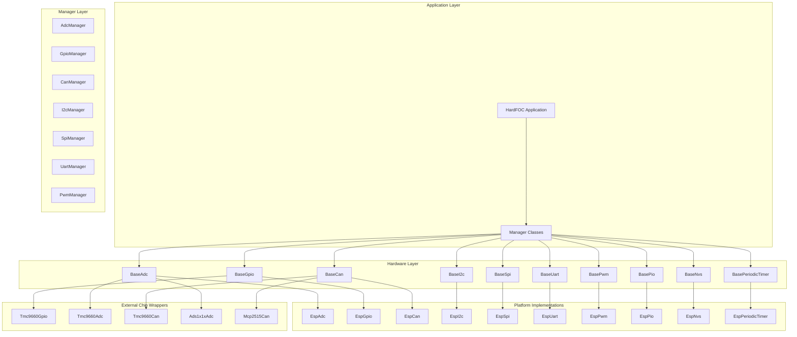

# 🚀 HardFOC Internal Interface Wrapper

<div align="center">


**🎯 Unified hardware abstraction layer for HardFOC motor control systems**

*A comprehensive, platform-agnostic interface wrapper that provides consistent APIs across different hardware implementations*

</div>

---

## 📚 **Table of Contents**

- [🎯 **Overview**](#-overview)
- [🏗️ **Architecture**](#️-architecture)
- [✨ **Key Features**](#-key-features)
- [🔌 **Supported Interfaces**](#-supported-interfaces)
- [🚀 **Quick Start**](#-quick-start)
- [💡 **Usage Examples**](#-usage-examples)
- [📖 **Documentation**](#-documentation)
- [🔧 **Building**](#-building)
- [🤝 **Contributing**](#-contributing)
- [📄 **License**](#-license)

---

## 🎯 **Overview**

The **HardFOC Internal Interface Wrapper** is a comprehensive hardware abstraction layer designed specifically for HardFOC motor control systems. It provides a unified, platform-agnostic API that abstracts away the complexities of different hardware implementations while maintaining high performance and flexibility.

### 🎯 **Core Philosophy**

- **🔌 Platform Agnostic**: Write once, run anywhere - from ESP32-C6 to custom motor controllers
- **⚡ Performance First**: Minimal overhead for real-time motor control applications
- **🛡️ Robust Error Handling**: Comprehensive error codes and validation
- **🔄 Lazy Initialization**: Resources allocated only when needed
- **📊 Built-in Diagnostics**: Statistics and health monitoring for all interfaces
- **🎯 Type Safety**: Consistent wrapped types (`hf_u8_t`, `hf_u32_t`, etc.) across the entire system

### 🏆 **Why Choose This Wrapper?**

- **🎯 Motor Control Optimized**: Designed specifically for HardFOC's real-time requirements
- **🔌 Hardware Flexibility**: Support for internal MCU peripherals and external chips
- **📈 Scalable Architecture**: Easy to add new hardware implementations
- **🛡️ Production Ready**: Comprehensive error handling and validation
- **📚 Well Documented**: Extensive API documentation with examples

---

## 🏗️ **Architecture**

The wrapper follows a layered architecture that provides maximum flexibility while maintaining consistency:



### 🔧 **Type System**

The wrapper implements a comprehensive type wrapping system for consistency and portability:

```cpp
// Platform-agnostic type definitions
using hf_u8_t = uint8_t;    // 8-bit unsigned
using hf_u16_t = uint16_t;  // 16-bit unsigned  
using hf_u32_t = uint32_t;  // 32-bit unsigned
using hf_u64_t = uint64_t;  // 64-bit unsigned
using hf_i8_t = int8_t;     // 8-bit signed
using hf_i16_t = int16_t;   // 16-bit signed
using hf_i32_t = int32_t;   // 32-bit signed
using hf_i64_t = int64_t;   // 64-bit signed

// Hardware-specific types
using hf_pin_num_t = hf_i32_t;      // GPIO pin numbers
using hf_channel_id_t = hf_u32_t;   // ADC/PWM channels
using hf_port_num_t = hf_u32_t;     // Communication ports
using hf_time_t = hf_u32_t;         // Time in milliseconds
using hf_frequency_hz_t = hf_u32_t; // Frequency in Hz
```

**Benefits:**
- **🔒 Type Consistency**: All interfaces use the same type system
- **🔄 Portability**: Easy to adapt to different platforms
- **🎯 Clarity**: Clear distinction between platform types and wrapped types
- **🛡️ Safety**: Prevents type mismatches across interfaces

---

## ✨ **Key Features**

### 🔌 **Multi-Platform Support**
- **ESP32-C6**: Full native peripheral support
- **External Chips**: TMC9660, ADS1x1x, MCP2515, and more
- **Future Platforms**: Easy to extend for new hardware

### ⚡ **Performance Optimized**
- **Zero-Copy Operations**: Direct hardware access where possible
- **Lazy Initialization**: Resources allocated only when needed
- **Minimal Overhead**: Designed for real-time motor control
- **Efficient Memory Usage**: Optimized data structures

### 🛡️ **Robust Error Handling**
- **Comprehensive Error Codes**: Detailed error reporting for each interface
- **Validation**: Parameter validation and bounds checking
- **Recovery**: Automatic error recovery where possible
- **Diagnostics**: Built-in health monitoring and statistics

### 📊 **Built-in Diagnostics**
- **Statistics Tracking**: Operation counts, timing, error rates
- **Health Monitoring**: Real-time system health assessment
- **Performance Metrics**: Throughput, latency, and efficiency data
- **Debug Support**: Extensive debugging and logging capabilities

### 🔄 **Lazy Initialization**
- **On-Demand Setup**: Hardware initialized only when first used
- **Resource Management**: Automatic cleanup and resource tracking
- **State Management**: Consistent initialization state across all interfaces

---

## 🔌 **Supported Interfaces**

| Interface | Description | Implementations | Status |
|-----------|-------------|-----------------|---------|
| **ADC** | Analog-to-Digital Conversion | ESP32-C6, TMC9660, ADS1x1x | ✅ Complete |
| **GPIO** | Digital Input/Output | ESP32-C6, TMC9660, I2C/SPI expanders | ✅ Complete |
| **CAN** | Controller Area Network | ESP32-C6, MCP2515, TMC9660 | ✅ Complete |
| **I2C** | Inter-Integrated Circuit | ESP32-C6, Bit-banged | ✅ Complete |
| **SPI** | Serial Peripheral Interface | ESP32-C6, Software SPI | ✅ Complete |
| **UART** | Universal Asynchronous Receiver/Transmitter | ESP32-C6, USB-to-serial | ✅ Complete |
| **PWM** | Pulse Width Modulation | ESP32-C6, External controllers | ✅ Complete |
| **PIO** | Programmable I/O | ESP32-C6, Custom implementations | ✅ Complete |
| **NVS** | Non-Volatile Storage | ESP32-C6, External flash | ✅ Complete |
| **Timer** | Periodic Timers | ESP32-C6, Hardware timers | ✅ Complete |

### 🎯 **Hardware Support Matrix**

| Hardware | ADC | GPIO | CAN | I2C | SPI | UART | PWM | PIO | NVS | Timer |
|----------|-----|------|-----|-----|-----|------|-----|-----|-----|-------|
| **ESP32-C6** | ✅ | ✅ | ✅ | ✅ | ✅ | ✅ | ✅ | ✅ | ✅ | ✅ |
| **TMC9660** | ✅ | ✅ | ✅ | ❌ | ❌ | ❌ | ❌ | ❌ | ❌ | ❌ |
| **ADS1x1x** | ✅ | ❌ | ❌ | ✅ | ❌ | ❌ | ❌ | ❌ | ❌ | ❌ |
| **MCP2515** | ❌ | ❌ | ✅ | ❌ | ✅ | ❌ | ❌ | ❌ | ❌ | ❌ |

---

## 🚀 **Quick Start**

### 📋 **Prerequisites**

- **ESP-IDF v5.0+** for ESP32-C6 development
- **C++17** compatible compiler
- **CMake 3.16+** for build system

### 🔧 **Installation**

1. **Clone the repository:**
```bash
git clone https://github.com/hardfoc/hf-internal-interface-wrap.git
cd hf-internal-interface-wrap
```

2. **Add to your ESP-IDF project:**
```cmake
# In your project's CMakeLists.txt
idf_component_register(
    SRCS "main.cpp"
    INCLUDE_DIRS "."
    REQUIRES iid-espidf
)
```

3. **Include the headers:**
```cpp
#include "inc/base/BaseAdc.h"
#include "inc/base/BaseGpio.h"
#include "inc/base/BaseCan.h"
#include "mcu/esp32/EspAdc.h"
#include "mcu/esp32/EspGpio.h"
```

### 💡 **Basic Usage**

```cpp
#include "mcu/esp32/EspAdc.h"
#include "mcu/esp32/EspGpio.h"

// Create hardware instances
EspAdc adc(ADC_UNIT_1, ADC_ATTEN_DB_11);
EspGpio led_pin(2, hf_gpio_direction_t::HF_GPIO_DIRECTION_OUTPUT);

void setup() {
    // Initialize hardware (lazy initialization)
    adc.EnsureInitialized();
    led_pin.EnsureInitialized();
    
    // Configure GPIO
    led_pin.SetActiveState(hf_gpio_active_state_t::HF_GPIO_ACTIVE_HIGH);
}

void loop() {
    // Read ADC voltage
    float voltage;
    if (adc.ReadChannelV(0, voltage) == hf_adc_err_t::ADC_SUCCESS) {
        printf("Voltage: %.3f V\n", voltage);
        
        // Control LED based on voltage
        if (voltage > 2.0f) {
            led_pin.SetActive();
        } else {
            led_pin.SetInactive();
        }
    }
    
    vTaskDelay(pdMS_TO_TICKS(100));
}
```

---

## 💡 **Usage Examples**

### 🔌 **Multi-Hardware ADC Reading**

```cpp
#include "mcu/esp32/EspAdc.h"
#include "external/Tmc9660Adc.h"
#include "external/Ads1x1xAdc.h"

class MultiSourceAdc {
private:
    EspAdc internal_adc_;
    Tmc9660Adc motor_adc_;
    Ads1x1xAdc external_adc_;
    
public:
    MultiSourceAdc() 
        : internal_adc_(ADC_UNIT_1, ADC_ATTEN_DB_11)
        , motor_adc_(/* TMC9660 controller */)
        , external_adc_(/* I2C bus, address */) {}
    
    bool initialize() {
        return internal_adc_.EnsureInitialized() &&
               motor_adc_.EnsureInitialized() &&
               external_adc_.EnsureInitialized();
    }
    
    struct SensorData {
        float battery_voltage;    // Internal ADC
        float motor_current;      // TMC9660 ADC
        float temperature;        // External ADC
    };
    
    SensorData read_all_sensors() {
        SensorData data = {};
        
        // Read from internal ADC
        internal_adc_.ReadChannelV(0, data.battery_voltage);
        
        // Read from motor controller
        motor_adc_.ReadChannelV(0, data.motor_current);
        
        // Read from external ADC
        external_adc_.ReadChannelV(0, data.temperature);
        
        return data;
    }
};
```

### 🎛️ **GPIO Manager with Multiple Sources**

```cpp
#include "mcu/esp32/EspGpio.h"
#include "external/Tmc9660Gpio.h"
#include "utils/GpioManager.h"

class HardwareManager {
private:
    EspGpio esp_led_;
    EspGpio esp_button_;
    Tmc9660Gpio motor_enable_;
    Tmc9660Gpio motor_fault_;
    GpioManager gpio_manager_;
    
public:
    HardwareManager() 
        : esp_led_(2, hf_gpio_direction_t::HF_GPIO_DIRECTION_OUTPUT)
        , esp_button_(0, hf_gpio_direction_t::HF_GPIO_DIRECTION_INPUT)
        , motor_enable_(/* TMC9660 pin */)
        , motor_fault_(/* TMC9660 pin */) {
        
        // Register all GPIO pins with manager
        gpio_manager_.RegisterPin("status_led", &esp_led_);
        gpio_manager_.RegisterPin("user_button", &esp_button_);
        gpio_manager_.RegisterPin("motor_enable", &motor_enable_);
        gpio_manager_.RegisterPin("motor_fault", &motor_fault_);
    }
    
    bool initialize() {
        return gpio_manager_.Initialize();
    }
    
    void handle_user_input() {
        bool button_pressed;
        if (gpio_manager_.ReadPin("user_button", button_pressed) == hf_gpio_err_t::GPIO_SUCCESS) {
            if (button_pressed) {
                // Toggle motor enable
                bool current_state;
                gpio_manager_.ReadPin("motor_enable", current_state);
                gpio_manager_.WritePin("motor_enable", !current_state);
                
                // Update status LED
                gpio_manager_.WritePin("status_led", !current_state);
            }
        }
    }
    
    void check_motor_fault() {
        bool fault_detected;
        if (gpio_manager_.ReadPin("motor_fault", fault_detected) == hf_gpio_err_t::GPIO_SUCCESS) {
            if (fault_detected) {
                printf("🚨 Motor fault detected!\n");
                gpio_manager_.WritePin("motor_enable", false);
                gpio_manager_.WritePin("status_led", true);  // Fault indicator
            }
        }
    }
};
```

### 📡 **CAN Communication with Multiple Controllers**

```cpp
#include "mcu/esp32/EspCan.h"
#include "external/Mcp2515Can.h"
#include "utils/CanManager.h"

class CanNetworkManager {
private:
    EspCan internal_can_;
    Mcp2515Can external_can_;
    CanManager can_manager_;
    
public:
    CanNetworkManager() 
        : internal_can_(/* CAN config */)
        , external_can_(/* SPI bus, CS pin */) {
        
        // Register CAN controllers
        can_manager_.RegisterController("internal", &internal_can_);
        can_manager_.RegisterController("external", &external_can_);
    }
    
    bool initialize() {
        return can_manager_.Initialize();
    }
    
    void send_motor_command(hf_u32_t motor_id, float target_velocity) {
        hf_can_message_t msg;
        msg.id = motor_id;
        msg.dlc = 4;
        msg.is_extended = false;
        
        // Pack velocity data
        hf_u32_t velocity_raw = static_cast<hf_u32_t>(target_velocity * 1000.0f);
        msg.data[0] = (velocity_raw >> 24) & 0xFF;
        msg.data[1] = (velocity_raw >> 16) & 0xFF;
        msg.data[2] = (velocity_raw >> 8) & 0xFF;
        msg.data[3] = velocity_raw & 0xFF;
        
        // Send on internal CAN bus
        can_manager_.SendMessage("internal", msg);
    }
    
    void handle_can_messages() {
        hf_can_message_t msg;
        std::string source;
        
        if (can_manager_.ReceiveMessage(source, msg) == hf_can_err_t::CAN_SUCCESS) {
            printf("📡 CAN message from %s: ID=0x%X, DLC=%u\n", 
                   source.c_str(), msg.id, msg.dlc);
            
            // Process message based on source and ID
            if (source == "internal" && msg.id == 0x100) {
                // Motor feedback
                hf_u32_t position = (msg.data[0] << 24) | (msg.data[1] << 16) | 
                                   (msg.data[2] << 8) | msg.data[3];
                printf("Motor position: %u\n", position);
            }
        }
    }
};
```

### 🔄 **Periodic Timer with Callbacks**

```cpp
#include "mcu/esp32/EspPeriodicTimer.h"

class MotorControlSystem {
private:
    EspPeriodicTimer control_timer_;
    EspPeriodicTimer safety_timer_;
    
public:
    MotorControlSystem() 
        : control_timer_(1000)  // 1kHz control loop
        , safety_timer_(100)    // 10Hz safety check
    {}
    
    bool initialize() {
        // Set up control loop callback
        control_timer_.SetCallback([this]() {
            this->control_loop();
        });
        
        // Set up safety check callback
        safety_timer_.SetCallback([this]() {
            this->safety_check();
        });
        
        return control_timer_.EnsureInitialized() &&
               safety_timer_.EnsureInitialized();
    }
    
    void start() {
        control_timer_.Start();
        safety_timer_.Start();
    }
    
    void stop() {
        control_timer_.Stop();
        safety_timer_.Stop();
    }
    
private:
    void control_loop() {
        // High-frequency motor control logic
        // This runs at 1kHz
    }
    
    void safety_check() {
        // Low-frequency safety monitoring
        // This runs at 10Hz
    }
};
```

---

## 📖 **Documentation**

### 📚 **API Reference**

Comprehensive API documentation is available for all interfaces:

- [📊 **BaseAdc**](docs/api/BaseAdc.md) - Analog-to-Digital Conversion
- [🔌 **BaseGpio**](docs/api/BaseGpio.md) - Digital Input/Output
- [📡 **BaseCan**](docs/api/BaseCan.md) - Controller Area Network
- [🔗 **BaseI2c**](docs/api/BaseI2c.md) - Inter-Integrated Circuit
- [⚡ **BaseSpi**](docs/api/BaseSpi.md) - Serial Peripheral Interface
- [📤 **BaseUart**](docs/api/BaseUart.md) - Universal Asynchronous Receiver/Transmitter
- [🎛️ **BasePwm**](docs/api/BasePwm.md) - Pulse Width Modulation
- [🔧 **BasePio**](docs/api/BasePio.md) - Programmable I/O
- [💾 **BaseNvs**](docs/api/BaseNvs.md) - Non-Volatile Storage
- [⏰ **BasePeriodicTimer**](docs/api/BasePeriodicTimer.md) - Periodic Timers

### 🎯 **Type System Documentation**

- [🔧 **Hardware Types**](docs/api/HardwareTypes.md) - Platform-agnostic type definitions
- [🛡️ **Error Codes**](docs/api/ErrorCodes.md) - Comprehensive error handling system

### 📖 **Guides and Examples**

- [🚀 **Getting Started**](docs/guides/getting-started.md) - Quick start guide
- [🔌 **Hardware Integration**](docs/guides/hardware-integration.md) - Adding new hardware
- [🛡️ **Error Handling**](docs/guides/error-handling.md) - Best practices for error handling
- [📊 **Performance Optimization**](docs/guides/performance.md) - Performance tuning guide

---

## 🔧 **Building**

### 📋 **Requirements**

- **ESP-IDF v5.0+**
- **C++17** compiler
- **CMake 3.16+**

### 🏗️ **Build Process**

1. **Set up ESP-IDF environment:**
```bash
source $IDF_PATH/export.sh
```

2. **Configure the project:**
```bash
idf.py menuconfig
```

3. **Build the project:**
```bash
idf.py build
```

4. **Flash to device:**
```bash
idf.py flash monitor
```

### 🔧 **Configuration Options**

The wrapper supports various configuration options through ESP-IDF's menuconfig:

- **Interface Selection**: Enable/disable specific interfaces
- **Buffer Sizes**: Configure buffer sizes for communication interfaces
- **Timeout Values**: Set default timeout values
- **Debug Options**: Enable debug logging and diagnostics
- **Performance Options**: Configure for performance vs. memory usage

---

## 🤝 **Contributing**

We welcome contributions! Please see our [Contributing Guide](CONTRIBUTING.md) for details.

### 🎯 **Development Setup**

1. **Fork the repository**
2. **Create a feature branch**
3. **Make your changes**
4. **Add tests and documentation**
5. **Submit a pull request**

### 📋 **Code Style**

- **C++17** standard
- **snake_case** for functions and variables
- **CamelCase** for classes and types
- **Comprehensive documentation** for all public APIs
- **Error handling** for all operations

### 🧪 **Testing**

- **Unit tests** for all interfaces
- **Integration tests** for hardware combinations
- **Performance benchmarks** for critical paths
- **Memory leak detection** and validation

---

## 📄 **License**

This project is licensed under the MIT License - see the [LICENSE](LICENSE) file for details.

### 📜 **License Summary**

- **✅ Commercial Use**: Allowed
- **✅ Modification**: Allowed  
- **✅ Distribution**: Allowed
- **✅ Private Use**: Allowed
- **❌ Liability**: Limited
- **❌ Warranty**: None

---

<div align="center">

**🚀 Built with ❤️ for the HardFOC community**

*Empowering motor control innovation through robust, flexible, and performant hardware abstraction*

</div>
