# 🚀 HardFOC Internal Interface Wrapper

<div align="center">


**🎯 Comprehensive Hardware Abstraction Layer for HardFOC Motor Controller Boards**

*A professional, platform-agnostic interface wrapper specifically designed for HardFOC motor controller boards, providing unified APIs across different hardware implementations with complete wireless, communication, and sensor support*

</div>

---

## 📚 **Table of Contents**

- [🎯 **Overview**](#-overview)
- [🏗️ **Architecture**](#️-architecture)
- [✨ **Key Features**](#-key-features)
- [🔌 **Complete Interface Support**](#-complete-interface-support)
- [🚀 **Quick Start**](#-quick-start)
- [📖 **Documentation**](#-documentation)
- [🔧 **Building**](#-building)
- [📊 **Examples**](#-examples)
- [🤝 **Contributing**](#-contributing)
- [📄 **License**](#-license)

---

## 🎯 **Overview**

The **HardFOC Internal Interface Wrapper** is a comprehensive, production-ready hardware abstraction layer specifically designed for **HardFOC motor controller boards**. It provides unified APIs across different MCU platforms while maintaining the high performance, thread safety, and extensive hardware support that HardFOC motor controller boards require, including wireless communication, sensors, and advanced peripherals.

### 🏆 **Why Choose This Wrapper for HardFOC Boards?**

- **🎯 HardFOC Optimized** - Designed specifically for HardFOC motor controller boards and their real-time requirements
- **🔌 Complete Hardware Coverage** - 14 comprehensive base interfaces covering all aspects of HardFOC boards
- **📈 Production Ready** - Professional-grade error handling, logging, and monitoring for HardFOC applications
- **🌐 Modern Connectivity** - Full WiFi and Bluetooth support for IoT-enabled HardFOC motor controller boards
- **🛡️ Industrial Grade** - Robust design for critical HardFOC motor control applications
- **📚 Extensively Documented** - Complete API documentation with HardFOC-specific examples

---

## 🏗️ **Architecture**

The wrapper follows a sophisticated multi-layered architecture that maximizes flexibility, maintainability, and performance for HardFOC motor controller boards:

```mermaid
graph TB
    subgraph "🎯 HardFOC Application Layer"
        A[HardFOC Motor Control Application]
        B[HardFOC System Management]
        C[HardFOC IoT Integration]
    end
    
    subgraph "🔒 Thread-Safe Layer (Optional)"
        D[Thread-Safe Wrappers]
        E[Concurrent Access Control]
    end
    
    subgraph "🏛️ HardFOC Base Interface Layer"
        F[Core Interfaces]
        G[Communication Interfaces] 
        H[Wireless Interfaces]
        I[System Interfaces]
    end
    
    subgraph "⚙️ Platform Implementation Layer"
        J[ESP32-C6 Implementations]
        K[External Hardware Drivers]
        L[I2C/SPI Device Support]
    end
    
    subgraph "🔧 HardFOC Hardware Layer"
        M[ESP32-C6 Hardware]
        N[HardFOC Board Components]
        O[Sensors & Actuators]
    end
    
    A --> D
    B --> E
    C --> D
    
    D --> F
    E --> G
    D --> H
    E --> I
    
    F --> J
    G --> K
    H --> J
    I --> L
    
    J --> M
    K --> N
    L --> O
```



### 🔧 **Consistent Type System**

All interfaces use a unified type system for maximum portability and consistency across HardFOC motor controller boards:

```cpp
// Platform-agnostic type definitions for HardFOC boards
using hf_u8_t = uint8_t;    // 8-bit unsigned
using hf_u16_t = uint16_t;  // 16-bit unsigned  
using hf_u32_t = uint32_t;  // 32-bit unsigned
using hf_u64_t = uint64_t;  // 64-bit unsigned

// Hardware-specific semantic types for HardFOC applications
using hf_pin_num_t = hf_i32_t;      // GPIO pin numbers
using hf_channel_id_t = hf_u32_t;   // ADC/PWM/DMA channels
using hf_frequency_hz_t = hf_u32_t; // Frequency values in Hz
using hf_voltage_mv_t = hf_u32_t;   // Voltage values in millivolts
using hf_temperature_c_t = hf_i32_t; // Temperature in Celsius (scaled)
```

---

## ✨ **Key Features**

### 🔌 **Comprehensive Hardware Support for HardFOC Boards**
- **14 Complete Interfaces** - From basic GPIO to advanced wireless communication for HardFOC applications
- **ESP32-C6 Optimized** - Full support for all ESP32-C6 capabilities and peripherals used in HardFOC boards
- **External Hardware** - Extensive support for I2C/SPI devices and external controllers commonly used with HardFOC boards
- **Sensor Integration** - Built-in support for temperature, motor feedback, and diagnostic sensors used in HardFOC systems

### ⚡ **Performance & Reliability for HardFOC Applications**
- **Real-Time Optimized** - Designed for critical motor control timing requirements of HardFOC boards
- **Thread-Safe Options** - Optional thread-safe wrappers for concurrent HardFOC applications
- **Lazy Initialization** - Resources allocated only when needed for optimal memory usage on HardFOC boards
- **Comprehensive Error Handling** - Detailed error codes and validation across all interfaces for HardFOC reliability

### 🌐 **Modern Connectivity for HardFOC IoT Applications**
- **WiFi Support** - Complete station/AP modes with WPA3 security for HardFOC IoT integration
- **Bluetooth Integration** - Both Classic and BLE support for mobile integration with HardFOC boards
- **IoT Ready** - Built-in networking capabilities for cloud connectivity of HardFOC motor controller systems
- **Remote Monitoring** - Advanced logging with network output support for HardFOC diagnostics

### 📊 **Professional Features for HardFOC Systems**
- **Advanced Logging** - Multi-level logging with multiple output destinations for HardFOC debugging
- **Performance Monitoring** - Built-in diagnostics and performance tracking for HardFOC optimization
- **Configuration Management** - Non-volatile storage for HardFOC system settings
- **Thermal Management** - Comprehensive temperature monitoring and protection for HardFOC boards

---

## 🔌 **Complete Interface Support**

### 🏛️ **Core Interfaces for HardFOC Boards**
| Interface | Description | Key Features | HardFOC Hardware Support |
|-----------|-------------|--------------|------------------|
| [`BaseGpio`](docs/api/BaseGpio.md) | 🔌 Digital I/O Operations | Dynamic modes, interrupts, pull resistors | ESP32-C6, I2C/SPI Expanders |
| [`BaseAdc`](docs/api/BaseAdc.md) | 📊 Analog-to-Digital Conversion | Multi-channel, calibration, voltage conversion | ESP32-C6, External ADCs |
| [`BasePwm`](docs/api/BasePwm.md) | 🎛️ Pulse Width Modulation | Multi-channel, frequency control, motor drive | ESP32-C6, External Controllers |
| [`BasePio`](docs/api/BasePio.md) | 📻 Programmable I/O | Custom protocols, precise timing, encoding | ESP32-C6 RMT |

### 📡 **Communication Interfaces for HardFOC Systems**
| Interface | Description | Key Features | HardFOC Hardware Support |
|-----------|-------------|--------------|------------------|
| [`BaseI2c`](docs/api/BaseI2c.md) | 🔄 I2C Communication | Master mode, device scanning, error recovery | ESP32-C6, Software I2C |
| [`BaseSpi`](docs/api/BaseSpi.md) | ⚡ SPI Communication | Full-duplex, configurable modes, DMA support | ESP32-C6, Software SPI |
| [`BaseUart`](docs/api/BaseUart.md) | 📡 UART Communication | Async I/O, flow control, configurable parameters | ESP32-C6, USB-Serial |
| [`BaseCan`](docs/api/BaseCan.md) | 🚗 CAN Bus Communication | Standard/Extended frames, filtering, error handling | ESP32-C6 TWAI, External CAN |

### 🌐 **Wireless Interfaces for HardFOC IoT**
| Interface | Description | Key Features | HardFOC Hardware Support |
|-----------|-------------|--------------|------------------|
| [`BaseWifi`](docs/api/BaseWifi.md) | 📶 WiFi Communication | Station/AP modes, WPA3 security, mesh networking | ESP32-C6 WiFi |
| [`BaseBluetooth`](docs/api/BaseBluetooth.md) | 📲 Bluetooth Communication | Classic & BLE, pairing, service discovery | ESP32-C6 Bluetooth |

### 🛠️ **System Interfaces for HardFOC Applications**
| Interface | Description | Key Features | HardFOC Hardware Support |
|-----------|-------------|--------------|------------------|
| [`BaseNvs`](docs/api/BaseNvs.md) | 💾 Non-Volatile Storage | Key-value storage, encryption, wear leveling | ESP32-C6 Flash, External |
| [`BasePeriodicTimer`](docs/api/BasePeriodicTimer.md) | ⏰ Periodic Timers | Callback scheduling, high precision, multi-timer | ESP32-C6 Hardware Timers |
| [`BaseTemperature`](docs/api/BaseTemperature.md) | 🌡️ Temperature Sensing | Multi-sensor support, calibration, thermal protection | Internal, I2C, 1-Wire Sensors |
| [`BaseLogger`](docs/api/BaseLogger.md) | 📝 System Logging | Multi-level logging, thread-safe, network output | UART, File, Network, Memory |

### 📊 **HardFOC Platform Support Matrix**

| Platform | GPIO | ADC | PWM | I2C | SPI | UART | CAN | WiFi | BT | Temp | NVS | Timer | PIO | Log |
|----------|------|-----|-----|-----|-----|------|-----|------|----|----- |-----|-------|-----|-----|
| **ESP32-C6** | ✅ | ✅ | ✅ | ✅ | ✅ | ✅ | ✅ | ✅ | ✅ | ✅ | ✅ | ✅ | ✅ | ✅ |
| **External ICs** | ✅ | ✅ | ✅ | ✅ | ✅ | ❌ | ✅ | ❌ | ❌ | ✅ | ✅ | ❌ | ❌ | ❌ |
| **I2C Devices** | ✅ | ✅ | ❌ | ❌ | ❌ | ❌ | ❌ | ❌ | ❌ | ✅ | ❌ | ❌ | ❌ | ❌ |
| **SPI Devices** | ✅ | ✅ | ✅ | ❌ | ❌ | ❌ | ✅ | ❌ | ❌ | ✅ | ❌ | ❌ | ❌ | ❌ |

---

## 🚀 **Quick Start**

### 📋 **Prerequisites**

- **ESP-IDF v5.0+** for ESP32-C6 development
- **C++17** compatible compiler (GCC 8+ or Clang 7+)
- **CMake 3.16+** for build system management
- **HardFOC Motor Controller Board** with ESP32-C6

### ⚙️ **Installation**

1. **Clone the repository:**
```bash
git clone https://github.com/hardfoc/hf-internal-interface-wrap.git
cd hf-internal-interface-wrap
```

2. **Add to your HardFOC project:**
```cmake
# In your HardFOC project's CMakeLists.txt
idf_component_register(
    SRCS "main.cpp"
    INCLUDE_DIRS "."
    REQUIRES hf_internal_interface_wrap
)
```

3. **Include the headers:**
```cpp
// Core interfaces for HardFOC boards
#include "inc/base/BaseGpio.h"
#include "inc/base/BaseAdc.h"
#include "inc/base/BasePwm.h"
#include "inc/base/BaseWifi.h"
#include "inc/base/BaseTemperature.h"

// ESP32 implementations for HardFOC boards
#include "inc/mcu/esp32/EspGpio.h"
#include "inc/mcu/esp32/EspAdc.h"
#include "inc/mcu/esp32/EspPwm.h"
#include "inc/mcu/esp32/EspWifi.h"
#include "inc/mcu/esp32/EspTemperature.h"
```

### 💡 **Basic HardFOC Motor Controller Example**

```cpp
#include "inc/mcu/esp32/EspGpio.h"
#include "inc/mcu/esp32/EspAdc.h"
#include "inc/mcu/esp32/EspPwm.h"
#include "inc/mcu/esp32/EspTemperature.h"
#include "inc/mcu/esp32/EspLogger.h"

class HardFOCMotorController {
private:
    EspGpio enable_pin_;
    EspPwm motor_pwm_;
    EspAdc current_sensor_;
    EspTemperature temp_sensor_;
    EspLogger logger_;
    
public:
    HardFOCMotorController() 
        : enable_pin_(GPIO_NUM_2, hf_gpio_direction_t::HF_GPIO_DIRECTION_OUTPUT)
        , motor_pwm_(LEDC_CHANNEL_0, GPIO_NUM_5)
        , current_sensor_(ADC_UNIT_1, ADC_ATTEN_DB_11)
    {}
    
    bool initialize() {
        // Initialize all HardFOC components
        bool success = true;
        success &= (logger_.EnsureInitialized() == hf_logger_err_t::LOGGER_SUCCESS);
        success &= (enable_pin_.EnsureInitialized() == hf_gpio_err_t::GPIO_SUCCESS);
        success &= (motor_pwm_.EnsureInitialized() == hf_pwm_err_t::PWM_SUCCESS);
        success &= (current_sensor_.EnsureInitialized() == hf_adc_err_t::ADC_SUCCESS);
        success &= (temp_sensor_.EnsureInitialized() == hf_temp_err_t::TEMP_SUCCESS);
        
        if (success) {
            motor_pwm_.SetFrequency(20000); // 20kHz PWM for HardFOC
            logger_.LogInfo("HARDFOC", "HardFOC motor controller initialized successfully");
        } else {
            logger_.LogError("HARDFOC", "HardFOC motor controller initialization failed");
        }
        
        return success;
    }
    
    void control_motor(float speed_percent) {
        // Safety checks for HardFOC operation
        float temperature, current;
        temp_sensor_.ReadTemperature(temperature);
        current_sensor_.ReadChannelV(ADC_CHANNEL_0, current);
        
        if (temperature > 85.0f) {
            logger_.LogError("HARDFOC", "HardFOC board overheating detected: %.1f°C", temperature);
            emergency_stop();
            return;
        }
        
        if (current > 10.0f) {
            logger_.LogWarn("HARDFOC", "HardFOC high current: %.2fA", current);
        }
        
        // Set motor speed on HardFOC board
        enable_pin_.SetActive();
        motor_pwm_.SetDutyCyclePercent(speed_percent);
        
        logger_.LogDebug("HARDFOC", "Speed: %.1f%%, Current: %.2fA, Temp: %.1f°C", 
                        speed_percent, current, temperature);
    }
    
    void emergency_stop() {
        enable_pin_.SetInactive();
        motor_pwm_.SetDutyCyclePercent(0.0f);
        logger_.LogError("HARDFOC", "HardFOC emergency stop activated");
    }
};
```

---

## 📖 **Documentation**

### 📚 **Complete API Reference for HardFOC Boards**
- [📖 **Main Documentation**](docs/index.md) - Comprehensive HardFOC system overview
- [🏛️ **Core Interfaces**](docs/index.md#️-core-interfaces) - GPIO, ADC, PWM, PIO for HardFOC boards
- [📡 **Communication Interfaces**](docs/index.md#-communication-interfaces) - I2C, SPI, UART, CAN for HardFOC systems
- [🌐 **Wireless Interfaces**](docs/index.md#-wireless-interfaces) - WiFi, Bluetooth for HardFOC IoT
- [🛠️ **System Interfaces**](docs/index.md#️-system-interfaces) - NVS, Timer, Temperature, Logger for HardFOC applications

### 🎯 **HardFOC-Specific Guides**
- [🔧 **Type System Guide**](docs/guides/type-system.md) - HardFOC type wrapping system
- [🏗️ **Architecture Guide**](docs/guides/architecture.md) - HardFOC system design and patterns
- [⚡ **Performance Guide**](docs/guides/performance.md) - HardFOC optimization techniques
- [🔒 **Thread Safety Guide**](docs/guides/thread-safety.md) - Concurrent programming for HardFOC
- [🛡️ **Error Handling Guide**](docs/guides/error-handling.md) - Robust error management for HardFOC

### 📊 **HardFOC Practical Examples**
- [🎛️ **HardFOC Motor Control Examples**](docs/examples/motor-control/) - Complete HardFOC motor control systems
- [🌐 **HardFOC IoT Integration Examples**](docs/examples/iot-integration/) - WiFi and Bluetooth applications for HardFOC
- [📊 **HardFOC Multi-Sensor Examples**](docs/examples/multi-sensor/) - Complex sensor integration for HardFOC boards
- [🏭 **HardFOC Industrial Examples**](docs/examples/industrial/) - Production-ready HardFOC applications

---

## 🔧 **Building**

### 🏗️ **Build Configuration for HardFOC Boards**

```bash
# Set up ESP-IDF environment for HardFOC development
. $IDF_PATH/export.sh

# Configure HardFOC project
idf.py menuconfig

# Build the HardFOC project
idf.py build

# Flash to HardFOC board and monitor
idf.py -p /dev/ttyUSB0 flash monitor
```

### ⚙️ **HardFOC Configuration Options**

The wrapper supports extensive configuration through ESP-IDF's menuconfig for HardFOC boards:

- **Interface Selection** - Enable/disable specific interfaces for HardFOC applications
- **Performance Tuning** - Optimize for speed vs. memory usage on HardFOC boards
- **Buffer Sizes** - Configure communication and logging buffers for HardFOC systems
- **Security Settings** - WiFi and Bluetooth security configuration for HardFOC IoT
- **Debug Options** - Comprehensive logging and diagnostics for HardFOC development

### 📦 **Dependencies**

```cmake
set(COMPONENT_REQUIRES
    freertos
    esp_common
    esp_hw_support
    esp_system
    log
    soc
    hal
    esp_wifi
    bt
    nvs_flash
)
```

---

## 📊 **Examples**

### 🎯 **Basic HardFOC Interface Examples**
- [🔌 **GPIO Control**](examples/basic/gpio_control.cpp) - LED control and button reading for HardFOC boards
- [📊 **ADC Monitoring**](examples/basic/adc_monitoring.cpp) - Sensor data acquisition for HardFOC systems
- [🎛️ **PWM Generation**](examples/basic/pwm_generation.cpp) - Motor speed control for HardFOC applications
- [🌡️ **Temperature Sensing**](examples/basic/temperature_sensing.cpp) - Thermal monitoring for HardFOC boards

### 🌐 **HardFOC Wireless Examples**
- [📶 **WiFi Station**](examples/wireless/wifi_station.cpp) - Internet connectivity for HardFOC IoT
- [🏠 **WiFi Access Point**](examples/wireless/wifi_ap.cpp) - Local network creation for HardFOC systems
- [📲 **Bluetooth BLE**](examples/wireless/bluetooth_ble.cpp) - Mobile app integration with HardFOC boards
- [📻 **Bluetooth Classic**](examples/wireless/bluetooth_classic.cpp) - Serial over Bluetooth for HardFOC

### 🚀 **Advanced HardFOC Integration Examples**
- [🏭 **Complete HardFOC Motor Controller**](examples/advanced/motor_controller.cpp) - Full-featured HardFOC motor control
- [🌉 **HardFOC IoT Gateway**](examples/advanced/iot_gateway.cpp) - WiFi bridge with HardFOC monitoring
- [📊 **HardFOC Data Logger**](examples/advanced/data_logger.cpp) - Multi-sensor data collection for HardFOC
- [🔐 **Secure HardFOC Communication**](examples/advanced/secure_comm.cpp) - Encrypted data transfer for HardFOC

### 🧪 **Production HardFOC Examples**
- [🏭 **Industrial HardFOC Control**](examples/production/industrial_control.cpp) - Complete industrial HardFOC system
- [🚗 **Automotive HardFOC Interface**](examples/production/automotive_interface.cpp) - CAN bus integration for HardFOC
- [📡 **Remote HardFOC Monitoring**](examples/production/remote_monitoring.cpp) - Cloud-connected HardFOC system
- [🔧 **HardFOC Diagnostic System**](examples/production/diagnostic_system.cpp) - Advanced HardFOC diagnostics

---

## 🤝 **Contributing**

We welcome contributions to the HardFOC Internal Interface Wrapper! Please see our [Contributing Guide](CONTRIBUTING.md) for details on:

- 📋 **Code Standards** - Coding style and best practices for HardFOC development
- 🧪 **Testing** - Unit tests and hardware validation requirements for HardFOC boards
- 📖 **Documentation** - Documentation standards and updates for HardFOC systems
- 🐛 **Bug Reports** - How to report bugs effectively for HardFOC applications
- ✨ **Feature Requests** - Proposing new features and enhancements for HardFOC boards

### 🎯 **Development Workflow**

1. **Fork** the repository
2. **Create** a feature branch
3. **Implement** your changes with HardFOC-specific tests
4. **Document** your changes with HardFOC examples
5. **Submit** a pull request

### 📋 **Code Quality Standards for HardFOC**

- **C++17** standard compliance
- **Comprehensive documentation** for all public APIs used with HardFOC boards
- **Robust error handling** for all HardFOC operations
- **Thread safety** considerations where applicable for HardFOC applications
- **Performance optimization** for real-time HardFOC motor control applications

---

## 📄 **License**

This project is licensed under the **GNU General Public License v3.0** - see the [LICENSE](LICENSE) file for details.

### 📜 **License Summary**

- **✅ Commercial Use** - Allowed with GPL compliance
- **✅ Modification** - Allowed with source disclosure
- **✅ Distribution** - Allowed with GPL compliance
- **✅ Private Use** - Allowed
- **❌ Liability** - Limited
- **❌ Warranty** - None provided

---

<div align="center">

**🚀 Built with ❤️ for the HardFOC Community**

*Empowering innovation through comprehensive, professional hardware abstraction for HardFOC motor controller boards*

*Enabling the future of HardFOC motor control technology*

---

**🔗 Quick Links**

[📖 Documentation](docs/index.md) | [🚀 Quick Start](#-quick-start) | [📊 Examples](#-examples) | [🤝 Contributing](#-contributing)

**📞 Support**

[💬 GitHub Discussions](../../discussions) | [🐛 Issue Tracker](../../issues) | [📧 Contact](mailto:support@hardfoc.com)

</div>
