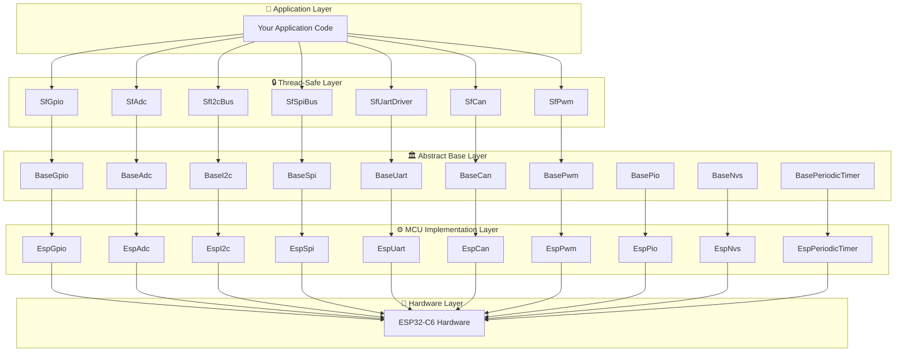
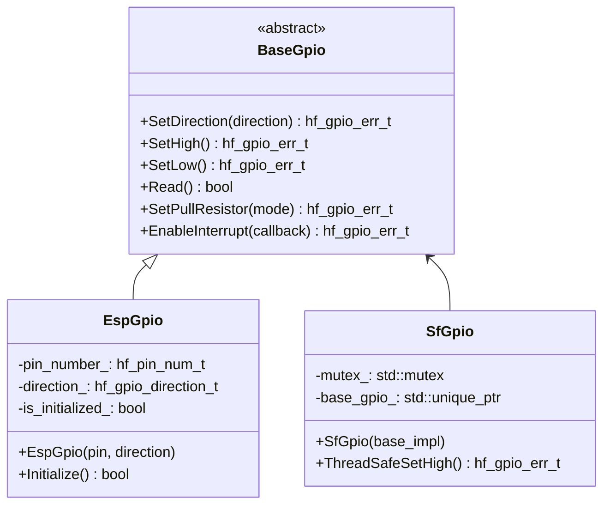
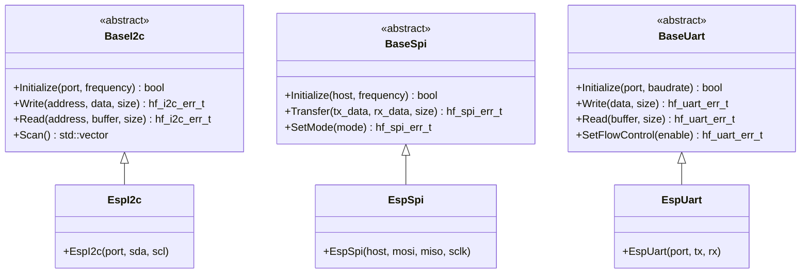
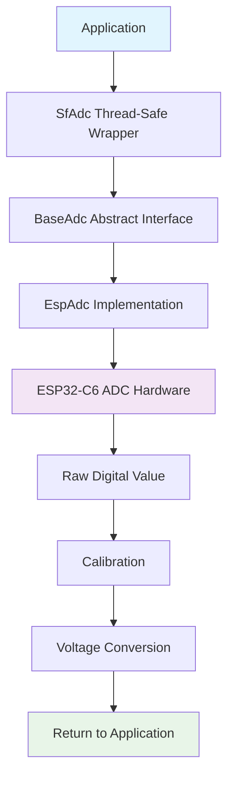
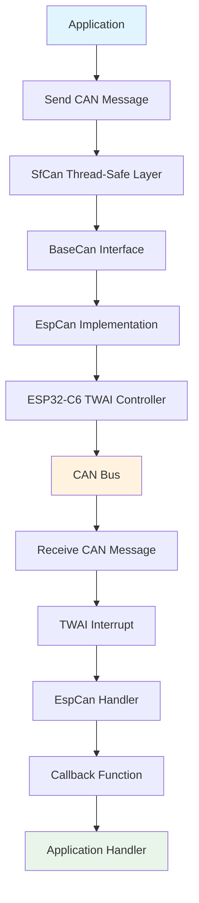
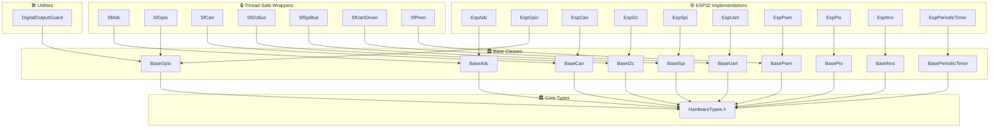

# 🗺️ HardFOC Internal Interface Wrapper - Component Map

<div align="center">


**🏗️ Visual guide to all components and their relationships in the HardFOC system**

</div>

---

## 📚 **Table of Contents**

- [🎯 **Overview**](#-overview)
- [🏗️ **Architecture Layers**](#️-architecture-layers)
- [📊 **Component Matrix**](#-component-matrix)
- [🔌 **Interface Implementations**](#-interface-implementations)
- [🔄 **Data Flow**](#-data-flow)
- [📁 **File Structure**](#-file-structure)

---

## 🎯 **Overview**

The HardFOC Internal Interface Wrapper is organized in a layered architecture with clear separation of concerns. This component map provides a comprehensive view of all components and their relationships.

### 🌟 **Key Principles**

- **🔌 Abstraction**: Base classes define common interfaces
- **🏗️ Implementation**: Platform-specific implementations
- **🔒 Thread Safety**: Optional thread-safe wrappers
- **🎯 Type Safety**: Consistent type wrapping system

---

## 🏗️ **Architecture Layers**



---

## 📊 **Component Matrix**

### 🏛️ **Base Classes** (Abstract Layer)

| Component | File | Purpose | Key Features |
|-----------|------|---------|--------------|
| **BaseGpio** | `inc/base/BaseGpio.h` | GPIO abstraction | Pin control, interrupts, pull resistors |
| **BaseAdc** | `inc/base/BaseAdc.h` | ADC abstraction | Multi-channel, calibration, voltage conversion |
| **BaseI2c** | `inc/base/BaseI2c.h` | I2C abstraction | Master mode, device scanning, error recovery |
| **BaseSpi** | `inc/base/BaseSpi.h` | SPI abstraction | Full-duplex, configurable modes, DMA support |
| **BaseUart** | `inc/base/BaseUart.h` | UART abstraction | Async I/O, flow control, configurable parameters |
| **BaseCan** | `inc/base/BaseCan.h` | CAN abstraction | Standard/Extended frames, filtering, error handling |
| **BasePwm** | `inc/base/BasePwm.h` | PWM abstraction | Multi-channel, frequency control, duty cycle |
| **BasePio** | `inc/base/BasePio.h` | PIO abstraction | Custom protocols, precise timing, hardware encoding |
| **BaseNvs** | `inc/base/BaseNvs.h` | NVS abstraction | Key-value storage, persistence, encryption |
| **BasePeriodicTimer** | `inc/base/BasePeriodicTimer.h` | Timer abstraction | Periodic callbacks, high precision, low latency |

### ⚙️ **ESP32 Implementations**

| Component | Header | Source | Purpose |
|-----------|---------|---------|---------|
| **EspGpio** | `inc/mcu/esp32/EspGpio.h` | `src/mcu/esp32/EspGpio.cpp` | ESP32-C6 GPIO driver |
| **EspAdc** | `inc/mcu/esp32/EspAdc.h` | `src/mcu/esp32/EspAdc.cpp` | ESP32-C6 ADC with calibration |
| **EspI2c** | `inc/mcu/esp32/EspI2c.h` | `src/mcu/esp32/EspI2c.cpp` | ESP32-C6 I2C master |
| **EspSpi** | `inc/mcu/esp32/EspSpi.h` | `src/mcu/esp32/EspSpi.cpp` | ESP32-C6 SPI master |
| **EspUart** | `inc/mcu/esp32/EspUart.h` | `src/mcu/esp32/EspUart.cpp` | ESP32-C6 UART driver |
| **EspCan** | `inc/mcu/esp32/EspCan.h` | `src/mcu/esp32/EspCan.cpp` | ESP32-C6 TWAI (CAN) |
| **EspPwm** | `inc/mcu/esp32/EspPwm.h` | `src/mcu/esp32/EspPwm.cpp` | ESP32-C6 LEDC PWM |
| **EspPio** | `inc/mcu/esp32/EspPio.h` | `src/mcu/esp32/EspPio.cpp` | ESP32-C6 RMT-based PIO |
| **EspNvs** | `inc/mcu/esp32/EspNvs.h` | `src/mcu/esp32/EspNvs.cpp` | ESP32-C6 NVS storage |
| **EspPeriodicTimer** | `inc/mcu/esp32/EspPeriodicTimer.h` | `src/mcu/esp32/EspPeriodicTimer.cpp` | ESP32-C6 timer callbacks |

### 🔒 **Thread-Safe Wrappers**

| Component | File | Base Class | Synchronization |
|-----------|------|------------|-----------------|
| **SfGpio** | `inc/thread_safe/SfGpio.h` | BaseGpio | Mutex protection |
| **SfAdc** | `inc/thread_safe/SfAdc.h` | BaseAdc | Lock-free reads, batch operations |
| **SfI2cBus** | `inc/thread_safe/SfI2cBus.h` | BaseI2c | Transaction-level locking |
| **SfSpiBus** | `inc/thread_safe/SfSpiBus.h` | BaseSpi | Transfer-level locking |
| **SfUartDriver** | `inc/thread_safe/SfUartDriver.h` | BaseUart | Buffer-level protection |
| **SfCan** | `inc/thread_safe/SfCan.h` | BaseCan | Message queue protection |
| **SfPwm** | `inc/thread_safe/SfPwm.h` | BasePwm | Channel-level locking |

### 🛠️ **Utility Components**

| Component | File | Purpose |
|-----------|------|---------|
| **HardwareTypes** | `inc/base/HardwareTypes.h` | Platform-agnostic type definitions |
| **DigitalOutputGuard** | `inc/utils/DigitalOutputGuard.h` | RAII GPIO management |

---

## 🔌 **Interface Implementations**

### 📊 **GPIO Interface**



### 📡 **Communication Interfaces**



---

## 🔄 **Data Flow**

### 📊 **ADC Data Flow**



### 🚗 **CAN Message Flow**



---

## 📁 **File Structure**

```
hf-internal-interface-wrap/
├── 📁 inc/                          # Header files
│   ├── 📁 base/                     # Abstract base classes
│   │   ├── 📄 BaseAdc.h
│   │   ├── 📄 BaseGpio.h
│   │   ├── 📄 BaseCan.h
│   │   ├── 📄 BaseI2c.h
│   │   ├── 📄 BaseSpi.h
│   │   ├── 📄 BaseUart.h
│   │   ├── 📄 BasePwm.h
│   │   ├── 📄 BasePio.h
│   │   ├── 📄 BaseNvs.h
│   │   ├── 📄 BasePeriodicTimer.h
│   │   └── 📄 HardwareTypes.h       # Type definitions
│   ├── 📁 mcu/                      # MCU implementations
│   │   └── 📁 esp32/               # ESP32-specific
│   │       ├── 📄 EspAdc.h
│   │       ├── 📄 EspGpio.h
│   │       ├── 📄 EspCan.h
│   │       ├── 📄 EspI2c.h
│   │       ├── 📄 EspSpi.h
│   │       ├── 📄 EspUart.h
│   │       ├── 📄 EspPwm.h
│   │       ├── 📄 EspPio.h
│   │       ├── 📄 EspNvs.h
│   │       └── 📄 EspPeriodicTimer.h
│   ├── 📁 thread_safe/              # Thread-safe wrappers
│   │   ├── 📄 SfGpio.h
│   │   ├── 📄 SfAdc.h
│   │   ├── 📄 SfI2cBus.h
│   │   ├── 📄 SfSpiBus.h
│   │   ├── 📄 SfUartDriver.h
│   │   ├── 📄 SfCan.h
│   │   └── 📄 SfPwm.h
│   └── 📁 utils/                    # Utility classes
│       └── 📄 DigitalOutputGuard.h
├── 📁 src/                          # Source files
│   ├── 📁 mcu/esp32/               # ESP32 implementations
│   │   ├── 📄 EspAdc.cpp
│   │   ├── 📄 EspGpio.cpp
│   │   ├── 📄 EspCan.cpp
│   │   ├── 📄 EspI2c.cpp
│   │   ├── 📄 EspSpi.cpp
│   │   ├── 📄 EspUart.cpp
│   │   ├── 📄 EspPwm.cpp
│   │   ├── 📄 EspPio.cpp
│   │   ├── 📄 EspNvs.cpp
│   │   └── 📄 EspPeriodicTimer.cpp
│   └── 📁 utils/                    # Utility implementations
│       └── 📄 DigitalOutputGuard.cpp
├── 📁 examples/                     # Example projects
│   ├── 📁 esp32/                   # ESP32 examples
│   └── 📁 common/                  # Common examples
├── 📁 docs/                         # Documentation
│   ├── 📁 api/                     # API documentation
│   ├── 📁 guides/                  # User guides
│   └── 📁 examples/                # Example documentation
└── 📁 .github/                      # GitHub workflows
    └── 📁 workflows/               # CI/CD pipelines
```

---

## 🎯 **Component Dependencies**

### 📊 **Dependency Graph**



---

## 🚀 **Usage Patterns**

### 🎯 **Direct Usage Pattern**

```cpp
// Direct ESP32 implementation usage
EspGpio led_pin(GPIO_NUM_2, hf_gpio_direction_t::HF_GPIO_DIRECTION_OUTPUT);
led_pin.Initialize();
led_pin.SetHigh();
```

### 🔒 **Thread-Safe Pattern**

```cpp
// Thread-safe wrapper usage
auto esp_gpio = std::make_unique<EspGpio>(GPIO_NUM_2, 
                                          hf_gpio_direction_t::HF_GPIO_DIRECTION_OUTPUT);
SfGpio safe_gpio(std::move(esp_gpio));
safe_gpio.Initialize();
safe_gpio.SetHigh();  // Thread-safe operation
```

### 🎯 **Polymorphic Pattern**

```cpp
// Using base class interface
std::unique_ptr<BaseGpio> gpio = std::make_unique<EspGpio>(GPIO_NUM_2, 
                                                           hf_gpio_direction_t::HF_GPIO_DIRECTION_OUTPUT);
gpio->Initialize();
gpio->SetHigh();  // Virtual function call
```

---

<div align="center">

**🗺️ This component map provides a comprehensive overview of the HardFOC Internal Interface Wrapper system architecture**

*Use this guide to understand component relationships and make informed implementation decisions*

</div>