# 🚀 HardFOC Internal Interface Wrapper

<div align="center">


**🎯 Hardware Abstraction Layer for HardFOC Systems**

*Professional, platform-agnostic interface wrapper for HardFOC motor controller boards*

</div>

---

## 📚 **Table of Contents**

- [🎯 **Overview**](#-overview)
- [🏗️ **Architecture**](#️-architecture)
- [🔧 **Type System**](#-type-system)
- [✨ **Key Features**](#-key-features)
- [🔌 **Supported Hardware**](#-supported-hardware)
- [🏛️ **Design Principles**](#️-design-principles)
- [📋 **API Reference**](#-api-reference)
- [🚀 **Quick Start**](#-quick-start)
- [📊 **Examples**](#-examples)
- [🔧 **Building**](#-building)
- [🤝 **Contributing**](#-contributing)
- [📄 **License**](#-license)

---

## 🎯 **Overview**

The **HardFOC Internal Interface Wrapper** is a hardware abstraction layer for **HardFOC motor controller boards**. It provides unified APIs across different MCU platforms while maintaining performance, thread safety, and hardware support.

### 🎯 **Primary Goals for HardFOC Boards**

- **🔌 Unified Interface** - Consistent APIs across all HardFOC motor controller board peripherals
- **⚡ Real-Time Performance** - Optimized for HardFOC motor control timing requirements
- **🌐 Modern Connectivity** - WiFi and Bluetooth support for IoT-enabled HardFOC boards
- **🛡️ Production Ready** - Error handling and monitoring for HardFOC applications
- **📈 Scalable Architecture** - From simple HardFOC prototypes to complex industrial systems
- **🔧 Easy Integration** - Integration with existing HardFOC motor control applications

---

## 🏗️ **Architecture**

The wrapper follows a multi-layered architecture for HardFOC motor controller boards:

```mermaid
graph TB
    subgraph "🎯 HardFOC Application Layer"
        A["🏭 HardFOC Motor Control<br/>Applications"]
        B["🌐 HardFOC IoT<br/>Integration"]
        C["📊 HardFOC System<br/>Management"]
    end
    
    subgraph "🔒 Thread-Safe Layer (Optional)"
        D["🔐 Thread-Safe Wrappers<br/>Concurrent Access Control"]
    end
    
    subgraph "🏛️ HardFOC Base Interface Layer"
        E["🔌 Core Interfaces<br/>GPIO, ADC, PWM, PIO"]
        F["📡 Communication<br/>I2C, SPI, UART, CAN"] 
        G["🌐 Wireless<br/>WiFi, Bluetooth"]
        H["🛠️ System<br/>NVS, Timer, Temp, Logger"]
    end
    
    subgraph "⚙️ Platform Implementation Layer"
        I["📟 ESP32-C6<br/>Implementations"]
        J["🔧 External Hardware<br/>Drivers"]
        K["📡 I2C/SPI Device<br/>Support"]
    end
    
    subgraph "🔧 HardFOC Hardware Layer"
        L["⚡ ESP32-C6<br/>Hardware"]
        M["🏭 HardFOC Board<br/>Components"]
        N["🎛️ Sensors &<br/>Actuators"]
    end
    
    A --> D
    B --> D
    C --> D
    
    D --> E
    D --> F
    D --> G
    D --> H
    
    E --> I
    F --> I
    G --> I
    H --> J
    
    I --> L
    J --> M
    K --> N
```



### 🔄 **Interface Inheritance Pattern for HardFOC**

All HardFOC interfaces follow a consistent inheritance pattern:


---

## 🔧 **Type System**

The wrapper uses a comprehensive type system designed for maximum portability and consistency across HardFOC motor controller boards:

### 🎯 **Core Types for HardFOC Applications**

```cpp
// Platform-agnostic integer types for HardFOC boards
using hf_u8_t = uint8_t;    // 8-bit unsigned
using hf_u16_t = uint16_t;  // 16-bit unsigned  
using hf_u32_t = uint32_t;  // 32-bit unsigned
using hf_u64_t = uint64_t;  // 64-bit unsigned
using hf_i8_t = int8_t;     // 8-bit signed
using hf_i16_t = int16_t;   // 16-bit signed
using hf_i32_t = int32_t;   // 32-bit signed
using hf_i64_t = int64_t;   // 64-bit signed
```

### 🏭 **HardFOC Hardware-Specific Types**

```cpp
// Hardware abstraction types for HardFOC motor controller boards
using hf_pin_num_t = hf_i32_t;          // GPIO pin numbers
using hf_channel_id_t = hf_u32_t;       // ADC/PWM/DMA channels
using hf_time_t = hf_u64_t;             // Time values in microseconds
using hf_frequency_hz_t = hf_u32_t;     // Frequency values in Hz

// HardFOC motor control semantic types
using hf_voltage_mv_t = hf_u32_t;       // Voltage in millivolts
using hf_current_ma_t = hf_u32_t;       // Current in milliamps
using hf_temperature_c_t = hf_i32_t;    // Temperature in Celsius (scaled by 100)
using hf_speed_rpm_t = hf_u32_t;        // Motor speed in RPM
using hf_torque_nm_t = hf_u32_t;        // Torque in Newton-meters (scaled)
```

📖 **Complete Documentation**: [HardwareTypes API Reference](api/HardwareTypes.md)

---

## ✨ **Key Features**

### 🔌 **Comprehensive Hardware Support for HardFOC Boards**
- **14 Complete Base Interfaces** - From GPIO to wireless communication for HardFOC applications
- **ESP32-C6 Optimized** - Full support for all ESP32-C6 peripherals used in HardFOC boards
- **External Hardware Integration** - I2C/SPI device support for HardFOC expansion boards
- **Motor Control Optimized** - Specialized features for HardFOC motor controller applications

### ⚡ **Performance & Reliability for HardFOC**
- **Real-Time Optimized** - Designed for critical HardFOC motor control timing
- **Lazy Initialization** - Resources allocated only when needed on HardFOC boards
- **Thread-Safe Options** - Optional concurrent access support for HardFOC applications
- **Comprehensive Error Handling** - Detailed error reporting for HardFOC reliability

### 🌐 **Modern Connectivity for HardFOC IoT**
- **WiFi Station/AP Modes** - Complete networking for HardFOC IoT integration
- **Bluetooth Classic & BLE** - Mobile and IoT connectivity for HardFOC boards
- **Cloud Integration Ready** - Built-in features for HardFOC cloud connectivity
- **Remote Monitoring** - Advanced logging and diagnostics for HardFOC systems

### 📊 **Professional Features for HardFOC Systems**
- **Rich Diagnostics** - Performance monitoring and system health for HardFOC boards
- **Configuration Management** - Non-volatile settings storage for HardFOC applications
- **Advanced Logging** - Multi-level, multi-output logging for HardFOC debugging
- **Thermal Management** - Temperature monitoring and protection for HardFOC boards

---

## 🔌 **Supported Hardware**

### 📊 **HardFOC Platform Support Matrix**

| **HardFOC Hardware Platform** | **GPIO** | **ADC** | **PWM** | **I2C** | **SPI** | **UART** | **CAN** | **WiFi** | **BT** | **Temp** | **NVS** | **Timer** | **PIO** | **Logger** |
|-------------------------------|----------|---------|---------|---------|---------|----------|---------|----------|--------|----------|---------|-----------|---------|------------|
| **ESP32-C6 (Primary MCU)**   | ✅       | ✅      | ✅      | ✅      | ✅      | ✅       | ✅      | ✅       | ✅     | ✅       | ✅      | ✅        | ✅      | ✅         |
| **I2C Expansion Devices**    | ✅       | ✅      | ❌      | ❌      | ❌      | ❌       | ❌      | ❌       | ❌     | ✅       | ❌      | ❌        | ❌      | ❌         |
| **SPI Expansion Devices**    | ✅       | ✅      | ✅      | ❌      | ❌      | ❌       | ✅      | ❌       | ❌     | ✅       | ❌      | ❌        | ❌      | ❌         |
| **External Controllers**     | ✅       | ✅      | ✅      | ✅      | ✅      | ❌       | ✅      | ❌       | ❌     | ✅       | ✅      | ❌        | ❌      | ❌         |

---

## 🏛️ **Design Principles**

### 🎯 **HardFOC-Specific Design Goals**

1. **🔌 Consistency** - Uniform APIs across all HardFOC motor controller board interfaces
2. **⚡ Performance** - Optimized for real-time HardFOC motor control requirements  
3. **🛡️ Reliability** - Comprehensive error handling for critical HardFOC applications
4. **📈 Scalability** - From simple HardFOC prototypes to complex industrial systems
5. **🔧 Simplicity** - Easy-to-use APIs for rapid HardFOC development
6. **🌐 Modern** - Built-in IoT connectivity for next-generation HardFOC boards

### 🏗️ **Architectural Patterns for HardFOC**

- **Abstract Base Classes** - Define consistent interfaces for all HardFOC peripherals
- **Platform Implementations** - Hardware-specific optimizations for HardFOC boards
- **Optional Thread Safety** - Concurrent access support for complex HardFOC applications
- **Lazy Resource Management** - Efficient memory usage on resource-constrained HardFOC boards
- **Comprehensive Error Handling** - Detailed error reporting for HardFOC reliability
- **Semantic Type System** - Motor control domain-specific types for HardFOC clarity

---

## 📋 **API Reference**

### 📚 **Documentation Structure**

Our comprehensive documentation is organized into logical sections for easy navigation:

| **Section** | **Description** | **Documentation** |
|-------------|-----------------|-------------------|
| **[📋 API Interfaces](api/README.md)** | Base classes and abstract interfaces | Complete API reference with examples |
| **[🔧 ESP32 Implementations](esp_api/README.md)** | ESP32-C6 specific implementations | Hardware-specific optimizations and features |
| **[🛠️ Utility Classes](utils/README.md)** | Advanced utility classes and helpers | RAII patterns, safety mechanisms, and convenience wrappers |
| **[🧪 Test Suites](../../examples/esp32/docs/README.md)** | Test documentation and examples | Test suites and examples |


### 🏛️ **Core Interfaces for HardFOC Boards**

| **Interface** | **Key Features** | **HardFOC Use Cases** | **Status** |
|---------------|------------------|----------------------|------------|
| [**`BaseGpio`**](api/BaseGpio.md) | Digital I/O, interrupts, pull resistors | Enable pins, limit switches, indicators on HardFOC boards | ✅ Complete |
| [**`BaseAdc`**](api/BaseAdc.md) | Multi-channel, calibration, voltage conversion | Current sensing, position feedback for HardFOC systems | ✅ Complete |
| [**`BasePwm`**](api/BasePwm.md) | Multi-channel, frequency control, duty cycle | Motor speed control, servo control for HardFOC applications | ✅ Complete |
| [**`BasePio`**](api/BasePio.md) | Custom protocols, precise timing, encoding | Encoder reading, custom protocols for HardFOC boards | ✅ Complete |

### 📡 **Communication Interfaces for HardFOC Systems**

| **Interface** | **Key Features** | **HardFOC Use Cases** | **Status** |
|---------------|------------------|----------------------|------------|
| [**`BaseI2c`**](api/BaseI2c.md) | Master mode, device scanning, error recovery | Sensor communication, display control for HardFOC boards | ✅ Complete |
| [**`BaseSpi`**](api/BaseSpi.md) | Full-duplex, configurable modes, DMA support | High-speed data, SD cards for HardFOC data logging | ✅ Complete |
| [**`BaseUart`**](api/BaseUart.md) | Async I/O, flow control, configurable parameters | Debug output, external communication for HardFOC systems | ✅ Complete |
| [**`BaseCan`**](api/BaseCan.md) | Standard/Extended frames, filtering, error handling | Industrial networking, multi-motor HardFOC coordination | ✅ Complete |

### 🌐 **Wireless Interfaces for HardFOC IoT**

| **Interface** | **Key Features** | **HardFOC Use Cases** | **Status** |
|---------------|------------------|----------------------|------------|
| [**`BaseWifi`**](api/BaseWifi.md) | Station/AP modes, WPA3 security, mesh networking | Cloud connectivity, remote monitoring for HardFOC boards | ✅ Complete |
| [**`BaseBluetooth`**](api/BaseBluetooth.md) | Classic & BLE, pairing, service discovery | Mobile apps, wireless configuration for HardFOC systems | ✅ Complete |

### 🛠️ **System Interfaces for HardFOC Applications**

| **Interface** | **Key Features** | **HardFOC Use Cases** | **Status** |
|---------------|------------------|----------------------|------------|
| [**`BaseNvs`**](api/BaseNvs.md) | Key-value storage, encryption, wear leveling | Configuration storage, calibration data for HardFOC boards | ✅ Complete |
| [**`BasePeriodicTimer`**](api/BasePeriodicTimer.md) | Callback scheduling, high precision, multi-timer | Control loops, sensor sampling for HardFOC applications | ✅ Complete |
| [**`BaseTemperature`**](api/BaseTemperature.md) | Multi-sensor support, calibration, thermal protection | Thermal monitoring, safety protection for HardFOC boards | ✅ Complete |
| [**`BaseLogger`**](api/BaseLogger.md) | Multi-level logging, thread-safe, network output | System diagnostics, performance monitoring for HardFOC systems | ✅ Complete |

### 🔧 **ESP32-C6 Implementations**

| **Implementation** | **Base Class** | **ESP32-C6 Features** | **Documentation** |
|-------------------|----------------|----------------------|-------------------|
| [**`EspGpio`**](esp_api/EspGpio.md) | BaseGpio | Drive strength, slew rate control | ✅ Complete |
| **`EspAdc`** | BaseAdc | 12-bit resolution, multiple units | ✅ Complete |
| **`EspPwm`** | BasePwm | LEDC controller, fade effects | ✅ Complete |
| **`EspI2c`** | BaseI2c | Clock stretching, multi-master | ✅ Complete |
| **`EspSpi`** | BaseSpi | Full-duplex, DMA support | ✅ Complete |
| **`EspUart`** | BaseUart | Hardware flow control | ✅ Complete |
| **`EspCan`** | BaseCan | TWAI controller, SN65 transceiver, no CAN-FD | ✅ Complete |
| **`EspWifi`** | BaseWifi | 802.11n, WPA3, mesh | ✅ Complete |
| **`EspBluetooth`** | BaseBluetooth | BLE/Classic, NimBLE optimized | ✅ Complete |
| **`EspNvs`** | BaseNvs | Encrypted storage, wear leveling | ✅ Complete |
| **`EspPeriodicTimer`** | BasePeriodicTimer | High precision, multi-timer | ✅ Complete |
| **`EspTemperature`** | BaseTemperature | Internal sensor, I2C/1-Wire | ✅ Complete |
| **`EspPio`** | BasePio | RMT peripheral, custom protocols | ✅ Complete |
| **`EspLogger`** | BaseLogger | Multi-output, network logging | ✅ Complete |

### 🎯 **Type System Reference**

| **Documentation** | **Description** | **Status** |
|------------------|-----------------|------------|
| [**`HardwareTypes`**](api/HardwareTypes.md) | Platform-agnostic type definitions | ✅ Complete |

---

## 🚀 **Quick Start**

### 📋 **Prerequisites for HardFOC Development**

- **ESP-IDF v5.0+** for ESP32-C6 development
- **C++17** compatible compiler (GCC 8+ or Clang 7+)
- **CMake 3.16+** for HardFOC project management
- **HardFOC Motor Controller Board** with ESP32-C6

### ⚙️ **Installation for HardFOC Boards**

```bash
# Clone the HardFOC wrapper repository
git clone https://github.com/hardfoc/hf-internal-interface-wrap.git
cd hf-internal-interface-wrap

# Add to your HardFOC project's CMakeLists.txt
idf_component_register(
    SRCS "main.cpp"
    INCLUDE_DIRS "."
    REQUIRES hf_internal_interface_wrap
)
```

### 🎯 **Basic HardFOC GPIO Example**

```cpp
#include "inc/mcu/esp32/EspGpio.h"

// Create output pin for LED control
EspGpio led_pin(GPIO_NUM_2, hf_gpio_direction_t::HF_GPIO_DIRECTION_OUTPUT);

// Create input pin for button
EspGpio button_pin(GPIO_NUM_0, hf_gpio_direction_t::HF_GPIO_DIRECTION_INPUT,
                  hf_gpio_active_state_t::HF_GPIO_ACTIVE_LOW,
                  hf_gpio_output_mode_t::HF_GPIO_OUTPUT_MODE_PUSH_PULL,
                  hf_gpio_pull_mode_t::HF_GPIO_PULL_MODE_UP);

void app_main() {
    // Initialize pins
    led_pin.EnsureInitialized();
    button_pin.EnsureInitialized();
    
    while (true) {
        if (button_pin.IsActive()) {
            led_pin.SetActive();    // Turn on LED when button pressed
        } else {
            led_pin.SetInactive();  // Turn off LED when button released
        }
        vTaskDelay(pdMS_TO_TICKS(10));
    }
}
```

### 📊 **Basic HardFOC ADC Example**

```cpp
#include "inc/mcu/esp32/EspAdc.h"

void read_hardfoc_sensors() {
    EspAdc adc(ADC_UNIT_1, ADC_ATTEN_DB_11);
    
    // Initialize ADC
    if (!adc.EnsureInitialized()) {
        printf("Failed to initialize HardFOC ADC\n");
        return;
    }
    
    // Read motor current sensor (channel 0)
    float current_voltage;
    if (adc.ReadChannelV(0, current_voltage) == hf_adc_err_t::ADC_SUCCESS) {
        float current_amps = (current_voltage - 2.5f) / 0.1f;  // ACS712 conversion
        printf("Motor Current: %.2f A\n", current_amps);
    }
    
    // Read position sensor (channel 1)
    float position_voltage;
    if (adc.ReadChannelV(1, position_voltage) == hf_adc_err_t::ADC_SUCCESS) {
        float position_degrees = (position_voltage / 3.3f) * 360.0f;
        printf("Motor Position: %.1f degrees\n", position_degrees);
    }
}
```

---

## 📊 **Examples**

### 🎯 **Basic Interface Examples for HardFOC**
- **GPIO Control** - LED and button control for HardFOC boards
- **ADC Monitoring** - Sensor data acquisition for HardFOC systems
- **PWM Generation** - Motor speed control for HardFOC applications
- **Temperature Sensing** - Thermal monitoring for HardFOC boards

### 🌐 **Wireless Examples for HardFOC IoT**
- **WiFi Station** - Internet connectivity for HardFOC IoT
- **WiFi Access Point** - Local network creation for HardFOC systems
- **Bluetooth BLE** - Mobile app integration with HardFOC boards
- **Bluetooth Classic** - Serial communication for HardFOC

### 🚀 **Advanced Integration Examples for HardFOC**
- **Complete HardFOC Motor Controller** - Full-featured motor control with TMC-style controllers
- **HardFOC IoT Gateway** - WiFi bridge with monitoring
- **HardFOC Multi-Sensor Logger** - Data collection system
- **Secure HardFOC Communication** - Encrypted data transfer

### 🧪 **Production-Ready Examples for HardFOC**
- **Industrial HardFOC Control System** - Complete industrial solution
- **Automotive HardFOC Interface** - CAN bus integration
- **Remote HardFOC Monitoring** - Cloud-connected system
- **HardFOC Diagnostic System** - Advanced diagnostics

---

## 🔧 **Building**

### 🏗️ **Standard Build Process for HardFOC Projects**

```bash
# Set up ESP-IDF environment for HardFOC development
. $IDF_PATH/export.sh

# Configure HardFOC project options
idf.py menuconfig

# Build HardFOC project
idf.py build

# Flash to HardFOC board and monitor
idf.py -p /dev/ttyUSB0 flash monitor

# Run HardFOC-specific tests
idf.py -p /dev/ttyUSB0 test
```

### ⚙️ **HardFOC Project Configuration**

Configure specific features for your HardFOC motor controller board:

- **Interface Selection** - Enable only the interfaces your HardFOC board uses
- **Performance Tuning** - Optimize for HardFOC real-time requirements
- **Memory Configuration** - Configure buffers for HardFOC applications
- **Wireless Settings** - WiFi and Bluetooth configuration for HardFOC IoT
- **Debug Options** - Logging levels for HardFOC development

---

## 🤝 **Contributing**

We welcome contributions to improve HardFOC motor controller board support! Please see our [Contributing Guidelines](../CONTRIBUTING.md).

### 🎯 **Areas for HardFOC Development**
- **New Hardware Support** - Additional HardFOC board variants
- **Performance Optimization** - Real-time improvements for HardFOC applications
- **Example Applications** - More HardFOC use case demonstrations
- **Documentation** - Enhanced guides for HardFOC development
- **Testing** - Hardware validation with HardFOC boards

---

## 📄 **License**

This project is licensed under the **GNU General Public License v3.0** - see the [LICENSE](../LICENSE) file for details.

The GPL-3.0 license ensures that improvements to the HardFOC wrapper remain open source and benefit the entire HardFOC community.

---

<div align="center">

**🚀 HardFOC Interface Wrapper**

*Hardware abstraction layer for HardFOC motor controller boards*

---

**🔗 Quick Links**

[🚀 Quick Start](#-quick-start) | [📋 API Reference](#-api-reference) | [📊 Examples](#-examples) | [🤝 Contributing](#-contributing)

**📚 Documentation Navigation**

[📋 API Interfaces](api/README.md) | [🔧 ESP32 Implementations](esp_api/README.md) | [🛠️ Utility Classes](utils/README.md) | [🧪 Test Suites](../../examples/esp32/docs/README.md)

**📞 Support**

[💬 GitHub Discussions](../../discussions) | [🐛 Issue Tracker](../../issues) | [📧 HardFOC Support](mailto:support@hardfoc.com)

</div>
