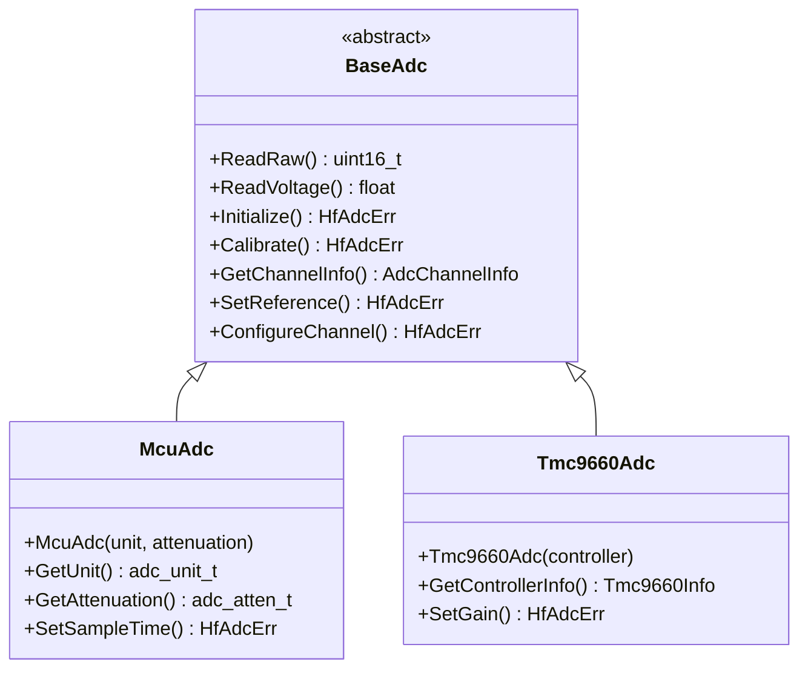

# 📊 BaseAdc API Reference

<div align="center">


**🎯 Unified ADC abstraction for all analog-to-digital conversion operations**

</div>

---

## 📚 **Table of Contents**

- [🎯 **Overview**](#-overview)
- [🏗️ **Class Hierarchy**](#️-class-hierarchy)
- [📋 **Error Codes**](#-error-codes)
- [📊 **Channel Management**](#-channel-management)
- [🔧 **Core Methods**](#-core-methods)
- [⚙️ **Calibration System**](#️-calibration-system)
- [💡 **Usage Examples**](#-usage-examples)
- [🧪 **Testing**](#-testing)

---

## 🎯 **Overview**

The `BaseAdc` class provides a comprehensive ADC abstraction that serves as the unified interface for all analog-to-digital conversion operations in the HardFOC system. It supports multi-channel operation, hardware calibration, voltage conversion, and works across different ADC implementations.

### ✨ **Key Features**

- 📊 **Multi-Channel Support** - Simultaneous operation on multiple ADC channels
- 🎯 **Hardware Calibration** - Automatic gain and offset calibration
- ⚡ **High-Speed Conversion** - Optimized for real-time motor control
- 🔄 **Voltage Conversion** - Direct voltage reading with calibration
- 📈 **Raw Data Access** - Direct access to raw ADC values
- 🛡️ **Robust Error Handling** - Comprehensive validation and error reporting
- 🏎️ **Performance Optimized** - Minimal overhead for critical applications
- 🔌 **Platform Agnostic** - Works with internal and external ADCs

### 📊 **Supported Hardware**

| Implementation | Hardware Type | Channels | Resolution | Sample Rate |
|----------------|---------------|----------|------------|-------------|
| `McuAdc` | ESP32-C6 Internal | ADC1: 7ch, ADC2: 6ch | 12-bit | Up to 2 MSPS |
| `Tmc9660Adc` | Motor Controller | 3 channels | 10-bit | Up to 100 kSPS |
| `Ads1x1xAdc` | External I2C ADC | 4 channels | 16-bit | Up to 860 SPS |

---

## 🏗️ **Class Hierarchy**



---

## 📋 **Error Codes**

The ADC system uses comprehensive error codes for robust error handling:

### ✅ **Success Codes**

| Code | Value | Description |
|------|-------|-------------|
| `ADC_SUCCESS` | 0 | ✅ Operation completed successfully |

### ❌ **General Error Codes**

| Code | Value | Description | Resolution |
|------|-------|-------------|------------|
| `ADC_ERR_FAILURE` | 1 | ❌ General operation failure | Check hardware and configuration |
| `ADC_ERR_NOT_INITIALIZED` | 2 | ⚠️ ADC not initialized | Call Initialize() first |
| `ADC_ERR_INVALID_CHANNEL` | 3 | 🚫 Invalid channel number | Use valid channel numbers |
| `ADC_ERR_INVALID_UNIT` | 4 | 🚫 Invalid ADC unit | Check ADC unit availability |
| `ADC_ERR_INVALID_PARAMETER` | 5 | 🚫 Invalid parameter | Validate input parameters |
| `ADC_ERR_TIMEOUT` | 6 | ⏰ Conversion timeout | Check ADC clock and load |

### 🔧 **Configuration Error Codes**

| Code | Value | Description | Resolution |
|------|-------|-------------|------------|
| `ADC_ERR_CALIBRATION_FAILED` | 10 | 📊 Calibration failure | Re-run calibration process |
| `ADC_ERR_REFERENCE_INVALID` | 11 | 🎯 Invalid voltage reference | Set valid reference voltage |
| `ADC_ERR_ATTENUATION_INVALID` | 12 | 📉 Invalid attenuation setting | Use supported attenuation values |
| `ADC_ERR_RESOLUTION_INVALID` | 13 | 🔍 Invalid resolution setting | Use supported resolution values |

### 🌐 **Hardware Error Codes**

| Code | Value | Description | Resolution |
|------|-------|-------------|------------|
| `ADC_ERR_HARDWARE_FAILURE` | 20 | 💥 Hardware communication failure | Check power and connections |
| `ADC_ERR_CHANNEL_BUSY` | 21 | 🔄 Channel currently in use | Wait or use different channel |
| `ADC_ERR_OVERLOAD` | 22 | ⚡ Input voltage overload | Reduce input voltage |
| `ADC_ERR_UNDERLOAD` | 23 | 📉 Input voltage too low | Increase input voltage |

---

## 📊 **Channel Management**

### 🎯 **Channel Configuration**

```cpp
/**
 * @brief ADC channel configuration structure
 * @details Contains all parameters needed to configure an ADC channel
 */
struct AdcChannelConfig {
    adc_unit_t unit;              ///< ADC unit (ADC1 or ADC2)
    adc_channel_t channel;        ///< Channel number within unit
    adc_atten_t attenuation;      ///< Input attenuation setting
    adc_bitwidth_t bitwidth;      ///< ADC resolution in bits
    float reference_voltage;       ///< Reference voltage for conversion
    bool calibration_enabled;     ///< Enable hardware calibration
};
```

### 📈 **Channel Information**

```cpp
/**
 * @brief ADC channel runtime information
 * @details Provides runtime status and capabilities of ADC channel
 */
struct AdcChannelInfo {
    bool is_available;            ///< Channel is available for use
    bool is_initialized;          ///< Channel has been initialized
    bool is_calibrated;           ///< Channel calibration is valid
    uint16_t resolution_bits;     ///< Effective resolution in bits
    float max_voltage;            ///< Maximum measurable voltage
    float min_voltage;            ///< Minimum measurable voltage
    uint32_t sample_rate_max;     ///< Maximum sample rate (Hz)
    float noise_level;            ///< Typical noise level (mV)
};
```

### 🎛️ **Attenuation Settings**

| Attenuation | Max Input Voltage | Use Case |
|-------------|-------------------|----------|
| `ADC_ATTEN_DB_0` | ~1.1V | Low voltage sensors |
| `ADC_ATTEN_DB_2_5` | ~1.5V | Battery monitoring |
| `ADC_ATTEN_DB_6` | ~2.2V | General purpose |
| `ADC_ATTEN_DB_11` | ~3.9V | High voltage inputs |

---

## 🔧 **Core Methods**

### 🏗️ **Initialization**

```cpp
/**
 * @brief Initialize the ADC instance
 * @return HfAdcErr Success or error code
 * 
 * 📝 Sets up ADC hardware, configures channels, and prepares for conversion.
 * Must be called before any conversion operations.
 * 
 * @example
 * McuAdc adc(ADC_UNIT_1, ADC_ATTEN_DB_11);
 * if (adc.Initialize() == HfAdcErr::ADC_SUCCESS) {
 *     // ADC ready for use
 * }
 */
virtual HfAdcErr Initialize() = 0;

/**
 * @brief Deinitialize the ADC instance
 * @return HfAdcErr Success or error code
 * 
 * 🧹 Cleanly shuts down ADC hardware and releases resources.
 */
virtual HfAdcErr Deinitialize() = 0;

/**
 * @brief Check if ADC is initialized
 * @return bool True if initialized
 * 
 * ❓ Query initialization status without side effects.
 */
virtual bool IsInitialized() const = 0;
```

### 📊 **Data Conversion**

```cpp
/**
 * @brief Read raw ADC value from specified channel
 * @param unit ADC unit (ADC_UNIT_1 or ADC_UNIT_2)
 * @param channel Channel number within the unit
 * @return uint16_t Raw ADC value (0-4095 for 12-bit)
 * 
 * 📈 Performs single ADC conversion and returns raw digital value.
 * No calibration or voltage conversion applied.
 * 
 * @example
 * uint16_t raw = adc.ReadRaw(ADC_UNIT_1, ADC_CHANNEL_0);
 * printf("Raw ADC: %d\n", raw);
 */
virtual uint16_t ReadRaw(adc_unit_t unit, adc_channel_t channel) = 0;

/**
 * @brief Read calibrated voltage from specified channel
 * @param unit ADC unit (ADC_UNIT_1 or ADC_UNIT_2)
 * @param channel Channel number within the unit
 * @return float Voltage in volts
 * 
 * ⚡ Performs ADC conversion with hardware calibration and returns voltage.
 * Automatically applies gain and offset correction.
 * 
 * @example
 * float voltage = adc.ReadVoltage(ADC_UNIT_1, ADC_CHANNEL_0);
 * printf("Voltage: %.3f V\n", voltage);
 */
virtual float ReadVoltage(adc_unit_t unit, adc_channel_t channel) = 0;

/**
 * @brief Convert raw ADC value to voltage
 * @param raw_value Raw ADC reading
 * @param unit ADC unit used for reading
 * @param channel Channel used for reading
 * @return float Equivalent voltage
 * 
 * 🔄 Converts previously read raw value to calibrated voltage.
 * Useful for batch processing or stored readings.
 */
virtual float RawToVoltage(uint16_t raw_value, adc_unit_t unit, adc_channel_t channel) = 0;
```

### 🎛️ **Channel Configuration**

```cpp
/**
 * @brief Configure ADC channel parameters
 * @param config Channel configuration structure
 * @return HfAdcErr Success or error code
 * 
 * ⚙️ Sets up channel-specific parameters including attenuation,
 * resolution, and reference voltage.
 * 
 * @example
 * AdcChannelConfig config = {
 *     .unit = ADC_UNIT_1,
 *     .channel = ADC_CHANNEL_0,
 *     .attenuation = ADC_ATTEN_DB_11,
 *     .bitwidth = ADC_BITWIDTH_12,
 *     .reference_voltage = 3.3f,
 *     .calibration_enabled = true
 * };
 * adc.ConfigureChannel(config);
 */
virtual HfAdcErr ConfigureChannel(const AdcChannelConfig& config) = 0;

/**
 * @brief Get channel information and status
 * @param unit ADC unit
 * @param channel Channel number
 * @return AdcChannelInfo Channel information structure
 * 
 * 📋 Retrieves comprehensive information about channel capabilities
 * and current configuration.
 */
virtual AdcChannelInfo GetChannelInfo(adc_unit_t unit, adc_channel_t channel) = 0;

/**
 * @brief Set ADC reference voltage
 * @param voltage Reference voltage in volts
 * @return HfAdcErr Success or error code
 * 
 * 🎯 Sets the voltage reference used for ADC conversions.
 * Affects the conversion accuracy and range.
 */
virtual HfAdcErr SetReferenceVoltage(float voltage) = 0;
```

---

## ⚙️ **Calibration System**

### 🎯 **Calibration Methods**

```cpp
/**
 * @brief Perform ADC calibration
 * @param unit ADC unit to calibrate
 * @return HfAdcErr Success or error code
 * 
 * 📊 Performs hardware calibration to improve accuracy.
 * Should be called after temperature changes or periodically.
 * 
 * @example
 * if (adc.Calibrate(ADC_UNIT_1) == HfAdcErr::ADC_SUCCESS) {
 *     printf("✅ Calibration successful\n");
 * }
 */
virtual HfAdcErr Calibrate(adc_unit_t unit) = 0;

/**
 * @brief Check if calibration is valid
 * @param unit ADC unit to check
 * @return bool True if calibration is valid
 * 
 * ✅ Verifies that calibration data is present and valid.
 */
virtual bool IsCalibrated(adc_unit_t unit) = 0;

/**
 * @brief Get calibration characteristics
 * @param unit ADC unit
 * @return CalibrationData Calibration parameters
 * 
 * 📊 Retrieves calibration coefficients for manual processing.
 */
virtual CalibrationData GetCalibration(adc_unit_t unit) = 0;
```

### 📊 **Calibration Data Structure**

```cpp
/**
 * @brief ADC calibration data structure
 * @details Contains calibration coefficients and metadata
 */
struct CalibrationData {
    float gain_coefficient;       ///< Gain correction factor
    float offset_voltage;         ///< Offset correction (mV)
    uint32_t calibration_date;    ///< Timestamp of last calibration
    bool is_valid;                ///< Calibration data is valid
    float temperature_coefficient; ///< Temperature drift coefficient
    uint16_t checksum;            ///< Data integrity checksum
};
```

---

## 💡 **Usage Examples**

### 📊 **Basic Voltage Reading**

```cpp
#include "mcu/McuAdc.h"

// Create ADC instance for high voltage range
McuAdc adc(ADC_UNIT_1, ADC_ATTEN_DB_11);

void setup() {
    // Initialize ADC with calibration
    if (adc.Initialize() == HfAdcErr::ADC_SUCCESS) {
        adc.Calibrate(ADC_UNIT_1);
        printf("✅ ADC initialized and calibrated\n");
    }
}

float read_battery_voltage() {
    // Read voltage from battery monitoring pin
    float voltage = adc.ReadVoltage(ADC_UNIT_1, ADC_CHANNEL_0);
    
    // Apply voltage divider correction (if needed)
    voltage *= 2.0f;  // For 2:1 voltage divider
    
    return voltage;
}

void monitor_battery() {
    float battery_voltage = read_battery_voltage();
    printf("🔋 Battery: %.2f V\n", battery_voltage);
    
    if (battery_voltage < 3.0f) {
        printf("⚠️ Low battery warning!\n");
    }
}
```

### 📈 **Multi-Channel Sensor Reading**

```cpp
#include "mcu/McuAdc.h"

struct SensorReadings {
    float temperature;      // Channel 0
    float pressure;         // Channel 1  
    float current;          // Channel 2
    float voltage;          // Channel 3
};

McuAdc adc(ADC_UNIT_1, ADC_ATTEN_DB_11);

SensorReadings read_all_sensors() {
    SensorReadings readings;
    
    // Read all channels
    float ch0 = adc.ReadVoltage(ADC_UNIT_1, ADC_CHANNEL_0);
    float ch1 = adc.ReadVoltage(ADC_UNIT_1, ADC_CHANNEL_1);
    float ch2 = adc.ReadVoltage(ADC_UNIT_1, ADC_CHANNEL_2);
    float ch3 = adc.ReadVoltage(ADC_UNIT_1, ADC_CHANNEL_3);
    
    // Convert to engineering units
    readings.temperature = (ch0 - 0.5f) * 100.0f;  // TMP36 sensor
    readings.pressure = ch1 * 100.0f;               // 0-100 PSI sensor
    readings.current = (ch2 - 2.5f) * 10.0f;       // ±25A current sensor
    readings.voltage = ch3 * 25.0f;                 // 0-25V input
    
    return readings;
}

void sensor_monitoring_task() {
    while (true) {
        SensorReadings sensors = read_all_sensors();
        
        printf("📊 Sensors - T:%.1f°C P:%.1f PSI I:%.1fA V:%.1fV\n",
               sensors.temperature, 
               sensors.pressure,
               sensors.current,
               sensors.voltage);
               
        vTaskDelay(pdMS_TO_TICKS(100));
    }
}
```

### ⚡ **High-Speed Data Acquisition**

```cpp
#include "mcu/McuAdc.h"
#include <vector>

McuAdc adc(ADC_UNIT_1, ADC_ATTEN_DB_6);

class HighSpeedAcquisition {
private:
    std::vector<uint16_t> buffer_;
    size_t sample_count_;
    
public:
    void configure(size_t samples) {
        sample_count_ = samples;
        buffer_.reserve(samples);
        
        // Configure for high-speed sampling
        AdcChannelConfig config = {
            .unit = ADC_UNIT_1,
            .channel = ADC_CHANNEL_0,
            .attenuation = ADC_ATTEN_DB_6,
            .bitwidth = ADC_BITWIDTH_12,
            .reference_voltage = 3.3f,
            .calibration_enabled = true
        };
        adc.ConfigureChannel(config);
    }
    
    void acquire_samples() {
        buffer_.clear();
        
        // Rapid sampling loop
        for (size_t i = 0; i < sample_count_; i++) {
            uint16_t raw = adc.ReadRaw(ADC_UNIT_1, ADC_CHANNEL_0);
            buffer_.push_back(raw);
            
            // Minimal delay for maximum speed
            esp_rom_delay_us(10);  // 100 kHz sampling
        }
    }
    
    void process_data() {
        float sum = 0.0f;
        uint16_t min_val = UINT16_MAX;
        uint16_t max_val = 0;
        
        for (uint16_t sample : buffer_) {
            float voltage = adc.RawToVoltage(sample, ADC_UNIT_1, ADC_CHANNEL_0);
            sum += voltage;
            min_val = std::min(min_val, sample);
            max_val = std::max(max_val, sample);
        }
        
        float average = sum / buffer_.size();
        float min_voltage = adc.RawToVoltage(min_val, ADC_UNIT_1, ADC_CHANNEL_0);
        float max_voltage = adc.RawToVoltage(max_val, ADC_UNIT_1, ADC_CHANNEL_0);
        
        printf("📈 Acquired %zu samples\n", buffer_.size());
        printf("   Average: %.3f V\n", average);
        printf("   Range: %.3f - %.3f V\n", min_voltage, max_voltage);
    }
};
```

### 🎯 **Motor Current Monitoring**

```cpp
#include "mcu/McuAdc.h"

class MotorCurrentSensor {
private:
    McuAdc adc_;
    const float CURRENT_SENSITIVITY = 0.1f;  // 100mV/A
    const float ZERO_CURRENT_VOLTAGE = 2.5f; // Zero current offset
    
public:
    MotorCurrentSensor() : adc_(ADC_UNIT_1, ADC_ATTEN_DB_11) {}
    
    bool initialize() {
        if (adc_.Initialize() != HfAdcErr::ADC_SUCCESS) {
            return false;
        }
        
        // Calibrate for accurate current measurements
        return adc_.Calibrate(ADC_UNIT_1) == HfAdcErr::ADC_SUCCESS;
    }
    
    float read_current_amps() {
        float voltage = adc_.ReadVoltage(ADC_UNIT_1, ADC_CHANNEL_0);
        
        // Convert to current using sensor characteristics
        float current = (voltage - ZERO_CURRENT_VOLTAGE) / CURRENT_SENSITIVITY;
        
        return current;
    }
    
    bool is_overcurrent(float threshold_amps) {
        float current = std::abs(read_current_amps());
        return current > threshold_amps;
    }
    
    void monitor_current() {
        float current = read_current_amps();
        
        printf("⚡ Motor Current: %.2f A\n", current);
        
        if (is_overcurrent(10.0f)) {
            printf("🚨 OVERCURRENT DETECTED!\n");
            // Trigger protection
        }
    }
};
```

---

## 🧪 **Testing**

### ✅ **Unit Test Coverage**

The BaseAdc implementation includes comprehensive unit tests:

```cpp
// Test initialization
TEST(BaseAdcTest, InitializationTest) {
    McuAdc adc(ADC_UNIT_1, ADC_ATTEN_DB_11);
    ASSERT_EQ(adc.Initialize(), HfAdcErr::ADC_SUCCESS);
    ASSERT_TRUE(adc.IsInitialized());
}

// Test calibration
TEST(BaseAdcTest, CalibrationTest) {
    McuAdc adc(ADC_UNIT_1, ADC_ATTEN_DB_11);
    adc.Initialize();
    
    ASSERT_EQ(adc.Calibrate(ADC_UNIT_1), HfAdcErr::ADC_SUCCESS);
    ASSERT_TRUE(adc.IsCalibrated(ADC_UNIT_1));
}

// Test voltage conversion accuracy
TEST(BaseAdcTest, VoltageAccuracyTest) {
    McuAdc adc(ADC_UNIT_1, ADC_ATTEN_DB_11);
    adc.Initialize();
    adc.Calibrate(ADC_UNIT_1);
    
    // Test with known reference voltage
    float measured = adc.ReadVoltage(ADC_UNIT_1, ADC_CHANNEL_0);
    float expected = 3.3f;  // Assuming 3.3V reference
    
    ASSERT_NEAR(measured, expected, 0.1f);  // ±100mV tolerance
}
```

### 📊 **Performance Benchmarks**

| Operation | ESP32-C6 ADC | TMC9660 ADC | Notes |
|-----------|---------------|-------------|-------|
| **Single Conversion** | ~10µs | ~50µs | Including I2C overhead |
| **Calibrated Read** | ~15µs | ~60µs | With calibration applied |
| **Raw Read** | ~8µs | ~45µs | No calibration overhead |
| **Channel Switch** | ~2µs | ~20µs | Time to change channels |
| **Initialization** | ~1ms | ~10ms | One-time setup cost |

### 🎯 **Accuracy Specifications**

| Parameter | ESP32-C6 | TMC9660 | Units |
|-----------|-----------|---------|-------|
| **Resolution** | 12-bit | 10-bit | bits |
| **INL** | ±2 LSB | ±4 LSB | LSB |
| **DNL** | ±1 LSB | ±2 LSB | LSB |
| **Gain Error** | ±1% | ±2% | % of full scale |
| **Offset Error** | ±10 mV | ±20 mV | mV |
| **Temperature Drift** | ±50 ppm/°C | ±100 ppm/°C | ppm/°C |

---

## 🔍 **Error Handling Best Practices**

### ✅ **Recommended Patterns**

```cpp
// ✅ Always check initialization
HfAdcErr result = adc.Initialize();
if (result != HfAdcErr::ADC_SUCCESS) {
    printf("❌ ADC initialization failed: %s\n", HfAdcErrToString(result));
    return false;
}

// ✅ Validate channels before use
AdcChannelInfo info = adc.GetChannelInfo(ADC_UNIT_1, ADC_CHANNEL_0);
if (!info.is_available) {
    printf("❌ Channel not available\n");
    return;
}

// ✅ Handle conversion errors gracefully
float voltage = adc.ReadVoltage(ADC_UNIT_1, ADC_CHANNEL_0);
if (voltage < 0.0f) {
    printf("⚠️ Invalid voltage reading\n");
    voltage = 0.0f;  // Use safe default
}

// ✅ Implement calibration checks
if (!adc.IsCalibrated(ADC_UNIT_1)) {
    printf("⚠️ ADC not calibrated, running calibration...\n");
    adc.Calibrate(ADC_UNIT_1);
}
```

### ❌ **Common Pitfalls**

```cpp
// ❌ Don't ignore initialization
adc.ReadVoltage(ADC_UNIT_1, ADC_CHANNEL_0);  // May fail silently

// ❌ Don't use invalid channels
float v = adc.ReadVoltage(ADC_UNIT_3, ADC_CHANNEL_15);  // Invalid

// ❌ Don't ignore calibration
// Readings may be inaccurate without calibration

// ❌ Don't assume voltage ranges
float voltage = adc.ReadVoltage(ADC_UNIT_1, ADC_CHANNEL_0);
// Check attenuation settings for expected range
```

---

## 📖 **See Also**

- [🔒 **SfAdc**](SfAdc.md) - Thread-safe ADC wrapper
- [⚙️ **McuAdc**](McuAdc.md) - ESP32-C6 implementation
- [🎛️ **Tmc9660Adc**](Tmc9660Adc.md) - Motor controller ADC
- [🎯 **ADC User Guide**](../guides/adc-guide.md) - Complete ADC tutorial

---

<div align="center">

**📊 BaseAdc - The Foundation of Analog Measurement in HardFOC**

*Part of the HardFOC Internal Interface Wrapper Documentation*

</div>
