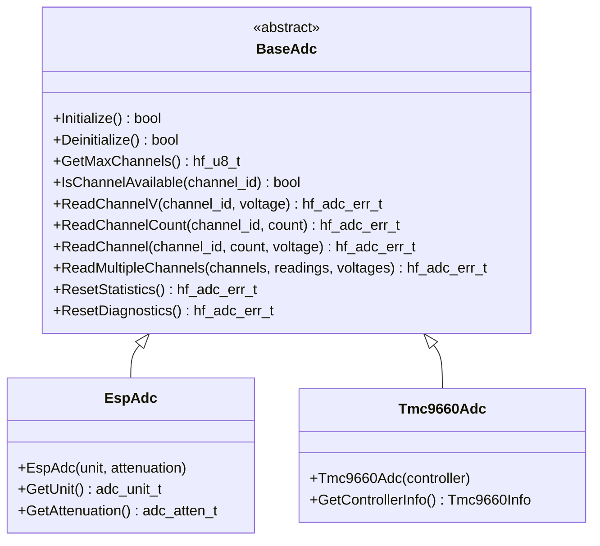

# 📊 BaseAdc API Reference

<div align="center">


**🎯 Unified ADC abstraction for all analog-to-digital conversion operations**

</div>

---

## 📚 **Table of Contents**

- [🎯 **Overview**](#-overview)
- [🏗️ **Class Hierarchy**](#️-class-hierarchy)
- [📋 **Error Codes**](#-error-codes)
- [🔧 **Core API**](#-core-api)
- [📊 **Data Structures**](#-data-structures)
- [💡 **Usage Examples**](#-usage-examples)
- [🧪 **Best Practices**](#-best-practices)

---

## 🎯 **Overview**

The `BaseAdc` class provides a comprehensive ADC abstraction that serves as the unified interface for all analog-to-digital conversion operations in the HardFOC system. It supports multi-channel operation, hardware calibration, voltage conversion, and works across different ADC implementations.

### ✨ **Key Features**

- 📊 **Multi-Channel Support** - Simultaneous operation on multiple ADC channels
- 🎯 **Hardware Calibration** - Automatic gain and offset calibration
- ⚡ **High-Speed Conversion** - Optimized for real-time motor control
- 🔄 **Voltage Conversion** - Direct voltage reading with calibration
- 📈 **Raw Data Access** - Direct access to raw ADC values
- 🛡️ **Robust Error Handling** - Comprehensive validation and error reporting
- 🏎️ **Performance Optimized** - Minimal overhead for critical applications
- 🔌 **Platform Agnostic** - Works with internal and external ADCs

### 📊 **Supported Hardware**

| Implementation | Hardware Type | Channels | Resolution | Sample Rate |
|----------------|---------------|----------|------------|-------------|
| `EspAdc` | ESP32-C6 Internal | ADC1: 7ch, ADC2: 6ch | 12-bit | Up to 2 MSPS |
| `Tmc9660Adc` | Motor Controller | 3 channels | 10-bit | Up to 100 kSPS |
| `Ads1x1xAdc` | External I2C ADC | 4 channels | 16-bit | Up to 860 SPS |

---

## 🏗️ **Class Hierarchy**



---

## 📋 **Error Codes**

The ADC system uses comprehensive error codes for robust error handling:

### ✅ **Success Codes**

| Code | Value | Description |
|------|-------|-------------|
| `ADC_SUCCESS` | 0 | ✅ Operation completed successfully |

### ❌ **General Error Codes**

| Code | Value | Description | Resolution |
|------|-------|-------------|------------|
| `ADC_ERR_FAILURE` | 1 | ❌ General operation failure | Check hardware and configuration |
| `ADC_ERR_NOT_INITIALIZED` | 2 | ⚠️ ADC not initialized | Call Initialize() first |
| `ADC_ERR_ALREADY_INITIALIZED` | 3 | ⚠️ ADC already initialized | Check initialization state |
| `ADC_ERR_INVALID_PARAMETER` | 4 | 🚫 Invalid parameter | Validate input parameters |
| `ADC_ERR_NULL_POINTER` | 5 | 🚫 Null pointer provided | Check pointer validity |
| `ADC_ERR_OUT_OF_MEMORY` | 6 | 💾 Memory allocation failed | Check system memory |

### 🔧 **Channel Error Codes**

| Code | Value | Description | Resolution |
|------|-------|-------------|------------|
| `ADC_ERR_CHANNEL_NOT_FOUND` | 7 | 🔍 Channel not found | Use valid channel numbers |
| `ADC_ERR_CHANNEL_NOT_ENABLED` | 8 | ⚠️ Channel not enabled | Enable channel first |
| `ADC_ERR_CHANNEL_NOT_CONFIGURED` | 9 | ⚙️ Channel not configured | Configure channel parameters |
| `ADC_ERR_CHANNEL_ALREADY_REGISTERED` | 10 | 🔄 Channel already registered | Check channel registration |
| `ADC_ERR_CHANNEL_READ_ERR` | 11 | 📖 Channel read error | Check hardware connections |
| `ADC_ERR_CHANNEL_WRITE_ERR` | 12 | ✍️ Channel write error | Check write permissions |
| `ADC_ERR_INVALID_CHANNEL` | 13 | 🚫 Invalid channel number | Use valid channel range |
| `ADC_ERR_CHANNEL_BUSY` | 14 | 🔄 Channel currently in use | Wait or use different channel |

### 📊 **Sampling Error Codes**

| Code | Value | Description | Resolution |
|------|-------|-------------|------------|
| `ADC_ERR_INVALID_SAMPLE_COUNT` | 15 | 📊 Invalid sample count | Use valid sample count |
| `ADC_ERR_SAMPLE_TIMEOUT` | 16 | ⏰ Sample timeout | Check ADC clock and load |
| `ADC_ERR_SAMPLE_OVERFLOW` | 17 | 📈 Sample overflow | Reduce sample rate |
| `ADC_ERR_SAMPLE_UNDERFLOW` | 18 | 📉 Sample underflow | Check input signal |

### 🌐 **Hardware Error Codes**

| Code | Value | Description | Resolution |
|------|-------|-------------|------------|
| `ADC_ERR_HARDWARE_FAULT` | 19 | 💥 Hardware fault | Check power and connections |
| `ADC_ERR_COMMUNICATION_FAILURE` | 20 | 📡 Communication failure | Check bus connections |
| `ADC_ERR_DEVICE_NOT_RESPONDING` | 21 | 🔇 Device not responding | Check device power and address |
| `ADC_ERR_VOLTAGE_OUT_OF_RANGE` | 22 | ⚡ Voltage out of range | Check input voltage levels |

### 🔧 **Calibration Error Codes**

| Code | Value | Description | Resolution |
|------|-------|-------------|------------|
| `ADC_ERR_CALIBRATION_FAILURE` | 22 | 📊 Calibration failure | Re-run calibration process |
| `ADC_ERR_CALIBRATION_NOT_FOUND` | 28 | 🔍 Calibration data not found | Run calibration first |
| `ADC_ERR_CALIBRATION_INVALID` | 29 | ❌ Invalid calibration data | Re-calibrate |
| `ADC_ERR_CALIBRATION_EXPIRED` | 30 | ⏰ Calibration expired | Re-calibrate |
| `ADC_ERR_CALIBRATION_DRIFT` | 31 | 📈 Calibration drift detected | Re-calibrate |

### 🎯 **Configuration Error Codes**

| Code | Value | Description | Resolution |
|------|-------|-------------|------------|
| `ADC_ERR_INVALID_CONFIGURATION` | 24 | ⚙️ Invalid configuration | Check configuration parameters |
| `ADC_ERR_UNSUPPORTED_OPERATION` | 25 | 🚫 Unsupported operation | Check hardware capabilities |
| `ADC_ERR_RESOURCE_BUSY` | 26 | 🔄 Resource busy | Wait for resource availability |
| `ADC_ERR_RESOURCE_UNAVAILABLE` | 27 | 🚫 Resource unavailable | Check resource allocation |

---

## 🔧 **Core API**

### 🏗️ **Initialization Methods**

```cpp
/**
 * @brief Initialize the ADC peripheral
 * @return true if successful, false otherwise
 * 
 * 📝 Sets up ADC hardware, configures channels, and prepares for conversion.
 * Must be called before any conversion operations.
 * 
 * @example
 * EspAdc adc(ADC_UNIT_1, ADC_ATTEN_DB_11);
 * if (adc.Initialize()) {
 *     // ADC ready for use
 * }
 */
virtual bool Initialize() noexcept = 0;

/**
 * @brief Deinitialize the ADC peripheral
 * @return true if successful, false otherwise
 * 
 * 🧹 Cleanly shuts down ADC hardware and releases resources.
 */
virtual bool Deinitialize() noexcept = 0;

/**
 * @brief Check if ADC is initialized
 * @return true if initialized, false otherwise
 * 
 * ❓ Query initialization status without side effects.
 */
[[nodiscard]] bool IsInitialized() const noexcept;

/**
 * @brief Ensure ADC is initialized (lazy initialization)
 * @return true if initialized successfully, false otherwise
 * 
 * 🔄 Automatically initializes ADC if not already initialized.
 */
bool EnsureInitialized() noexcept;

/**
 * @brief Ensure ADC is deinitialized (lazy deinitialization)
 * @return true if deinitialized successfully, false otherwise
 * 
 * 🔄 Automatically deinitializes ADC if currently initialized.
 */
bool EnsureDeinitialized() noexcept;
```

### 📊 **Channel Management**

```cpp
/**
 * @brief Get maximum number of channels supported
 * @return Maximum channel count
 * 
 * 📊 Returns the total number of ADC channels available on this hardware.
 */
[[nodiscard]] virtual hf_u8_t GetMaxChannels() const noexcept = 0;

/**
 * @brief Check if a specific channel is available
 * @param channel_id Channel ID to check
 * @return true if channel is available, false otherwise
 * 
 * ✅ Validates channel availability before use.
 */
[[nodiscard]] virtual bool IsChannelAvailable(hf_channel_id_t channel_id) const noexcept = 0;
```

### 📈 **Data Conversion Methods**

```cpp
/**
 * @brief Read channel voltage
 * @param channel_id Channel ID to read from
 * @param channel_reading_v Reference to store voltage reading
 * @param numOfSamplesToAvg Number of samples to average (default 1)
 * @param timeBetweenSamples Time between samples in milliseconds (default 0)
 * @return hf_adc_err_t error code
 * 
 * ⚡ Performs ADC conversion and returns calibrated voltage.
 * Supports multi-sample averaging for improved accuracy.
 * 
 * @example
 * float voltage;
 * hf_adc_err_t result = adc.ReadChannelV(0, voltage, 4, 1);
 * if (result == hf_adc_err_t::ADC_SUCCESS) {
 *     printf("Voltage: %.3f V\n", voltage);
 * }
 */
virtual hf_adc_err_t ReadChannelV(hf_channel_id_t channel_id, 
                                    float &channel_reading_v,
                                    hf_u8_t numOfSamplesToAvg = 1,
                                    hf_time_t timeBetweenSamples = 0) noexcept = 0;

/**
 * @brief Read channel count (raw ADC value)
 * @param channel_id Channel ID to read from
 * @param channel_reading_count Reference to store count reading
 * @param numOfSamplesToAvg Number of samples to average (default 1)
 * @param timeBetweenSamples Time between samples in milliseconds (default 0)
 * @return hf_adc_err_t error code
 * 
 * 📈 Performs ADC conversion and returns raw digital value.
 * No calibration or voltage conversion applied.
 * 
 * @example
 * hf_u32_t raw_count;
 * hf_adc_err_t result = adc.ReadChannelCount(0, raw_count);
 * if (result == hf_adc_err_t::ADC_SUCCESS) {
 *     printf("Raw ADC: %u\n", raw_count);
 * }
 */
virtual hf_adc_err_t ReadChannelCount(hf_channel_id_t channel_id, 
                                        hf_u32_t &channel_reading_count,
                                        hf_u8_t numOfSamplesToAvg = 1,
                                        hf_time_t timeBetweenSamples = 0) noexcept = 0;

/**
 * @brief Read both channel count and voltage
 * @param channel_id Channel ID to read from
 * @param channel_reading_count Reference to store count reading
 * @param channel_reading_v Reference to store voltage reading
 * @param numOfSamplesToAvg Number of samples to average (default 1)
 * @param timeBetweenSamples Time between samples in milliseconds (default 0)
 * @return hf_adc_err_t error code
 * 
 * 🔄 Performs single ADC conversion and returns both raw and calibrated values.
 * More efficient than separate calls for both values.
 * 
 * @example
 * hf_u32_t raw_count;
 * float voltage;
 * hf_adc_err_t result = adc.ReadChannel(0, raw_count, voltage);
 * if (result == hf_adc_err_t::ADC_SUCCESS) {
 *     printf("Raw: %u, Voltage: %.3f V\n", raw_count, voltage);
 * }
 */
virtual hf_adc_err_t ReadChannel(hf_channel_id_t channel_id, hf_u32_t &channel_reading_count,
                               float &channel_reading_v, hf_u8_t numOfSamplesToAvg = 1,
                               hf_time_t timeBetweenSamples = 0) noexcept = 0;
```

### 📊 **Multi-Channel Operations**

```cpp
/**
 * @brief Read multiple channels simultaneously
 * @param channel_ids Array of channel IDs
 * @param num_channels Number of channels
 * @param readings Array to store raw readings
 * @param voltages Array to store voltage readings
 * @return hf_adc_err_t error code
 * 
 * 📊 Reads multiple channels in a single operation for improved efficiency.
 * Default implementation reads channels sequentially.
 * 
 * @example
 * hf_channel_id_t channels[] = {0, 1, 2};
 * hf_u32_t raw_readings[3];
 * float voltages[3];
 * hf_adc_err_t result = adc.ReadMultipleChannels(channels, 3, raw_readings, voltages);
 */
virtual hf_adc_err_t ReadMultipleChannels(const hf_channel_id_t *channel_ids, hf_u8_t num_channels,
                                        hf_u32_t *readings, float *voltages) noexcept;
```

### 📈 **Statistics and Diagnostics**

```cpp
/**
 * @brief Reset ADC operation statistics
 * @return hf_adc_err_t error code
 * 
 * 🔄 Clears all accumulated statistics counters.
 */
virtual hf_adc_err_t ResetStatistics() noexcept;

/**
 * @brief Reset ADC diagnostic information
 * @return hf_adc_err_t error code
 * 
 * 🔄 Clears diagnostic information and error counters.
 */
virtual hf_adc_err_t ResetDiagnostics() noexcept;

/**
 * @brief Get ADC operation statistics
 * @param statistics Reference to store statistics data
 * @return hf_adc_err_t error code
 * 
 * 📊 Retrieves comprehensive statistics about ADC operations.
 */
virtual hf_adc_err_t GetStatistics(hf_adc_statistics_t &statistics) const noexcept;

/**
 * @brief Get ADC diagnostic information
 * @param diagnostics Reference to store diagnostics data
 * @return hf_adc_err_t error code
 * 
 * 🔍 Retrieves diagnostic information about ADC health and status.
 */
virtual hf_adc_err_t GetDiagnostics(hf_adc_diagnostics_t &diagnostics) const noexcept;
```

---

## 📊 **Data Structures**

### 📈 **ADC Statistics Structure**

```cpp
struct hf_adc_statistics_t {
    hf_u32_t totalConversions;        ///< Total conversions performed
    hf_u32_t successfulConversions;   ///< Successful conversions
    hf_u32_t failedConversions;       ///< Failed conversions
    hf_u32_t averageConversionTimeUs; ///< Average conversion time (microseconds)
    hf_u32_t maxConversionTimeUs;     ///< Maximum conversion time
    hf_u32_t minConversionTimeUs;     ///< Minimum conversion time
    hf_u32_t calibrationCount;        ///< Number of calibrations performed
    hf_u32_t thresholdViolations;     ///< Threshold monitor violations
    hf_u32_t calibration_errors;      ///< Calibration errors
};
```

### 🔍 **ADC Diagnostics Structure**

```cpp
struct hf_adc_diagnostics_t {
    bool adcHealthy;                ///< Overall ADC health status
    hf_adc_err_t lastErrorCode;     ///< Last error code
    hf_u32_t lastErrorTimestamp;    ///< Last error timestamp
    hf_u32_t consecutiveErrors;     ///< Consecutive error count
    float temperatureC;             ///< ADC temperature (if available)
    float referenceVoltage;         ///< Reference voltage
    bool calibrationValid;          ///< Calibration validity
    hf_u32_t enabled_channels;      ///< Bit mask of enabled channels
};
```

---

## 💡 **Usage Examples**

### 📊 **Basic Voltage Reading**

```cpp
#include "mcu/esp32/EspAdc.h"

// Create ADC instance for high voltage range
EspAdc adc(ADC_UNIT_1, ADC_ATTEN_DB_11);

void setup() {
    // Initialize ADC (lazy initialization)
    if (adc.EnsureInitialized()) {
        printf("✅ ADC initialized successfully\n");
    }
}

float read_battery_voltage() {
    float voltage;
    hf_adc_err_t result = adc.ReadChannelV(0, voltage);
    
    if (result != hf_adc_err_t::ADC_SUCCESS) {
        printf("❌ ADC Error: %s\n", HfAdcErrToString(result));
        return -1.0f;  // Error value
    }
    
    // Apply voltage divider correction (if needed)
    voltage *= 2.0f;  // For 2:1 voltage divider
    
    return voltage;
}

void monitor_battery() {
    float battery_voltage = read_battery_voltage();
    if (battery_voltage > 0) {
        printf("🔋 Battery: %.2f V\n", battery_voltage);
        
        if (battery_voltage < 3.0f) {
            printf("⚠️ Low battery warning!\n");
        }
    }
}
```

### 📈 **Multi-Channel Sensor Reading**

```cpp
#include "mcu/esp32/EspAdc.h"

struct SensorReadings {
    float temperature;      // Channel 0
    float pressure;         // Channel 1  
    float current;          // Channel 2
    float voltage;          // Channel 3
};

EspAdc adc(ADC_UNIT_1, ADC_ATTEN_DB_11);

SensorReadings read_all_sensors() {
    SensorReadings readings;
    
    // Read all channels with error handling
    float ch0, ch1, ch2, ch3;
    
    if (adc.ReadChannelV(0, ch0) == hf_adc_err_t::ADC_SUCCESS) {
        readings.temperature = (ch0 - 0.5f) * 100.0f;  // TMP36 sensor
    }
    
    if (adc.ReadChannelV(1, ch1) == hf_adc_err_t::ADC_SUCCESS) {
        readings.pressure = ch1 * 100.0f;               // 0-100 PSI sensor
    }
    
    if (adc.ReadChannelV(2, ch2) == hf_adc_err_t::ADC_SUCCESS) {
        readings.current = (ch2 - 2.5f) * 10.0f;       // ±25A current sensor
    }
    
    if (adc.ReadChannelV(3, ch3) == hf_adc_err_t::ADC_SUCCESS) {
        readings.voltage = ch3 * 25.0f;                 // 0-25V input
    }
    
    return readings;
}

void sensor_monitoring_task() {
    while (true) {
        SensorReadings sensors = read_all_sensors();
        
        printf("📊 Sensors - T:%.1f°C P:%.1f PSI I:%.1fA V:%.1fV\n",
               sensors.temperature, 
               sensors.pressure,
               sensors.current,
               sensors.voltage);
               
        vTaskDelay(pdMS_TO_TICKS(100));
    }
}
```

### ⚡ **High-Speed Data Acquisition**

```cpp
#include "mcu/esp32/EspAdc.h"
#include <vector>

EspAdc adc(ADC_UNIT_1, ADC_ATTEN_DB_6);

class HighSpeedAcquisition {
private:
    std::vector<hf_u32_t> buffer_;
    size_t sample_count_;
    
public:
    void configure(size_t samples) {
        sample_count_ = samples;
        buffer_.reserve(samples);
        
        // Ensure ADC is initialized
        adc.EnsureInitialized();
    }
    
    void acquire_samples() {
        buffer_.clear();
        
        // Rapid sampling loop with error handling
        for (size_t i = 0; i < sample_count_; i++) {
            hf_u32_t raw_count;
            hf_adc_err_t result = adc.ReadChannelCount(0, raw_count);
            
            if (result == hf_adc_err_t::ADC_SUCCESS) {
                buffer_.push_back(raw_count);
            } else {
                printf("⚠️ Sample %zu failed: %s\n", i, HfAdcErrToString(result));
            }
            
            // Minimal delay for maximum speed
            esp_rom_delay_us(10);  // 100 kHz sampling
        }
    }
    
    void process_data() {
        if (buffer_.empty()) {
            printf("❌ No data acquired\n");
            return;
        }
        
        hf_u32_t sum = 0;
        hf_u32_t min_val = UINT32_MAX;
        hf_u32_t max_val = 0;
        
        for (hf_u32_t sample : buffer_) {
            sum += sample;
            min_val = std::min(min_val, sample);
            max_val = std::max(max_val, sample);
        }
        
        float average = static_cast<float>(sum) / buffer_.size();
        
        printf("📈 Acquired %zu samples\n", buffer_.size());
        printf("   Average: %.1f\n", average);
        printf("   Range: %u - %u\n", min_val, max_val);
    }
};
```

### 🎯 **Motor Current Monitoring**

```cpp
#include "mcu/esp32/EspAdc.h"

class MotorCurrentSensor {
private:
    EspAdc adc_;
    const float CURRENT_SENSITIVITY = 0.1f;  // 100mV/A
    const float ZERO_CURRENT_VOLTAGE = 2.5f; // Zero current offset
    
public:
    MotorCurrentSensor() : adc_(ADC_UNIT_1, ADC_ATTEN_DB_11) {}
    
    bool initialize() {
        return adc_.EnsureInitialized();
    }
    
    float read_current_amps() {
        float voltage;
        hf_adc_err_t result = adc_.ReadChannelV(0, voltage, 4);  // 4-sample average
        
        if (result != hf_adc_err_t::ADC_SUCCESS) {
            printf("❌ Current read error: %s\n", HfAdcErrToString(result));
            return 0.0f;
        }
        
        // Convert to current using sensor characteristics
        float current = (voltage - ZERO_CURRENT_VOLTAGE) / CURRENT_SENSITIVITY;
        
        return current;
    }
    
    bool is_overcurrent(float threshold_amps) {
        float current = std::abs(read_current_amps());
        return current > threshold_amps;
    }
    
    void monitor_current() {
        float current = read_current_amps();
        
        printf("⚡ Motor Current: %.2f A\n", current);
        
        if (is_overcurrent(10.0f)) {
            printf("🚨 OVERCURRENT DETECTED!\n");
            // Trigger protection
        }
    }
    
    void print_statistics() {
        hf_adc_statistics_t stats;
        if (adc_.GetStatistics(stats) == hf_adc_err_t::ADC_SUCCESS) {
            printf("📊 ADC Statistics:\n");
            printf("   Total conversions: %u\n", stats.totalConversions);
            printf("   Successful: %u\n", stats.successfulConversions);
            printf("   Failed: %u\n", stats.failedConversions);
            printf("   Avg conversion time: %u μs\n", stats.averageConversionTimeUs);
        }
    }
};
```

---

## 🧪 **Best Practices**

### ✅ **Recommended Patterns**

```cpp
// ✅ Always check initialization
if (!adc.EnsureInitialized()) {
    printf("❌ ADC initialization failed\n");
    return false;
}

// ✅ Validate channels before use
if (!adc.IsChannelAvailable(channel_id)) {
    printf("❌ Channel %u not available\n", channel_id);
    return;
}

// ✅ Handle conversion errors gracefully
float voltage;
hf_adc_err_t result = adc.ReadChannelV(channel_id, voltage);
if (result != hf_adc_err_t::ADC_SUCCESS) {
    printf("⚠️ ADC Error: %s\n", HfAdcErrToString(result));
    // Use safe default or retry logic
    voltage = 0.0f;
}

// ✅ Use multi-sample averaging for accuracy
float voltage;
adc.ReadChannelV(channel_id, voltage, 8, 1);  // 8 samples, 1ms between

// ✅ Monitor statistics for system health
hf_adc_statistics_t stats;
if (adc.GetStatistics(stats) == hf_adc_err_t::ADC_SUCCESS) {
    if (stats.failedConversions > 100) {
        printf("⚠️ High ADC failure rate detected\n");
    }
}
```

### ❌ **Common Pitfalls**

```cpp
// ❌ Don't ignore initialization
adc.ReadChannelV(0, voltage);  // May fail silently

// ❌ Don't use invalid channels
float v = adc.ReadChannelV(99, voltage);  // Invalid channel

// ❌ Don't ignore error codes
adc.ReadChannelV(0, voltage);  // Error handling missing

// ❌ Don't assume voltage ranges
float voltage = adc.ReadChannelV(0, voltage);
// Check attenuation settings for expected range

// ❌ Don't use without error checking in critical applications
// Always check return values in safety-critical systems
```

### 🎯 **Performance Optimization**

```cpp
// 🚀 Use raw counts for high-speed applications
hf_u32_t raw_count;
adc.ReadChannelCount(channel_id, raw_count);  // Faster than voltage conversion

// 🚀 Use multi-channel reads for efficiency
hf_u32_t readings[4];
float voltages[4];
adc.ReadMultipleChannels(channels, 4, readings, voltages);

// 🚀 Minimize sample averaging for speed-critical applications
adc.ReadChannelV(channel_id, voltage, 1);  // Single sample for speed

// 🚀 Use appropriate attenuation for signal range
// ADC_ATTEN_DB_0: 0-1.1V
// ADC_ATTEN_DB_2_5: 0-1.5V  
// ADC_ATTEN_DB_6: 0-2.2V
// ADC_ATTEN_DB_11: 0-3.9V
```

---

## 🔗 **Related Documentation**

- [🔒 **SfAdc**](SfAdc.md) - Thread-safe ADC wrapper
- [⚙️ **EspAdc**](EspAdc.md) - ESP32-C6 implementation
- [🎛️ **Tmc9660Adc**](Tmc9660Adc.md) - Motor controller ADC
- [🎯 **Hardware Types**](HardwareTypes.md) - Platform-agnostic types

---

<div align="center">

**📊 BaseAdc - The Foundation of Analog Measurement in HardFOC**

*Part of the HardFOC Internal Interface Wrapper Documentation*

</div> 