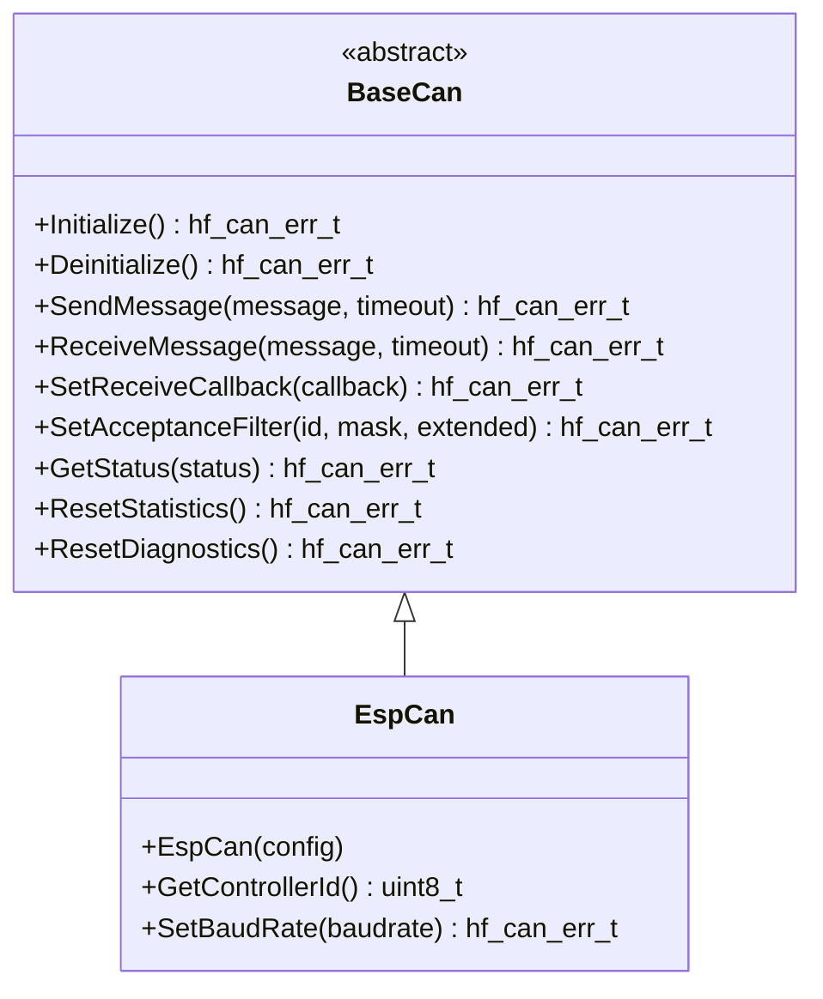

# 🚌 BaseCan API Reference

<div align="center">


**🎯 Unified CAN bus abstraction for all Controller Area Network operations**

**📋 Navigation**

[← Previous: BaseUart](BaseUart.md) | [Back to API Index](README.md) | [Next: BaseWifi
→](BaseWifi.md)

</div>

---

## 📚 **Table of Contents**

- [🎯 **Overview**](#-overview)
- [🏗️ **Class Hierarchy**](#-class-hierarchy)
- [📋 **Error Codes**](#-error-codes)
- [🔧 **Core API**](#-core-api)
- [📊 **Data Structures**](#-data-structures)
- [📊 **Usage Examples**](#-usage-examples)
- [🧪 **Best Practices**](#-best-practices)

---

## 🎯 **Overview**

The `BaseCan` class provides a comprehensive CAN bus abstraction that serves as the
unified interface for all Controller Area Network operations in the HardFOC system.
It supports both classic CAN and CAN-FD protocols, message filtering, error
handling, and works across different CAN controller implementations.

### ✨ **Key Features**

- 🚌 **CAN 2.0A/2.0B Support** - Classic CAN protocols (CAN-FD support varies by hardware)
- 📨 **Message Filtering** - Hardware-based acceptance filtering
- 🔄 **Error Recovery** - Automatic bus recovery and error handling
- 📊 **Statistics & Diagnostics** - Comprehensive monitoring and reporting
- ⚡ **High Performance** - Optimized for real-time applications
- 🛡️ **Robust Error Handling** - Detailed error codes and recovery mechanisms
- 🔌 **Platform Agnostic** - Works with internal and external CAN controllers
- 🧵 **Thread Safe** - Designed for multi-threaded applications

### 📊 **Supported Hardware**

| Implementation | Hardware Type | Protocol | Speed | Features |

|----------------|---------------|----------|-------|----------|

| `EspCan` | ESP32-C6 Internal | CAN 2.0A/B | Up to 1 Mbps | Built-in error handling, no CAN-FD |

---

## 🏗️ **Class Hierarchy**



---

## 📋 **Error Codes**

The CAN system uses comprehensive error codes for robust error handling:

### ✅ **Success Codes**

| Code | Value | Description |

|------|-------|-------------|

| `CAN_SUCCESS` | 0 | ✅ Operation completed successfully |

### ❌ **General Error Codes**

| Code | Value | Description | Resolution |

|------|-------|-------------|------------|

| `CAN_ERR_FAILURE` | 1 | ❌ General operation failure | Check hardware and configuration |

| `CAN_ERR_NOT_INITIALIZED` | 2 | ⚠️ CAN not initialized | Call Initialize() first |

| `CAN_ERR_ALREADY_INITIALIZED` | 3 | ⚠️ CAN already initialized | Check initialization state |

| `CAN_ERR_INVALID_PARAMETER` | 4 | 🚫 Invalid parameter | Validate input parameters |

| `CAN_ERR_NULL_POINTER` | 5 | 🚫 Null pointer provided | Check pointer validity |

| `CAN_ERR_OUT_OF_MEMORY` | 6 | 💾 Memory allocation failed | Check system memory |

### 🚌 **Bus Error Codes**

| Code | Value | Description | Resolution |

|------|-------|-------------|------------|

| `CAN_ERR_BUS_OFF` | 7 | 🚫 Bus off state | Restart CAN controller |

| `CAN_ERR_BUS_ERROR` | 8 | ❌ Bus error | Check bus wiring and termination |

| `CAN_ERR_BUS_BUSY` | 9 | 🔄 Bus busy | Wait for bus availability |

| `CAN_ERR_BUS_NOT_AVAILABLE` | 10 | 🚫 Bus not available | Check bus configuration |

| `CAN_ERR_BUS_RECOVERY_FAILED` | 11 | ❌ Bus recovery failed | Restart CAN controller |

| `CAN_ERR_BUS_ARBITRATION_LOST` | 12 | 🔄 Bus arbitration lost | Normal in multi-node systems |

### 📨 **Message Error Codes**

| Code | Value | Description | Resolution |

|------|-------|-------------|------------|

| `CAN_ERR_MESSAGE_TIMEOUT` | 13 | ⏰ Message timeout | Check bus load and timing |

| `CAN_ERR_MESSAGE_LOST` | 14 | 📤 Message lost | Check buffer sizes |

| `CAN_ERR_MESSAGE_INVALID` | 15 | ❌ Invalid message | Check message format |

| `CAN_ERR_MESSAGE_TOO_LONG` | 16 | 📏 Message too long | Check DLC value |

| `CAN_ERR_MESSAGE_INVALID_ID` | 17 | 🆔 Invalid message ID | Check ID range |

| `CAN_ERR_MESSAGE_INVALID_DLC` | 18 | 📊 Invalid DLC | Check data length |

| `CAN_ERR_QUEUE_FULL` | 19 | 📦 Queue full | Increase queue size or process faster |

| `CAN_ERR_QUEUE_EMPTY` | 20 | 📭 Queue empty | Check message reception |

### 📤 **Transmission Error Codes**

| Code | Value | Description | Resolution |

|------|-------|-------------|------------|

| `CAN_ERR_TX_FAILED` | 21 | ❌ Transmission failed | Check bus state and wiring |

| `CAN_ERR_TX_ABORTED` | 22 | 🚫 Transmission aborted | Check bus errors |

| `CAN_ERR_TX_ERROR_PASSIVE` | 23 | ⚠️ Transmit error passive | Check error counters |

| `CAN_ERR_TX_ERROR_WARNING` | 24 | ⚠️ Transmit error warning | Monitor error counters |

### 📥 **Reception Error Codes**

| Code | Value | Description | Resolution |

|------|-------|-------------|------------|

| `CAN_ERR_RX_OVERRUN` | 25 | 📈 Receive overrun | Process messages faster |

| `CAN_ERR_RX_ERROR_PASSIVE` | 26 | ⚠️ Receive error passive | Check error counters |

| `CAN_ERR_RX_ERROR_WARNING` | 27 | ⚠️ Receive error warning | Monitor error counters |

| `CAN_ERR_RX_FIFO_FULL` | 28 | 📦 Receive FIFO full | Process messages faster |

### 🌐 **Hardware Error Codes**

| Code | Value | Description | Resolution |

|------|-------|-------------|------------|

| `CAN_ERR_HARDWARE_FAULT` | 29 | 💥 Hardware fault | Check power and connections |

| `CAN_ERR_COMMUNICATION_FAILURE` | 30 | 📡 Communication failure | Check interface connections |

| `CAN_ERR_DEVICE_NOT_RESPONDING` | 31 | 🔇 Device not responding | Check device power and address |

| `CAN_ERR_VOLTAGE_OUT_OF_RANGE` | 32 | ⚡ Voltage out of range | Check power supply |

| `CAN_ERR_CLOCK_ERROR` | 33 | ⏰ Clock error | Check clock configuration |

| `CAN_ERR_TRANSCEIVER_ERROR` | 34 | 🔌 Transceiver error | Check transceiver connections |

### ⚙️ **Configuration Error Codes**

| Code | Value | Description | Resolution |

|------|-------|-------------|------------|

| `CAN_ERR_INVALID_CONFIGURATION` | 35 | ⚙️ Invalid configuration | Check configuration parameters |

| `CAN_ERR_UNSUPPORTED_OPERATION` | 36 | 🚫 Unsupported operation | Check hardware capabilities |

| `CAN_ERR_INVALID_BAUD_RATE` | 37 | 📊 Invalid baud rate | Use supported baud rate |

| `CAN_ERR_INVALID_CONTROLLER_ID` | 38 | 🆔 Invalid controller ID | Use valid controller ID |

| `CAN_ERR_FILTER_ERROR` | 39 | 🔍 Filter error | Check filter configuration |

| `CAN_ERR_FILTER_FULL` | 40 | 📦 Filter table full | Reduce number of filters |

### 🔧 **Protocol Error Codes**

| Code | Value | Description | Resolution |

|------|-------|-------------|------------|

| `CAN_ERR_STUFF_ERROR` | 41 | 🔧 Bit stuffing error | Check bus quality |

| `CAN_ERR_FORM_ERROR` | 42 | 📋 Frame format error | Check message format |

| `CAN_ERR_CRC_ERROR` | 43 | 🔢 CRC error | Check bus integrity |

| `CAN_ERR_ACK_ERROR` | 44 | ✅ Acknowledgment error | Check bus termination |

| `CAN_ERR_BIT_ERROR` | 45 | 🔌 Bit error | Check bus quality |

---

## 🔧 **Core API**

### 🏗️ **Initialization Methods**

```cpp
/**
 * @brief Initialize the CAN controller
 * @return hf_can_err_t error code
 * 
 * 📝 Sets up CAN hardware, configures pins, and prepares for communication.
 * Must be called before any CAN operations.
 * 
 * @example
 * EspCan can(config);
 * if (can.Initialize() == hf_can_err_t::CAN_SUCCESS) {
 *     // CAN ready for use
 * }
 */
virtual hf_can_err_t Initialize() noexcept = 0;

/**
 * @brief Deinitialize the CAN controller
 * @return hf_can_err_t error code
 * 
 * 🧹 Cleanly shuts down CAN hardware and releases resources.
 */
virtual hf_can_err_t Deinitialize() noexcept = 0;

/**
 * @brief Check if CAN is initialized
 * @return true if initialized, false otherwise
 * 
 * ❓ Query initialization status without side effects.
 */
[[nodiscard]] bool IsInitialized() const noexcept;

/**
 * @brief Ensure CAN is initialized (lazy initialization)
 * @return true if initialized successfully, false otherwise
 * 
 * 🔄 Automatically initializes CAN if not already initialized.
 */
bool EnsureInitialized() noexcept;

/**
 * @brief Ensure CAN is deinitialized (lazy deinitialization)
 * @return true if deinitialized successfully, false otherwise
 * 
 * 🔄 Automatically deinitializes CAN if currently initialized.
 */
bool EnsureDeinitialized() noexcept;
```

### 📨 **Message Transmission**

```cpp
/**
 * @brief Send a CAN message
 * @param message CAN message to send
 * @param timeout_ms Timeout in milliseconds (0 = non-blocking)
 * @return hf_can_err_t error code
 * 
 * 📤 Transmits a CAN message with optional timeout.
 * Supports both classic CAN and CAN-FD messages.
 * 
 * @example
 * hf_can_message_t msg;
 * msg.id = 0x123;
 * msg.dlc = 8;
 * msg.data[0] = 0x01;
 * msg.data[1] = 0x02;
 * // ... set other data bytes
 * 
 * hf_can_err_t result = can.SendMessage(msg, 1000);
 * if (result != hf_can_err_t::CAN_SUCCESS) {
 *     printf("Send failed: %s\n", HfCanErrToString(result));
 * }
 */
virtual hf_can_err_t SendMessage(const hf_can_message_t &message, uint32_t timeout_ms = 1000)
noexcept = 0;

/**
 * @brief Send multiple messages in batch
 * @param messages Array of messages to send
 * @param count Number of messages
 * @param timeout_ms Timeout in milliseconds
 * @return Number of messages successfully sent
 * 
 * 📦 Transmits multiple messages efficiently.
 * Returns the number of messages actually sent.
 * 
 * @example
 * hf_can_message_t messages[3];
 * // ... populate messages
 * uint32_t sent = can.SendMessageBatch(messages, 3, 1000);
 * printf("Sent %u of 3 messages\n", sent);
 */
virtual uint32_t SendMessageBatch(const hf_can_message_t *messages, uint32_t count,
                                uint32_t timeout_ms = 1000) noexcept;
```

### 📥 **Message Reception**

```cpp
/**
 * @brief Receive a CAN message
 * @param message Reference to store received message
 * @param timeout_ms Timeout in milliseconds (0 = non-blocking)
 * @return hf_can_err_t error code
 * 
 * 📥 Receives a CAN message with optional timeout.
 * Returns CAN_ERR_QUEUE_EMPTY if no message available.
 * 
 * @example
 * hf_can_message_t received_msg;
 * hf_can_err_t result = can.ReceiveMessage(received_msg, 100);
 * if (result == hf_can_err_t::CAN_SUCCESS) {
 *     printf("Received ID: 0x%03X, Data: ", received_msg.id);
 *     for (int i = 0; i < received_msg.dlc; i++) {
 *         printf("%02X ", received_msg.data[i]);
 *     }
 *     printf("\n");
 * }
 */
virtual hf_can_err_t ReceiveMessage(hf_can_message_t &message, uint32_t timeout_ms = 0) noexcept =
0;

/**
 * @brief Receive multiple messages in batch
 * @param messages Array to store received messages
 * @param max_count Maximum number of messages to receive
 * @param timeout_ms Timeout in milliseconds
 * @return Number of messages received
 * 
 * 📦 Receives multiple messages efficiently.
 * Returns the number of messages actually received.
 * 
 * @example
 * hf_can_message_t messages[10];
 * uint32_t received = can.ReceiveMessageBatch(messages, 10, 100);
 * printf("Received %u messages\n", received);
 */
virtual uint32_t ReceiveMessageBatch(hf_can_message_t *messages, uint32_t max_count,
                                   uint32_t timeout_ms = 100) noexcept;
```

### 🔍 **Message Filtering**

```cpp
/**
 * @brief Set acceptance filter
 * @param id Filter ID
 * @param mask Filter mask
 * @param extended Extended frame flag
 * @return hf_can_err_t error code
 * 
 * 🔍 Configures hardware-based message filtering.
 * Only messages matching the filter will be received.
 * 
 * @example
 * // Accept only messages with ID 0x100-0x1FF
 * can.SetAcceptanceFilter(0x100, 0x700, false);
 * 
 * // Accept only extended frame with ID 0x18FF0000
 * can.SetAcceptanceFilter(0x18FF0000, 0x1FFFFFFF, true);
 */
virtual hf_can_err_t SetAcceptanceFilter(uint32_t id, uint32_t mask, bool extended = false) noexcept
= 0;

/**
 * @brief Clear acceptance filter
 * @return hf_can_err_t error code
 * 
 * 🔄 Removes all acceptance filters.
 * All messages will be received.
 */
virtual hf_can_err_t ClearAcceptanceFilter() noexcept;
```

### 📞 **Callback Management**

```cpp
/**
 * @brief Set receive callback function
 * @param callback Callback function
 * @return hf_can_err_t error code
 * 
 * 📞 Sets callback function for asynchronous message reception.
 * Callback is invoked when messages are received.
 * 
 * @example
 * void on_can_message(const hf_can_message_t &msg) {
 *     printf("Async received ID: 0x%03X\n", msg.id);
 * }
 * 
 * can.SetReceiveCallback(on_can_message);
 */
virtual hf_can_err_t SetReceiveCallback(hf_can_receive_callback_t callback) noexcept = 0;

/**
 * @brief Clear receive callback
 * 
 * 🔄 Removes the receive callback function.
 */
virtual void ClearReceiveCallback() noexcept;

/**
 * @brief Set CAN-FD receive callback
 * @param callback CAN-FD callback function
 * @return hf_can_err_t error code
 * 
 * 📞 Sets callback for CAN-FD messages with enhanced information.
 * Only available if CAN-FD is supported by the hardware.
 * ESP32-C6 TWAI controller does not support CAN-FD.
 */
virtual hf_can_err_t SetReceiveCallbackFD(hf_can_fd_receive_callback_t callback) noexcept;
```

### 🎛️ **Configuration and Status**

```cpp
/**
 * @brief Check if CAN-FD is supported
 * @return true if supported, false otherwise
 * 
 * ✅ Checks if the hardware supports CAN-FD protocol.
 * ESP32-C6 TWAI controller returns false (no CAN-FD support).
 */
virtual bool SupportsCanFD() const noexcept;

/**
 * @brief Enable/disable CAN-FD mode
 * @param enable Enable CAN-FD mode
 * @param data_baudrate Data phase baudrate (for CAN-FD)
 * @return true if successful, false otherwise
 * 
 * 🚀 Configures CAN-FD mode if supported.
 * ESP32-C6 TWAI controller does not support CAN-FD - returns false.
 * Requires re-initialization to take effect.
 */
virtual bool SetCanFDMode(bool enable, uint32_t data_baudrate = 2000000,
                         uint32_t timeout_ms = 1000) noexcept;

/**
 * @brief Get CAN bus status
 * @param status Reference to store status information
 * @return hf_can_err_t error code
 * 
 * 📊 Retrieves comprehensive CAN bus status information.
 * 
 * @example
 * hf_can_status_t status;
 * if (can.GetStatus(status) == hf_can_err_t::CAN_SUCCESS) {
 *     printf("TX errors: %u, RX errors: %u\n", 
 *            status.tx_error_count, status.rx_error_count);
 *     printf("Bus off: %s\n", status.bus_off ? "Yes" : "No");
 * }
 */
virtual hf_can_err_t GetStatus(hf_can_status_t &status) const noexcept = 0;
```

### 📈 **Statistics and Diagnostics**

```cpp
/**
 * @brief Reset CAN operation statistics
 * @return hf_can_err_t error code
 * 
 * 🔄 Clears all accumulated statistics counters.
 */
virtual hf_can_err_t ResetStatistics() noexcept;

/**
 * @brief Reset CAN diagnostic information
 * @return hf_can_err_t error code
 * 
 * 🔄 Clears diagnostic information and error counters.
 */
virtual hf_can_err_t ResetDiagnostics() noexcept;

/**
 * @brief Get CAN operation statistics
 * @param statistics Reference to store statistics data
 * @return hf_can_err_t error code
 * 
 * 📊 Retrieves comprehensive statistics about CAN operations.
 */
virtual hf_can_err_t GetStatistics(hf_can_statistics_t &statistics) const noexcept;

/**
 * @brief Get CAN diagnostic information
 * @param diagnostics Reference to store diagnostics data
 * @return hf_can_err_t error code
 * 
 * 🔍 Retrieves diagnostic information about CAN health and status.
 */
virtual hf_can_err_t GetDiagnostics(hf_can_diagnostics_t &diagnostics) const noexcept;
```

---

## 📊 **Data Structures**

### 📨 **CAN Message Structure**

```cpp
struct hf_can_message_t {
    // === Core CAN Message Fields ===
    uint32_t id;     ///< Message ID (11 or 29-bit)
    uint8_t dlc;     ///< Data length code (0-8 for classic CAN)
    uint8_t data[8]; ///< Message data (max 8 bytes for classic CAN)

    // === Standard CAN Flags ===
    bool is_extended;  ///< Extended ID flag (29-bit vs 11-bit)
    bool is_rtr;       ///< Remote transmission request flag
    bool is_ss;        ///< Single shot flag (no retransmission)
    bool is_self;      ///< Self reception request flag
    bool dlc_non_comp; ///< DLC is non-compliant (> 8 for classic CAN)

    // === Metadata and Diagnostics ===
    uint64_t timestamp_us;    ///< Precise timestamp in microseconds
    uint32_t sequence_number; ///< Message sequence number
    uint8_t controller_id;    ///< Originating controller ID
    uint8_t retry_count;      ///< Number of transmission retries
    uint8_t error_count;      ///< Associated error count

    // === CAN-FD Extended Fields ===
    bool is_canfd;       ///< CAN-FD frame flag
    bool is_brs;         ///< Bit Rate Switching flag (CAN-FD)
    bool is_esi;         ///< Error State Indicator flag (CAN-FD)
    uint8_t canfd_dlc;   ///< CAN-FD DLC (can be > 8)

    // === Helper Methods ===
    uint8_t GetMaxDataLength() const noexcept;  ///< Get max data length for frame type
    bool IsValidDLC(uint8_t dlc) const noexcept;  ///< Validate DLC for frame type
    uint8_t GetEffectiveDLC() const noexcept;  ///< Get effective DLC value
    bool SetDLC(uint8_t dlc) noexcept;  ///< Set DLC for current frame type
    void SetStandardFrame() noexcept;  ///< Set standard frame format
    void SetExtendedFrame() noexcept;  ///< Set extended frame format
    void SetDataFrame() noexcept;  ///< Set data frame (not remote)
    void SetRemoteFrame() noexcept;  ///< Set remote frame
    void SetSingleShot() noexcept;  ///< Set single shot transmission
    void SetSelfReception() noexcept;  ///< Enable self reception
    bool IsValidId() const noexcept;  ///< Validate message ID
};
```

### ⚙️ **CAN Configuration Structure**

```cpp
struct hf_can_config_t {
    hf_pin_num_t tx_pin;     ///< CAN TX pin
    hf_pin_num_t rx_pin;     ///< CAN RX pin
    hf_baud_rate_t baudrate; ///< CAN baudrate (bps)
    bool loopback_mode;      ///< Enable loopback mode for testing
    bool silent_mode;        ///< Enable silent mode (listen-only)
    uint16_t tx_queue_size;  ///< TX queue size (implementation-dependent)
    uint16_t rx_queue_size;  ///< RX queue size (implementation-dependent)
};
```

### 📊 **CAN Status Structure**

```cpp
struct hf_can_status_t {
    uint32_t tx_error_count;  ///< Transmit error counter
    uint32_t rx_error_count;  ///< Receive error counter
    uint32_t tx_failed_count; ///< Failed transmission count
    uint32_t rx_missed_count; ///< Missed reception count
    bool bus_off;             ///< Bus-off state
    bool error_warning;       ///< Error warning state
    bool error_passive;       ///< Error passive state

    // CAN-FD specific status
    bool canfd_enabled;        ///< CAN-FD mode is active
    bool canfd_brs_enabled;    ///< Bit Rate Switching is enabled
    uint32_t nominal_baudrate; ///< Nominal bit rate (arbitration phase)
    uint32_t data_baudrate;    ///< Data bit rate (data phase for CAN-FD)
    uint32_t canfd_tx_count;   ///< Number of CAN-FD frames transmitted
    uint32_t canfd_rx_count;   ///< Number of CAN-FD frames received
    uint32_t brs_tx_count;     ///< Number of BRS frames transmitted
    uint32_t brs_rx_count;     ///< Number of BRS frames received
    uint32_t form_errors;      ///< CAN-FD form errors
    uint32_t stuff_errors;     ///< Stuff errors
    uint32_t crc_errors;       ///< CRC errors
    uint32_t bit_errors;       ///< Bit errors
    uint32_t ack_errors;       ///< Acknowledgment errors
};
```

### 📈 **CAN Statistics Structure**

```cpp
struct hf_can_statistics_t {
    // Message counters
    uint64_t messages_sent;          ///< Total messages successfully sent
    uint64_t messages_received;      ///< Total messages successfully received
    uint64_t bytes_transmitted;      ///< Total bytes transmitted
    uint64_t bytes_received;         ///< Total bytes received
    
    // Error counters
    uint32_t send_failures;          ///< Failed send operations
    uint32_t receive_failures;       ///< Failed receive operations
    uint32_t bus_error_count;        ///< Total bus errors
    uint32_t arbitration_lost_count; ///< Arbitration lost events
    uint32_t tx_failed_count;        ///< Transmission failures
    uint32_t bus_off_events;         ///< Bus-off occurrences
    uint32_t error_warning_events;   ///< Error warning events
    
    // Performance metrics
    uint64_t uptime_seconds;         ///< Total uptime in seconds
    uint32_t last_activity_timestamp;///< Last activity timestamp
    hf_can_err_t last_error;         ///< Last error encountered
    
    // Queue statistics
    uint32_t tx_queue_peak;          ///< Peak TX queue usage
    uint32_t rx_queue_peak;          ///< Peak RX queue usage
    uint32_t tx_queue_overflows;     ///< TX queue overflow count
    uint32_t rx_queue_overflows;     ///< RX queue overflow count
};
```

### 🔍 **CAN Diagnostics Structure**

```cpp
struct hf_can_diagnostics_t {
    uint32_t tx_error_count;         ///< Transmit error counter
    uint32_t rx_error_count;         ///< Receive error counter
    uint32_t tx_queue_peak;          ///< Peak TX queue usage
    uint32_t rx_queue_peak;          ///< Peak RX queue usage
    uint32_t last_error_timestamp;   ///< Timestamp of last error
    uint32_t controller_resets;      ///< Number of controller resets
    uint32_t bus_load_percentage;    ///< Current bus load percentage
    float bit_error_rate;            ///< Bit error rate (errors/bits)
};
```

---

## 📊 **Usage Examples**

### 📨 **Basic Message Transmission**

```cpp
#include "mcu/esp32/EspCan.h"

// Create CAN instance
hf_can_config_t config = {
    .tx_pin = 5,
    .rx_pin = 4,
    .baudrate = 500000,
    .loopback_mode = false,
    .silent_mode = false,
    .tx_queue_size = 10,
    .rx_queue_size = 10
};

EspCan can(config);

void setup() {
    // Initialize CAN
    if (can.Initialize() == hf_can_err_t::CAN_SUCCESS) {
        printf("✅ CAN initialized successfully\n");
    }
}

void send_status_message() {
    hf_can_message_t msg;
    msg.id = 0x100;  // Status message ID
    msg.dlc = 8;     // 8 bytes of data
    msg.is_extended = false;
    msg.is_rtr = false;
    
    // Pack status data
    msg.data[0] = 0x01;  // Status byte
    msg.data[1] = 0x02;  // Temperature
    msg.data[2] = 0x03;  // Voltage
    msg.data[3] = 0x04;  // Current
    msg.data[4] = 0x05;  // Speed
    msg.data[5] = 0x06;  // Position
    msg.data[6] = 0x07;  // Error flags
    msg.data[7] = 0x08;  // Checksum
    
    hf_can_err_t result = can.SendMessage(msg, 1000);
    if (result != hf_can_err_t::CAN_SUCCESS) {
        printf("❌ Send failed: %s\n", HfCanErrToString(result));
    } else {
        printf("✅ Message sent successfully\n");
    }
}
```

### 📥 **Message Reception**

```cpp
#include "mcu/esp32/EspCan.h"

EspCan can(config);

void receive_messages() {
    hf_can_message_t msg;
    
    while (true) {
        hf_can_err_t result = can.ReceiveMessage(msg, 100);
        
        if (result == hf_can_err_t::CAN_SUCCESS) {
            printf("📥 Received ID: 0x%03X, DLC: %u, Data: ", msg.id, msg.dlc);
            for (int i = 0; i < msg.dlc; i++) {
                printf("%02X ", msg.data[i]);
            }
            printf("\n");
            
            // Process message based on ID
            switch (msg.id) {
                case 0x100:
                    process_status_message(msg);
                    break;
                case 0x200:
                    process_command_message(msg);
                    break;
                default:
                    printf("⚠️ Unknown message ID: 0x%03X\n", msg.id);
                    break;
            }
        } else if (result == hf_can_err_t::CAN_ERR_QUEUE_EMPTY) {
            // No message available, continue
            continue;
        } else {
            printf("❌ Receive error: %s\n", HfCanErrToString(result));
        }
    }
}

void process_status_message(const hf_can_message_t &msg) {
    if (msg.dlc >= 8) {
        uint8_t status = msg.data[0];
        uint8_t temperature = msg.data[1];
        uint8_t voltage = msg.data[2];
        uint8_t current = msg.data[3];
        
        printf("📊 Status - Temp: %u°C, V: %uV, I: %uA\n", 
               temperature, voltage, current);
    }
}
```

### 🔍 **Message Filtering**

```cpp
#include "mcu/esp32/EspCan.h"

EspCan can(config);

void setup_filtering() {
    // Initialize CAN
    can.Initialize();
    
    // Accept only status messages (0x100-0x1FF)
    can.SetAcceptanceFilter(0x100, 0x700, false);
    
    // Accept only command messages (0x200-0x2FF)
    can.SetAcceptanceFilter(0x200, 0x700, false);
    
    // Accept only diagnostic messages (0x7DF-0x7FF)
    can.SetAcceptanceFilter(0x7DF, 0x7E0, false);
    
    printf("✅ Message filtering configured\n");
}

void receive_filtered_messages() {
    hf_can_message_t msg;
    
    while (true) {
        if (can.ReceiveMessage(msg, 100) == hf_can_err_t::CAN_SUCCESS) {
            // Only filtered messages will be received
            printf("📥 Filtered message ID: 0x%03X\n", msg.id);
        }
    }
}
```

### 📞 **Asynchronous Reception with Callbacks**

```cpp
#include "mcu/esp32/EspCan.h"

EspCan can(config);

// Callback function for received messages
void on_can_message(const hf_can_message_t &msg) {
    printf("📞 Async received ID: 0x%03X\n", msg.id);
    
    // Process message in callback context
    switch (msg.id) {
        case 0x100:
            // Handle status message
            break;
        case 0x200:
            // Handle command message
            break;
    }
}

void setup_async_reception() {
    // Initialize CAN
    can.Initialize();
    
    // Set receive callback
    can.SetReceiveCallback(on_can_message);
    
    printf("✅ Asynchronous reception enabled\n");
}

void main_loop() {
    while (true) {
        // Main application logic
        // Messages will be handled automatically by callback
        
        vTaskDelay(pdMS_TO_TICKS(100));
    }
}
```

### 🚌 **Motor Control System**

```cpp
#include "mcu/esp32/EspCan.h"

class MotorController {
private:
    EspCan can*;
    uint32_t motor_id*;
    
public:
    MotorController(const hf_can_config_t &config, uint32_t motor_id) 
        : can*(config), motor_id*(motor_id) {}
    
    bool initialize() {
        return can*.Initialize() == hf_can_err_t::CAN_SUCCESS;
    }
    
    void set_speed(float speed_rpm) {
        hf_can_message_t msg;
        msg.id = 0x200 + motor_id*;  // Command message for this motor
        msg.dlc = 4;
        msg.is_extended = false;
        msg.is_rtr = false;
        
        // Pack speed command
        uint16_t speed_raw = static_cast<uint16_t>(speed_rpm);
        msg.data[0] = 0x01;  // Command type: set speed
        msg.data[1] = speed_raw & 0xFF;
        msg.data[2] = (speed_raw >> 8) & 0xFF;
        msg.data[3] = calculate_checksum(msg.data, 3);
        
        hf_can_err_t result = can*.SendMessage(msg, 1000);
        if (result != hf_can_err_t::CAN_SUCCESS) {
            printf("❌ Speed command failed: %s\n", HfCanErrToString(result));
        }
    }
    
    void request_status() {
        hf_can_message_t msg;
        msg.id = 0x100 + motor_id*;  // Status request for this motor
        msg.dlc = 0;
        msg.is_extended = false;
        msg.is_rtr = true;  // Remote frame
        
        can*.SendMessage(msg, 1000);
    }
    
    void monitor_status() {
        hf_can_status_t status;
        if (can*.GetStatus(status) == hf_can_err_t::CAN_SUCCESS) {
            printf("📊 CAN Status - TX errors: %u, RX errors: %u, Bus off: %s\n",
                   status.tx_error_count, status.rx_error_count,
                   status.bus_off ? "Yes" : "No");
        }
    }
    
private:
    uint8_t calculate_checksum(const uint8_t *data, uint8_t length) {
        uint8_t checksum = 0;
        for (uint8_t i = 0; i < length; i++) {
            checksum ^= data[i];
        }
        return checksum;
    }
};
```

---

## 🧪 **Best Practices**

### ✅ **Recommended Patterns**

```cpp
// ✅ Always check initialization
if (can.Initialize() != hf_can_err_t::CAN_SUCCESS) {
    printf("❌ CAN initialization failed\n");
    return false;
}

// ✅ Use appropriate timeouts
can.SendMessage(msg, 1000);  // 1 second timeout for critical messages
can.ReceiveMessage(msg, 100);  // 100ms timeout for non-blocking receive

// ✅ Handle all error codes
hf_can_err_t result = can.SendMessage(msg, timeout);
if (result != hf_can_err_t::CAN_SUCCESS) {
    printf("⚠️ Send error: %s\n", HfCanErrToString(result));
    // Handle specific error types
    if (result == hf_can_err_t::CAN_ERR_BUS_OFF) {
        // Bus off - restart controller
        can.Deinitialize();
        can.Initialize();
    }
}

// ✅ Use message filtering for efficiency
can.SetAcceptanceFilter(0x100, 0x700, false);  // Only accept status messages

// ✅ Monitor bus health
hf_can_status_t status;
if (can.GetStatus(status) == hf_can_err_t::CAN_SUCCESS) {
    if (status.bus_off) {
        printf("🚨 Bus off detected!\n");
    }
    if (status.tx_error_count > 100) {
        printf("⚠️ High TX error count: %u\n", status.tx_error_count);
    }
}
```

### ❌ **Common Pitfalls**

```cpp
// ❌ Don't ignore initialization
can.SendMessage(msg);  // May fail silently

// ❌ Don't use infinite timeouts in real-time systems
can.ReceiveMessage(msg, UINT32_MAX);  // May block forever

// ❌ Don't ignore error codes
can.SendMessage(msg);  // Error handling missing

// ❌ Don't assume message reception
// Always check return values for receive operations

// ❌ Don't use without proper bus termination
// CAN bus requires proper termination resistors

// ❌ Don't ignore bus-off state
// Bus-off requires controller restart
```

### 🎯 **Performance Optimization**

```cpp
// 🚀 Use batch operations for multiple messages
hf_can_message_t messages[10];
// ... populate messages
uint32_t sent = can.SendMessageBatch(messages, 10, 1000);

// 🚀 Use callbacks for high-frequency reception
can.SetReceiveCallback(on_message);  // Non-blocking reception

// 🚀 Use appropriate queue sizes
hf_can_config_t config = {
    .tx_queue_size = 20,  // Larger for high-frequency transmission
    .rx_queue_size = 50   // Larger for high-frequency reception
};

// 🚀 Use message filtering to reduce CPU load
can.SetAcceptanceFilter(target_id, mask, extended);

// 🚀 Monitor statistics for performance tuning
hf_can_statistics_t stats;
can.GetStatistics(stats);
if (stats.tx_queue_overflows > 0) {
    printf("⚠️ TX queue overflow - increase queue size\n");
}
```

---

## 🔗 **Related Documentation**

- [⚙️ **EspCan**](../esp_api/EspCan.md) - ESP32-C6 implementation
- [🎯 **Hardware Types**](HardwareTypes.md) - Platform-agnostic types

---

<div align="center">

**📋 Navigation**

[← Previous: BaseUart](BaseUart.md) | [Back to API Index](README.md) | [Next: BaseWifi
→](BaseWifi.md)

</div>

---

<div align="center">

**🚌 BaseCan - The Foundation of CAN Communication in HardFOC**

*Part of the HardFOC Internal Interface Wrapper Documentation*

</div> 