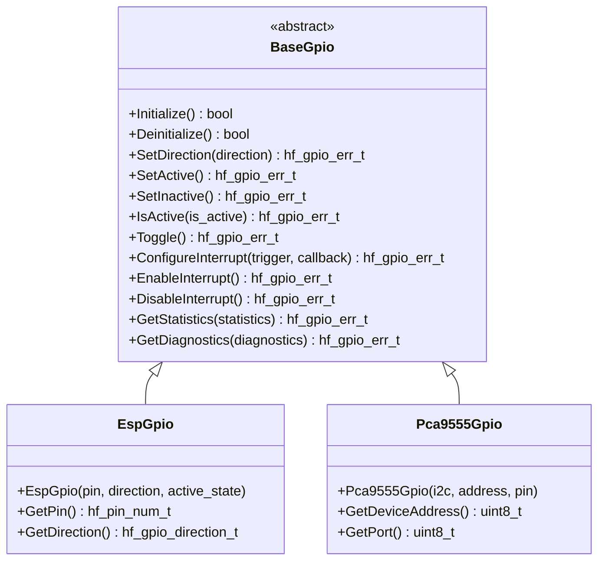

# 🔌 BaseGpio API Reference

<div align="center">


**🎯 Unified GPIO abstraction for all digital I/O operations**

</div>

---

## 📚 **Table of Contents**

- [🎯 **Overview**](#-overview)
- [🏗️ **Class Hierarchy**](#️-class-hierarchy)
- [📋 **Error Codes**](#-error-codes)
- [🔧 **Core API**](#-core-api)
- [📊 **Data Structures**](#-data-structures)
- [📊 **Usage Examples**](#-usage-examples)
- [🧪 **Best Practices**](#-best-practices)

---

## 🎯 **Overview**

The `BaseGpio` class provides a comprehensive GPIO abstraction that serves as the unified interface for all digital I/O operations in the HardFOC system. It supports dynamic mode switching, configurable polarity, pull resistors, interrupt handling, and works across different hardware platforms.

### ✨ **Key Features**

- 🔄 **Dynamic Mode Switching** - Switch between input and output modes at runtime
- 🎯 **Configurable Polarity** - Active-high and active-low support
- 🔌 **Pull Resistor Control** - Internal pull-up, pull-down, and floating configurations
- ⚡ **Interrupt Support** - Edge and level-triggered interrupts with callbacks
- 🛡️ **Robust Error Handling** - Comprehensive validation and error reporting
- 🔌 **Platform Agnostic** - Works with MCU GPIOs, I2C expanders, SPI expanders
- 🧵 **Thread Safe** - Designed for multi-threaded applications
- 📊 **Statistics & Diagnostics** - Built-in monitoring and health reporting

### 📊 **Supported Hardware**

| Implementation | Hardware Type | Pins | Features | Use Cases |
|----------------|---------------|------|----------|-----------|
| `EspGpio` | ESP32-C6 Internal | 48 pins | Interrupts, pull resistors | General I/O, sensors |
| `Pca9555Gpio` | I2C GPIO Expander | 16 pins | Interrupts, polarity | I/O expansion |
| `Mcp23s17Gpio` | SPI GPIO Expander | 16 pins | Interrupts, banks | High-speed I/O |
| `Tmc9660Gpio` | Motor Controller | 8 pins | Motor control specific | Motor control signals |

---

## 🏗️ **Class Hierarchy**



---

## 📋 **Error Codes**

The GPIO system uses comprehensive error codes for robust error handling:

### ✅ **Success Codes**

| Code | Value | Description |
|------|-------|-------------|
| `GPIO_SUCCESS` | 0 | ✅ Operation completed successfully |

### ❌ **General Error Codes**

| Code | Value | Description | Resolution |
|------|-------|-------------|------------|
| `GPIO_ERR_FAILURE` | 1 | ❌ General operation failure | Check hardware and configuration |
| `GPIO_ERR_NOT_INITIALIZED` | 2 | ⚠️ GPIO not initialized | Call Initialize() first |
| `GPIO_ERR_ALREADY_INITIALIZED` | 3 | ⚠️ GPIO already initialized | Check initialization state |
| `GPIO_ERR_INVALID_PARAMETER` | 4 | 🚫 Invalid parameter | Validate input parameters |
| `GPIO_ERR_NULL_POINTER` | 5 | 🚫 Null pointer provided | Check pointer validity |
| `GPIO_ERR_OUT_OF_MEMORY` | 6 | 💾 Memory allocation failed | Check system memory |

### 🔌 **Pin Error Codes**

| Code | Value | Description | Resolution |
|------|-------|-------------|------------|
| `GPIO_ERR_INVALID_PIN` | 7 | 🚫 Invalid pin number | Use valid pin range |
| `GPIO_ERR_PIN_NOT_FOUND` | 8 | 🔍 Pin not found | Check pin availability |
| `GPIO_ERR_PIN_NOT_CONFIGURED` | 9 | ⚙️ Pin not configured | Configure pin first |
| `GPIO_ERR_PIN_ALREADY_REGISTERED` | 10 | 🔄 Pin already registered | Check pin registration |
| `GPIO_ERR_PIN_ACCESS_DENIED` | 11 | 🚫 Pin access denied | Check permissions |
| `GPIO_ERR_PIN_BUSY` | 12 | 🔄 Pin busy | Wait or use different pin |

### 🌐 **Hardware Error Codes**

| Code | Value | Description | Resolution |
|------|-------|-------------|------------|
| `GPIO_ERR_HARDWARE_FAULT` | 13 | 💥 Hardware fault | Check power and connections |
| `GPIO_ERR_COMMUNICATION_FAILURE` | 14 | 📡 Communication failure | Check bus connections |
| `GPIO_ERR_DEVICE_NOT_RESPONDING` | 15 | 🔇 Device not responding | Check device power and address |
| `GPIO_ERR_TIMEOUT` | 16 | ⏰ Operation timeout | Check bus speed and load |
| `GPIO_ERR_VOLTAGE_OUT_OF_RANGE` | 17 | ⚡ Voltage out of range | Check power supply |

### ⚙️ **Configuration Error Codes**

| Code | Value | Description | Resolution |
|------|-------|-------------|------------|
| `GPIO_ERR_INVALID_CONFIGURATION` | 18 | ⚙️ Invalid configuration | Check configuration parameters |
| `GPIO_ERR_UNSUPPORTED_OPERATION` | 19 | 🚫 Unsupported operation | Check hardware capabilities |
| `GPIO_ERR_RESOURCE_BUSY` | 20 | 🔄 Resource busy | Wait for resource availability |
| `GPIO_ERR_RESOURCE_UNAVAILABLE` | 21 | 🚫 Resource unavailable | Check resource allocation |

### 📖 **I/O Error Codes**

| Code | Value | Description | Resolution |
|------|-------|-------------|------------|
| `GPIO_ERR_READ_FAILURE` | 22 | 📖 Read failure | Check pin configuration and connections |
| `GPIO_ERR_WRITE_FAILURE` | 23 | ✍️ Write failure | Check pin configuration and load |
| `GPIO_ERR_DIRECTION_MISMATCH` | 24 | 🔄 Direction mismatch | Set correct pin direction |
| `GPIO_ERR_PULL_RESISTOR_FAILURE` | 25 | 🔌 Pull resistor failure | Check pull resistor configuration |

### 🔔 **Interrupt Error Codes**

| Code | Value | Description | Resolution |
|------|-------|-------------|------------|
| `GPIO_ERR_INTERRUPT_NOT_SUPPORTED` | 26 | 🚫 Interrupt not supported | Check hardware capabilities |
| `GPIO_ERR_INTERRUPT_ALREADY_ENABLED` | 27 | 🔄 Interrupt already enabled | Check interrupt state |
| `GPIO_ERR_INTERRUPT_NOT_ENABLED` | 28 | ⚠️ Interrupt not enabled | Enable interrupt first |
| `GPIO_ERR_INTERRUPT_HANDLER_FAILED` | 29 | ❌ Interrupt handler failed | Check callback function |

---

## 🔧 **Core API**

### 🏗️ **Initialization Methods**

```cpp
/**
 * @brief Initialize the GPIO pin
 * @return true if successful, false otherwise
 * 
 * 📝 Sets up GPIO hardware, configures pin, and prepares for operation.
 * Must be called before any GPIO operations.
 * 
 * @example
 * EspGpio led_pin(2, HF_GPIO_DIRECTION_OUTPUT);
 * if (led_pin.Initialize()) {
 *     // GPIO ready for use
 * }
 */
virtual bool Initialize() noexcept = 0;

/**
 * @brief Deinitialize the GPIO pin
 * @return true if successful, false otherwise
 * 
 * 🧹 Cleanly shuts down GPIO hardware and releases resources.
 */
virtual bool Deinitialize() noexcept = 0;

/**
 * @brief Check if GPIO is initialized
 * @return true if initialized, false otherwise
 * 
 * ❓ Query initialization status without side effects.
 */
[[nodiscard]] bool IsInitialized() const noexcept;

/**
 * @brief Ensure GPIO is initialized (lazy initialization)
 * @return true if initialized successfully, false otherwise
 * 
 * 🔄 Automatically initializes GPIO if not already initialized.
 */
bool EnsureInitialized() noexcept;

/**
 * @brief Ensure GPIO is deinitialized (lazy deinitialization)
 * @return true if deinitialized successfully, false otherwise
 * 
 * 🔄 Automatically deinitializes GPIO if currently initialized.
 */
bool EnsureDeinitialized() noexcept;
```

### 🎛️ **Direction and Mode Management**

```cpp
/**
 * @brief Get current pin direction
 * @return Current direction setting
 * 
 * 📊 Returns the current pin direction (input or output).
 */
[[nodiscard]] hf_gpio_direction_t GetDirection() const noexcept;

/**
 * @brief Set pin direction
 * @param direction New direction setting
 * @return hf_gpio_err_t error code
 * 
 * 🔄 Changes pin direction between input and output modes.
 * 
 * @example
 * hf_gpio_err_t result = gpio.SetDirection(HF_GPIO_DIRECTION_OUTPUT);
 * if (result != hf_gpio_err_t::GPIO_SUCCESS) {
 *     printf("Direction set failed: %s\n", HfGpioErrToString(result));
 * }
 */
hf_gpio_err_t SetDirection(hf_gpio_direction_t direction) noexcept;

/**
 * @brief Check if pin is configured as input
 * @return true if input, false if output
 * 
 * ✅ Quick check for input mode.
 */
[[nodiscard]] bool IsInput() const noexcept;

/**
 * @brief Check if pin is configured as output
 * @return true if output, false if input
 * 
 * ✅ Quick check for output mode.
 */
[[nodiscard]] bool IsOutput() const noexcept;

/**
 * @brief Get output drive mode
 * @return Current output mode setting
 * 
 * 📊 Returns the current output drive mode (push-pull or open-drain).
 */
[[nodiscard]] hf_gpio_output_mode_t GetOutputMode() const noexcept;

/**
 * @brief Set output drive mode
 * @param mode New output mode setting
 * @return hf_gpio_err_t error code
 * 
 * 🔄 Changes output drive characteristics.
 * 
 * @example
 * gpio.SetOutputMode(HF_GPIO_OUTPUT_MODE_OPEN_DRAIN);
 */
hf_gpio_err_t SetOutputMode(hf_gpio_output_mode_t mode) noexcept;

/**
 * @brief Get pull resistor configuration
 * @return Current pull mode setting
 * 
 * 📊 Returns the current pull resistor configuration.
 */
[[nodiscard]] hf_gpio_pull_mode_t GetPullMode() const noexcept;

/**
 * @brief Set pull resistor configuration
 * @param mode New pull mode setting
 * @return hf_gpio_err_t error code
 * 
 * 🔄 Changes internal pull resistor configuration.
 * 
 * @example
 * gpio.SetPullMode(HF_GPIO_PULL_MODE_UP);  // Enable pull-up
 */
hf_gpio_err_t SetPullMode(hf_gpio_pull_mode_t mode) noexcept;
```

### 🔌 **State Control Methods**

```cpp
/**
 * @brief Get current logical state
 * @return Current logical state
 * 
 * 📊 Returns the current logical state (active or inactive).
 */
[[nodiscard]] hf_gpio_state_t GetCurrentState() const noexcept;

/**
 * @brief Get active state polarity
 * @return Current active state configuration
 * 
 * 📊 Returns whether the pin is active-high or active-low.
 */
[[nodiscard]] hf_gpio_active_state_t GetActiveState() const noexcept;

/**
 * @brief Set active state polarity
 * @param active_state New active state configuration
 * 
 * 🔄 Changes the polarity of the active state.
 * 
 * @example
 * gpio.SetActiveState(HF_GPIO_ACTIVE_LOW);  // LED on when pin is low
 */
void SetActiveState(hf_gpio_active_state_t active_state) noexcept;

/**
 * @brief Set pin to active state
 * @return hf_gpio_err_t error code
 * 
 * ⚡ Sets the pin to its logical active state.
 * 
 * @example
 * gpio.SetActive();  // Turn on LED
 */
hf_gpio_err_t SetActive() noexcept;

/**
 * @brief Set pin to inactive state
 * @return hf_gpio_err_t error code
 * 
 * ⚡ Sets the pin to its logical inactive state.
 * 
 * @example
 * gpio.SetInactive();  // Turn off LED
 */
hf_gpio_err_t SetInactive() noexcept;

/**
 * @brief Toggle pin state
 * @return hf_gpio_err_t error code
 * 
 * 🔄 Toggles the pin between active and inactive states.
 * 
 * @example
 * gpio.Toggle();  // Toggle LED state
 */
hf_gpio_err_t Toggle() noexcept;

/**
 * @brief Check if pin is active
 * @param is_active Reference to store result
 * @return hf_gpio_err_t error code
 * 
 * ✅ Reads the current logical state of the pin.
 * 
 * @example
 * bool is_on;
 * if (gpio.IsActive(is_on) == hf_gpio_err_t::GPIO_SUCCESS) {
 *     printf("LED is %s\n", is_on ? "ON" : "OFF");
 * }
 */
hf_gpio_err_t IsActive(bool &is_active) noexcept;
```

### 🔔 **Interrupt Management**

```cpp
/**
 * @brief Check if interrupts are supported
 * @return true if supported, false otherwise
 * 
 * ✅ Checks if the hardware supports interrupts.
 */
[[nodiscard]] virtual bool SupportsInterrupts() const noexcept;

/**
 * @brief Configure interrupt
 * @param trigger Interrupt trigger type
 * @param callback Callback function (optional)
 * @param user_data User data for callback (optional)
 * @return hf_gpio_err_t error code
 * 
 * 🔔 Configures interrupt trigger and callback function.
 * 
 * @example
 * void on_button_press(BaseGpio* gpio, hf_gpio_interrupt_trigger_t trigger, void* data) {
 *     printf("Button pressed!\n");
 * }
 * 
 * gpio.ConfigureInterrupt(HF_GPIO_INTERRUPT_TRIGGER_FALLING_EDGE, on_button_press);
 */
virtual hf_gpio_err_t ConfigureInterrupt(hf_gpio_interrupt_trigger_t trigger, 
                                       InterruptCallback callback = nullptr,
                                       void *user_data = nullptr) noexcept;

/**
 * @brief Enable interrupt
 * @return hf_gpio_err_t error code
 * 
 * 🔔 Enables the configured interrupt.
 */
virtual hf_gpio_err_t EnableInterrupt() noexcept;

/**
 * @brief Disable interrupt
 * @return hf_gpio_err_t error code
 * 
 * 🔔 Disables the interrupt.
 */
virtual hf_gpio_err_t DisableInterrupt() noexcept;

/**
 * @brief Wait for interrupt
 * @param timeout_ms Timeout in milliseconds (0 = infinite)
 * @return hf_gpio_err_t error code
 * 
 * ⏰ Blocks until interrupt occurs or timeout expires.
 * 
 * @example
 * hf_gpio_err_t result = gpio.WaitForInterrupt(5000);  // 5 second timeout
 * if (result == hf_gpio_err_t::GPIO_SUCCESS) {
 *     printf("Interrupt received!\n");
 * } else if (result == hf_gpio_err_t::GPIO_ERR_TIMEOUT) {
 *     printf("Timeout waiting for interrupt\n");
 * }
 */
virtual hf_gpio_err_t WaitForInterrupt(uint32_t timeout_ms = 0) noexcept;
```

### 📊 **Information and Status**

```cpp
/**
 * @brief Check if pin is available
 * @return true if available, false otherwise
 * 
 * ✅ Checks if the pin is available for use.
 */
[[nodiscard]] virtual bool IsPinAvailable() const noexcept = 0;

/**
 * @brief Get maximum number of pins
 * @return Maximum pin count
 * 
 * 📊 Returns the total number of pins available on this hardware.
 */
[[nodiscard]] virtual uint8_t GetMaxPins() const noexcept = 0;

/**
 * @brief Get GPIO description
 * @return Description string
 * 
 * 📝 Returns a human-readable description of this GPIO implementation.
 */
[[nodiscard]] virtual const char *GetDescription() const noexcept = 0;

/**
 * @brief Get GPIO pin number
 * @return Pin number/identifier
 * 
 * 📊 Returns the platform-agnostic pin identifier.
 */
[[nodiscard]] hf_pin_num_t GetPin() const noexcept;
```

### 📈 **Statistics and Diagnostics**

```cpp
/**
 * @brief Reset GPIO operation statistics
 * @return hf_gpio_err_t error code
 * 
 * 🔄 Clears all accumulated statistics counters.
 */
virtual hf_gpio_err_t ResetStatistics() noexcept;

/**
 * @brief Reset GPIO diagnostic information
 * @return hf_gpio_err_t error code
 * 
 * 🔄 Clears diagnostic information and error counters.
 */
virtual hf_gpio_err_t ResetDiagnostics() noexcept;

/**
 * @brief Get GPIO operation statistics
 * @param statistics Reference to store statistics data
 * @return hf_gpio_err_t error code
 * 
 * 📊 Retrieves comprehensive statistics about GPIO operations.
 */
virtual hf_gpio_err_t GetStatistics(hf_gpio_statistics_t &statistics) const noexcept;

/**
 * @brief Get GPIO diagnostic information
 * @param diagnostics Reference to store diagnostics data
 * @return hf_gpio_err_t error code
 * 
 * 🔍 Retrieves diagnostic information about GPIO health and status.
 */
virtual hf_gpio_err_t GetDiagnostics(hf_gpio_diagnostics_t &diagnostics) const noexcept;
```

---

## 📊 **Data Structures**

### 🔌 **GPIO State Enums**

```cpp
enum class hf_gpio_state_t : uint8_t {
    HF_GPIO_STATE_INACTIVE = 0, ///< Logical inactive state
    HF_GPIO_STATE_ACTIVE = 1    ///< Logical active state
};

enum class hf_gpio_active_state_t : uint8_t {
    HF_GPIO_ACTIVE_LOW = 0, ///< Active state is electrical low
    HF_GPIO_ACTIVE_HIGH = 1 ///< Active state is electrical high
};

enum class hf_gpio_direction_t : uint8_t {
    HF_GPIO_DIRECTION_INPUT = 0, ///< Pin configured as input
    HF_GPIO_DIRECTION_OUTPUT = 1 ///< Pin configured as output
};

enum class hf_gpio_output_mode_t : uint8_t {
    HF_GPIO_OUTPUT_MODE_PUSH_PULL = 0, ///< Push-pull output (strong high and low)
    HF_GPIO_OUTPUT_MODE_OPEN_DRAIN = 1 ///< Open-drain output (strong low, high-impedance high)
};

enum class hf_gpio_pull_mode_t : uint8_t {
    HF_GPIO_PULL_MODE_FLOATING = 0, ///< No pull resistor (floating/high-impedance)
    HF_GPIO_PULL_MODE_UP = 1,       ///< Internal pull-up resistor enabled
    HF_GPIO_PULL_MODE_DOWN = 2,     ///< Internal pull-down resistor enabled
    HF_GPIO_PULL_MODE_UP_DOWN = 3   ///< Both pull-up and pull-down resistors enabled
};

enum class hf_gpio_interrupt_trigger_t : uint8_t {
    HF_GPIO_INTERRUPT_TRIGGER_NONE = 0,        ///< No interrupt (disabled)
    HF_GPIO_INTERRUPT_TRIGGER_RISING_EDGE = 1, ///< Trigger on rising edge (low to high)
    HF_GPIO_INTERRUPT_TRIGGER_FALLING_EDGE = 2, ///< Trigger on falling edge (high to low)
    HF_GPIO_INTERRUPT_TRIGGER_BOTH_EDGES = 3,  ///< Trigger on both rising and falling edges
    HF_GPIO_INTERRUPT_TRIGGER_LOW_LEVEL = 4,   ///< Trigger on low level
    HF_GPIO_INTERRUPT_TRIGGER_HIGH_LEVEL = 5   ///< Trigger on high level
};
```

### 📈 **GPIO Statistics Structure**

```cpp
struct hf_gpio_statistics_t {
    uint32_t totalOperations;        ///< Total GPIO operations performed
    uint32_t successfulOperations;   ///< Successful operations
    uint32_t failedOperations;       ///< Failed operations
    uint32_t stateChanges;           ///< Number of state changes
    uint32_t directionChanges;       ///< Number of direction changes
    uint32_t interruptCount;         ///< Number of interrupts received
    uint32_t averageOperationTimeUs; ///< Average operation time (microseconds)
    uint32_t maxOperationTimeUs;     ///< Maximum operation time
    uint32_t minOperationTimeUs;     ///< Minimum operation time
};
```

### 🔍 **GPIO Diagnostics Structure**

```cpp
struct hf_gpio_diagnostics_t {
    bool gpioHealthy;                ///< Overall GPIO health status
    hf_gpio_err_t lastErrorCode;     ///< Last error code
    uint32_t lastErrorTimestamp;     ///< Last error timestamp
    uint32_t consecutiveErrors;      ///< Consecutive error count
    bool pinAvailable;               ///< Pin availability status
    bool interruptSupported;         ///< Interrupt support status
    bool interruptEnabled;           ///< Interrupt enabled status
    uint32_t currentState;           ///< Current pin state
};
```

### 🔔 **Interrupt Callback Type**

```cpp
using InterruptCallback = std::function<void(BaseGpio *gpio, 
                                           hf_gpio_interrupt_trigger_t trigger, 
                                           void *user_data)>;
```

---

## 📊 **Usage Examples**

### 🔌 **Basic LED Control**

```cpp
#include "mcu/esp32/EspGpio.h"

// Create GPIO instance for LED (active-low)
EspGpio led_pin(2, HF_GPIO_DIRECTION_OUTPUT, HF_GPIO_ACTIVE_LOW);

void setup_led() {
    // Initialize GPIO (lazy initialization)
    if (led_pin.EnsureInitialized()) {
        printf("✅ LED GPIO initialized\n");
    }
}

void control_led() {
    // Turn LED on
    hf_gpio_err_t result = led_pin.SetActive();
    if (result != hf_gpio_err_t::GPIO_SUCCESS) {
        printf("❌ LED on failed: %s\n", HfGpioErrToString(result));
    }
    
    // Wait a moment
    vTaskDelay(pdMS_TO_TICKS(1000));
    
    // Turn LED off
    result = led_pin.SetInactive();
    if (result != hf_gpio_err_t::GPIO_SUCCESS) {
        printf("❌ LED off failed: %s\n", HfGpioErrToString(result));
    }
}

void toggle_led() {
    // Toggle LED state
    led_pin.Toggle();
    
    // Check current state
    bool is_on;
    if (led_pin.IsActive(is_on) == hf_gpio_err_t::GPIO_SUCCESS) {
        printf("LED is %s\n", is_on ? "ON" : "OFF");
    }
}
```

### 🔘 **Button Input with Interrupt**

```cpp
#include "mcu/esp32/EspGpio.h"

EspGpio button_pin(0, HF_GPIO_DIRECTION_INPUT, HF_GPIO_ACTIVE_LOW);

// Interrupt callback function
void on_button_press(BaseGpio* gpio, hf_gpio_interrupt_trigger_t trigger, void* data) {
    printf("🔘 Button pressed! Pin: %d\n", gpio->GetPin());
    
    // Debounce delay
    vTaskDelay(pdMS_TO_TICKS(50));
    
    // Check if button is still pressed
    bool is_pressed;
    if (gpio->IsActive(is_pressed) == hf_gpio_err_t::GPIO_SUCCESS && is_pressed) {
        printf("✅ Button confirmed pressed\n");
        // Handle button press
    }
}

void setup_button() {
    // Initialize GPIO
    button_pin.EnsureInitialized();
    
    // Configure pull-up resistor
    button_pin.SetPullMode(HF_GPIO_PULL_MODE_UP);
    
    // Configure interrupt for falling edge (button press)
    if (button_pin.SupportsInterrupts()) {
        hf_gpio_err_t result = button_pin.ConfigureInterrupt(
            HF_GPIO_INTERRUPT_TRIGGER_FALLING_EDGE, 
            on_button_press
        );
        
        if (result == hf_gpio_err_t::GPIO_SUCCESS) {
            button_pin.EnableInterrupt();
            printf("✅ Button interrupt configured\n");
        } else {
            printf("❌ Button interrupt failed: %s\n", HfGpioErrToString(result));
        }
    } else {
        printf("⚠️ Interrupts not supported on this GPIO\n");
    }
}

void poll_button() {
    // Alternative: polling method
    bool is_pressed;
    if (button_pin.IsActive(is_pressed) == hf_gpio_err_t::GPIO_SUCCESS) {
        if (is_pressed) {
            printf("🔘 Button is pressed\n");
        }
    }
}
```

### 🔄 **Dynamic Mode Switching**

```cpp
#include "mcu/esp32/EspGpio.h"

EspGpio multi_pin(4, HF_GPIO_DIRECTION_INPUT);

class BidirectionalPin {
private:
    BaseGpio* gpio_;
    
public:
    BidirectionalPin(BaseGpio* gpio) : gpio_(gpio) {}
    
    void set_as_output() {
        hf_gpio_err_t result = gpio_->SetDirection(HF_GPIO_DIRECTION_OUTPUT);
        if (result == hf_gpio_err_t::GPIO_SUCCESS) {
            printf("✅ Pin configured as output\n");
        }
    }
    
    void set_as_input() {
        hf_gpio_err_t result = gpio_->SetDirection(HF_GPIO_DIRECTION_INPUT);
        if (result == hf_gpio_err_t::GPIO_SUCCESS) {
            printf("✅ Pin configured as input\n");
        }
    }
    
    void write(bool value) {
        if (gpio_->IsOutput()) {
            if (value) {
                gpio_->SetActive();
            } else {
                gpio_->SetInactive();
            }
        } else {
            printf("❌ Pin not configured as output\n");
        }
    }
    
    bool read() {
        if (gpio_->IsInput()) {
            bool value;
            if (gpio_->IsActive(value) == hf_gpio_err_t::GPIO_SUCCESS) {
                return value;
            }
        } else {
            printf("❌ Pin not configured as input\n");
        }
        return false;
    }
};
```

### 🔌 **I2C GPIO Expander**

```cpp
#include "mcu/esp32/Pca9555Gpio.h"

// Create I2C GPIO expander instance
Pca9555Gpio expander_pin0(i2c_bus, 0x20, 0);  // Device address 0x20, pin 0
Pca9555Gpio expander_pin1(i2c_bus, 0x20, 1);  // Device address 0x20, pin 1

void setup_expander() {
    // Initialize pins
    expander_pin0.EnsureInitialized();
    expander_pin1.EnsureInitialized();
    
    // Configure pin 0 as output (LED)
    expander_pin0.SetDirection(HF_GPIO_DIRECTION_OUTPUT);
    expander_pin0.SetActiveState(HF_GPIO_ACTIVE_LOW);
    
    // Configure pin 1 as input (button) with pull-up
    expander_pin1.SetDirection(HF_GPIO_DIRECTION_INPUT);
    expander_pin1.SetPullMode(HF_GPIO_PULL_MODE_UP);
    
    printf("✅ I2C GPIO expander configured\n");
}

void control_expander_led() {
    // Turn on LED
    expander_pin0.SetActive();
    
    // Check button state
    bool button_pressed;
    if (expander_pin1.IsActive(button_pressed) == hf_gpio_err_t::GPIO_SUCCESS) {
        if (button_pressed) {
            expander_pin0.SetInactive();  // Turn off LED when button pressed
        }
    }
}
```

### 📊 **GPIO Monitoring System**

```cpp
#include "mcu/esp32/EspGpio.h"

class GpioMonitor {
private:
    std::vector<BaseGpio*> gpio_pins_;
    
public:
    void add_pin(BaseGpio* pin) {
        gpio_pins_.push_back(pin);
    }
    
    void monitor_all_pins() {
        printf("📊 GPIO Status Report:\n");
        printf("=====================\n");
        
        for (auto* pin : gpio_pins_) {
            printf("Pin %d: ", pin->GetPin());
            
            // Check if initialized
            if (!pin->IsInitialized()) {
                printf("❌ Not initialized\n");
                continue;
            }
            
            // Get direction
            hf_gpio_direction_t direction = pin->GetDirection();
            printf("%s | ", direction == HF_GPIO_DIRECTION_INPUT ? "INPUT" : "OUTPUT");
            
            // Get state
            bool is_active;
            if (pin->IsActive(is_active) == hf_gpio_err_t::GPIO_SUCCESS) {
                printf("State: %s | ", is_active ? "ACTIVE" : "INACTIVE");
            }
            
            // Get pull mode
            hf_gpio_pull_mode_t pull_mode = pin->GetPullMode();
            printf("Pull: %s", BaseGpio::ToString(pull_mode));
            
            printf("\n");
        }
    }
    
    void print_statistics() {
        printf("📈 GPIO Statistics:\n");
        printf("==================\n");
        
        for (auto* pin : gpio_pins_) {
            hf_gpio_statistics_t stats;
            if (pin->GetStatistics(stats) == hf_gpio_err_t::GPIO_SUCCESS) {
                printf("Pin %d: %u operations, %u successful, %u failed\n",
                       pin->GetPin(), stats.totalOperations, 
                       stats.successfulOperations, stats.failedOperations);
            }
        }
    }
    
    void print_diagnostics() {
        printf("🔍 GPIO Diagnostics:\n");
        printf("===================\n");
        
        for (auto* pin : gpio_pins_) {
            hf_gpio_diagnostics_t diag;
            if (pin->GetDiagnostics(diag) == hf_gpio_err_t::GPIO_SUCCESS) {
                printf("Pin %d: %s | Last error: %s | Consecutive errors: %u\n",
                       pin->GetPin(),
                       diag.gpioHealthy ? "✅ Healthy" : "❌ Unhealthy",
                       HfGpioErrToString(diag.lastErrorCode),
                       diag.consecutiveErrors);
            }
        }
    }
};
```

---

## 🧪 **Best Practices**

### ✅ **Recommended Patterns**

```cpp
// ✅ Always check initialization
if (!gpio.EnsureInitialized()) {
    printf("❌ GPIO initialization failed\n");
    return false;
}

// ✅ Validate pin availability
if (!gpio.IsPinAvailable()) {
    printf("❌ Pin not available\n");
    return;
}

// ✅ Set appropriate pull resistors for inputs
gpio.SetPullMode(HF_GPIO_PULL_MODE_UP);  // For buttons
gpio.SetPullMode(HF_GPIO_PULL_MODE_DOWN);  // For active-high sensors

// ✅ Use appropriate active state for LEDs
gpio.SetActiveState(HF_GPIO_ACTIVE_LOW);  // Common for LED cathodes

// ✅ Handle all error codes
hf_gpio_err_t result = gpio.SetActive();
if (result != hf_gpio_err_t::GPIO_SUCCESS) {
    printf("⚠️ GPIO Error: %s\n", HfGpioErrToString(result));
    // Handle specific error types
}

// ✅ Use interrupts for responsive input handling
if (gpio.SupportsInterrupts()) {
    gpio.ConfigureInterrupt(HF_GPIO_INTERRUPT_TRIGGER_FALLING_EDGE, callback);
    gpio.EnableInterrupt();
}

// ✅ Monitor statistics for system health
hf_gpio_statistics_t stats;
if (gpio.GetStatistics(stats) == hf_gpio_err_t::GPIO_SUCCESS) {
    if (stats.failedOperations > 10) {
        printf("⚠️ High GPIO failure rate detected\n");
    }
}
```

### ❌ **Common Pitfalls**

```cpp
// ❌ Don't ignore initialization
gpio.SetActive();  // May fail silently

// ❌ Don't use without checking pin availability
gpio.SetDirection(HF_GPIO_DIRECTION_OUTPUT);  // May fail on invalid pin

// ❌ Don't ignore error codes
gpio.SetActive();  // Error handling missing

// ❌ Don't assume pin direction
gpio.IsActive(value);  // May fail if pin is output

// ❌ Don't use interrupts without checking support
gpio.ConfigureInterrupt(trigger, callback);  // May fail if not supported

// ❌ Don't forget pull resistors for floating inputs
// Floating inputs can cause erratic behavior
```

### 🎯 **Performance Optimization**

```cpp
// 🚀 Use appropriate output modes
gpio.SetOutputMode(HF_GPIO_OUTPUT_MODE_PUSH_PULL);  // For strong drive
gpio.SetOutputMode(HF_GPIO_OUTPUT_MODE_OPEN_DRAIN);  // For open-drain applications

// 🚀 Use interrupts instead of polling for inputs
// Interrupts are more efficient than continuous polling

// 🚀 Minimize direction changes
// Direction changes can be slow on some hardware

// 🚀 Use appropriate pull resistors
// Reduces external component count and improves noise immunity

// 🚀 Monitor statistics for performance tuning
hf_gpio_statistics_t stats;
gpio.GetStatistics(stats);
if (stats.averageOperationTimeUs > 100) {
    printf("⚠️ Slow GPIO operations detected\n");
}
```

---

## 🔗 **Related Documentation**

- [🔒 **SfGpio**](SfGpio.md) - Thread-safe GPIO wrapper
- [⚙️ **EspGpio**](EspGpio.md) - ESP32-C6 implementation
- [🔌 **Pca9555Gpio**](Pca9555Gpio.md) - I2C GPIO expander
- [🎯 **Hardware Types**](HardwareTypes.md) - Platform-agnostic types

---

<div align="center">

**🔌 BaseGpio - The Foundation of Digital I/O in HardFOC**

*Part of the HardFOC Internal Interface Wrapper Documentation*

</div> 