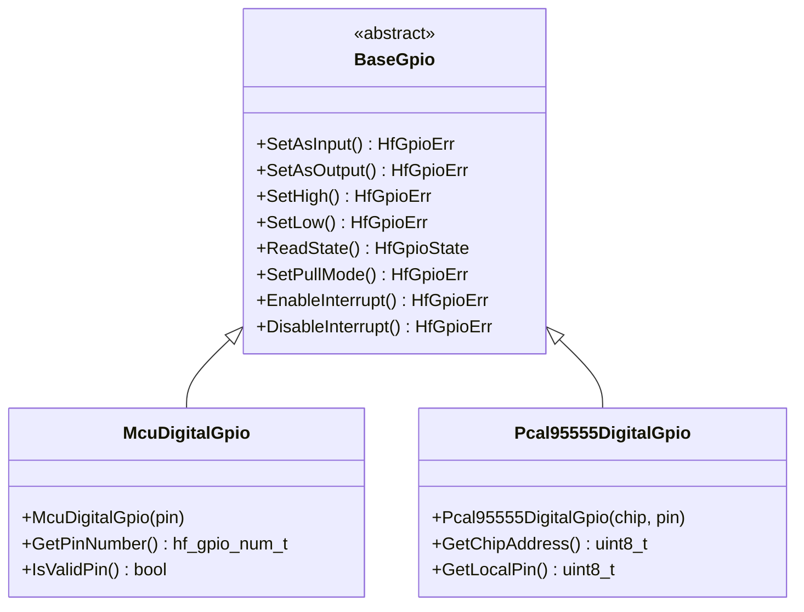

# 🔌 BaseGpio API Reference

<div align="center">


**🎯 Unified GPIO abstraction for all digital I/O operations**

</div>

---

## 📚 **Table of Contents**

- [🎯 **Overview**](#-overview)
- [🏗️ **Class Hierarchy**](#️-class-hierarchy)
- [📋 **Error Codes**](#-error-codes)
- [🎛️ **Pin Modes & States**](#️-pin-modes--states)
- [🔧 **Core Methods**](#-core-methods)
- [⚡ **Interrupt Handling**](#-interrupt-handling)
- [💡 **Usage Examples**](#-usage-examples)
- [🧪 **Testing**](#-testing)

---

## 🎯 **Overview**

The `BaseGpio` class provides a comprehensive GPIO abstraction that serves as the unified interface for all digital I/O operations in the HardFOC system. It supports dynamic mode switching, configurable pull resistors, interrupt handling, and works across different hardware platforms.

### ✨ **Key Features**

- 🔄 **Dynamic Mode Switching** - Change between input/output modes at runtime
- ⚡ **Interrupt Support** - Edge and level-triggered interrupts with callbacks
- 🔧 **Pull Resistor Control** - Built-in pull-up/pull-down configuration
- 🎯 **Drive Strength** - Configurable output drive capabilities
- 🛡️ **Robust Error Handling** - Comprehensive error codes and validation
- 🏎️ **High Performance** - Optimized for real-time applications
- 🔌 **Platform Agnostic** - Works with MCU pins, I2C/SPI expanders

### 📊 **Supported Hardware**

| Implementation | Hardware Type | Max Pins | Interrupt Support |
|----------------|---------------|----------|-------------------|
| `McuDigitalGpio` | ESP32-C6 Native | 30 | ✅ Full Support |
| `Pcal95555DigitalGpio` | I2C Expander | 16 per chip | ✅ Pin Change |
| `Tmc9660DigitalGpio` | Motor Controller | 8 | ❌ Polling Only |

---

## 🏗️ **Class Hierarchy**



---

## 📋 **Error Codes**

The GPIO system uses comprehensive error codes for robust error handling:

### ✅ **Success Codes**

| Code | Value | Description |
|------|-------|-------------|
| `GPIO_SUCCESS` | 0 | ✅ Operation completed successfully |

### ❌ **General Error Codes**

| Code | Value | Description | Resolution |
|------|-------|-------------|------------|
| `GPIO_ERR_FAILURE` | 1 | ❌ General operation failure | Check hardware connections |
| `GPIO_ERR_NOT_INITIALIZED` | 2 | ⚠️ GPIO not initialized | Call initialization methods |
| `GPIO_ERR_INVALID_PIN` | 3 | 🚫 Invalid pin number | Verify pin number validity |
| `GPIO_ERR_INVALID_MODE` | 4 | 🚫 Invalid GPIO mode | Use valid `HfGpioMode` values |
| `GPIO_ERR_INVALID_STATE` | 5 | 🚫 Invalid GPIO state | Use `GPIO_STATE_LOW` or `GPIO_STATE_HIGH` |
| `GPIO_ERR_MODE_CONFLICT` | 6 | ⚡ Mode switching conflict | Ensure proper mode transitions |

### 🔧 **Configuration Error Codes**

| Code | Value | Description | Resolution |
|------|-------|-------------|------------|
| `GPIO_ERR_PULL_NOT_SUPPORTED` | 10 | 🚫 Pull resistor not supported | Check hardware capabilities |
| `GPIO_ERR_INTERRUPT_NOT_SUPPORTED` | 11 | 🚫 Interrupts not supported | Use polling or different pin |
| `GPIO_ERR_DRIVE_STRENGTH_NOT_SUPPORTED` | 12 | 🚫 Drive strength not supported | Use default drive strength |

### 🌐 **Hardware Error Codes**

| Code | Value | Description | Resolution |
|------|-------|-------------|------------|
| `GPIO_ERR_HARDWARE_FAILURE` | 20 | 💥 Hardware communication failure | Check power and connections |
| `GPIO_ERR_I2C_FAILURE` | 21 | 🔄 I2C communication error | Verify I2C bus integrity |
| `GPIO_ERR_SPI_FAILURE` | 22 | ⚡ SPI communication error | Check SPI configuration |

---

## 🎛️ **Pin Modes & States**

### 📌 **GPIO Modes**

```cpp
enum class HfGpioMode {
    INPUT = 0,           // 📥 Input mode (high impedance)
    OUTPUT,              // 📤 Output mode (push-pull)
    INPUT_PULLUP,        // 📥⬆️ Input with pull-up resistor
    INPUT_PULLDOWN,      // 📥⬇️ Input with pull-down resistor
    OUTPUT_OPEN_DRAIN    // 📤🔓 Open-drain output
};
```

### 🔌 **GPIO States**

```cpp
enum class HfGpioState {
    LOW = 0,             // ⬇️ Logic low (0V)
    HIGH = 1,            // ⬆️ Logic high (3.3V)
    UNKNOWN = 2          // ❓ Unknown/floating state
};
```

### 🔧 **Pull Resistor Modes**

```cpp
enum class HfGpioPull {
    NONE = 0,            // 🚫 No pull resistor
    UP,                  // ⬆️ Pull-up resistor (~45kΩ)
    DOWN                 // ⬇️ Pull-down resistor (~45kΩ)
};
```

### ⚡ **Interrupt Types**

```cpp
enum class HfGpioInterruptType {
    RISING_EDGE = 0,     // ⬆️ Trigger on low-to-high transition
    FALLING_EDGE,        // ⬇️ Trigger on high-to-low transition
    BOTH_EDGES,          // 🔄 Trigger on any edge
    LOW_LEVEL,           // 📉 Trigger while pin is low
    HIGH_LEVEL           // 📈 Trigger while pin is high
};
```

---

## 🔧 **Core Methods**

### 🏗️ **Initialization**

```cpp
/**
 * @brief Initialize the GPIO pin
 * @return HfGpioErr Success or error code
 * 
 * 📝 Sets up the GPIO hardware and prepares it for use.
 * Must be called before any other operations.
 */
virtual HfGpioErr Initialize() = 0;

/**
 * @brief Deinitialize the GPIO pin
 * @return HfGpioErr Success or error code
 * 
 * 🧹 Cleanly shuts down the GPIO and releases hardware resources.
 */
virtual HfGpioErr Deinitialize() = 0;
```

### 🎛️ **Mode Configuration**

```cpp
/**
 * @brief Configure GPIO as input
 * @param pull_mode Pull resistor configuration
 * @return HfGpioErr Success or error code
 * 
 * 📥 Configures the pin as an input with optional pull resistors.
 * 
 * @example
 * gpio.SetAsInput(HfGpioPull::UP);  // Input with pull-up
 */
virtual HfGpioErr SetAsInput(HfGpioPull pull_mode = HfGpioPull::NONE) = 0;

/**
 * @brief Configure GPIO as output
 * @param initial_state Initial output state
 * @return HfGpioErr Success or error code
 * 
 * 📤 Configures the pin as an output with specified initial state.
 * 
 * @example
 * gpio.SetAsOutput(HfGpioState::LOW);  // Output starting low
 */
virtual HfGpioErr SetAsOutput(HfGpioState initial_state = HfGpioState::LOW) = 0;

/**
 * @brief Set GPIO mode
 * @param mode GPIO mode to set
 * @return HfGpioErr Success or error code
 * 
 * 🎯 Generic mode setting method for advanced configurations.
 */
virtual HfGpioErr SetMode(HfGpioMode mode) = 0;
```

### 📤 **Output Operations**

```cpp
/**
 * @brief Set GPIO output high
 * @return HfGpioErr Success or error code
 * 
 * ⬆️ Sets the output pin to logic high (3.3V).
 * Pin must be configured as output first.
 */
virtual HfGpioErr SetHigh() = 0;

/**
 * @brief Set GPIO output low  
 * @return HfGpioErr Success or error code
 * 
 * ⬇️ Sets the output pin to logic low (0V).
 * Pin must be configured as output first.
 */
virtual HfGpioErr SetLow() = 0;

/**
 * @brief Set GPIO output state
 * @param state Desired output state
 * @return HfGpioErr Success or error code
 * 
 * 🎯 Generic state setting method.
 * 
 * @example
 * gpio.SetState(HfGpioState::HIGH);  // Set high
 */
virtual HfGpioErr SetState(HfGpioState state) = 0;

/**
 * @brief Toggle GPIO output state
 * @return HfGpioErr Success or error code
 * 
 * 🔄 Inverts the current output state (high→low, low→high).
 */
virtual HfGpioErr Toggle() = 0;
```

### 📥 **Input Operations**

```cpp
/**
 * @brief Read GPIO input state
 * @return HfGpioState Current pin state
 * 
 * 📖 Reads the current logic level of the pin.
 * Works for both input and output pins.
 * 
 * @example
 * if (gpio.ReadState() == HfGpioState::HIGH) {
 *     // Pin is high
 * }
 */
virtual HfGpioState ReadState() = 0;

/**
 * @brief Check if GPIO is high
 * @return bool True if pin is high
 * 
 * ⬆️ Convenience method to check for high state.
 */
bool IsHigh() { return ReadState() == HfGpioState::HIGH; }

/**
 * @brief Check if GPIO is low
 * @return bool True if pin is low
 * 
 * ⬇️ Convenience method to check for low state.
 */
bool IsLow() { return ReadState() == HfGpioState::LOW; }
```

---

## ⚡ **Interrupt Handling**

### 🔧 **Interrupt Configuration**

```cpp
/**
 * @brief GPIO interrupt callback function type
 * @param pin Pin number that triggered the interrupt
 * @param state Current pin state
 * @param user_data User-provided data pointer
 * 
 * 📡 Callback function signature for GPIO interrupts.
 * Called from interrupt context - keep processing minimal!
 */
using HfGpioInterruptCallback = std::function<void(uint32_t pin, HfGpioState state, void* user_data)>;

/**
 * @brief Enable GPIO interrupt
 * @param type Interrupt trigger type
 * @param callback Function to call on interrupt
 * @param user_data User data passed to callback
 * @return HfGpioErr Success or error code
 * 
 * ⚡ Enables interrupts on the GPIO pin with specified trigger.
 * 
 * @example
 * gpio.EnableInterrupt(
 *     HfGpioInterruptType::RISING_EDGE,
 *     [](uint32_t pin, HfGpioState state, void* data) {
 *         // Handle interrupt (keep minimal!)
 *         button_pressed = true;
 *     },
 *     nullptr
 * );
 */
virtual HfGpioErr EnableInterrupt(
    HfGpioInterruptType type,
    HfGpioInterruptCallback callback,
    void* user_data = nullptr
) = 0;

/**
 * @brief Disable GPIO interrupt
 * @return HfGpioErr Success or error code
 * 
 * 🛑 Disables interrupts on the GPIO pin.
 */
virtual HfGpioErr DisableInterrupt() = 0;
```

### 📊 **Interrupt Status**

```cpp
/**
 * @brief Check if interrupt is enabled
 * @return bool True if interrupt is enabled
 * 
 * ❓ Query interrupt enable status.
 */
virtual bool IsInterruptEnabled() = 0;

/**
 * @brief Get interrupt type
 * @return HfGpioInterruptType Current interrupt type
 * 
 * 📋 Get the currently configured interrupt trigger type.
 */
virtual HfGpioInterruptType GetInterruptType() = 0;
```

---

## 💡 **Usage Examples**

### 🔴 **Basic LED Control**

```cpp
#include "mcu/McuDigitalGpio.h"

// Create GPIO instance for built-in LED
McuDigitalGpio led_pin(GPIO_NUM_2);

void setup() {
    // Initialize and configure as output
    led_pin.Initialize();
    led_pin.SetAsOutput(HfGpioState::LOW);
}

void blink_led() {
    led_pin.SetHigh();
    vTaskDelay(pdMS_TO_TICKS(500));
    led_pin.SetLow(); 
    vTaskDelay(pdMS_TO_TICKS(500));
}

// Alternative using toggle
void blink_led_toggle() {
    led_pin.Toggle();
    vTaskDelay(pdMS_TO_TICKS(500));
}
```

### 🔘 **Button Input with Pull-up**

```cpp
#include "mcu/McuDigitalGpio.h"

McuDigitalGpio button_pin(GPIO_NUM_0);

void setup() {
    // Configure as input with pull-up resistor
    button_pin.Initialize();
    button_pin.SetAsInput(HfGpioPull::UP);
}

bool is_button_pressed() {
    // Button is pressed when pin reads low (active-low)
    return button_pin.IsLow();
}

void button_task() {
    while (true) {
        if (is_button_pressed()) {
            printf("🔘 Button pressed!\n");
            vTaskDelay(pdMS_TO_TICKS(50)); // Debounce
        }
        vTaskDelay(pdMS_TO_TICKS(10));
    }
}
```

### ⚡ **Interrupt-Driven Button**

```cpp
#include "mcu/McuDigitalGpio.h"
#include <atomic>

McuDigitalGpio button_pin(GPIO_NUM_0);
std::atomic<bool> button_pressed{false};

void button_interrupt_handler(uint32_t pin, HfGpioState state, void* user_data) {
    // Interrupt handler - keep minimal!
    if (state == HfGpioState::LOW) {
        button_pressed = true;
    }
}

void setup() {
    button_pin.Initialize();
    button_pin.SetAsInput(HfGpioPull::UP);
    
    // Enable falling edge interrupt (button press)
    button_pin.EnableInterrupt(
        HfGpioInterruptType::FALLING_EDGE,
        button_interrupt_handler
    );
}

void main_task() {
    while (true) {
        if (button_pressed.exchange(false)) {
            printf("⚡ Button interrupt triggered!\n");
            // Handle button press
        }
        vTaskDelay(pdMS_TO_TICKS(10));
    }
}
```

### 🔄 **I2C GPIO Expander**

```cpp
#include "Pcal95555DigitalGpio.h"
#include "thread_safe/SfI2cBus.h"

// Setup I2C bus
SfI2cBus i2c_bus;

// Create GPIO pins on PCAL95555 expander
Pcal95555DigitalGpio expander_pin0(0x20, 0);  // Chip address 0x20, pin 0
Pcal95555DigitalGpio expander_pin1(0x20, 1);  // Chip address 0x20, pin 1

void setup() {
    // Initialize I2C bus
    i2c_bus.Initialize(I2C_NUM_0, 400000);
    
    // Configure expander pins
    expander_pin0.Initialize();
    expander_pin0.SetAsOutput(HfGpioState::LOW);
    
    expander_pin1.Initialize();
    expander_pin1.SetAsInput(HfGpioPull::UP);
}

void expander_example() {
    // Control output pin
    expander_pin0.SetHigh();
    
    // Read input pin
    if (expander_pin1.IsLow()) {
        printf("🔌 Expander input is active!\n");
    }
}
```

### 🎛️ **Dynamic Mode Switching**

```cpp
#include "mcu/McuDigitalGpio.h"

McuDigitalGpio versatile_pin(GPIO_NUM_5);

void bidirectional_communication() {
    versatile_pin.Initialize();
    
    // Start as output to send data
    versatile_pin.SetAsOutput(HfGpioState::LOW);
    
    // Send some signal pattern
    for (int i = 0; i < 5; i++) {
        versatile_pin.SetHigh();
        vTaskDelay(pdMS_TO_TICKS(10));
        versatile_pin.SetLow();
        vTaskDelay(pdMS_TO_TICKS(10));
    }
    
    // Switch to input to receive response
    versatile_pin.SetAsInput(HfGpioPull::UP);
    
    // Wait for response
    while (versatile_pin.IsHigh()) {
        vTaskDelay(pdMS_TO_TICKS(1));
    }
    
    printf("📡 Response received!\n");
}
```

---

## 🧪 **Testing**

### ✅ **Unit Test Coverage**

The BaseGpio implementation includes comprehensive unit tests:

```cpp
// Test initialization
TEST(BaseGpioTest, InitializationTest) {
    McuDigitalGpio gpio(GPIO_NUM_2);
    ASSERT_EQ(gpio.Initialize(), HfGpioErr::GPIO_SUCCESS);
}

// Test mode switching
TEST(BaseGpioTest, ModeSwitchingTest) {
    McuDigitalGpio gpio(GPIO_NUM_2);
    gpio.Initialize();
    
    ASSERT_EQ(gpio.SetAsOutput(), HfGpioErr::GPIO_SUCCESS);
    ASSERT_EQ(gpio.SetAsInput(), HfGpioErr::GPIO_SUCCESS);
}

// Test interrupt functionality
TEST(BaseGpioTest, InterruptTest) {
    McuDigitalGpio gpio(GPIO_NUM_0);
    gpio.Initialize();
    gpio.SetAsInput(HfGpioPull::UP);
    
    bool interrupt_called = false;
    auto callback = [&](uint32_t pin, HfGpioState state, void* data) {
        interrupt_called = true;
    };
    
    ASSERT_EQ(gpio.EnableInterrupt(HfGpioInterruptType::FALLING_EDGE, callback), 
              HfGpioErr::GPIO_SUCCESS);
    
    // Simulate interrupt trigger
    trigger_interrupt(GPIO_NUM_0);
    
    ASSERT_TRUE(interrupt_called);
}
```

### 📊 **Performance Benchmarks**

| Operation | MCU GPIO | I2C Expander | Notes |
|-----------|----------|--------------|-------|
| **SetHigh/Low** | ~100ns | ~2ms | I2C adds communication overhead |
| **ReadState** | ~50ns | ~1.5ms | Reading requires I2C transaction |
| **Mode Switch** | ~200ns | ~3ms | Configuration update needed |
| **Interrupt Latency** | ~2µs | ~50µs | I2C expanders use polling |

---

## 🔍 **Error Handling Best Practices**

### ✅ **Recommended Patterns**

```cpp
// ✅ Always check return codes
HfGpioErr result = gpio.SetAsOutput();
if (result != HfGpioErr::GPIO_SUCCESS) {
    printf("❌ GPIO configuration failed: %d\n", static_cast<int>(result));
    return;
}

// ✅ Use RAII for automatic cleanup
class GpioGuard {
    BaseGpio& gpio_;
public:
    GpioGuard(BaseGpio& gpio) : gpio_(gpio) {
        gpio_.Initialize();
    }
    ~GpioGuard() {
        gpio_.Deinitialize();
    }
};

// ✅ Validate pin numbers before use
if (!McuDigitalGpio::IsValidPin(pin_number)) {
    printf("❌ Invalid pin number: %d\n", pin_number);
    return;
}
```

### ❌ **Common Pitfalls**

```cpp
// ❌ Don't ignore return codes
gpio.SetAsOutput();  // Missing error check

// ❌ Don't use interrupts for time-critical operations
gpio.EnableInterrupt(type, [](auto...) {
    // Don't do heavy processing here!
    expensive_operation();  // BAD!
});

// ❌ Don't forget to initialize
gpio.SetHigh();  // Will fail if not initialized

// ❌ Don't mix thread-unsafe operations
// Use SfGpio for multi-threaded access
BaseGpio* gpio = get_shared_gpio();
gpio->SetHigh();  // Potential race condition
```

---

## 📖 **See Also**

- [🔒 **SfGpio**](SfGpio.md) - Thread-safe GPIO wrapper
- [⚙️ **McuDigitalGpio**](McuDigitalGpio.md) - ESP32-C6 implementation
- [🔌 **DigitalOutputGuard**](DigitalOutputGuard.md) - RAII GPIO management
- [🎯 **GPIO User Guide**](../guides/gpio-guide.md) - Complete GPIO tutorial

---

<div align="center">

**🔌 BaseGpio - The Foundation of Digital I/O in HardFOC**

*Part of the HardFOC Internal Interface Wrapper Documentation*

</div>
