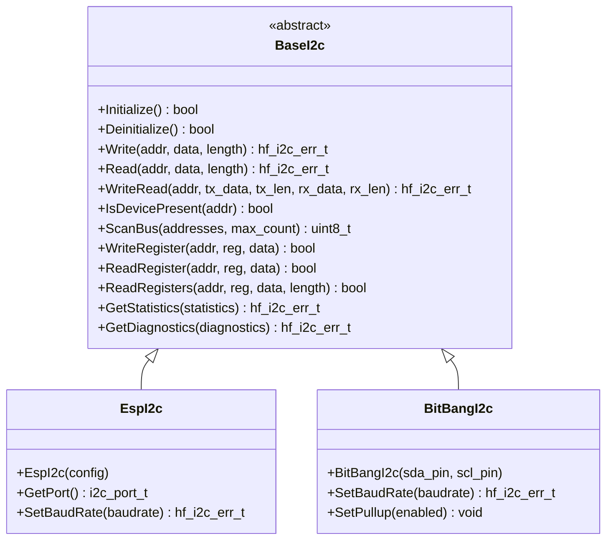

# 🔗 BaseI2c API Reference

<div align="center">


**🎯 Unified I2C bus abstraction for all Inter-Integrated Circuit operations**

</div>

---

## 📚 **Table of Contents**

- [🎯 **Overview**](#-overview)
- [🏗️ **Class Hierarchy**](#️-class-hierarchy)
- [📋 **Error Codes**](#-error-codes)
- [🔧 **Core API**](#-core-api)
- [📊 **Data Structures**](#-data-structures)
- [💡 **Usage Examples**](#-usage-examples)
- [🧪 **Best Practices**](#-best-practices)

---

## 🎯 **Overview**

The `BaseI2c` class provides a comprehensive I2C bus abstraction that serves as the unified interface for all Inter-Integrated Circuit operations in the HardFOC system. It supports master mode communication, device scanning, register access, and works across different I2C controller implementations.

### ✨ **Key Features**

- 🔗 **Master Mode Support** - Full I2C master functionality
- 📡 **Device Scanning** - Automatic device discovery and presence detection
- 📝 **Register Access** - Convenient register read/write operations
- ⚡ **Clock Stretching** - Automatic handling of clock stretching
- 🛡️ **Robust Error Handling** - Comprehensive validation and error reporting
- 🔌 **Platform Agnostic** - Works with internal and external I2C controllers
- 📊 **Statistics & Diagnostics** - Built-in monitoring and health reporting
- 🧵 **Thread Safe** - Designed for multi-threaded applications

### 📊 **Supported Hardware**

| Implementation | Hardware Type | Speed | Features | Use Cases |
|----------------|---------------|-------|----------|-----------|
| `EspI2c` | ESP32-C6 Internal | Up to 1 MHz | Clock stretching, DMA | Sensors, EEPROM |
| `BitBangI2c` | Software I2C | Up to 100 kHz | Any GPIO pins | Custom implementations |
| `Pca9548I2c` | I2C Multiplexer | Up to 400 kHz | 8-channel multiplexing | Multi-device systems |
| `Tmc9660I2c` | Motor Controller | Up to 400 kHz | Integrated with motor control | Motor sensors |

---

## 🏗️ **Class Hierarchy**



---

## 📋 **Error Codes**

The I2C system uses comprehensive error codes for robust error handling:

### ✅ **Success Codes**

| Code | Value | Description |
|------|-------|-------------|
| `I2C_SUCCESS` | 0 | ✅ Operation completed successfully |

### ❌ **General Error Codes**

| Code | Value | Description | Resolution |
|------|-------|-------------|------------|
| `I2C_ERR_FAILURE` | 1 | ❌ General operation failure | Check hardware and configuration |
| `I2C_ERR_NOT_INITIALIZED` | 2 | ⚠️ I2C not initialized | Call Initialize() first |
| `I2C_ERR_ALREADY_INITIALIZED` | 3 | ⚠️ I2C already initialized | Check initialization state |
| `I2C_ERR_INVALID_PARAMETER` | 4 | 🚫 Invalid parameter | Validate input parameters |
| `I2C_ERR_NULL_POINTER` | 5 | 🚫 Null pointer provided | Check pointer validity |
| `I2C_ERR_OUT_OF_MEMORY` | 6 | 💾 Memory allocation failed | Check system memory |

### 🚌 **Bus Error Codes**

| Code | Value | Description | Resolution |
|------|-------|-------------|------------|
| `I2C_ERR_BUS_BUSY` | 7 | 🔄 Bus busy | Wait for bus availability |
| `I2C_ERR_BUS_ERROR` | 8 | ❌ Bus error | Check bus wiring and termination |
| `I2C_ERR_BUS_ARBITRATION_LOST` | 9 | 🔄 Arbitration lost | Normal in multi-master systems |
| `I2C_ERR_BUS_NOT_AVAILABLE` | 10 | 🚫 Bus not available | Check bus configuration |
| `I2C_ERR_BUS_TIMEOUT` | 11 | ⏰ Bus timeout | Check bus speed and load |

### 📱 **Device Error Codes**

| Code | Value | Description | Resolution |
|------|-------|-------------|------------|
| `I2C_ERR_DEVICE_NOT_FOUND` | 12 | 🔍 Device not found | Check device address and connections |
| `I2C_ERR_DEVICE_NACK` | 13 | ❌ Device NACK | Check device address and data |
| `I2C_ERR_DEVICE_NOT_RESPONDING` | 14 | 🔇 Device not responding | Check device power and address |
| `I2C_ERR_INVALID_ADDRESS` | 15 | 🆔 Invalid device address | Use valid 7-bit address |

### 📊 **Data Error Codes**

| Code | Value | Description | Resolution |
|------|-------|-------------|------------|
| `I2C_ERR_DATA_TOO_LONG` | 16 | 📏 Data too long | Check data length limits |
| `I2C_ERR_READ_FAILURE` | 17 | 📖 Read failure | Check device and bus state |
| `I2C_ERR_WRITE_FAILURE` | 18 | ✍️ Write failure | Check device and bus state |
| `I2C_ERR_TIMEOUT` | 19 | ⏰ Operation timeout | Check bus speed and device response |

### 🌐 **Hardware Error Codes**

| Code | Value | Description | Resolution |
|------|-------|-------------|------------|
| `I2C_ERR_HARDWARE_FAULT` | 20 | 💥 Hardware fault | Check power and connections |
| `I2C_ERR_COMMUNICATION_FAILURE` | 21 | 📡 Communication failure | Check interface connections |
| `I2C_ERR_VOLTAGE_OUT_OF_RANGE` | 22 | ⚡ Voltage out of range | Check power supply |
| `I2C_ERR_CLOCK_STRETCH_TIMEOUT` | 23 | ⏰ Clock stretch timeout | Check device response time |

### ⚙️ **Configuration Error Codes**

| Code | Value | Description | Resolution |
|------|-------|-------------|------------|
| `I2C_ERR_INVALID_CONFIGURATION` | 24 | ⚙️ Invalid configuration | Check configuration parameters |
| `I2C_ERR_UNSUPPORTED_OPERATION` | 25 | 🚫 Unsupported operation | Check hardware capabilities |
| `I2C_ERR_INVALID_CLOCK_SPEED` | 26 | 📊 Invalid clock speed | Use supported baud rate |
| `I2C_ERR_PIN_CONFIGURATION_ERROR` | 27 | 🔌 Pin configuration error | Check pin assignments |

---

## 🔧 **Core API**

### 🏗️ **Initialization Methods**

```cpp
/**
 * @brief Initialize the I2C bus
 * @return true if successful, false otherwise
 * 
 * 📝 Sets up I2C hardware, configures pins, and prepares for communication.
 * Must be called before any I2C operations.
 * 
 * @example
 * EspI2c i2c(config);
 * if (i2c.Initialize()) {
 *     // I2C ready for use
 * }
 */
virtual bool Initialize() noexcept = 0;

/**
 * @brief Deinitialize the I2C bus
 * @return true if successful, false otherwise
 * 
 * 🧹 Cleanly shuts down I2C hardware and releases resources.
 */
virtual bool Deinitialize() noexcept = 0;

/**
 * @brief Check if I2C is initialized
 * @return true if initialized, false otherwise
 * 
 * ❓ Query initialization status without side effects.
 */
[[nodiscard]] bool IsInitialized() const noexcept;

/**
 * @brief Ensure I2C is initialized (lazy initialization)
 * @return true if initialized successfully, false otherwise
 * 
 * 🔄 Automatically initializes I2C if not already initialized.
 */
bool EnsureInitialized() noexcept;

/**
 * @brief Ensure I2C is deinitialized (lazy deinitialization)
 * @return true if deinitialized successfully, false otherwise
 * 
 * 🔄 Automatically deinitializes I2C if currently initialized.
 */
bool EnsureDeinitialized() noexcept;
```

### 📤 **Write Operations**

```cpp
/**
 * @brief Write data to I2C device
 * @param device_addr 7-bit I2C device address
 * @param data Pointer to data buffer to write
 * @param length Number of bytes to write
 * @param timeout_ms Timeout in milliseconds (0 = use default)
 * @return hf_i2c_err_t error code
 * 
 * 📤 Writes data to the specified I2C device.
 * 
 * @example
 * uint8_t data[] = {0x01, 0x02, 0x03};
 * hf_i2c_err_t result = i2c.Write(0x48, data, 3, 1000);
 * if (result != hf_i2c_err_t::I2C_SUCCESS) {
 *     printf("Write failed: %s\n", HfI2CErrToString(result));
 * }
 */
virtual hf_i2c_err_t Write(uint8_t device_addr, const uint8_t *data, uint16_t length,
                          uint32_t timeout_ms = 0) noexcept = 0;

/**
 * @brief Write single byte to I2C device
 * @param device_addr 7-bit I2C device address
 * @param data Byte to write
 * @return true if successful, false otherwise
 * 
 * 📤 Convenience method for single byte writes.
 * 
 * @example
 * if (i2c.WriteByte(0x48, 0x01)) {
 *     printf("Byte written successfully\n");
 * }
 */
virtual bool WriteByte(uint8_t device_addr, uint8_t data) noexcept;
```

### 📥 **Read Operations**

```cpp
/**
 * @brief Read data from I2C device
 * @param device_addr 7-bit I2C device address
 * @param data Pointer to buffer to store received data
 * @param length Number of bytes to read
 * @param timeout_ms Timeout in milliseconds (0 = use default)
 * @return hf_i2c_err_t error code
 * 
 * 📥 Reads data from the specified I2C device.
 * 
 * @example
 * uint8_t buffer[4];
 * hf_i2c_err_t result = i2c.Read(0x48, buffer, 4, 1000);
 * if (result == hf_i2c_err_t::I2C_SUCCESS) {
 *     printf("Read: %02X %02X %02X %02X\n", buffer[0], buffer[1], buffer[2], buffer[3]);
 * }
 */
virtual hf_i2c_err_t Read(uint8_t device_addr, uint8_t *data, uint16_t length,
                         uint32_t timeout_ms = 0) noexcept = 0;

/**
 * @brief Read single byte from I2C device
 * @param device_addr 7-bit I2C device address
 * @param data Reference to store received byte
 * @return true if successful, false otherwise
 * 
 * 📥 Convenience method for single byte reads.
 * 
 * @example
 * uint8_t value;
 * if (i2c.ReadByte(0x48, value)) {
 *     printf("Read byte: 0x%02X\n", value);
 * }
 */
virtual bool ReadByte(uint8_t device_addr, uint8_t &data) noexcept;
```

### 🔄 **Write-Then-Read Operations**

```cpp
/**
 * @brief Write data then read data from I2C device
 * @param device_addr 7-bit I2C device address
 * @param tx_data Pointer to transmit data buffer
 * @param tx_length Number of bytes to write
 * @param rx_data Pointer to receive data buffer
 * @param rx_length Number of bytes to read
 * @param timeout_ms Timeout in milliseconds (0 = use default)
 * @return hf_i2c_err_t error code
 * 
 * 🔄 Performs write-then-read transaction (common for register access).
 * 
 * @example
 * uint8_t tx_data[] = {0x00};  // Register address
 * uint8_t rx_data[2];          // Register data
 * hf_i2c_err_t result = i2c.WriteRead(0x48, tx_data, 1, rx_data, 2, 1000);
 * if (result == hf_i2c_err_t::I2C_SUCCESS) {
 *     printf("Register value: 0x%04X\n", (rx_data[0] << 8) | rx_data[1]);
 * }
 */
virtual hf_i2c_err_t WriteRead(uint8_t device_addr, const uint8_t *tx_data, uint16_t tx_length,
                              uint8_t *rx_data, uint16_t rx_length,
                              uint32_t timeout_ms = 0) noexcept = 0;
```

### 📝 **Register Access Methods**

```cpp
/**
 * @brief Write to I2C device register
 * @param device_addr 7-bit I2C device address
 * @param reg_addr Register address
 * @param data Data to write to register
 * @return true if successful, false otherwise
 * 
 * 📝 Writes a single byte to a device register.
 * 
 * @example
 * if (i2c.WriteRegister(0x48, 0x01, 0x80)) {
 *     printf("Register written successfully\n");
 * }
 */
virtual bool WriteRegister(uint8_t device_addr, uint8_t reg_addr, uint8_t data) noexcept;

/**
 * @brief Read from I2C device register
 * @param device_addr 7-bit I2C device address
 * @param reg_addr Register address
 * @param data Reference to store register data
 * @return true if successful, false otherwise
 * 
 * 📝 Reads a single byte from a device register.
 * 
 * @example
 * uint8_t value;
 * if (i2c.ReadRegister(0x48, 0x00, value)) {
 *     printf("Register value: 0x%02X\n", value);
 * }
 */
virtual bool ReadRegister(uint8_t device_addr, uint8_t reg_addr, uint8_t &data) noexcept;

/**
 * @brief Read multiple registers from I2C device
 * @param device_addr 7-bit I2C device address
 * @param reg_addr Starting register address
 * @param data Pointer to buffer to store register data
 * @param length Number of registers to read
 * @return true if successful, false otherwise
 * 
 * 📝 Reads multiple consecutive registers.
 * 
 * @example
 * uint8_t registers[4];
 * if (i2c.ReadRegisters(0x48, 0x00, registers, 4)) {
 *     printf("Registers: %02X %02X %02X %02X\n", 
 *            registers[0], registers[1], registers[2], registers[3]);
 * }
 */
virtual bool ReadRegisters(uint8_t device_addr, uint8_t reg_addr, uint8_t *data,
                          uint16_t length) noexcept;
```

### 🔍 **Device Discovery**

```cpp
/**
 * @brief Check if I2C device is present
 * @param device_addr 7-bit I2C device address
 * @return true if device responds, false otherwise
 * 
 * 🔍 Performs a quick device presence check.
 * 
 * @example
 * if (i2c.IsDevicePresent(0x48)) {
 *     printf("Device 0x48 is present\n");
 * } else {
 *     printf("Device 0x48 not found\n");
 * }
 */
virtual bool IsDevicePresent(uint8_t device_addr) noexcept;

/**
 * @brief Scan I2C bus for devices
 * @param addresses Array to store found device addresses
 * @param max_addresses Maximum number of addresses to store
 * @return Number of devices found
 * 
 * 🔍 Scans the entire I2C bus for responding devices.
 * 
 * @example
 * uint8_t devices[16];
 * uint8_t count = i2c.ScanBus(devices, 16);
 * printf("Found %u I2C devices:\n", count);
 * for (uint8_t i = 0; i < count; i++) {
 *     printf("  Address: 0x%02X\n", devices[i]);
 * }
 */
virtual uint8_t ScanBus(uint8_t *addresses, uint8_t max_addresses) noexcept;
```

### 📈 **Statistics and Diagnostics**

```cpp
/**
 * @brief Reset I2C operation statistics
 * @return hf_i2c_err_t error code
 * 
 * 🔄 Clears all accumulated statistics counters.
 */
virtual hf_i2c_err_t ResetStatistics() noexcept;

/**
 * @brief Reset I2C diagnostic information
 * @return hf_i2c_err_t error code
 * 
 * 🔄 Clears diagnostic information and error counters.
 */
virtual hf_i2c_err_t ResetDiagnostics() noexcept;

/**
 * @brief Get I2C operation statistics
 * @param statistics Reference to store statistics data
 * @return hf_i2c_err_t error code
 * 
 * 📊 Retrieves comprehensive statistics about I2C operations.
 */
virtual hf_i2c_err_t GetStatistics(hf_i2c_statistics_t &statistics) const noexcept;

/**
 * @brief Get I2C diagnostic information
 * @param diagnostics Reference to store diagnostics data
 * @return hf_i2c_err_t error code
 * 
 * 🔍 Retrieves diagnostic information about I2C health and status.
 */
virtual hf_i2c_err_t GetDiagnostics(hf_i2c_diagnostics_t &diagnostics) const noexcept;
```

---

## 📊 **Data Structures**

### 📈 **I2C Statistics Structure**

```cpp
struct hf_i2c_statistics_t {
    uint64_t total_transactions;     ///< Total transactions attempted
    uint64_t successful_transactions; ///< Successful transactions
    uint64_t failed_transactions;    ///< Failed transactions
    uint64_t timeout_count;          ///< Transaction timeouts
    uint64_t bytes_written;          ///< Total bytes written
    uint64_t bytes_read;             ///< Total bytes read
    uint64_t total_transaction_time_us; ///< Total transaction time
    uint32_t max_transaction_time_us;   ///< Longest transaction time
    uint32_t min_transaction_time_us;   ///< Shortest transaction time
    uint32_t nack_errors;            ///< NACK error count
    uint32_t bus_errors;             ///< Bus error count
    uint32_t arbitration_lost_count; ///< Arbitration lost count
    uint32_t clock_stretch_timeouts; ///< Clock stretch timeouts
    uint32_t devices_added;          ///< Devices added to bus
    uint32_t devices_removed;        ///< Devices removed from bus
};
```

### 🔍 **I2C Diagnostics Structure**

```cpp
struct hf_i2c_diagnostics_t {
    bool bus_healthy;                           ///< Overall bus health status
    bool sda_line_state;                        ///< Current SDA line state
    bool scl_line_state;                        ///< Current SCL line state
    bool bus_locked;                           ///< Bus lock status
    hf_i2c_err_t last_error_code;                  ///< Last error code encountered
    uint64_t last_error_timestamp_us;          ///< Timestamp of last error
    uint32_t consecutive_errors;               ///< Consecutive error count
    uint32_t error_recovery_attempts;          ///< Bus recovery attempts
    float bus_utilization_percent;             ///< Bus utilization percentage
    uint32_t average_response_time_us;         ///< Average device response time
    uint32_t clock_stretching_events;          ///< Clock stretching event count
    uint32_t active_device_count;              ///< Number of active devices on bus
    uint32_t total_device_scans;               ///< Total device scan operations
    uint32_t devices_found_last_scan;          ///< Devices found in last scan
};
```

---

## 💡 **Usage Examples**

### 🔍 **Device Discovery**

```cpp
#include "mcu/esp32/EspI2c.h"

// Create I2C instance
hf_i2c_config_t config = {
    .sda_pin = 21,
    .scl_pin = 22,
    .baudrate = 100000,
    .timeout_ms = 1000
};

EspI2c i2c(config);

void discover_devices() {
    // Initialize I2C
    if (!i2c.EnsureInitialized()) {
        printf("❌ I2C initialization failed\n");
        return;
    }
    
    printf("🔍 Scanning I2C bus...\n");
    
    // Scan for devices
    uint8_t devices[16];
    uint8_t count = i2c.ScanBus(devices, 16);
    
    if (count == 0) {
        printf("❌ No I2C devices found\n");
        return;
    }
    
    printf("✅ Found %u I2C devices:\n", count);
    for (uint8_t i = 0; i < count; i++) {
        printf("  Address: 0x%02X\n", devices[i]);
        
        // Check if device is responding
        if (i2c.IsDevicePresent(devices[i])) {
            printf("    Status: ✅ Responding\n");
        } else {
            printf("    Status: ❌ Not responding\n");
        }
    }
}
```

### 📝 **Temperature Sensor (TMP102)**

```cpp
#include "mcu/esp32/EspI2c.h"

class Tmp102Sensor {
private:
    BaseI2c* i2c_;
    uint8_t address_;
    
public:
    Tmp102Sensor(BaseI2c* i2c, uint8_t address = 0x48) 
        : i2c_(i2c), address_(address) {}
    
    bool initialize() {
        return i2c_->EnsureInitialized();
    }
    
    bool is_present() {
        return i2c_->IsDevicePresent(address_);
    }
    
    float read_temperature() {
        uint8_t data[2];
        
        // Read temperature register (0x00)
        if (!i2c_->ReadRegisters(address_, 0x00, data, 2)) {
            return -999.0f;  // Error value
        }
        
        // Convert to temperature (12-bit resolution)
        int16_t raw = (data[0] << 4) | (data[1] >> 4);
        if (raw & 0x800) {  // Negative temperature
            raw |= 0xF000;  // Sign extend
        }
        
        return raw * 0.0625f;  // Convert to Celsius
    }
    
    bool set_configuration(uint16_t config) {
        uint8_t data[2] = {
            static_cast<uint8_t>(config >> 8),
            static_cast<uint8_t>(config & 0xFF)
        };
        
        // Write to configuration register (0x01)
        return i2c_->WriteRegisters(address_, 0x01, data, 2);
    }
    
    uint16_t get_configuration() {
        uint8_t data[2];
        
        if (!i2c_->ReadRegisters(address_, 0x01, data, 2)) {
            return 0xFFFF;  // Error value
        }
        
        return (data[0] << 8) | data[1];
    }
};

void temperature_monitoring() {
    EspI2c i2c(config);
    Tmp102Sensor sensor(&i2c, 0x48);
    
    if (!sensor.initialize()) {
        printf("❌ Sensor initialization failed\n");
        return;
    }
    
    if (!sensor.is_present()) {
        printf("❌ Temperature sensor not found\n");
        return;
    }
    
    printf("✅ Temperature sensor found\n");
    
    // Configure sensor (12-bit resolution, normal mode)
    sensor.set_configuration(0x60A0);
    
    while (true) {
        float temperature = sensor.read_temperature();
        if (temperature > -900.0f) {
            printf("🌡️ Temperature: %.2f°C\n", temperature);
        } else {
            printf("❌ Temperature read failed\n");
        }
        
        vTaskDelay(pdMS_TO_TICKS(1000));
    }
}
```

### 📊 **EEPROM Access (24LC256)**

```cpp
#include "mcu/esp32/EspI2c.h"

class Eeprom24LC256 {
private:
    BaseI2c* i2c_;
    uint8_t address_;
    
public:
    Eeprom24LC256(BaseI2c* i2c, uint8_t address = 0x50) 
        : i2c_(i2c), address_(address) {}
    
    bool initialize() {
        return i2c_->EnsureInitialized();
    }
    
    bool write_byte(uint16_t address, uint8_t data) {
        uint8_t tx_data[3] = {
            static_cast<uint8_t>(address >> 8),    // High address byte
            static_cast<uint8_t>(address & 0xFF),  // Low address byte
            data
        };
        
        hf_i2c_err_t result = i2c_->Write(this->address_, tx_data, 3);
        if (result != hf_i2c_err_t::I2C_SUCCESS) {
            printf("❌ Write failed: %s\n", HfI2CErrToString(result));
            return false;
        }
        
        // Wait for write cycle to complete
        vTaskDelay(pdMS_TO_TICKS(5));
        return true;
    }
    
    bool read_byte(uint16_t address, uint8_t &data) {
        uint8_t addr_data[2] = {
            static_cast<uint8_t>(address >> 8),    // High address byte
            static_cast<uint8_t>(address & 0xFF)   // Low address byte
        };
        
        // Write address, then read data
        hf_i2c_err_t result = i2c_->WriteRead(this->address_, addr_data, 2, &data, 1);
        if (result != hf_i2c_err_t::I2C_SUCCESS) {
            printf("❌ Read failed: %s\n", HfI2CErrToString(result));
            return false;
        }
        
        return true;
    }
    
    bool write_page(uint16_t address, const uint8_t* data, uint8_t length) {
        if (length > 64) {  // Page size limit
            printf("❌ Page size too large\n");
            return false;
        }
        
        // Check page boundary
        uint16_t page_start = address & 0xFFC0;  // 64-byte page boundary
        uint16_t page_end = page_start + 64;
        
        if (address + length > page_end) {
            printf("❌ Data crosses page boundary\n");
            return false;
        }
        
        uint8_t* tx_data = new uint8_t[length + 2];
        tx_data[0] = static_cast<uint8_t>(address >> 8);    // High address byte
        tx_data[1] = static_cast<uint8_t>(address & 0xFF);  // Low address byte
        memcpy(&tx_data[2], data, length);
        
        hf_i2c_err_t result = i2c_->Write(this->address_, tx_data, length + 2);
        delete[] tx_data;
        
        if (result != hf_i2c_err_t::I2C_SUCCESS) {
            printf("❌ Page write failed: %s\n", HfI2CErrToString(result));
            return false;
        }
        
        // Wait for write cycle to complete
        vTaskDelay(pdMS_TO_TICKS(5));
        return true;
    }
    
    bool read_bytes(uint16_t address, uint8_t* data, uint16_t length) {
        uint8_t addr_data[2] = {
            static_cast<uint8_t>(address >> 8),    // High address byte
            static_cast<uint8_t>(address & 0xFF)   // Low address byte
        };
        
        // Write address, then read data
        hf_i2c_err_t result = i2c_->WriteRead(this->address_, addr_data, 2, data, length);
        if (result != hf_i2c_err_t::I2C_SUCCESS) {
            printf("❌ Read failed: %s\n", HfI2CErrToString(result));
            return false;
        }
        
        return true;
    }
};

void eeprom_test() {
    EspI2c i2c(config);
    Eeprom24LC256 eeprom(&i2c, 0x50);
    
    if (!eeprom.initialize()) {
        printf("❌ EEPROM initialization failed\n");
        return;
    }
    
    // Write test data
    uint8_t test_data[] = "Hello, EEPROM!";
    uint16_t write_addr = 0x0000;
    
    if (eeprom.write_page(write_addr, test_data, sizeof(test_data) - 1)) {
        printf("✅ Data written to EEPROM\n");
    }
    
    // Read back data
    uint8_t read_data[16];
    if (eeprom.read_bytes(write_addr, read_data, sizeof(test_data) - 1)) {
        read_data[sizeof(test_data) - 1] = '\0';  // Null terminate
        printf("📖 Read from EEPROM: %s\n", read_data);
    }
}
```

### 🔌 **I2C Multiplexer (PCA9548)**

```cpp
#include "mcu/esp32/EspI2c.h"

class Pca9548Multiplexer {
private:
    BaseI2c* i2c_;
    uint8_t address_;
    uint8_t current_channel_;
    
public:
    Pca9548Multiplexer(BaseI2c* i2c, uint8_t address = 0x70) 
        : i2c_(i2c), address_(address), current_channel_(0) {}
    
    bool initialize() {
        return i2c_->EnsureInitialized();
    }
    
    bool select_channel(uint8_t channel) {
        if (channel > 7) {
            printf("❌ Invalid channel: %u\n", channel);
            return false;
        }
        
        uint8_t control_byte = 1 << channel;
        hf_i2c_err_t result = i2c_->Write(address_, &control_byte, 1);
        
        if (result == hf_i2c_err_t::I2C_SUCCESS) {
            current_channel_ = channel;
            printf("✅ Selected channel %u\n", channel);
            return true;
        } else {
            printf("❌ Channel selection failed: %s\n", HfI2CErrToString(result));
            return false;
        }
    }
    
    uint8_t get_current_channel() const {
        return current_channel_;
    }
    
    bool scan_channel(uint8_t channel) {
        if (!select_channel(channel)) {
            return false;
        }
        
        printf("🔍 Scanning channel %u:\n", channel);
        
        uint8_t devices[16];
        uint8_t count = i2c_->ScanBus(devices, 16);
        
        if (count == 0) {
            printf("  No devices found\n");
        } else {
            printf("  Found %u devices:\n", count);
            for (uint8_t i = 0; i < count; i++) {
                printf("    Address: 0x%02X\n", devices[i]);
            }
        }
        
        return true;
    }
    
    void scan_all_channels() {
        printf("🔍 Scanning all I2C multiplexer channels:\n");
        
        for (uint8_t channel = 0; channel < 8; channel++) {
            scan_channel(channel);
        }
    }
};

void multiplexer_test() {
    EspI2c i2c(config);
    Pca9548Multiplexer mux(&i2c, 0x70);
    
    if (!mux.initialize()) {
        printf("❌ Multiplexer initialization failed\n");
        return;
    }
    
    // Scan all channels
    mux.scan_all_channels();
    
    // Access device on channel 0
    if (mux.select_channel(0)) {
        // Now communicate with device on channel 0
        if (i2c.IsDevicePresent(0x48)) {
            printf("✅ Device 0x48 found on channel 0\n");
        }
    }
}
```

---

## 🧪 **Best Practices**

### ✅ **Recommended Patterns**

```cpp
// ✅ Always check initialization
if (!i2c.EnsureInitialized()) {
    printf("❌ I2C initialization failed\n");
    return false;
}

// ✅ Use appropriate timeouts
i2c.Write(addr, data, length, 1000);  // 1 second timeout for critical operations
i2c.Read(addr, data, length, 500);    // 500ms timeout for normal reads

// ✅ Handle all error codes
hf_i2c_err_t result = i2c.Write(addr, data, length);
if (result != hf_i2c_err_t::I2C_SUCCESS) {
    printf("⚠️ I2C Error: %s\n", HfI2CErrToString(result));
    // Handle specific error types
    if (result == hf_i2c_err_t::I2C_ERR_DEVICE_NACK) {
        // Device not responding - check address
    } else if (result == hf_i2c_err_t::I2C_ERR_BUS_ERROR) {
        // Bus error - check wiring
    }
}

// ✅ Use device presence checks
if (i2c.IsDevicePresent(device_addr)) {
    // Device is available
} else {
    printf("❌ Device 0x%02X not found\n", device_addr);
}

// ✅ Use register access methods for convenience
i2c.WriteRegister(addr, reg, value);  // Easier than manual write
i2c.ReadRegister(addr, reg, value);   // Easier than manual read

// ✅ Monitor bus health
hf_i2c_statistics_t stats;
if (i2c.GetStatistics(stats) == hf_i2c_err_t::I2C_SUCCESS) {
    if (stats.failed_transactions > 10) {
        printf("⚠️ High I2C failure rate detected\n");
    }
}
```

### ❌ **Common Pitfalls**

```cpp
// ❌ Don't ignore initialization
i2c.Write(addr, data, length);  // May fail silently

// ❌ Don't use infinite timeouts in real-time systems
i2c.Read(addr, data, length, UINT32_MAX);  // May block forever

// ❌ Don't ignore error codes
i2c.Write(addr, data, length);  // Error handling missing

// ❌ Don't assume device presence
// Always check if device responds before communication

// ❌ Don't use without proper pull-up resistors
// I2C bus requires external pull-up resistors

// ❌ Don't ignore clock stretching
// Some devices stretch the clock during communication
```

### 🎯 **Performance Optimization**

```cpp
// 🚀 Use appropriate baud rates
// 100 kHz for long cables or multiple devices
// 400 kHz for short cables and fast devices
// 1 MHz for high-speed devices (if supported)

// 🚀 Use register access methods for efficiency
i2c.WriteRegister(addr, reg, value);  // Optimized for register access

// 🚀 Use page writes for EEPROM
// Write multiple bytes in a single transaction

// 🚀 Minimize bus scanning frequency
// Cache device presence information

// 🚀 Use appropriate timeouts
// Too short: may cause unnecessary failures
// Too long: may block system unnecessarily

// 🚀 Monitor statistics for performance tuning
hf_i2c_statistics_t stats;
i2c.GetStatistics(stats);
if (stats.average_response_time_us > 1000) {
    printf("⚠️ Slow I2C response detected\n");
}
```

---

## 🔗 **Related Documentation**

- [🔒 **SfI2c**](SfI2c.md) - Thread-safe I2C wrapper
- [⚙️ **EspI2c**](EspI2c.md) - ESP32-C6 implementation
- [🔌 **BitBangI2c**](BitBangI2c.md) - Software I2C implementation
- [🎯 **Hardware Types**](HardwareTypes.md) - Platform-agnostic types

---

<div align="center">

**🔗 BaseI2c - The Foundation of I2C Communication in HardFOC**

*Part of the HardFOC Internal Interface Wrapper Documentation*

</div> 