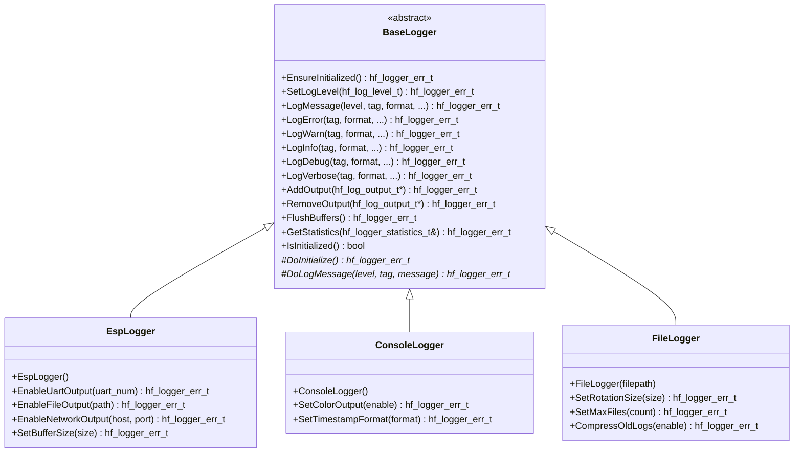

# 📝 BaseLogger API Reference

<div align="center">


**🎯 Unified logging abstraction for comprehensive system monitoring and debugging**

**📋 Navigation**

[← Previous: BaseNvs](BaseNvs.md) | [Back to API Index](README.md) | [Next: BaseTemperature →](BaseTemperature.md)

</div>

---

## 📚 **Table of Contents**

- [🎯 **Overview**](#-overview)
- [🏗️ **Class Hierarchy**](#-class-hierarchy)
- [📋 **Error Codes**](#-error-codes)
- [🔧 **Core API**](#-core-api)
- [📊 **Data Structures**](#-data-structures)
- [📝 **Log Levels**](#-log-levels)
- [📊 **Usage Examples**](#-usage-examples)
- [🧪 **Best Practices**](#-best-practices)

---

## 🎯 **Overview**

The `BaseLogger` class provides a comprehensive logging abstraction that serves as the unified interface for all logging operations in the HardFOC system. It supports multiple log levels, configurable output destinations, thread-safe operations, performance monitoring, and works across different hardware implementations with minimal overhead.

### ✨ **Key Features**

- 📝 **Multi-Level Logging** - ERROR, WARN, INFO, DEBUG, VERBOSE levels
- 🔒 **Thread-Safe Operations** - Concurrent logging from multiple tasks
- 📊 **Multiple Output Destinations** - UART, file, memory buffer, network
- ⚡ **High Performance** - Minimal overhead with efficient buffering
- 🎯 **Configurable Filtering** - Runtime level control and tag filtering
- 📈 **Performance Monitoring** - Built-in logging statistics and profiling
- 🛡️ **Robust Error Handling** - Comprehensive validation and error reporting
- 🏎️ **Memory Efficient** - Optimized memory usage with circular buffers
- 🔌 **Platform Agnostic** - Works across different MCU platforms

### 📊 **Supported Hardware**

| Implementation | UART | File | Memory | Network | Performance |
|----------------|------|------|--------|---------|-------------|
| `EspLogger` | ✅ | ✅ | ✅ | ✅ | High |
| `Esp8266Logger` | ✅ | ❌ | ✅ | ✅ | Medium |
| `ArmLogger` | ✅ | ✅ | ✅ | ❌ | High |

---

## 🏗️ **Class Hierarchy**



---

## 📋 **Error Codes**

### 🚨 **Logger Error Enumeration**

```cpp
enum class hf_logger_err_t : hf_u32_t {
    // Success codes
    LOGGER_SUCCESS = 0,
    
    // General errors
    LOGGER_ERR_FAILURE = 1,
    LOGGER_ERR_NOT_INITIALIZED = 2,
    LOGGER_ERR_ALREADY_INITIALIZED = 3,
    LOGGER_ERR_INVALID_PARAMETER = 4,
    LOGGER_ERR_NULL_POINTER = 5,
    LOGGER_ERR_OUT_OF_MEMORY = 6,
    
    // Output errors
    LOGGER_ERR_OUTPUT_NOT_FOUND = 7,
    LOGGER_ERR_OUTPUT_ALREADY_ADDED = 8,
    LOGGER_ERR_OUTPUT_FAILURE = 9,
    LOGGER_ERR_OUTPUT_FULL = 10,
    
    // Buffer errors
    LOGGER_ERR_BUFFER_OVERFLOW = 11,
    LOGGER_ERR_BUFFER_UNDERFLOW = 12,
    LOGGER_ERR_BUFFER_FULL = 13,
    LOGGER_ERR_BUFFER_EMPTY = 14,
    
    // Format errors
    LOGGER_ERR_FORMAT_ERROR = 15,
    LOGGER_ERR_MESSAGE_TOO_LONG = 16,
    LOGGER_ERR_INVALID_TAG = 17,
    LOGGER_ERR_INVALID_LEVEL = 18,
    
    // File errors
    LOGGER_ERR_FILE_NOT_FOUND = 19,
    LOGGER_ERR_FILE_PERMISSION = 20,
    LOGGER_ERR_FILE_WRITE_ERROR = 21,
    LOGGER_ERR_DISK_FULL = 22,
    
    // Network errors
    LOGGER_ERR_NETWORK_UNAVAILABLE = 23,
    LOGGER_ERR_NETWORK_TIMEOUT = 24,
    LOGGER_ERR_NETWORK_ERROR = 25,
    
    // System errors
    LOGGER_ERR_SYSTEM_ERROR = 26,
    LOGGER_ERR_PERMISSION_DENIED = 27,
    LOGGER_ERR_OPERATION_ABORTED = 28
};
```

### 📊 **Error Code Categories**

| Category | Range | Description |
|----------|-------|-------------|
| **Success** | 0 | Successful operation |
| **General** | 1-6 | Basic initialization and parameter errors |
| **Output** | 7-10 | Output destination errors |
| **Buffer** | 11-14 | Buffer management errors |
| **Format** | 15-18 | Message formatting errors |
| **File** | 19-22 | File system errors |
| **Network** | 23-25 | Network logging errors |
| **System** | 26-28 | System-level errors |

---

## 🔧 **Core API**

### 🎯 **Essential Methods**

#### **Initialization & Configuration**
```cpp
/**
 * @brief Ensure the logger is initialized
 * @return hf_logger_err_t Error code
 */
virtual hf_logger_err_t EnsureInitialized() = 0;

/**
 * @brief Set the global log level
 * @param level Minimum log level to output
 * @return hf_logger_err_t Error code
 */
virtual hf_logger_err_t SetLogLevel(hf_log_level_t level) = 0;

/**
 * @brief Check if logger is initialized
 * @return bool True if initialized
 */
virtual bool IsInitialized() const = 0;
```

#### **Logging Methods**
```cpp
/**
 * @brief Log a message with specified level
 * @param level Log level
 * @param tag Message tag/category
 * @param format Printf-style format string
 * @param ... Format arguments
 * @return hf_logger_err_t Error code
 */
virtual hf_logger_err_t LogMessage(hf_log_level_t level, 
                                 const char* tag,
                                 const char* format, ...) = 0;

/**
 * @brief Log error message
 * @param tag Message tag/category
 * @param format Printf-style format string
 * @param ... Format arguments
 * @return hf_logger_err_t Error code
 */
virtual hf_logger_err_t LogError(const char* tag, const char* format, ...) = 0;

/**
 * @brief Log warning message
 * @param tag Message tag/category
 * @param format Printf-style format string
 * @param ... Format arguments
 * @return hf_logger_err_t Error code
 */
virtual hf_logger_err_t LogWarn(const char* tag, const char* format, ...) = 0;

/**
 * @brief Log info message
 * @param tag Message tag/category
 * @param format Printf-style format string
 * @param ... Format arguments
 * @return hf_logger_err_t Error code
 */
virtual hf_logger_err_t LogInfo(const char* tag, const char* format, ...) = 0;

/**
 * @brief Log debug message
 * @param tag Message tag/category
 * @param format Printf-style format string
 * @param ... Format arguments
 * @return hf_logger_err_t Error code
 */
virtual hf_logger_err_t LogDebug(const char* tag, const char* format, ...) = 0;

/**
 * @brief Log verbose message
 * @param tag Message tag/category
 * @param format Printf-style format string
 * @param ... Format arguments
 * @return hf_logger_err_t Error code
 */
virtual hf_logger_err_t LogVerbose(const char* tag, const char* format, ...) = 0;
```

#### **Output Management**
```cpp
/**
 * @brief Add log output destination
 * @param output Pointer to output handler
 * @return hf_logger_err_t Error code
 */
virtual hf_logger_err_t AddOutput(hf_log_output_t* output) = 0;

/**
 * @brief Remove log output destination
 * @param output Pointer to output handler to remove
 * @return hf_logger_err_t Error code
 */
virtual hf_logger_err_t RemoveOutput(hf_log_output_t* output) = 0;

/**
 * @brief Flush all output buffers
 * @return hf_logger_err_t Error code
 */
virtual hf_logger_err_t FlushBuffers() = 0;
```

---

## 📊 **Data Structures**

### 📝 **Log Level Types**

```cpp
enum class hf_log_level_t : hf_u8_t {
    LOG_LEVEL_NONE = 0,     ///< No logging
    LOG_LEVEL_ERROR = 1,    ///< Error conditions only
    LOG_LEVEL_WARN = 2,     ///< Warning and error conditions
    LOG_LEVEL_INFO = 3,     ///< Informational messages
    LOG_LEVEL_DEBUG = 4,    ///< Debug information
    LOG_LEVEL_VERBOSE = 5   ///< Detailed trace information
};
```

### 📤 **Output Types**

```cpp
enum class hf_log_output_type_t : hf_u8_t {
    LOG_OUTPUT_UART = 0,        ///< UART/Serial output
    LOG_OUTPUT_FILE = 1,        ///< File system output
    LOG_OUTPUT_MEMORY = 2,      ///< Memory buffer output
    LOG_OUTPUT_NETWORK = 3,     ///< Network/UDP output
    LOG_OUTPUT_CUSTOM = 4       ///< Custom user-defined output
};
```

### 📋 **Log Message Structure**

```cpp
struct hf_log_message_t {
    hf_u64_t timestamp_us;              ///< Timestamp in microseconds
    hf_log_level_t level;               ///< Log level
    char tag[16];                       ///< Message tag/category
    char message[256];                  ///< Formatted message
    hf_u32_t task_id;                   ///< Task/thread ID
    const char* file;                   ///< Source file name
    hf_u32_t line;                      ///< Source line number
};
```

### 📤 **Output Handler Interface**

```cpp
struct hf_log_output_t {
    hf_log_output_type_t type;          ///< Output type
    hf_log_level_t min_level;           ///< Minimum level for this output
    
    /**
     * @brief Write log message to output
     * @param message Log message to write
     * @return hf_logger_err_t Error code
     */
    hf_logger_err_t (*write)(const hf_log_message_t* message);
    
    /**
     * @brief Flush output buffer
     * @return hf_logger_err_t Error code
     */
    hf_logger_err_t (*flush)(void);
    
    void* user_data;                    ///< User-defined data
};
```

### 📈 **Logger Statistics**

```cpp
struct hf_logger_statistics_t {
    hf_u64_t total_messages;            ///< Total messages logged
    hf_u64_t messages_by_level[6];      ///< Messages per log level
    hf_u64_t dropped_messages;          ///< Messages dropped due to buffer full
    hf_u64_t format_errors;             ///< Format string errors
    hf_u64_t output_errors;             ///< Output write errors
    hf_u32_t buffer_high_water_mark;    ///< Maximum buffer usage
    hf_u32_t average_message_size;      ///< Average message size in bytes
    hf_u64_t total_bytes_logged;        ///< Total bytes written
    hf_u32_t active_outputs;            ///< Number of active outputs
    hf_u64_t uptime_ms;                 ///< Logger uptime in milliseconds
};
```

---

## 📝 **Log Levels**

### 🚨 **ERROR Level**
Critical errors that require immediate attention:
```cpp
logger.LogError("MOTOR", "Motor controller fault detected: %s", fault_description);
logger.LogError("COMM", "CAN bus communication timeout after %d ms", timeout_ms);
```

### ⚠️ **WARN Level**
Warning conditions that should be monitored:
```cpp
logger.LogWarn("TEMP", "Temperature high: %.1f°C (limit: %.1f°C)", temp, limit);
logger.LogWarn("MEMORY", "Low memory warning: %d bytes remaining", free_bytes);
```

### ℹ️ **INFO Level**
General informational messages:
```cpp
logger.LogInfo("SYSTEM", "Motor controller initialized successfully");
logger.LogInfo("NETWORK", "Connected to WiFi: %s (IP: %s)", ssid, ip_address);
```

### 🔧 **DEBUG Level**
Debug information for troubleshooting:
```cpp
logger.LogDebug("ADC", "Reading channel %d: raw=%u, voltage=%.3fV", channel, raw, voltage);
logger.LogDebug("GPIO", "Pin %d state changed: %s", pin, state ? "HIGH" : "LOW");
```

### 📊 **VERBOSE Level**
Detailed trace information:
```cpp
logger.LogVerbose("I2C", "Transaction: addr=0x%02X, write=%d bytes, read=%d bytes", 
                  address, write_len, read_len);
logger.LogVerbose("TIMER", "Callback executed: task=%s, duration=%lu us", 
                  task_name, duration);
```

---

## 📊 **Usage Examples**

### 🔧 **Basic System Logger**

```cpp
#include "inc/mcu/esp32/EspLogger.h"

class SystemLogger {
private:
    EspLogger logger_;
    bool is_initialized_;
    
public:
    SystemLogger() : is_initialized_(false) {}
    
    bool initialize() {
        if (logger_.EnsureInitialized() != hf_logger_err_t::LOGGER_SUCCESS) {
            return false;
        }
        
        // Set log level based on build configuration
        #ifdef DEBUG
            logger_.SetLogLevel(hf_log_level_t::LOG_LEVEL_VERBOSE);
        #else
            logger_.SetLogLevel(hf_log_level_t::LOG_LEVEL_INFO);
        #endif
        
        // Enable UART output for development
        if (logger_.EnableUartOutput(UART_NUM_0) != hf_logger_err_t::LOGGER_SUCCESS) {
            return false;
        }
        
        // Enable file output for production logging
        if (logger_.EnableFileOutput("/spiffs/system.log") != hf_logger_err_t::LOGGER_SUCCESS) {
            printf("Warning: File logging not available\n");
        }
        
        is_initialized_ = true;
        logger_.LogInfo("SYSTEM", "System logger initialized");
        
        return true;
    }
    
    void log_system_startup() {
        if (!is_initialized_) return;
        
        logger_.LogInfo("BOOT", "=== HardFOC Motor Controller Starting ===");
        logger_.LogInfo("BOOT", "Firmware version: %s", get_firmware_version());
        logger_.LogInfo("BOOT", "Build date: %s %s", __DATE__, __TIME__);
        logger_.LogInfo("BOOT", "Free heap: %d bytes", esp_get_free_heap_size());
        logger_.LogInfo("BOOT", "CPU frequency: %d MHz", esp_clk_cpu_freq() / 1000000);
    }
    
    void log_motor_operation(float speed, float current, float temperature) {
        if (!is_initialized_) return;
        
        logger_.LogDebug("MOTOR", "Speed: %.2f RPM, Current: %.2f A, Temp: %.1f°C", 
                        speed, current, temperature);
        
        // Log warnings for abnormal conditions
        if (current > 10.0f) {
            logger_.LogWarn("MOTOR", "High current detected: %.2f A", current);
        }
        
        if (temperature > 80.0f) {
            logger_.LogWarn("MOTOR", "High temperature detected: %.1f°C", temperature);
        }
        
        // Log errors for fault conditions
        if (temperature > 100.0f) {
            logger_.LogError("MOTOR", "CRITICAL: Temperature overload: %.1f°C", temperature);
        }
    }
    
    void log_communication_event(const char* interface, bool success, 
                                const char* details) {
        if (!is_initialized_) return;
        
        if (success) {
            logger_.LogDebug("COMM", "%s: %s", interface, details);
        } else {
            logger_.LogError("COMM", "%s error: %s", interface, details);
        }
    }
    
    void show_logger_statistics() {
        if (!is_initialized_) return;
        
        hf_logger_statistics_t stats;
        if (logger_.GetStatistics(stats) == hf_logger_err_t::LOGGER_SUCCESS) {
            logger_.LogInfo("STATS", "=== Logger Statistics ===");
            logger_.LogInfo("STATS", "Total messages: %llu", stats.total_messages);
            logger_.LogInfo("STATS", "Errors: %llu, Warnings: %llu, Info: %llu",
                           stats.messages_by_level[1], 
                           stats.messages_by_level[2],
                           stats.messages_by_level[3]);
            logger_.LogInfo("STATS", "Debug: %llu, Verbose: %llu",
                           stats.messages_by_level[4],
                           stats.messages_by_level[5]);
            logger_.LogInfo("STATS", "Dropped messages: %llu", stats.dropped_messages);
            logger_.LogInfo("STATS", "Total bytes: %llu", stats.total_bytes_logged);
            
            if (stats.dropped_messages > 0) {
                logger_.LogWarn("STATS", "Performance issue: %llu messages dropped", 
                               stats.dropped_messages);
            }
        }
    }
    
private:
    const char* get_firmware_version() {
        return "1.2.3";  // This would come from build system
    }
};
```

### 📊 **Performance Monitoring Logger**

```cpp
#include "inc/mcu/esp32/EspLogger.h"

class PerformanceLogger {
private:
    EspLogger logger_;
    hf_u64_t last_memory_check_;
    hf_u64_t last_performance_log_;
    
public:
    bool initialize() {
        if (logger_.EnsureInitialized() != hf_logger_err_t::LOGGER_SUCCESS) {
            return false;
        }
        
        logger_.SetLogLevel(hf_log_level_t::LOG_LEVEL_DEBUG);
        logger_.EnableUartOutput(UART_NUM_0);
        
        last_memory_check_ = esp_timer_get_time();
        last_performance_log_ = esp_timer_get_time();
        
        return true;
    }
    
    void log_function_performance(const char* function_name, 
                                hf_u64_t start_time_us,
                                hf_u64_t end_time_us) {
        hf_u64_t duration_us = end_time_us - start_time_us;
        
        if (duration_us > 1000) {  // Log if > 1ms
            logger_.LogWarn("PERF", "%s took %llu us (> 1ms)", function_name, duration_us);
        } else if (duration_us > 100) {  // Log if > 100us
            logger_.LogDebug("PERF", "%s took %llu us", function_name, duration_us);
        } else {
            logger_.LogVerbose("PERF", "%s took %llu us", function_name, duration_us);
        }
    }
    
    void log_memory_usage() {
        hf_u64_t now = esp_timer_get_time();
        
        // Log memory usage every 5 seconds
        if (now - last_memory_check_ >= 5000000) {
            size_t free_heap = esp_get_free_heap_size();
            size_t min_free_heap = esp_get_minimum_free_heap_size();
            
            logger_.LogInfo("MEMORY", "Free heap: %u bytes (minimum: %u bytes)", 
                           free_heap, min_free_heap);
            
            if (free_heap < 10000) {
                logger_.LogError("MEMORY", "CRITICAL: Low memory condition");
            } else if (free_heap < 50000) {
                logger_.LogWarn("MEMORY", "Low memory warning");
            }
            
            last_memory_check_ = now;
        }
    }
    
    void log_task_performance() {
        hf_u64_t now = esp_timer_get_time();
        
        // Log task statistics every 10 seconds
        if (now - last_performance_log_ >= 10000000) {
            TaskStatus_t* task_array;
            UBaseType_t task_count = uxTaskGetNumberOfTasks();
            
            task_array = (TaskStatus_t*)pvPortMalloc(task_count * sizeof(TaskStatus_t));
            if (task_array != nullptr) {
                task_count = uxTaskGetSystemState(task_array, task_count, nullptr);
                
                logger_.LogInfo("TASKS", "=== Task Performance ===");
                for (UBaseType_t i = 0; i < task_count; i++) {
                    logger_.LogInfo("TASKS", "%s: Priority=%u, Stack=%u", 
                                   task_array[i].pcTaskName,
                                   task_array[i].uxCurrentPriority,
                                   task_array[i].usStackHighWaterMark);
                    
                    if (task_array[i].usStackHighWaterMark < 512) {
                        logger_.LogWarn("TASKS", "Low stack warning for task: %s", 
                                       task_array[i].pcTaskName);
                    }
                }
                
                vPortFree(task_array);
            }
            
            last_performance_log_ = now;
        }
    }
    
    // RAII class for automatic function timing
    class FunctionTimer {
    private:
        PerformanceLogger* logger_;
        const char* function_name_;
        hf_u64_t start_time_;
        
    public:
        FunctionTimer(PerformanceLogger* logger, const char* function_name)
            : logger_(logger), function_name_(function_name) {
            start_time_ = esp_timer_get_time();
        }
        
        ~FunctionTimer() {
            hf_u64_t end_time = esp_timer_get_time();
            logger_->log_function_performance(function_name_, start_time_, end_time);
        }
    };
};

// Macro for easy function timing
#define PERF_TIME_FUNCTION(logger) \
    PerformanceLogger::FunctionTimer _timer(logger, __FUNCTION__)
```

### 📤 **Multi-Output Logger System**

```cpp
#include "inc/mcu/esp32/EspLogger.h"

class MultiOutputLogger {
private:
    EspLogger logger_;
    hf_log_output_t uart_output_;
    hf_log_output_t file_output_;
    hf_log_output_t network_output_;
    
public:
    bool initialize() {
        if (logger_.EnsureInitialized() != hf_logger_err_t::LOGGER_SUCCESS) {
            return false;
        }
        
        // Setup UART output for immediate feedback
        setup_uart_output();
        
        // Setup file output for persistent logging
        setup_file_output();
        
        // Setup network output for remote monitoring
        setup_network_output();
        
        logger_.LogInfo("LOGGER", "Multi-output logger system initialized");
        return true;
    }
    
private:
    void setup_uart_output() {
        uart_output_.type = hf_log_output_type_t::LOG_OUTPUT_UART;
        uart_output_.min_level = hf_log_level_t::LOG_LEVEL_DEBUG;
        uart_output_.write = uart_write_callback;
        uart_output_.flush = uart_flush_callback;
        uart_output_.user_data = this;
        
        logger_.AddOutput(&uart_output_);
    }
    
    void setup_file_output() {
        file_output_.type = hf_log_output_type_t::LOG_OUTPUT_FILE;
        file_output_.min_level = hf_log_level_t::LOG_LEVEL_INFO;
        file_output_.write = file_write_callback;
        file_output_.flush = file_flush_callback;
        file_output_.user_data = this;
        
        logger_.AddOutput(&file_output_);
    }
    
    void setup_network_output() {
        network_output_.type = hf_log_output_type_t::LOG_OUTPUT_NETWORK;
        network_output_.min_level = hf_log_level_t::LOG_LEVEL_ERROR;  // Only errors
        network_output_.write = network_write_callback;
        network_output_.flush = network_flush_callback;
        network_output_.user_data = this;
        
        logger_.AddOutput(&network_output_);
    }
    
    static hf_logger_err_t uart_write_callback(const hf_log_message_t* message) {
        // Format timestamp
        char timestamp[32];
        format_timestamp(message->timestamp_us, timestamp, sizeof(timestamp));
        
        // Add color coding based on level
        const char* color = get_color_code(message->level);
        const char* level_str = get_level_string(message->level);
        
        printf("%s[%s] %s (%s:%lu) %s: %s\033[0m\n",
               color,
               timestamp,
               level_str,
               message->file,
               message->line,
               message->tag,
               message->message);
        
        return hf_logger_err_t::LOGGER_SUCCESS;
    }
    
    static hf_logger_err_t file_write_callback(const hf_log_message_t* message) {
        FILE* log_file = fopen("/spiffs/system.log", "a");
        if (log_file == nullptr) {
            return hf_logger_err_t::LOGGER_ERR_FILE_WRITE_ERROR;
        }
        
        char timestamp[32];
        format_timestamp(message->timestamp_us, timestamp, sizeof(timestamp));
        
        fprintf(log_file, "[%s] %s %s: %s\n",
                timestamp,
                get_level_string(message->level),
                message->tag,
                message->message);
        
        fclose(log_file);
        return hf_logger_err_t::LOGGER_SUCCESS;
    }
    
    static hf_logger_err_t network_write_callback(const hf_log_message_t* message) {
        // Send critical errors to monitoring server
        if (message->level == hf_log_level_t::LOG_LEVEL_ERROR) {
            // Create JSON payload
            char json_payload[512];
            snprintf(json_payload, sizeof(json_payload),
                    "{"
                    "\"timestamp\":%llu,"
                    "\"level\":\"ERROR\","
                    "\"tag\":\"%s\","
                    "\"message\":\"%s\","
                    "\"file\":\"%s\","
                    "\"line\":%lu"
                    "}",
                    message->timestamp_us,
                    message->tag,
                    message->message,
                    message->file,
                    message->line);
            
            // Send via UDP (implementation depends on network stack)
            send_udp_message("log.server.com", 5140, json_payload);
        }
        
        return hf_logger_err_t::LOGGER_SUCCESS;
    }
    
    static hf_logger_err_t uart_flush_callback(void) {
        fflush(stdout);
        return hf_logger_err_t::LOGGER_SUCCESS;
    }
    
    static hf_logger_err_t file_flush_callback(void) {
        // File is closed after each write, so no flush needed
        return hf_logger_err_t::LOGGER_SUCCESS;
    }
    
    static hf_logger_err_t network_flush_callback(void) {
        // UDP is connectionless, no flush needed
        return hf_logger_err_t::LOGGER_SUCCESS;
    }
    
    static void format_timestamp(hf_u64_t timestamp_us, char* buffer, size_t buffer_size) {
        hf_u64_t timestamp_ms = timestamp_us / 1000;
        hf_u32_t seconds = timestamp_ms / 1000;
        hf_u32_t milliseconds = timestamp_ms % 1000;
        
        snprintf(buffer, buffer_size, "%lu.%03lu", seconds, milliseconds);
    }
    
    static const char* get_level_string(hf_log_level_t level) {
        switch (level) {
            case hf_log_level_t::LOG_LEVEL_ERROR: return "ERROR";
            case hf_log_level_t::LOG_LEVEL_WARN: return "WARN ";
            case hf_log_level_t::LOG_LEVEL_INFO: return "INFO ";
            case hf_log_level_t::LOG_LEVEL_DEBUG: return "DEBUG";
            case hf_log_level_t::LOG_LEVEL_VERBOSE: return "VERB ";
            default: return "UNKN ";
        }
    }
    
    static const char* get_color_code(hf_log_level_t level) {
        switch (level) {
            case hf_log_level_t::LOG_LEVEL_ERROR: return "\033[31m";    // Red
            case hf_log_level_t::LOG_LEVEL_WARN: return "\033[33m";     // Yellow
            case hf_log_level_t::LOG_LEVEL_INFO: return "\033[32m";     // Green
            case hf_log_level_t::LOG_LEVEL_DEBUG: return "\033[36m";    // Cyan
            case hf_log_level_t::LOG_LEVEL_VERBOSE: return "\033[37m";  // White
            default: return "\033[0m";                                  // Reset
        }
    }
    
    static void send_udp_message(const char* host, int port, const char* message) {
        // UDP implementation would go here
        // This is a placeholder for actual network implementation
    }
};
```

---

## 🧪 **Best Practices**

### ✅ **Recommended Practices**

1. **🎯 Use Appropriate Log Levels**
   ```cpp
   // Use ERROR for critical issues
   logger.LogError("MOTOR", "Controller fault: emergency stop engaged");
   
   // Use WARN for concerning but non-critical issues
   logger.LogWarn("TEMP", "Temperature approaching limit: %.1f°C", temp);
   
   // Use INFO for important operational messages
   logger.LogInfo("SYSTEM", "Motor controller initialized successfully");
   
   // Use DEBUG for troubleshooting information
   logger.LogDebug("ADC", "Channel %d reading: %u", channel, raw_value);
   
   // Use VERBOSE for detailed tracing
   logger.LogVerbose("I2C", "Write transaction complete: %d bytes", count);
   ```

2. **🏷️ Use Meaningful Tags**
   ```cpp
   // GOOD: Descriptive, hierarchical tags
   logger.LogInfo("MOTOR.CTRL", "Speed set to %.2f RPM", speed);
   logger.LogDebug("COMM.CAN", "Message received: ID=0x%03X", msg_id);
   logger.LogError("SENSOR.TEMP", "Temperature sensor not responding");
   
   // BAD: Vague or inconsistent tags
   logger.LogInfo("", "Something happened");
   logger.LogError("error", "Bad thing");
   ```

3. **📊 Monitor Performance**
   ```cpp
   // Regular statistics monitoring
   hf_logger_statistics_t stats;
   logger.GetStatistics(stats);
   
   if (stats.dropped_messages > 0) {
       logger.LogWarn("LOGGER", "Performance issue: %llu messages dropped", 
                     stats.dropped_messages);
   }
   
   // Check buffer usage
   if (stats.buffer_high_water_mark > 80) {  // 80% usage
       logger.LogWarn("LOGGER", "High buffer usage: %u%%", 
                     stats.buffer_high_water_mark);
   }
   ```

4. **🔄 Implement Log Rotation**
   ```cpp
   // For file logging, implement rotation
   class LogRotator {
   public:
       void check_rotation() {
           struct stat st;
           if (stat("/spiffs/system.log", &st) == 0) {
               if (st.st_size > MAX_LOG_SIZE) {
                   rotate_logs();
               }
           }
       }
       
   private:
       void rotate_logs() {
           rename("/spiffs/system.log", "/spiffs/system.log.old");
           // Create new log file
       }
   };
   ```

### ❌ **Common Pitfalls**

1. **🚫 Logging in ISRs or Critical Sections**
   ```cpp
   // BAD: Logging from ISR
   void IRAM_ATTR gpio_isr_handler(void* arg) {
       logger.LogDebug("ISR", "GPIO interrupt");  // Don't do this!
   }
   
   // GOOD: Defer logging to task context
   void IRAM_ATTR gpio_isr_handler(void* arg) {
       BaseType_t xHigherPriorityTaskWoken = pdFALSE;
       xSemaphoreGiveFromISR(gpio_semaphore, &xHigherPriorityTaskWoken);
       portYIELD_FROM_ISR(xHigherPriorityTaskWoken);
   }
   
   void gpio_task(void* params) {
       while (true) {
           if (xSemaphoreTake(gpio_semaphore, portMAX_DELAY)) {
               logger.LogDebug("GPIO", "Interrupt processed");
           }
       }
   }
   ```

2. **🚫 Excessive Verbose Logging**
   ```cpp
   // BAD: Too much verbose logging
   for (int i = 0; i < 1000; i++) {
       logger.LogVerbose("LOOP", "Iteration %d", i);  // Floods log
   }
   
   // GOOD: Sample verbose logging
   for (int i = 0; i < 1000; i++) {
       if (i % 100 == 0) {  // Log every 100 iterations
           logger.LogVerbose("LOOP", "Progress: %d/1000", i);
       }
   }
   ```

3. **🚫 Not Checking Logger Errors**
   ```cpp
   // BAD: Ignoring logger errors
   logger.LogError("CRITICAL", "System failure");
   
   // GOOD: Handle logger failures
   if (logger.LogError("CRITICAL", "System failure") != LOGGER_SUCCESS) {
       // Fallback logging method
       printf("CRITICAL ERROR: System failure\n");
   }
   ```

### 🎯 **Performance Tips**

1. **⚡ Use Appropriate Buffer Sizes**
   ```cpp
   // Configure buffer size based on log volume
   logger.SetBufferSize(8192);  // 8KB buffer for high-volume logging
   ```

2. **📊 Batch Flush Operations**
   ```cpp
   // Flush periodically rather than after each message
   void periodic_flush_task(void* params) {
       while (true) {
           vTaskDelay(pdMS_TO_TICKS(1000));  // Flush every second
           logger.FlushBuffers();
       }
   }
   ```

3. **🔍 Use Conditional Compilation**
   ```cpp
   // Remove verbose logging in production builds
   #ifdef DEBUG_VERBOSE
   #define LOG_VERBOSE(tag, format, ...) logger.LogVerbose(tag, format, ##__VA_ARGS__)
   #else
   #define LOG_VERBOSE(tag, format, ...) do {} while(0)
   #endif
   ```

---

<div align="center">

**📋 Navigation**

[← Previous: BaseNvs](BaseNvs.md) | [Back to API Index](README.md) | [Next: BaseTemperature →](BaseTemperature.md)

</div>

---

<div align="center">

**📝 Professional Logging for Critical System Monitoring**

*Enabling comprehensive system observability with optimal performance and reliability*

</div>