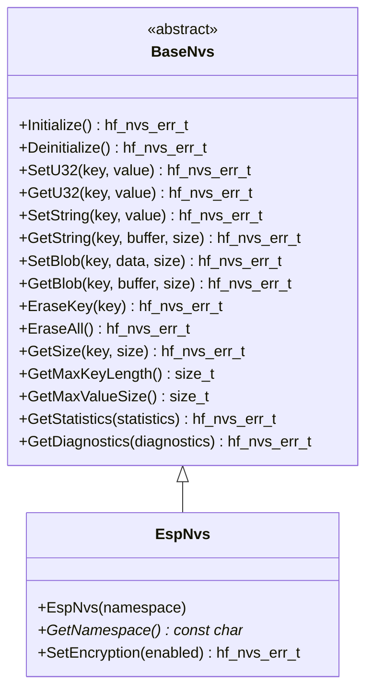

# 💾 BaseNvs API Reference
**🎯 Unified Non-Volatile Storage abstraction for all persistent data operations**
## 📚 **Table of Contents**

- [🎯 **Overview**](#-overview)
- [🏗️ **Class Hierarchy**](#-class-hierarchy)
- [📋 **Error Codes**](#-error-codes)
- [🔧 **Core API**](#-core-api)
- [📊 **Data Structures**](#-data-structures)
- [📊 **Usage Examples**](#-usage-examples)
- [🧪 **Best Practices**](#-best-practices)

---

## 🎯 **Overview**

The `BaseNvs` class provides a comprehensive non-volatile storage abstraction that serves as the
unified interface for all persistent data operations in the HardFOC system.
It supports key-value storage, multiple data types, namespaces,
and works across different storage implementations.

### ✨ **Key Features**

- 💾 **Key-Value Storage** - Simple and efficient key-value pairs
- 📝 **Multiple Data Types** - uint32_t, strings, binary blobs
- 🗂️ **Namespace Support** - Organized storage with namespaces
- 🔒 **Atomic Operations** - Safe concurrent access
- 🛡️ **Robust Error Handling** - Comprehensive validation and error reporting
- 🔌 **Platform Agnostic** - Works with flash, EEPROM, and other storage
- 📊 **Statistics & Diagnostics** - Built-in monitoring and health reporting
- 🧵 **Thread Safe** - Designed for multi-threaded applications

### 📊 **Supported Hardware**

| Implementation | Hardware Type | Capacity | Features | Use Cases |

|----------------|---------------|----------|----------|-----------|

| `EspNvs` | ESP32-C6 Flash | Up to 1MB | Encryption, wear leveling | Configuration, logs |

---

## 🏗️ **Class Hierarchy**



---

## 📋 **Error Codes**

The NVS system uses comprehensive error codes for robust error handling:

### ✅ **Success Codes**

| Code | Value | Description |

|------|-------|-------------|

| `NVS_SUCCESS` | 0 | ✅ Operation completed successfully |

### ❌ **General Error Codes**

| Code | Value | Description | Resolution |

|------|-------|-------------|------------|

| `NVS_ERR_FAILURE` | 1 | ❌ General operation failure | Check hardware and configuration |

| `NVS_ERR_NOT_INITIALIZED` | 2 | ⚠️ NVS not initialized | Call Initialize() first |

| `NVS_ERR_ALREADY_INITIALIZED` | 3 | ⚠️ NVS already initialized | Check initialization state |

| `NVS_ERR_INVALID_PARAMETER` | 4 | 🚫 Invalid parameter | Validate input parameters |

| `NVS_ERR_NULL_POINTER` | 5 | 🚫 Null pointer provided | Check pointer validity |

| `NVS_ERR_OUT_OF_MEMORY` | 6 | 💾 Memory allocation failed | Check system memory |

### 🔑 **Storage Error Codes**

| Code | Value | Description | Resolution |

|------|-------|-------------|------------|

| `NVS_ERR_KEY_NOT_FOUND` | 7 | 🔍 Key not found | Check key name or create key first |

| `NVS_ERR_KEY_TOO_LONG` | 8 | 📏 Key too long | Use shorter key name |

| `NVS_ERR_VALUE_TOO_LARGE` | 9 | 📊 Value too large | Check storage capacity |

| `NVS_ERR_NAMESPACE_NOT_FOUND` | 10 | 🗂️ Namespace not found | Create namespace first |

| `NVS_ERR_STORAGE_FULL` | 11 | 📦 Storage full | Free space or use larger storage |

| `NVS_ERR_INVALID_DATA` | 12 | ❌ Invalid data | Check data format |

| `NVS_ERR_READ_ONLY` | 13 | 📖 Read only mode | Check write permissions |

| `NVS_ERR_CORRUPTED` | 14 | 💥 Data corrupted | Re-initialize storage |

### 🔐 **Encryption Error Codes**

| Code | Value | Description | Resolution |

|------|-------|-------------|------------|

| `NVS_ERR_ENCRYPTION_FAILED` | 15 | 🔐 Encryption operation failed | Check encryption keys |

| `NVS_ERR_DECRYPTION_FAILED` | 16 | 🔓 Decryption operation failed | Check encryption keys |

| `NVS_ERR_ENCRYPTION_NOT_CONFIGURED` | 17 | ⚙️ Encryption not configured | Configure encryption |

| `NVS_ERR_ENCRYPTION_NOT_SUPPORTED` | 18 | 🚫 Encryption not supported | Use different storage |

| `NVS_ERR_KEY_PARTITION_CORRUPTED` | 19 | 💥 Key partition corrupted | Re-initialize encryption |

| `NVS_ERR_WRONG_ENCRYPTION_SCHEME` | 20 | 🔐 Wrong encryption scheme | Use correct encryption |

### 🔧 **System Error Codes**

| Code | Value | Description | Resolution |

|------|-------|-------------|------------|

| `NVS_ERR_VERSION_MISMATCH` | 21 | 📊 Version mismatch | Update storage format |

| `NVS_ERR_NO_FREE_PAGES` | 22 | 📄 No free pages | Free space or reinitialize |

| `NVS_ERR_PARTITION_NOT_FOUND` | 23 | 🗂️ Partition not found | Check partition configuration |

| `NVS_ERR_ITERATOR_INVALID` | 24 | 🔄 Iterator invalid | Restart iteration |

| `NVS_ERR_SECURITY_VIOLATION` | 25 | 🚫 Security policy violation | Check access permissions |

| `NVS_ERR_UNSUPPORTED_OPERATION` | 26 | 🚫 Unsupported operation | Check hardware capabilities |

---

## 🔧 **Core API**

### 🏗️ **Initialization Methods**

```cpp
/**
 * @brief Initialize the NVS storage system
 * @return hf_nvs_err_t error code
 * 
 * 📝 Sets up storage hardware, opens namespace, and prepares for operations.
 * Must be called before any storage operations.
 * 
 * @example
 * EspNvs nvs("config");
 * if (nvs.Initialize() == hf_nvs_err_t::NVS_SUCCESS) {
 *     // NVS ready for use
 * }
 */
virtual hf_nvs_err_t Initialize() noexcept = 0;

/**
 * @brief Deinitialize the NVS storage system
 * @return hf_nvs_err_t error code
 * 
 * 🧹 Cleanly shuts down storage and closes namespace.
 */
virtual hf_nvs_err_t Deinitialize() noexcept = 0;

/**
 * @brief Check if NVS is initialized
 * @return true if initialized, false otherwise
 * 
 * ❓ Query initialization status without side effects.
 */
bool IsInitialized() const noexcept;

/**
 * @brief Ensure NVS is initialized (lazy initialization)
 * @return true if initialized successfully, false otherwise
 * 
 * 🔄 Automatically initializes NVS if not already initialized.
 */
bool EnsureInitialized();

/**
 * @brief Ensure NVS is deinitialized (lazy deinitialization)
 * @return true if deinitialized successfully, false otherwise
 * 
 * 🔄 Automatically deinitializes NVS if currently initialized.
 */
bool EnsureDeinitialized();
```

### 🔢 **Integer Storage Methods**

```cpp
/**
 * @brief Store 32-bit unsigned integer
 * @param key Storage key (null-terminated string)
 * @param value Value to store
 * @return hf_nvs_err_t error code
 * 
 * 💾 Stores a 32-bit unsigned integer value.
 * 
 * @example
 * hf_nvs_err_t result = nvs.SetU32("boot_count", 42);
 * if (result != hf_nvs_err_t::NVS_SUCCESS) {
 *     printf("Store failed: %s\n", HfNvsErrToString(result));
 * }
 */
virtual hf_nvs_err_t SetU32(const char *key, uint32_t value) noexcept = 0;

/**
 * @brief Retrieve 32-bit unsigned integer
 * @param key Storage key (null-terminated string)
 * @param value Reference to store retrieved value
 * @return hf_nvs_err_t error code
 * 
 * 📖 Retrieves a 32-bit unsigned integer value.
 * 
 * @example
 * uint32_t boot_count;
 * hf_nvs_err_t result = nvs.GetU32("boot_count", boot_count);
 * if (result == hf_nvs_err_t::NVS_SUCCESS) {
 *     printf("Boot count: %u\n", boot_count);
 * } else if (result == hf_nvs_err_t::NVS_ERR_KEY_NOT_FOUND) {
 *     printf("Boot count not found, using default\n");
 *     boot_count = 0;
 * }
 */
virtual hf_nvs_err_t GetU32(const char *key, uint32_t &value) noexcept = 0;
```

### 📝 **String Storage Methods**

```cpp
/**
 * @brief Store string value
 * @param key Storage key (null-terminated string)
 * @param value String value to store
 * @return hf_nvs_err_t error code
 * 
 * 💾 Stores a null-terminated string value.
 * 
 * @example
 * hf_nvs_err_t result = nvs.SetString("device_name", "MyDevice");
 * if (result != hf_nvs_err_t::NVS_SUCCESS) {
 *     printf("String store failed: %s\n", HfNvsErrToString(result));
 * }
 */
virtual hf_nvs_err_t SetString(const char *key, const char *value) noexcept = 0;

/**
 * @brief Retrieve string value
 * @param key Storage key (null-terminated string)
 * @param buffer Buffer to store retrieved string
 * @param buffer_size Size of the buffer in bytes
 * @param actual_size Actual size of the string (optional)
 * @return hf_nvs_err_t error code
 * 
 * 📖 Retrieves a string value.
 * 
 * @example
 * char device_name[32];
 * size_t actual_size;
 * hf_nvs_err_t result = nvs.GetString("device_name", device_name, sizeof(device_name), &actual_size);
 * if (result == hf_nvs_err_t::NVS_SUCCESS) {
 *     printf("Device name: %s (length: %zu)\n", device_name, actual_size);
 * }
 */
virtual hf_nvs_err_t GetString(const char *key, char *buffer, size_t buffer_size,
                             size_t *actual_size = nullptr) noexcept = 0;
```

### 📦 **Binary Blob Storage Methods**

```cpp
/**
 * @brief Store binary data (blob)
 * @param key Storage key (null-terminated string)
 * @param data Pointer to data to store
 * @param data_size Size of data in bytes
 * @return hf_nvs_err_t error code
 * 
 * 💾 Stores binary data of any size.
 * 
 * @example
 * uint8_t config_data[] = {0x01, 0x02, 0x03, 0x04};
 * hf_nvs_err_t result = nvs.SetBlob("config", config_data, sizeof(config_data));
 * if (result != hf_nvs_err_t::NVS_SUCCESS) {
 *     printf("Blob store failed: %s\n", HfNvsErrToString(result));
 * }
 */
virtual hf_nvs_err_t SetBlob(const char *key, const void *data, size_t data_size) noexcept = 0;

/**
 * @brief Retrieve binary data (blob)
 * @param key Storage key (null-terminated string)
 * @param buffer Buffer to store retrieved data
 * @param buffer_size Size of the buffer in bytes
 * @param actual_size Actual size of the data (optional)
 * @return hf_nvs_err_t error code
 * 
 * 📖 Retrieves binary data.
 * 
 * @example
 * uint8_t config_data[64];
 * size_t actual_size;
 * hf_nvs_err_t result = nvs.GetBlob("config", config_data, sizeof(config_data), &actual_size);
 * if (result == hf_nvs_err_t::NVS_SUCCESS) {
 *     printf("Config data size: %zu bytes\n", actual_size);
 *     for (size_t i = 0; i < actual_size; i++) {
 *         printf("%02X ", config_data[i]);
 *     }
 *     printf("\n");
 * }
 */
virtual hf_nvs_err_t GetBlob(const char *key, void *buffer, size_t buffer_size,
                           size_t *actual_size = nullptr) noexcept = 0;
```

### 🗑️ **Data Management Methods**

```cpp
/**
 * @brief Erase specific key
 * @param key Storage key to erase
 * @return hf_nvs_err_t error code
 * 
 * 🗑️ Removes a specific key-value pair from storage.
 * 
 * @example
 * hf_nvs_err_t result = nvs.EraseKey("obsolete_config");
 * if (result == hf_nvs_err_t::NVS_SUCCESS) {
 *     printf("Key erased successfully\n");
 * }
 */
virtual hf_nvs_err_t EraseKey(const char *key) noexcept = 0;

/**
 * @brief Erase all data in namespace
 * @return hf_nvs_err_t error code
 * 
 * 🗑️ Removes all key-value pairs in the current namespace.
 * 
 * @example
 * hf_nvs_err_t result = nvs.EraseAll();
 * if (result == hf_nvs_err_t::NVS_SUCCESS) {
 *     printf("All data erased successfully\n");
 * }
 */
virtual hf_nvs_err_t EraseAll() noexcept = 0;

/**
 * @brief Get size of stored value
 * @param key Storage key
 * @param size Reference to store size
 * @return hf_nvs_err_t error code
 * 
 * 📊 Gets the size of a stored value without reading it.
 * 
 * @example
 * size_t value_size;
 * hf_nvs_err_t result = nvs.GetSize("config", value_size);
 * if (result == hf_nvs_err_t::NVS_SUCCESS) {
 *     printf("Config size: %zu bytes\n", value_size);
 * }
 */
virtual hf_nvs_err_t GetSize(const char *key, size_t &size) noexcept = 0;
```

### 📊 **Information Methods**

```cpp
/**
 * @brief Get maximum key length
 * @return Maximum key length in characters
 * 
 * 📊 Returns the maximum allowed key length for this storage.
 */
virtual size_t GetMaxKeyLength() const noexcept = 0;

/**
 * @brief Get maximum value size
 * @return Maximum value size in bytes
 * 
 * 📊 Returns the maximum allowed value size for this storage.
 */
virtual size_t GetMaxValueSize() const noexcept = 0;
```

### 📈 **Statistics and Diagnostics**

```cpp
/**
 * @brief Reset NVS operation statistics
 * @return hf_nvs_err_t error code
 * 
 * 🔄 Clears all accumulated statistics counters.
 */
virtual hf_nvs_err_t ResetStatistics() noexcept;

/**
 * @brief Reset NVS diagnostic information
 * @return hf_nvs_err_t error code
 * 
 * 🔄 Clears diagnostic information and error counters.
 */
virtual hf_nvs_err_t ResetDiagnostics() noexcept;

/**
 * @brief Get NVS operation statistics
 * @param statistics Reference to store statistics data
 * @return hf_nvs_err_t error code
 * 
 * 📊 Retrieves comprehensive statistics about NVS operations.
 */
virtual hf_nvs_err_t GetStatistics(hf_nvs_statistics_t &statistics) const noexcept;

/**
 * @brief Get NVS diagnostic information
 * @param diagnostics Reference to store diagnostics data
 * @return hf_nvs_err_t error code
 * 
 * 🔍 Retrieves diagnostic information about NVS health and status.
 */
virtual hf_nvs_err_t GetDiagnostics(hf_nvs_diagnostics_t &diagnostics) const noexcept;
```

---

## 📊 **Data Structures**

### 📈 **NVS Statistics Structure**

```cpp
struct hf_nvs_statistics_t {
    uint32_t total_operations;      ///< Total operations performed
    uint32_t total_errors;          ///< Total errors encountered
    uint32_t total_reads;           ///< Total read operations
    uint32_t total_writes;          ///< Total write operations
    uint32_t total_commits;         ///< Total commit operations
    uint32_t total_erases;          ///< Total erase operations
    hf_nvs_err_t last_error;        ///< Last error encountered
    uint32_t last_operation_time_us; ///< Time of last operation
    uint32_t successful_ops;        ///< Successful operations
    uint32_t failed_ops;            ///< Failed operations
    uint32_t bytes_written;         ///< Total bytes written
    uint32_t bytes_read;            ///< Total bytes read
};
```

### 🔍 **NVS Diagnostics Structure**

```cpp
struct hf_nvs_diagnostics_t {
    hf_nvs_err_t last_error;        ///< Last error encountered
    uint32_t consecutive_errors;    ///< Consecutive error count
    bool storage_healthy;           ///< Storage health status
    uint32_t system_uptime_ms;      ///< System uptime in milliseconds
};
```

---

## 📊 **Usage Examples**

### 🔧 **Configuration Storage**

```cpp
#include "mcu/esp32/EspNvs.h"

class ConfigurationManager {
private:
    EspNvs config_nvs*;
    
public:
    ConfigurationManager() : config_nvs*("config") {}
    
    bool initialize() {
        return config_nvs*.EnsureInitialized();
    }
    
    bool save_device_config(const DeviceConfig& config) {
        // Store individual values
        hf_nvs_err_t result = config_nvs*.SetU32("device_id", config.device_id);
        if (result != hf_nvs_err_t::NVS_SUCCESS) {
            printf("❌ Failed to save device_id: %s\n", HfNvsErrToString(result));
            return false;
        }
        
        result = config_nvs*.SetString("device_name", config.device_name.c_str());
        if (result != hf_nvs_err_t::NVS_SUCCESS) {
            printf("❌ Failed to save device_name: %s\n", HfNvsErrToString(result));
            return false;
        }
        
        result = config_nvs*.SetU32("baud_rate", config.baud_rate);
        if (result != hf_nvs_err_t::NVS_SUCCESS) {
            printf("❌ Failed to save baud_rate: %s\n", HfNvsErrToString(result));
            return false;
        }
        
        printf("✅ Device configuration saved successfully\n");
        return true;
    }
    
    bool load_device_config(DeviceConfig& config) {
        // Load individual values with defaults
        uint32_t device_id;
        hf_nvs_err_t result = config_nvs*.GetU32("device_id", device_id);
        if (result == hf_nvs_err_t::NVS_SUCCESS) {
            config.device_id = device_id;
        } else if (result == hf_nvs_err_t::NVS_ERR_KEY_NOT_FOUND) {
            config.device_id = 1;  // Default value
            printf("⚠️ Using default device_id: %u\n", config.device_id);
        } else {
            printf("❌ Failed to load device_id: %s\n", HfNvsErrToString(result));
            return false;
        }
        
        char device_name[32];
        size_t name_size;
        result = config_nvs*.GetString("device_name", device_name, sizeof(device_name), &name_size);
        if (result == hf_nvs_err_t::NVS_SUCCESS) {
            config.device_name = std::string(device_name, name_size);
        } else if (result == hf_nvs_err_t::NVS_ERR_KEY_NOT_FOUND) {
            config.device_name = "DefaultDevice";  // Default value
            printf("⚠️ Using default device_name: %s\n", config.device_name.c_str());
        } else {
            printf("❌ Failed to load device_name: %s\n", HfNvsErrToString(result));
            return false;
        }
        
        uint32_t baud_rate;
        result = config_nvs*.GetU32("baud_rate", baud_rate);
        if (result == hf_nvs_err_t::NVS_SUCCESS) {
            config.baud_rate = baud_rate;
        } else if (result == hf_nvs_err_t::NVS_ERR_KEY_NOT_FOUND) {
            config.baud_rate = 115200;  // Default value
            printf("⚠️ Using default baud_rate: %u\n", config.baud_rate);
        } else {
            printf("❌ Failed to load baud_rate: %s\n", HfNvsErrToString(result));
            return false;
        }
        
        printf("✅ Device configuration loaded successfully\n");
        return true;
    }
    
    void print_config_info() {
        printf("📊 Configuration Storage Info:\n");
        printf("  Max key length: %zu characters\n", config_nvs*.GetMaxKeyLength());
        printf("  Max value size: %zu bytes\n", config_nvs*.GetMaxValueSize());
        
        // Print statistics
        hf_nvs_statistics_t stats;
        if (config_nvs*.GetStatistics(stats) == hf_nvs_err_t::NVS_SUCCESS) {
            printf("  Total operations: %u\n", stats.total_operations);
            printf("  Successful operations: %u\n", stats.successful_ops);
            printf("  Failed operations: %u\n", stats.failed_ops);
            printf("  Bytes written: %u\n", stats.bytes_written);
            printf("  Bytes read: %u\n", stats.bytes_read);
        }
    }
};

struct DeviceConfig {
    uint32_t device_id;
    std::string device_name;
    uint32_t baud_rate;
};
```

### 📊 **Calibration Data Storage**

```cpp
#include "mcu/esp32/EspNvs.h"

class CalibrationManager {
private:
    EspNvs calib_nvs*;
    
public:
    CalibrationManager() : calib_nvs*("calibration") {}
    
    bool initialize() {
        return calib_nvs*.EnsureInitialized();
    }
    
    bool save_adc_calibration(const AdcCalibration& calib) {
        // Store calibration data as blob
        hf_nvs_err_t result = calib_nvs*.SetBlob("adc_calib", &calib, sizeof(calib));
        if (result != hf_nvs_err_t::NVS_SUCCESS) {
            printf("❌ Failed to save ADC calibration: %s\n", HfNvsErrToString(result));
            return false;
        }
        
        // Store calibration timestamp
        uint32_t timestamp = static_cast<uint32_t>(time(nullptr));
        result = calib_nvs*.SetU32("adc_calib_time", timestamp);
        if (result != hf_nvs_err_t::NVS_SUCCESS) {
            printf("❌ Failed to save calibration timestamp: %s\n", HfNvsErrToString(result));
            return false;
        }
        
        printf("✅ ADC calibration saved successfully\n");
        return true;
    }
    
    bool load_adc_calibration(AdcCalibration& calib) {
        // Check if calibration exists
        size_t calib_size;
        hf_nvs_err_t result = calib_nvs*.GetSize("adc_calib", calib_size);
        if (result != hf_nvs_err_t::NVS_SUCCESS) {
            printf("❌ Calibration not found\n");
            return false;
        }
        
        if (calib_size != sizeof(AdcCalibration)) {
            printf("❌ Calibration size mismatch: expected %zu, got %zu\n", 
                   sizeof(AdcCalibration), calib_size);
            return false;
        }
        
        // Load calibration data
        result = calib_nvs*.GetBlob("adc_calib", &calib, sizeof(calib));
        if (result != hf_nvs_err_t::NVS_SUCCESS) {
            printf("❌ Failed to load ADC calibration: %s\n", HfNvsErrToString(result));
            return false;
        }
        
        // Load and check timestamp
        uint32_t timestamp;
        result = calib_nvs*.GetU32("adc_calib_time", timestamp);
        if (result == hf_nvs_err_t::NVS_SUCCESS) {
            uint32_t current_time = static_cast<uint32_t>(time(nullptr));
            uint32_t age_days = (current_time - timestamp) / (24 * 3600);
            printf("✅ ADC calibration loaded (age: %u days)\n", age_days);
            
            if (age_days > 30) {
                printf("⚠️ Calibration is old (%u days), consider re-calibration\n", age_days);
            }
        }
        
        return true;
    }
    
    bool is_calibration_valid() {
        size_t calib_size;
        hf_nvs_err_t result = calib_nvs*.GetSize("adc_calib", calib_size);
        return (result == hf_nvs_err_t::NVS_SUCCESS && calib_size == sizeof(AdcCalibration));
    }
    
    void clear_calibration() {
        calib_nvs*.EraseKey("adc_calib");
        calib_nvs*.EraseKey("adc_calib_time");
        printf("🗑️ Calibration data cleared\n");
    }
};

struct AdcCalibration {
    float gain_coefficients[8];
    float offset_coefficients[8];
    float temperature_coefficient;
    uint32_t calibration_date;
    uint16_t checksum;
};
```

### 📝 **Log Storage**

```cpp
#include "mcu/esp32/EspNvs.h"

class LogManager {
private:
    EspNvs log_nvs*;
    uint32_t log_index*;
    
public:
    LogManager() : log_nvs*("logs"), log_index*(0) {}
    
    bool initialize() {
        if (!log_nvs*.EnsureInitialized()) {
            return false;
        }
        
        // Load current log index
        hf_nvs_err_t result = log_nvs*.GetU32("log_index", log_index*);
        if (result == hf_nvs_err_t::NVS_ERR_KEY_NOT_FOUND) {
            log_index* = 0;  // Start from beginning
        } else if (result != hf_nvs_err_t::NVS_SUCCESS) {
            printf("❌ Failed to load log index: %s\n", HfNvsErrToString(result));
            return false;
        }
        
        return true;
    }
    
    bool add_log_entry(const char* message) {
        char key[16];
        snprintf(key, sizeof(key), "log*%u", log_index*);
        
        // Store log message
        hf_nvs_err_t result = log_nvs*.SetString(key, message);
        if (result != hf_nvs_err_t::NVS_SUCCESS) {
            printf("❌ Failed to store log entry: %s\n", HfNvsErrToString(result));
            return false;
        }
        
        // Increment and save log index
        log_index*++;
        result = log_nvs*.SetU32("log_index", log_index*);
        if (result != hf_nvs_err_t::NVS_SUCCESS) {
            printf("❌ Failed to update log index: %s\n", HfNvsErrToString(result));
            return false;
        }
        
        printf("✅ Log entry %u stored: %s\n", log_index* - 1, message);
        return true;
    }
    
    void print_recent_logs(uint32_t count = 10) {
        printf("📝 Recent Log Entries:\n");
        printf("=====================\n");
        
        uint32_t start_index = (log_index* > count) ? (log_index* - count) : 0;
        
        for (uint32_t i = start_index; i < log_index*; i++) {
            char key[16];
            snprintf(key, sizeof(key), "log*%u", i);
            
            char message[128];
            hf_nvs_err_t result = log_nvs*.GetString(key, message, sizeof(message));
            if (result == hf_nvs_err_t::NVS_SUCCESS) {
                printf("[%u] %s\n", i, message);
            } else {
                printf("[%u] <log entry not found>\n", i);
            }
        }
    }
    
    void clear_logs() {
        // Erase all log entries
        for (uint32_t i = 0; i < log_index*; i++) {
            char key[16];
            snprintf(key, sizeof(key), "log*%u", i);
            log_nvs*.EraseKey(key);
        }
        
        // Reset log index
        log_index* = 0;
        log_nvs*.SetU32("log_index", log_index*);
        
        printf("🗑️ All logs cleared\n");
    }
    
    uint32_t get_log_count() const {
        return log_index*;
    }
};
```

### 🔐 **Encrypted Storage (ESP32)**

```cpp
#include "mcu/esp32/EspNvs.h"

class SecureStorage {
private:
    EspNvs secure_nvs*;
    
public:
    SecureStorage() : secure_nvs*("secure") {}
    
    bool initialize() {
        if (!secure_nvs*.EnsureInitialized()) {
            return false;
        }
        
        // Enable encryption if supported
        hf_nvs_err_t result = secure_nvs*.SetEncryption(true);
        if (result == hf_nvs_err_t::NVS_SUCCESS) {
            printf("✅ Encryption enabled\n");
        } else if (result == hf_nvs_err_t::NVS_ERR_ENCRYPTION_NOT_SUPPORTED) {
            printf("⚠️ Encryption not supported on this storage\n");
        } else {
            printf("❌ Failed to enable encryption: %s\n", HfNvsErrToString(result));
            return false;
        }
        
        return true;
    }
    
    bool store_credentials(const char* username, const char* password) {
        // Store username
        hf_nvs_err_t result = secure_nvs*.SetString("username", username);
        if (result != hf_nvs_err_t::NVS_SUCCESS) {
            printf("❌ Failed to store username: %s\n", HfNvsErrToString(result));
            return false;
        }
        
        // Store password
        result = secure_nvs*.SetString("password", password);
        if (result != hf_nvs_err_t::NVS_SUCCESS) {
            printf("❌ Failed to store password: %s\n", HfNvsErrToString(result));
            return false;
        }
        
        printf("✅ Credentials stored securely\n");
        return true;
    }
    
    bool load_credentials(char* username, size_t username_size, 
                         char* password, size_t password_size) {
        // Load username
        hf_nvs_err_t result = secure_nvs*.GetString("username", username, username_size);
        if (result != hf_nvs_err_t::NVS_SUCCESS) {
            printf("❌ Failed to load username: %s\n", HfNvsErrToString(result));
            return false;
        }
        
        // Load password
        result = secure_nvs*.GetString("password", password, password_size);
        if (result != hf_nvs_err_t::NVS_SUCCESS) {
            printf("❌ Failed to load password: %s\n", HfNvsErrToString(result));
            return false;
        }
        
        printf("✅ Credentials loaded successfully\n");
        return true;
    }
    
    void clear_credentials() {
        secure_nvs*.EraseKey("username");
        secure_nvs*.EraseKey("password");
        printf("🗑️ Credentials cleared\n");
    }
};
```

---

## 🧪 **Best Practices**

### ✅ **Recommended Patterns**

```cpp
// ✅ Always check initialization
if (!nvs.EnsureInitialized()) {
    printf("❌ NVS initialization failed\n");
    return false;
}

// ✅ Use appropriate error handling
uint32_t value;
hf_nvs_err_t result = nvs.GetU32("key", value);
if (result == hf_nvs_err_t::NVS_SUCCESS) {
    // Use the value
} else if (result == hf_nvs_err_t::NVS_ERR_KEY_NOT_FOUND) {
    // Key doesn't exist, use default
    value = default_value;
} else {
    printf("❌ NVS Error: %s\n", HfNvsErrToString(result));
    return false;
}

// ✅ Check data sizes before operations
size_t required_size;
if (nvs.GetSize("key", required_size) == hf_nvs_err_t::NVS_SUCCESS) {
    if (required_size > buffer_size) {
        printf("❌ Buffer too small, need %zu bytes\n", required_size);
        return false;
    }
}

// ✅ Use namespaces for organization
EspNvs config_nvs("config");
EspNvs calib_nvs("calibration");
EspNvs logs_nvs("logs");

// ✅ Validate data integrity
uint16_t stored_checksum;
if (nvs.GetU32("checksum", stored_checksum) == hf_nvs_err_t::NVS_SUCCESS) {
    uint16_t calculated_checksum = calculate_checksum(data, size);
    if (stored_checksum != calculated_checksum) {
        printf("❌ Data integrity check failed\n");
        return false;
    }
}

// ✅ Monitor storage health
hf_nvs_statistics_t stats;
if (nvs.GetStatistics(stats) == hf_nvs_err_t::NVS_SUCCESS) {
    if (stats.failed_ops > 10) {
        printf("⚠️ High NVS failure rate detected\n");
    }
}
```

### ❌ **Common Pitfalls**

```cpp
// ❌ Don't ignore initialization
nvs.SetU32("key", value);  // May fail silently

// ❌ Don't ignore error codes
nvs.GetString("key", buffer, size);  // Error handling missing

// ❌ Don't assume key exists
uint32_t value = nvs.GetU32("key");  // May return garbage

// ❌ Don't use without checking buffer sizes
char buffer[16];
nvs.GetString("key", buffer, sizeof(buffer));  // May truncate

// ❌ Don't store sensitive data unencrypted
nvs.SetString("password", "secret");  // Use encrypted storage

// ❌ Don't ignore storage capacity
// Check available space before large writes
```

### 🎯 **Performance Optimization**

```cpp
// 🚀 Use appropriate data types
// Use uint32_t for small integers
// Use blobs for large data structures
// Use strings for text data

// 🚀 Minimize write operations
// Batch related data together
// Use atomic operations where possible

// 🚀 Use appropriate key names
// Keep keys short but descriptive
// Use consistent naming conventions

// 🚀 Monitor storage usage
hf_nvs_statistics_t stats;
nvs.GetStatistics(stats);
if (stats.bytes_written > max_storage_bytes) {
    printf("⚠️ Storage usage high: %u bytes\n", stats.bytes_written);
}

// 🚀 Use encryption for sensitive data
// Enable encryption when available
// Store encryption keys securely

// 🚀 Implement data validation
// Use checksums for data integrity
// Validate data ranges and formats
```

---

## 🔗 **Related Documentation**

- [⚙️ **EspNvs**](../esp_api/EspNvs.md) - ESP32-C6 implementation
- [🎯 **Hardware Types**](HardwareTypes.md) - Platform-agnostic types

---
**💾 BaseNvs - The Foundation of Persistent Storage in HardFOC**

*Part of the HardFOC Internal Interface Wrapper Documentation*

 
