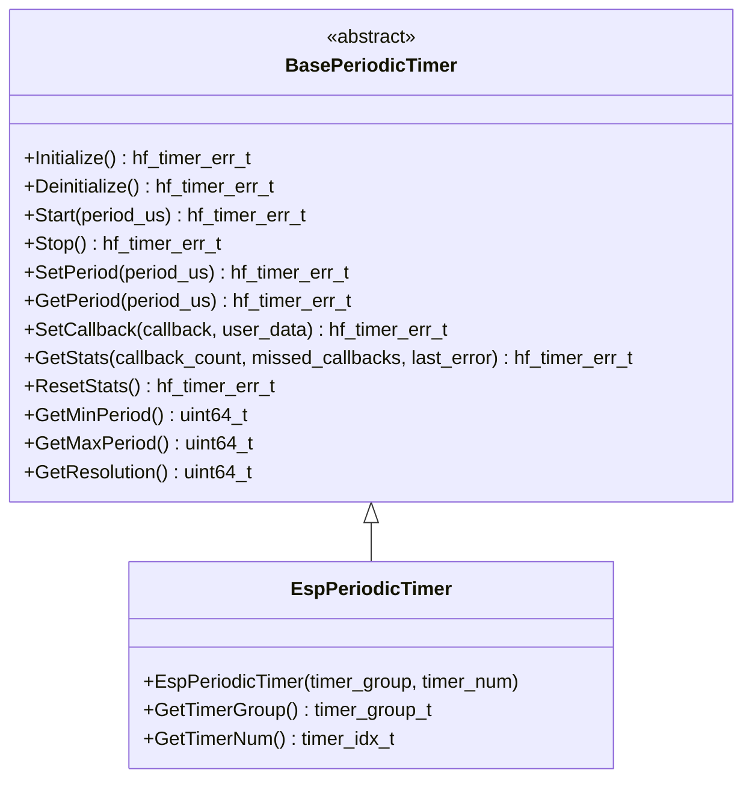

# ⏰ BasePeriodicTimer API Reference

<div align="center">


**🎯 Unified periodic timer abstraction for all high-precision timing operations**

</div>

---

## 📚 **Table of Contents**

- [🎯 **Overview**](#-overview)
- [🏗️ **Class Hierarchy**](#️-class-hierarchy)
- [📋 **Error Codes**](#-error-codes)
- [🔧 **Core API**](#-core-api)
- [📊 **Data Structures**](#-data-structures)
- [📊 **Usage Examples**](#-usage-examples)
- [🧪 **Best Practices**](#-best-practices)

---

## 🎯 **Overview**

The `BasePeriodicTimer` class provides a comprehensive periodic timer abstraction that serves as the unified interface for all high-precision timing operations in the HardFOC system. It supports microsecond resolution, callback-based notifications, and works across different timer implementations.

### ✨ **Key Features**

- ⏰ **Microsecond Resolution** - High-precision timing down to microseconds
- 📞 **Callback Support** - Event-driven timer notifications
- 🔄 **Dynamic Period Control** - Change period during operation
- 🛡️ **Robust Error Handling** - Comprehensive validation and error reporting
- 🔌 **Platform Agnostic** - Works with hardware and software timers
- 📊 **Statistics & Diagnostics** - Built-in monitoring and health reporting
- 🧵 **Thread Safe** - Designed for multi-threaded applications
- ⚡ **Low Overhead** - Optimized for real-time applications

### 📊 **Supported Hardware**

| Implementation | Hardware Type | Resolution | Max Period | Features | Use Cases |
|----------------|---------------|------------|------------|----------|-----------|
| `EspPeriodicTimer` | ESP32-C6 Hardware | 1 μs | 8.5 hours | Multiple channels, DMA | Control loops, sampling |

---

## 🏗️ **Class Hierarchy**



---

## 📋 **Error Codes**

The timer system uses comprehensive error codes for robust error handling:

### ✅ **Success Codes**

| Code | Value | Description |
|------|-------|-------------|
| `TIMER_SUCCESS` | 0 | ✅ Operation completed successfully |

### ❌ **General Error Codes**

| Code | Value | Description | Resolution |
|------|-------|-------------|------------|
| `TIMER_ERR_FAILURE` | 1 | ❌ General operation failure | Check hardware and configuration |
| `TIMER_ERR_NOT_INITIALIZED` | 2 | ⚠️ Timer not initialized | Call Initialize() first |
| `TIMER_ERR_ALREADY_INITIALIZED` | 3 | ⚠️ Timer already initialized | Check initialization state |
| `TIMER_ERR_INVALID_PARAMETER` | 4 | 🚫 Invalid parameter | Validate input parameters |
| `TIMER_ERR_NULL_POINTER` | 5 | 🚫 Null pointer provided | Check pointer validity |
| `TIMER_ERR_OUT_OF_MEMORY` | 6 | 💾 Memory allocation failed | Check system memory |

### ⏰ **Timer-Specific Error Codes**

| Code | Value | Description | Resolution |
|------|-------|-------------|------------|
| `TIMER_ERR_ALREADY_RUNNING` | 7 | 🔄 Timer already running | Stop timer first |
| `TIMER_ERR_NOT_RUNNING` | 8 | ⏸️ Timer not running | Start timer first |
| `TIMER_ERR_INVALID_PERIOD` | 9 | 📊 Invalid period | Use valid period range |
| `TIMER_ERR_RESOURCE_BUSY` | 10 | 🔄 Timer resource busy | Wait or use different timer |
| `TIMER_ERR_HARDWARE_FAULT` | 11 | 💥 Hardware fault | Check hardware connections |
| `TIMER_ERR_UNSUPPORTED_OPERATION` | 12 | 🚫 Unsupported operation | Check hardware capabilities |

---

## 🔧 **Core API**

### 🏗️ **Initialization Methods**

```cpp
/**
 * @brief Initialize the timer hardware/resources
 * @return hf_timer_err_t error code
 * 
 * 📝 Sets up timer hardware, configures callbacks, and prepares for operation.
 * Must be called before any timer operations.
 * 
 * @example
 * EspPeriodicTimer timer(TIMER_GROUP_0, TIMER_0);
 * if (timer.Initialize() == hf_timer_err_t::TIMER_SUCCESS) {
 *     // Timer ready for use
 * }
 */
virtual hf_timer_err_t Initialize() noexcept = 0;

/**
 * @brief Deinitialize the timer and free resources
 * @return hf_timer_err_t error code
 * 
 * 🧹 Cleanly shuts down timer hardware and releases resources.
 */
virtual hf_timer_err_t Deinitialize() noexcept = 0;

/**
 * @brief Check if timer is initialized
 * @return true if initialized, false otherwise
 * 
 * ❓ Query initialization status without side effects.
 */
bool IsInitialized() const noexcept;

/**
 * @brief Check if timer is currently running
 * @return true if running, false otherwise
 * 
 * ❓ Query running status without side effects.
 */
bool IsRunning() const noexcept;
```

### ⏰ **Timer Control Methods**

```cpp
/**
 * @brief Start the periodic timer with specified period
 * @param period_us Timer period in microseconds
 * @return hf_timer_err_t error code
 * 
 * ⏰ Starts the timer with the specified period.
 * Callback will be invoked at each period.
 * 
 * @example
 * hf_timer_err_t result = timer.Start(1000000);  // 1 second period
 * if (result != hf_timer_err_t::TIMER_SUCCESS) {
 *     printf("Timer start failed: %s\n", HfTimerErrToString(result));
 * }
 */
virtual hf_timer_err_t Start(uint64_t period_us) noexcept = 0;

/**
 * @brief Stop the periodic timer
 * @return hf_timer_err_t error code
 * 
 * ⏸️ Stops the timer and cancels all pending callbacks.
 * 
 * @example
 * hf_timer_err_t result = timer.Stop();
 * if (result == hf_timer_err_t::TIMER_SUCCESS) {
 *     printf("Timer stopped successfully\n");
 * }
 */
virtual hf_timer_err_t Stop() noexcept = 0;

/**
 * @brief Change the timer period while running
 * @param period_us New timer period in microseconds
 * @return hf_timer_err_t error code
 * 
 * 🔄 Changes the timer period without stopping and restarting.
 * 
 * @example
 * // Change from 1 second to 500ms while running
 * timer.SetPeriod(500000);
 */
virtual hf_timer_err_t SetPeriod(uint64_t period_us) noexcept = 0;

/**
 * @brief Get the current timer period
 * @param period_us Reference to store the current period
 * @return hf_timer_err_t error code
 * 
 * 📊 Retrieves the current timer period.
 * 
 * @example
 * uint64_t current_period;
 * if (timer.GetPeriod(current_period) == hf_timer_err_t::TIMER_SUCCESS) {
 *     printf("Current period: %llu μs\n", current_period);
 * }
 */
virtual hf_timer_err_t GetPeriod(uint64_t &period_us) noexcept = 0;
```

### 📞 **Callback Management**

```cpp
/**
 * @brief Set callback function for timer events
 * @param callback Callback function to invoke
 * @param user_data User data to pass to callback (optional)
 * @return hf_timer_err_t error code
 * 
 * 📞 Sets the callback function that will be invoked at each timer period.
 * 
 * @example
 * void on_timer_tick(void* user_data) {
 *     printf("Timer tick! User data: %p\n", user_data);
 *     // Handle timer event
 * }
 * 
 * timer.SetCallback(on_timer_tick, nullptr);
 */
hf_timer_err_t SetCallback(hf_timer_callback_t callback, void *user_data = nullptr) noexcept;

/**
 * @brief Get current user data pointer
 * @return User data pointer
 * 
 * 📊 Returns the user data associated with the timer callback.
 */
void *GetUserData() const noexcept;

/**
 * @brief Check if timer has a valid callback
 * @return true if callback is set, false otherwise
 * 
 * ✅ Checks if a callback function has been set.
 */
bool HasValidCallback() const noexcept;
```

### 📊 **Information Methods**

```cpp
/**
 * @brief Get description of this timer implementation
 * @return Description string
 * 
 * 📝 Returns a human-readable description of this timer implementation.
 */
virtual const char *GetDescription() const noexcept = 0;

/**
 * @brief Get minimum supported timer period
 * @return Minimum period in microseconds
 * 
 * 📊 Returns the minimum supported timer period for this hardware.
 */
virtual uint64_t GetMinPeriod() const noexcept = 0;

/**
 * @brief Get maximum supported timer period
 * @return Maximum period in microseconds
 * 
 * 📊 Returns the maximum supported timer period for this hardware.
 */
virtual uint64_t GetMaxPeriod() const noexcept = 0;

/**
 * @brief Get timer resolution
 * @return Timer resolution in microseconds
 * 
 * 📊 Returns the timer resolution (minimum time increment).
 */
virtual uint64_t GetResolution() const noexcept = 0;
```

### 📈 **Statistics and Diagnostics**

```cpp
/**
 * @brief Get timer statistics and status information
 * @param callback_count Number of callbacks executed
 * @param missed_callbacks Number of missed callbacks (if supported)
 * @param last_error Last error that occurred
 * @return hf_timer_err_t error code
 * 
 * 📊 Retrieves comprehensive statistics about timer operation.
 * 
 * @example
 * uint64_t callback_count, missed_callbacks;
 * hf_timer_err_t last_error;
 * if (timer.GetStats(callback_count, missed_callbacks, last_error) == hf_timer_err_t::TIMER_SUCCESS) {
 *     printf("Callbacks: %llu, Missed: %llu, Last error: %s\n", 
 *            callback_count, missed_callbacks, HfTimerErrToString(last_error));
 * }
 */
virtual hf_timer_err_t GetStats(uint64_t &callback_count, uint64_t &missed_callbacks,
                                hf_timer_err_t &last_error) noexcept = 0;

/**
 * @brief Reset timer statistics
 * @return hf_timer_err_t error code
 * 
 * 🔄 Clears all accumulated statistics counters.
 */
virtual hf_timer_err_t ResetStats() noexcept = 0;

/**
 * @brief Reset timer operation statistics
 * @return hf_timer_err_t error code
 * 
 * 🔄 Clears operation statistics.
 */
virtual hf_timer_err_t ResetStatistics() noexcept;

/**
 * @brief Reset timer diagnostic information
 * @return hf_timer_err_t error code
 * 
 * 🔄 Clears diagnostic information and error counters.
 */
virtual hf_timer_err_t ResetDiagnostics() noexcept;

/**
 * @brief Get timer operation statistics
 * @param statistics Reference to store statistics data
 * @return hf_timer_err_t error code
 * 
 * 📊 Retrieves comprehensive statistics about timer operations.
 */
virtual hf_timer_err_t GetStatistics(hf_timer_statistics_t &statistics) const noexcept;

/**
 * @brief Get timer diagnostic information
 * @param diagnostics Reference to store diagnostics data
 * @return hf_timer_err_t error code
 * 
 * 🔍 Retrieves diagnostic information about timer health and status.
 */
virtual hf_timer_err_t GetDiagnostics(hf_timer_diagnostics_t &diagnostics) const noexcept;
```

---

## 📊 **Data Structures**

### 📞 **Timer Callback Type**

```cpp
using hf_timer_callback_t = std::function<void(void *user_data)>;
```

### 📈 **Timer Statistics Structure**

```cpp
struct hf_timer_statistics_t {
    uint32_t totalStarts;          ///< Total timer starts
    uint32_t totalStops;           ///< Total timer stops
    uint32_t callbackExecutions;   ///< Number of callback executions
    uint32_t missedCallbacks;      ///< Number of missed callbacks
    uint32_t averageCallbackTimeUs; ///< Average callback execution time (microseconds)
    uint32_t maxCallbackTimeUs;    ///< Maximum callback execution time
    uint32_t minCallbackTimeUs;    ///< Minimum callback execution time
    uint64_t totalRunningTimeUs;   ///< Total running time in microseconds
};
```

### 🔍 **Timer Diagnostics Structure**

```cpp
struct hf_timer_diagnostics_t {
    bool timerHealthy;             ///< Overall timer health status
    hf_timer_err_t lastErrorCode;  ///< Last error code
    uint32_t lastErrorTimestamp;   ///< Last error timestamp
    uint32_t consecutiveErrors;    ///< Consecutive error count
    bool timerInitialized;         ///< Timer initialization status
    bool timerRunning;             ///< Timer running status
    uint64_t currentPeriodUs;      ///< Current timer period in microseconds
    uint64_t timerResolutionUs;    ///< Timer resolution in microseconds
};
```

### 📊 **Timer Stats Structure**

```cpp
struct hf_timer_stats_t {
    uint64_t start_count;          ///< Number of timer starts
    uint64_t stop_count;           ///< Number of timer stops
    uint64_t callback_count;       ///< Number of callback executions
    uint64_t missed_callbacks;     ///< Number of missed callbacks
    hf_timer_err_t last_error;     ///< Last error encountered
    hf_timestamp_us_t last_start_us; ///< Timestamp of last start
};
```

---

## 📊 **Usage Examples**

### ⏰ **Basic Periodic Timer**

```cpp
#include "mcu/esp32/EspPeriodicTimer.h"

// Create timer instance
EspPeriodicTimer timer(TIMER_GROUP_0, TIMER_0);

// Timer callback function
void on_timer_tick(void* user_data) {
    static uint32_t tick_count = 0;
    tick_count++;
    
    printf("⏰ Timer tick %u\n", tick_count);
    
    // Perform periodic task
    // e.g., read sensors, update control loops, etc.
}

void setup_timer() {
    // Initialize timer
    if (timer.Initialize() != hf_timer_err_t::TIMER_SUCCESS) {
        printf("❌ Timer initialization failed\n");
        return;
    }
    
    // Set callback function
    timer.SetCallback(on_timer_tick, nullptr);
    
    // Start timer with 1 second period
    hf_timer_err_t result = timer.Start(1000000);  // 1,000,000 μs = 1 second
    if (result == hf_timer_err_t::TIMER_SUCCESS) {
        printf("✅ Timer started successfully\n");
    } else {
        printf("❌ Timer start failed: %s\n", HfTimerErrToString(result));
    }
}

void stop_timer() {
    hf_timer_err_t result = timer.Stop();
    if (result == hf_timer_err_t::TIMER_SUCCESS) {
        printf("✅ Timer stopped successfully\n");
    }
}

void print_timer_info() {
    printf("📊 Timer Information:\n");
    printf("  Description: %s\n", timer.GetDescription());
    printf("  Min period: %llu μs\n", timer.GetMinPeriod());
    printf("  Max period: %llu μs\n", timer.GetMaxPeriod());
    printf("  Resolution: %llu μs\n", timer.GetResolution());
    printf("  Initialized: %s\n", timer.IsInitialized() ? "Yes" : "No");
    printf("  Running: %s\n", timer.IsRunning() ? "Yes" : "No");
}
```

### 🔄 **Control Loop Timer**

```cpp
#include "mcu/esp32/EspPeriodicTimer.h"

class ControlLoop {
private:
    EspPeriodicTimer timer_;
    float setpoint_;
    float current_value_;
    float kp_, ki_, kd_;
    float integral_;
    float last_error_;
    
public:
    ControlLoop() : timer_(TIMER_GROUP_0, TIMER_0), setpoint_(0.0f), current_value_(0.0f),
                    kp_(1.0f), ki_(0.1f), kd_(0.01f), integral_(0.0f), last_error_(0.0f) {}
    
    bool initialize() {
        // Initialize timer
        if (timer_.Initialize() != hf_timer_err_t::TIMER_SUCCESS) {
            printf("❌ Control loop timer initialization failed\n");
            return false;
        }
        
        // Set callback
        timer_.SetCallback([](void* user_data) {
            static_cast<ControlLoop*>(user_data)->control_step();
        }, this);
        
        return true;
    }
    
    void start(float frequency_hz) {
        uint64_t period_us = static_cast<uint64_t>(1000000.0f / frequency_hz);
        
        hf_timer_err_t result = timer_.Start(period_us);
        if (result == hf_timer_err_t::TIMER_SUCCESS) {
            printf("✅ Control loop started at %.1f Hz\n", frequency_hz);
        } else {
            printf("❌ Control loop start failed: %s\n", HfTimerErrToString(result));
        }
    }
    
    void stop() {
        timer_.Stop();
        printf("⏸️ Control loop stopped\n");
    }
    
    void set_setpoint(float setpoint) {
        setpoint_ = setpoint;
    }
    
    void set_current_value(float value) {
        current_value_ = value;
    }
    
    void set_gains(float kp, float ki, float kd) {
        kp_ = kp;
        ki_ = ki;
        kd_ = kd;
        integral_ = 0.0f;  // Reset integral on gain change
    }
    
private:
    void control_step() {
        // Calculate error
        float error = setpoint_ - current_value_;
        
        // PID control
        float proportional = kp_ * error;
        integral_ += ki_ * error;
        float derivative = kd_ * (error - last_error_);
        
        float output = proportional + integral_ + derivative;
        
        // Apply output (example: motor speed)
        apply_control_output(output);
        
        // Update for next iteration
        last_error_ = error;
        
        // Optional: print control info
        static uint32_t step_count = 0;
        if (++step_count % 100 == 0) {  // Print every 100 steps
            printf("🎯 Control - Setpoint: %.2f, Current: %.2f, Output: %.2f\n",
                   setpoint_, current_value_, output);
        }
    }
    
    void apply_control_output(float output) {
        // Apply control output to actuator
        // This is just an example - implement based on your hardware
        printf("⚡ Control output: %.2f\n", output);
    }
};

void control_loop_example() {
    ControlLoop controller;
    
    if (!controller.initialize()) {
        printf("❌ Controller initialization failed\n");
        return;
    }
    
    // Configure control parameters
    controller.set_gains(2.0f, 0.5f, 0.1f);
    controller.set_setpoint(100.0f);
    
    // Start control loop at 100 Hz
    controller.start(100.0f);
    
    // Simulate changing setpoint
    vTaskDelay(pdMS_TO_TICKS(5000));  // Wait 5 seconds
    controller.set_setpoint(200.0f);
    
    vTaskDelay(pdMS_TO_TICKS(5000));  // Wait 5 seconds
    controller.stop();
}
```

### 📊 **High-Frequency Sampling Timer**

```cpp
#include "mcu/esp32/EspPeriodicTimer.h"
#include <vector>

class HighFrequencySampler {
private:
    EspPeriodicTimer timer_;
    std::vector<float> samples_;
    size_t max_samples_;
    bool sampling_active_;
    
public:
    HighFrequencySampler(size_t max_samples = 1000) 
        : timer_(TIMER_GROUP_0, TIMER_0), max_samples_(max_samples), sampling_active_(false) {
        samples_.reserve(max_samples);
    }
    
    bool initialize() {
        if (timer_.Initialize() != hf_timer_err_t::TIMER_SUCCESS) {
            printf("❌ Sampler timer initialization failed\n");
            return false;
        }
        
        timer_.SetCallback([](void* user_data) {
            static_cast<HighFrequencySampler*>(user_data)->sample_data();
        }, this);
        
        return true;
    }
    
    void start_sampling(float frequency_hz) {
        samples_.clear();
        sampling_active_ = true;
        
        uint64_t period_us = static_cast<uint64_t>(1000000.0f / frequency_hz);
        
        hf_timer_err_t result = timer_.Start(period_us);
        if (result == hf_timer_err_t::TIMER_SUCCESS) {
            printf("✅ Sampling started at %.1f Hz\n", frequency_hz);
        } else {
            printf("❌ Sampling start failed: %s\n", HfTimerErrToString(result));
        }
    }
    
    void stop_sampling() {
        sampling_active_ = false;
        timer_.Stop();
        printf("⏸️ Sampling stopped\n");
    }
    
    const std::vector<float>& get_samples() const {
        return samples_;
    }
    
    void print_statistics() {
        if (samples_.empty()) {
            printf("❌ No samples collected\n");
            return;
        }
        
        float sum = 0.0f;
        float min_val = samples_[0];
        float max_val = samples_[0];
        
        for (float sample : samples_) {
            sum += sample;
            min_val = std::min(min_val, sample);
            max_val = std::max(max_val, sample);
        }
        
        float average = sum / samples_.size();
        
        printf("📊 Sampling Statistics:\n");
        printf("  Samples collected: %zu\n", samples_.size());
        printf("  Average: %.3f\n", average);
        printf("  Min: %.3f\n", min_val);
        printf("  Max: %.3f\n", max_val);
        printf("  Range: %.3f\n", max_val - min_val);
    }
    
private:
    void sample_data() {
        if (!sampling_active_) {
            return;
        }
        
        // Simulate reading sensor data
        float sensor_value = read_sensor_value();
        
        if (samples_.size() < max_samples_) {
            samples_.push_back(sensor_value);
        } else {
            // Buffer full, stop sampling
            sampling_active_ = false;
            timer_.Stop();
            printf("📦 Sample buffer full (%zu samples)\n", samples_.size());
        }
    }
    
    float read_sensor_value() {
        // Simulate sensor reading
        // Replace with actual sensor reading code
        static float value = 0.0f;
        value += 0.1f;  // Simulate changing value
        if (value > 10.0f) value = 0.0f;
        return value;
    }
};

void sampling_example() {
    HighFrequencySampler sampler(1000);
    
    if (!sampler.initialize()) {
        printf("❌ Sampler initialization failed\n");
        return;
    }
    
    // Start high-frequency sampling (1 kHz)
    sampler.start_sampling(1000.0f);
    
    // Wait for sampling to complete
    vTaskDelay(pdMS_TO_TICKS(2000));  // Wait 2 seconds
    
    // Stop sampling
    sampler.stop_sampling();
    
    // Print results
    sampler.print_statistics();
}
```

### 🔄 **Dynamic Period Timer**

```cpp
#include "mcu/esp32/EspPeriodicTimer.h"

class AdaptiveTimer {
private:
    EspPeriodicTimer timer_;
    uint64_t current_period_;
    uint64_t min_period_;
    uint64_t max_period_;
    uint32_t load_factor_;
    
public:
    AdaptiveTimer(uint64_t min_period_us = 1000, uint64_t max_period_us = 1000000)
        : timer_(TIMER_GROUP_0, TIMER_0), current_period_(100000), 
          min_period_(min_period_us), max_period_(max_period_us), load_factor_(50) {}
    
    bool initialize() {
        if (timer_.Initialize() != hf_timer_err_t::TIMER_SUCCESS) {
            return false;
        }
        
        timer_.SetCallback([](void* user_data) {
            static_cast<AdaptiveTimer*>(user_data)->adaptive_step();
        }, this);
        
        return true;
    }
    
    void start() {
        hf_timer_err_t result = timer_.Start(current_period_);
        if (result == hf_timer_err_t::TIMER_SUCCESS) {
            printf("✅ Adaptive timer started with period %llu μs\n", current_period_);
        }
    }
    
    void stop() {
        timer_.Stop();
    }
    
    void set_load_factor(uint32_t factor) {
        load_factor_ = std::min(factor, 100u);  // Clamp to 0-100
        adjust_period();
    }
    
    uint64_t get_current_period() const {
        return current_period_;
    }
    
private:
    void adaptive_step() {
        // Simulate system load measurement
        uint32_t current_load = measure_system_load();
        
        // Adjust load factor based on current load
        if (current_load > 80) {
            load_factor_ = std::min(load_factor_ + 5, 100u);
        } else if (current_load < 20) {
            load_factor_ = std::max(load_factor_ - 5, 0u);
        }
        
        // Adjust period based on load factor
        adjust_period();
        
        // Perform periodic task
        perform_task();
    }
    
    void adjust_period() {
        // Calculate new period based on load factor
        // Higher load = longer period (slower execution)
        uint64_t new_period = min_period_ + 
            ((max_period_ - min_period_) * load_factor_) / 100;
        
        if (new_period != current_period_) {
            current_period_ = new_period;
            timer_.SetPeriod(current_period_);
            printf("🔄 Period adjusted to %llu μs (load: %u%%)\n", current_period_, load_factor_);
        }
    }
    
    uint32_t measure_system_load() {
        // Simulate system load measurement
        // Replace with actual load measurement
        static uint32_t load = 50;
        load += (rand() % 21) - 10;  // Random change ±10
        if (load > 100) load = 100;
        if (load < 0) load = 0;
        return load;
    }
    
    void perform_task() {
        // Simulate periodic task execution
        static uint32_t task_count = 0;
        task_count++;
        
        if (task_count % 100 == 0) {
            printf("⚡ Task executed %u times (period: %llu μs)\n", task_count, current_period_);
        }
    }
};

void adaptive_timer_example() {
    AdaptiveTimer timer(1000, 100000);  // 1ms to 100ms range
    
    if (!timer.initialize()) {
        printf("❌ Adaptive timer initialization failed\n");
        return;
    }
    
    timer.start();
    
    // Simulate changing system load
    for (int i = 0; i < 10; i++) {
        vTaskDelay(pdMS_TO_TICKS(1000));
        
        // Simulate high load
        timer.set_load_factor(80);
        
        vTaskDelay(pdMS_TO_TICKS(1000));
        
        // Simulate low load
        timer.set_load_factor(20);
    }
    
    timer.stop();
}
```

---

## 🧪 **Best Practices**

### ✅ **Recommended Patterns**

```cpp
// ✅ Always check initialization
if (timer.Initialize() != hf_timer_err_t::TIMER_SUCCESS) {
    printf("❌ Timer initialization failed\n");
    return false;
}

// ✅ Use appropriate period ranges
uint64_t min_period = timer.GetMinPeriod();
uint64_t max_period = timer.GetMaxPeriod();
uint64_t period = std::clamp(desired_period, min_period, max_period);

// ✅ Handle all error codes
hf_timer_err_t result = timer.Start(period);
if (result != hf_timer_err_t::TIMER_SUCCESS) {
    printf("⚠️ Timer Error: %s\n", HfTimerErrToString(result));
    // Handle specific error types
    if (result == hf_timer_err_t::TIMER_ERR_INVALID_PERIOD) {
        // Period out of range
    } else if (result == hf_timer_err_t::TIMER_ERR_ALREADY_RUNNING) {
        // Timer already running
    }
}

// ✅ Set callback before starting timer
timer.SetCallback(on_timer_tick, user_data);
timer.Start(period);

// ✅ Keep callbacks short and efficient
void on_timer_tick(void* user_data) {
    // Quick operations only
    // Avoid blocking operations
    // Use queues for longer tasks
}

// ✅ Monitor timer statistics
uint64_t callback_count, missed_callbacks;
hf_timer_err_t last_error;
if (timer.GetStats(callback_count, missed_callbacks, last_error) == hf_timer_err_t::TIMER_SUCCESS) {
    if (missed_callbacks > 0) {
        printf("⚠️ Missed callbacks detected: %llu\n", missed_callbacks);
    }
}
```

### ❌ **Common Pitfalls**

```cpp
// ❌ Don't ignore initialization
timer.Start(period);  // May fail silently

// ❌ Don't use periods outside valid range
timer.Start(0);  // Invalid period

// ❌ Don't ignore error codes
timer.Start(period);  // Error handling missing

// ❌ Don't perform blocking operations in callbacks
void on_timer_tick(void* user_data) {
    vTaskDelay(100);  // ❌ Blocking in callback
    // Use queues instead
}

// ❌ Don't start timer without callback
timer.Start(period);  // No callback set

// ❌ Don't forget to stop timer
// Always stop timer when done
```

### 🎯 **Performance Optimization**

```cpp
// 🚀 Use appropriate period for application
// Too short: may cause missed callbacks
// Too long: may not meet timing requirements

// 🚀 Keep callbacks lightweight
// Use queues for longer operations
// Avoid memory allocation in callbacks

// 🚀 Use hardware timers when available
// Hardware timers are more precise than software timers

// 🚀 Monitor missed callbacks
// High missed callback count indicates system overload

// 🚀 Use appropriate timer resolution
// Don't use 1μs resolution for 1-second periods

// 🚀 Consider timer priority
// High-priority timers for critical operations
// Lower priority for non-critical operations
```

---

## 🔗 **Related Documentation**

- [⚙️ **EspPeriodicTimer**](../esp_api/EspPeriodicTimer.md) - ESP32-C6 implementation
- [🎯 **Hardware Types**](HardwareTypes.md) - Platform-agnostic types

---

<div align="center">

**⏰ BasePeriodicTimer - The Foundation of High-Precision Timing in HardFOC**

*Part of the HardFOC Internal Interface Wrapper Documentation*

</div> 