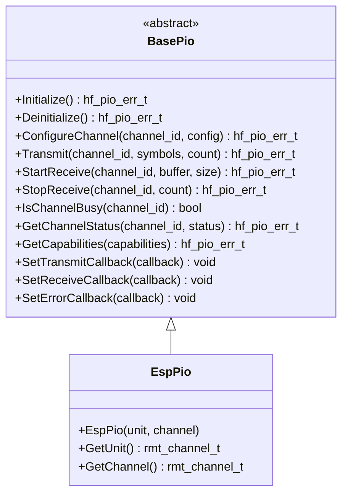

# 🎛️ BasePio API Reference

<div align="center">


**⚡ Precise digital signal I/O for timing-critical operations**

</div>

---

## 📚 **Table of Contents**

- [🎯 **Overview**](#-overview)
- [🏗️ **Class Hierarchy**](#️-class-hierarchy)
- [📋 **Error Codes**](#-error-codes)
- [🔧 **Core API**](#-core-api)
- [📊 **Data Structures**](#-data-structures)
- [📊 **Usage Examples**](#-usage-examples)
- [🧪 **Best Practices**](#-best-practices)

---

## 🎯 **Overview**

The `BasePio` class provides a comprehensive abstraction for Programmable IO operations, enabling precise timing control for digital signal generation and reception. It's designed for timing-critical applications like WS2812 LED driving, IR communication, stepper motor control, and custom protocols.

### ✨ **Key Features**

- ⚡ **Precise Timing** - Nanosecond resolution timing control
- 📊 **Buffered Operations** - Efficient symbol transmission and reception
- 🔄 **Asynchronous Operation** - Non-blocking with callback support
- 🎯 **Multi-Channel Support** - Simultaneous operation on multiple channels
- 🔧 **Flexible Configuration** - Configurable polarity, idle states, and timing
- 🛡️ **Robust Error Handling** - Comprehensive validation and error reporting
- 🏎️ **Performance Optimized** - Hardware-accelerated when available
- 🔌 **Platform Agnostic** - Works with various hardware backends

### 🎛️ **Supported Applications**

| Application | Description | Timing Requirements |
|-------------|-------------|-------------------|
| **WS2812 LEDs** | RGB LED strip control | 350ns/700ns pulses |
| **IR Communication** | Remote control protocols | 9-600μs pulses |
| **Stepper Motors** | Precise step timing | 1-100μs pulses |
| **Custom Protocols** | Proprietary signaling | Configurable timing |
| **PWM Generation** | High-frequency PWM | 1ns-1ms resolution |

---

## 🏗️ **Class Hierarchy**



---

## 📋 **Error Codes**

### ✅ **Success Codes**

| Code | Value | Description |
|------|-------|-------------|
| `PIO_SUCCESS` | 0 | ✅ Operation completed successfully |

### ❌ **General Error Codes**

| Code | Value | Description | Resolution |
|------|-------|-------------|------------|
| `PIO_ERR_FAILURE` | 1 | ❌ General operation failure | Check hardware and configuration |
| `PIO_ERR_NOT_INITIALIZED` | 2 | ⚠️ PIO not initialized | Call Initialize() first |
| `PIO_ERR_ALREADY_INITIALIZED` | 3 | ⚠️ PIO already initialized | Check initialization state |
| `PIO_ERR_INVALID_PARAMETER` | 4 | 🚫 Invalid parameter | Validate input parameters |
| `PIO_ERR_NULL_POINTER` | 5 | 🚫 Null pointer provided | Check pointer validity |
| `PIO_ERR_OUT_OF_MEMORY` | 6 | 💾 Memory allocation failed | Check system memory |

### 🔧 **Channel Error Codes**

| Code | Value | Description | Resolution |
|------|-------|-------------|------------|
| `PIO_ERR_INVALID_CHANNEL` | 7 | 🚫 Invalid PIO channel | Use valid channel numbers |
| `PIO_ERR_CHANNEL_BUSY` | 8 | 🔄 Channel already in use | Wait or use different channel |
| `PIO_ERR_CHANNEL_NOT_AVAILABLE` | 9 | ⚠️ Channel not available | Check channel availability |
| `PIO_ERR_INSUFFICIENT_CHANNELS` | 10 | 📊 Insufficient channels | Reduce channel count |

### ⏱️ **Timing Error Codes**

| Code | Value | Description | Resolution |
|------|-------|-------------|------------|
| `PIO_ERR_INVALID_RESOLUTION` | 11 | ⚙️ Invalid time resolution | Use supported resolution |
| `PIO_ERR_RESOLUTION_TOO_HIGH` | 12 | 📈 Resolution too high | Reduce resolution |
| `PIO_ERR_RESOLUTION_TOO_LOW` | 13 | 📉 Resolution too low | Increase resolution |
| `PIO_ERR_DURATION_TOO_LONG` | 14 | ⏰ Duration too long | Reduce duration |
| `PIO_ERR_DURATION_TOO_SHORT` | 15 | ⚡ Duration too short | Increase duration |

### 📊 **Buffer Error Codes**

| Code | Value | Description | Resolution |
|------|-------|-------------|------------|
| `PIO_ERR_BUFFER_OVERFLOW` | 16 | 📈 Buffer overflow | Increase buffer size |
| `PIO_ERR_BUFFER_UNDERFLOW` | 17 | 📉 Buffer underflow | Check data source |
| `PIO_ERR_BUFFER_TOO_SMALL` | 18 | 📏 Buffer too small | Increase buffer size |
| `PIO_ERR_BUFFER_TOO_LARGE` | 19 | 📐 Buffer too large | Reduce buffer size |

### 🌐 **Hardware Error Codes**

| Code | Value | Description | Resolution |
|------|-------|-------------|------------|
| `PIO_ERR_HARDWARE_FAULT` | 20 | 💥 Hardware fault | Check power and connections |
| `PIO_ERR_COMMUNICATION_TIMEOUT` | 21 | ⏰ Communication timeout | Check timing requirements |
| `PIO_ERR_COMMUNICATION_FAILURE` | 22 | 📡 Communication failure | Check bus connections |
| `PIO_ERR_DEVICE_NOT_RESPONDING` | 23 | 🔇 Device not responding | Check device power |

### ⚙️ **Configuration Error Codes**

| Code | Value | Description | Resolution |
|------|-------|-------------|------------|
| `PIO_ERR_INVALID_CONFIGURATION` | 24 | ⚙️ Invalid configuration | Check configuration parameters |
| `PIO_ERR_UNSUPPORTED_OPERATION` | 25 | 🚫 Unsupported operation | Check hardware capabilities |
| `PIO_ERR_PIN_CONFLICT` | 26 | 🔌 Pin already in use | Use different pin |
| `PIO_ERR_RESOURCE_BUSY` | 27 | 🔄 Resource busy | Wait for resource availability |

### 🔧 **System Error Codes**

| Code | Value | Description | Resolution |
|------|-------|-------------|------------|
| `PIO_ERR_SYSTEM_ERROR` | 28 | 💻 System error | Check system resources |
| `PIO_ERR_PERMISSION_DENIED` | 29 | 🚫 Permission denied | Check access permissions |
| `PIO_ERR_OPERATION_ABORTED` | 30 | ⏹️ Operation aborted | Check abort conditions |

---

## 🔧 **Core API**

### 🏗️ **Initialization Methods**

```cpp
/**
 * @brief Initialize the PIO peripheral
 * @return hf_pio_err_t error code
 * 
 * 📝 Sets up PIO hardware, configures channels, and prepares for operation.
 * Must be called before any PIO operations.
 * 
 * @example
 * EspPio pio(RMT_CHANNEL_0);
 * hf_pio_err_t result = pio.Initialize();
 * if (result == hf_pio_err_t::PIO_SUCCESS) {
 *     // PIO ready for use
 * }
 */
virtual hf_pio_err_t Initialize() noexcept = 0;

/**
 * @brief Deinitialize the PIO peripheral
 * @return hf_pio_err_t error code
 * 
 * 🧹 Cleanly shuts down PIO hardware and releases resources.
 */
virtual hf_pio_err_t Deinitialize() noexcept = 0;

/**
 * @brief Check if PIO is initialized
 * @return true if initialized, false otherwise
 * 
 * ❓ Query initialization status without side effects.
 */
[[nodiscard]] bool IsInitialized() const noexcept;

/**
 * @brief Ensure PIO is initialized (lazy initialization)
 * @return true if initialized successfully, false otherwise
 * 
 * 🔄 Automatically initializes PIO if not already initialized.
 */
bool EnsureInitialized() noexcept;
```

### ⚙️ **Channel Configuration**

```cpp
/**
 * @brief Configure a PIO channel
 * @param channel_id Channel identifier
 * @param config Channel configuration structure
 * @return hf_pio_err_t error code
 * 
 * ⚙️ Configures channel parameters including GPIO pin, direction, timing,
 * polarity, and buffer settings.
 * 
 * @example
 * hf_pio_channel_config_t config;
 * config.gpio_pin = 18;
 * config.direction = hf_pio_direction_t::Transmit;
 * config.resolution_hz = 1000000;  // 1MHz resolution (replaces resolution_ns)
 * config.polarity = hf_pio_polarity_t::Normal;
 * config.idle_state = hf_pio_idle_state_t::Low;
 * 
 * hf_pio_err_t result = pio.ConfigureChannel(0, config);
 */
virtual hf_pio_err_t ConfigureChannel(uint8_t channel_id,
                                    const hf_pio_channel_config_t &config) noexcept = 0;
```

### 📤 **Transmission Methods**

```cpp
/**
 * @brief Transmit a sequence of symbols
 * @param channel_id Channel identifier
 * @param symbols Array of symbols to transmit
 * @param symbol_count Number of symbols in the array
 * @param wait_completion If true, block until transmission is complete
 * @return hf_pio_err_t error code
 * 
 * 📤 Transmits precise timing sequences. Each symbol defines duration
 * and signal level for precise waveform generation.
 * 
 * @example
 * hf_pio_symbol_t ws2812_data[] = {
 *     {350, true},   // 350ns high
 *     {800, false},  // 800ns low
 *     {700, true},   // 700ns high
 *     {600, false}   // 600ns low
 * };
 * 
 * hf_pio_err_t result = pio.Transmit(0, ws2812_data, 4, true);
 */
virtual hf_pio_err_t Transmit(uint8_t channel_id, const hf_pio_symbol_t *symbols,
                            size_t symbol_count, bool wait_completion = false) noexcept = 0;
```

### 📥 **Reception Methods**

```cpp
/**
 * @brief Start receiving symbols
 * @param channel_id Channel identifier
 * @param buffer Buffer to store received symbols
 * @param buffer_size Size of the buffer
 * @param timeout_us Timeout in microseconds (0 = no timeout)
 * @return hf_pio_err_t error code
 * 
 * 📥 Begins asynchronous symbol reception. Received symbols are stored
 * in the provided buffer with precise timing information.
 * 
 * @example
 * hf_pio_symbol_t receive_buffer[64];
 * hf_pio_err_t result = pio.StartReceive(0, receive_buffer, 64, 10000);
 */
virtual hf_pio_err_t StartReceive(uint8_t channel_id, hf_pio_symbol_t *buffer, 
                                size_t buffer_size, uint32_t timeout_us = 0) noexcept = 0;

/**
 * @brief Stop receiving and get the number of symbols received
 * @param channel_id Channel identifier
 * @param symbols_received [out] Number of symbols actually received
 * @return hf_pio_err_t error code
 * 
 * ⏹️ Stops reception and returns the count of symbols received.
 */
virtual hf_pio_err_t StopReceive(uint8_t channel_id, size_t &symbols_received) noexcept = 0;
```

### 📊 **Status and Capabilities**

```cpp
/**
 * @brief Check if a channel is currently busy
 * @param channel_id Channel identifier
 * @return true if channel is busy, false otherwise
 * 
 * ❓ Query channel busy status for flow control.
 */
virtual bool IsChannelBusy(uint8_t channel_id) const noexcept = 0;

/**
 * @brief Get channel status information
 * @param channel_id Channel identifier
 * @param status [out] Status information structure
 * @return hf_pio_err_t error code
 * 
 * 📊 Retrieves comprehensive status information about a channel.
 */
virtual hf_pio_err_t GetChannelStatus(uint8_t channel_id,
                                    hf_pio_channel_status_t &status) const noexcept = 0;

/**
 * @brief Get PIO capabilities
 * @param capabilities [out] Capability information structure
 * @return hf_pio_err_t error code
 * 
 * 📋 Retrieves hardware capabilities and limitations.
 */
virtual hf_pio_err_t GetCapabilities(hf_pio_capabilities_t &capabilities) const noexcept = 0;
```

### 🔄 **Callback Management**

```cpp
/**
 * @brief Set callback for transmission complete events
 * @param callback Callback function
 * @param user_data User data to pass to callback
 * 
 * 🔔 Registers callback for transmission completion events.
 */
virtual void SetTransmitCallback(hf_pio_transmit_callback_t callback,
                               void *user_data = nullptr) noexcept = 0;

/**
 * @brief Set callback for reception complete events
 * @param callback Callback function
 * @param user_data User data to pass to callback
 * 
 * 🔔 Registers callback for reception completion events.
 */
virtual void SetReceiveCallback(hf_pio_receive_callback_t callback,
                              void *user_data = nullptr) noexcept = 0;

/**
 * @brief Set callback for error events
 * @param callback Callback function
 * @param user_data User data to pass to callback
 * 
 * 🔔 Registers callback for error events.
 */
virtual void SetErrorCallback(hf_pio_error_callback_t callback,
                            void *user_data = nullptr) noexcept = 0;

/**
 * @brief Clear all callbacks
 * 
 * 🧹 Removes all registered callbacks.
 */
virtual void ClearCallbacks() noexcept = 0;
```

---

## 📊 **Data Structures**

### ⚙️ **Channel Configuration**

```cpp
struct hf_pio_channel_config_t {
    hf_pin_num_t gpio_pin;          ///< GPIO pin for PIO signal
    hf_pio_direction_t direction;   ///< Channel direction
    uint32_t resolution_hz;         ///< Time resolution in Hz
    hf_pio_polarity_t polarity;     ///< Signal polarity
    hf_pio_idle_state_t idle_state; ///< Idle state
    uint32_t timeout_us;            ///< Operation timeout in microseconds
    size_t buffer_size;             ///< Buffer size for symbols/durations
};
```

### 📈 **PIO Symbol**

```cpp
struct hf_pio_symbol_t {
    uint32_t duration; ///< Duration in resolution units
    bool level;        ///< Signal level (true = high, false = low)
};
```

### 📊 **Channel Status**

```cpp
struct hf_pio_channel_status_t {
    bool is_initialized;      ///< Channel is initialized
    bool is_busy;             ///< Channel is currently busy
    bool is_transmitting;     ///< Channel is transmitting
    bool is_receiving;        ///< Channel is receiving
    size_t symbols_queued;    ///< Number of symbols in queue
    size_t symbols_processed; ///< Number of symbols processed
    hf_pio_err_t last_error;  ///< Last error that occurred
    uint32_t timestamp_us;    ///< Timestamp of last operation
};
```

### 📋 **PIO Capabilities**

```cpp
struct hf_pio_capabilities_t {
    uint8_t max_channels;        ///< Maximum number of channels
    uint32_t min_resolution_ns;  ///< Minimum time resolution
    uint32_t max_resolution_ns;  ///< Maximum time resolution
    uint32_t max_duration;       ///< Maximum single duration
    size_t max_buffer_size;      ///< Maximum buffer size
    bool supports_bidirectional; ///< Supports bidirectional mode
    bool supports_loopback;      ///< Supports loopback mode
    bool supports_carrier;       ///< Supports carrier modulation
};
```

### 📈 **PIO Statistics**

```cpp
struct hf_pio_statistics_t {
    uint32_t totalTransmissions;    ///< Total transmissions performed
    uint32_t successfulTransmissions; ///< Successful transmissions
    uint32_t failedTransmissions;   ///< Failed transmissions
    uint32_t totalReceptions;       ///< Total receptions performed
    uint32_t successfulReceptions;  ///< Successful receptions
    uint32_t failedReceptions;      ///< Failed receptions
    uint32_t symbolsTransmitted;    ///< Total symbols transmitted
    uint32_t symbolsReceived;       ///< Total symbols received
    uint32_t averageTransmissionTimeUs; ///< Average transmission time
    uint32_t maxTransmissionTimeUs; ///< Maximum transmission time
    uint32_t minTransmissionTimeUs; ///< Minimum transmission time
    uint32_t timingErrors;          ///< Number of timing errors
    uint32_t bufferOverflows;       ///< Number of buffer overflows
};
```

---

## 📊 **Usage Examples**

### 🎨 **WS2812 LED Control**

```cpp
#include "mcu/esp32/EspPio.h"

class WS2812Controller {
private:
    EspPio pio_;
    static constexpr uint32_t T0H_NS = 350;   // 0-bit high time
    static constexpr uint32_t T0L_NS = 800;   // 0-bit low time
    static constexpr uint32_t T1H_NS = 700;   // 1-bit high time
    static constexpr uint32_t T1L_NS = 600;   // 1-bit low time
    
public:
    bool initialize() {
        // Configure PIO channel for WS2812
        hf_pio_channel_config_t config;
        config.gpio_pin = 18;  // WS2812 data pin
        config.direction = hf_pio_direction_t::Transmit;
        config.resolution_hz = 1000000;  // 1MHz resolution (replaces resolution_ns)
        config.polarity = hf_pio_polarity_t::Normal;
        config.idle_state = hf_pio_idle_state_t::Low;
        
        hf_pio_err_t result = pio_.ConfigureChannel(0, config);
        return (result == hf_pio_err_t::PIO_SUCCESS);
    }
    
    void send_color(uint8_t r, uint8_t g, uint8_t b) {
        // Convert RGB to GRB (WS2812 format)
        uint8_t grb[3] = {g, r, b};
        
        // Create symbol array for 24 bits
        hf_pio_symbol_t symbols[24];
        int symbol_index = 0;
        
        for (int i = 0; i < 3; i++) {
            for (int bit = 7; bit >= 0; bit--) {
                bool bit_value = (grb[i] >> bit) & 1;
                
                if (bit_value) {
                    // 1-bit: 700ns high, 600ns low
                    symbols[symbol_index++] = {7, true};   // 700ns high
                    symbols[symbol_index++] = {6, false};  // 600ns low
                } else {
                    // 0-bit: 350ns high, 800ns low
                    symbols[symbol_index++] = {4, true};   // 350ns high
                    symbols[symbol_index++] = {8, false};  // 800ns low
                }
            }
        }
        
        // Transmit the color data
        pio_.Transmit(0, symbols, 24, true);
    }
    
    void set_all_leds(uint8_t r, uint8_t g, uint8_t b, int count) {
        for (int i = 0; i < count; i++) {
            send_color(r, g, b);
            // Small delay between LEDs
            esp_rom_delay_us(50);
        }
    }
};
```

### 📡 **IR Signal Transmission**

```cpp
#include "mcu/esp32/EspPio.h"

class IRTransmitter {
private:
    EspPio pio_;
    static constexpr uint32_t CARRIER_FREQ_KHZ = 38;  // 38kHz carrier
    static constexpr uint32_t CARRIER_PERIOD_NS = 26316;  // 1/38kHz
    
public:
    bool initialize() {
        hf_pio_channel_config_t config;
        config.gpio_pin = 4;  // IR LED pin
        config.direction = hf_pio_direction_t::Transmit;
        config.resolution_hz = 1000000;  // 1MHz resolution (1μs equivalent)
        config.polarity = hf_pio_polarity_t::Normal;
        config.idle_state = hf_pio_idle_state_t::Low;
        
        return (pio_.ConfigureChannel(0, config) == hf_pio_err_t::PIO_SUCCESS);
    }
    
    void send_nec_code(uint32_t address, uint32_t command) {
        // NEC protocol: 9ms leader + 4.5ms space + address + command + stop
        std::vector<hf_pio_symbol_t> symbols;
        
        // 9ms leader pulse (9000μs high)
        symbols.push_back({9000, true});
        symbols.push_back({4500, false});  // 4.5ms space
        
        // Send address (LSB first)
        for (int i = 0; i < 16; i++) {
            bool bit = (address >> i) & 1;
            if (bit) {
                symbols.push_back({560, true});   // 560μs pulse
                symbols.push_back({1690, false}); // 1690μs space
            } else {
                symbols.push_back({560, true});   // 560μs pulse
                symbols.push_back({560, false});  // 560μs space
            }
        }
        
        // Send command (LSB first)
        for (int i = 0; i < 16; i++) {
            bool bit = (command >> i) & 1;
            if (bit) {
                symbols.push_back({560, true});   // 560μs pulse
                symbols.push_back({1690, false}); // 1690μs space
            } else {
                symbols.push_back({560, true});   // 560μs pulse
                symbols.push_back({560, false});  // 560μs space
            }
        }
        
        // Stop bit
        symbols.push_back({560, true});
        symbols.push_back({56000, false});  // 56ms space
        
        // Transmit the IR code
        pio_.Transmit(0, symbols.data(), symbols.size(), true);
    }
    
    void send_sony_code(uint32_t command, uint32_t address = 0) {
        // Sony SIRC protocol: 2.4ms leader + 12 bits data
        std::vector<hf_pio_symbol_t> symbols;
        
        // 2.4ms leader pulse
        symbols.push_back({2400, true});
        symbols.push_back({600, false});  // 600μs space
        
        // Send command (7 bits, MSB first)
        for (int i = 6; i >= 0; i--) {
            bool bit = (command >> i) & 1;
            symbols.push_back({600, true});  // 600μs pulse
            if (bit) {
                symbols.push_back({1200, false}); // 1200μs space
            } else {
                symbols.push_back({600, false});  // 600μs space
            }
        }
        
        // Send address (5 bits, MSB first)
        for (int i = 4; i >= 0; i--) {
            bool bit = (address >> i) & 1;
            symbols.push_back({600, true});  // 600μs pulse
            if (bit) {
                symbols.push_back({1200, false}); // 1200μs space
            } else {
                symbols.push_back({600, false});  // 600μs space
            }
        }
        
        // Transmit the IR code
        pio_.Transmit(0, symbols.data(), symbols.size(), true);
    }
};
```

### 🔄 **Stepper Motor Control**

```cpp
#include "mcu/esp32/EspPio.h"

class StepperController {
private:
    EspPio pio_;
    static constexpr uint32_t STEP_PULSE_US = 10;  // 10μs step pulse
    static constexpr uint32_t STEP_DELAY_US = 1000; // 1ms between steps
    
public:
    bool initialize() {
        hf_pio_channel_config_t config;
        config.gpio_pin = 26;  // Step pin
        config.direction = hf_pio_direction_t::Transmit;
        config.resolution_hz = 1000000;  // 1MHz resolution (1μs equivalent)
        config.polarity = hf_pio_polarity_t::Normal;
        config.idle_state = hf_pio_idle_state_t::Low;
        
        return (pio_.ConfigureChannel(0, config) == hf_pio_err_t::PIO_SUCCESS);
    }
    
    void step_single() {
        // Single step: 10μs high pulse
        hf_pio_symbol_t step_pulse[] = {
            {10, true},   // 10μs high
            {10, false}   // 10μs low
        };
        
        pio_.Transmit(0, step_pulse, 2, true);
    }
    
    void step_continuous(int steps, uint32_t delay_us) {
        // Generate continuous stepping pattern
        std::vector<hf_pio_symbol_t> symbols;
        
        for (int i = 0; i < steps; i++) {
            symbols.push_back({10, true});    // 10μs high
            symbols.push_back({delay_us, false}); // Delay between steps
        }
        
        pio_.Transmit(0, symbols.data(), symbols.size(), true);
    }
    
    void set_speed_rpm(float rpm, int steps_per_rev = 200) {
        // Calculate delay for desired RPM
        float steps_per_second = (rpm * steps_per_rev) / 60.0f;
        uint32_t delay_us = static_cast<uint32_t>(1000000.0f / steps_per_second);
        
        printf("Speed: %.1f RPM, Delay: %u μs\n", rpm, delay_us);
    }
};
```

### 📡 **IR Signal Reception**

```cpp
#include "mcu/esp32/EspPio.h"

class IRReceiver {
private:
    EspPio pio_;
    hf_pio_symbol_t receive_buffer_[128];
    bool receiving_ = false;
    
public:
    bool initialize() {
        hf_pio_channel_config_t config;
        config.gpio_pin = 5;  // IR receiver pin
        config.direction = hf_pio_direction_t::Receive;
        config.resolution_hz = 1000000;  // 1MHz resolution (1μs equivalent)
        config.polarity = hf_pio_polarity_t::Normal;
        config.idle_state = hf_pio_idle_state_t::High;  // IR receivers idle high
        
        return (pio_.ConfigureChannel(0, config) == hf_pio_err_t::PIO_SUCCESS);
    }
    
    void start_receiving() {
        if (!receiving_) {
            hf_pio_err_t result = pio_.StartReceive(0, receive_buffer_, 128, 50000); // 50ms timeout
            if (result == hf_pio_err_t::PIO_SUCCESS) {
                receiving_ = true;
                printf("🎯 Started IR reception\n");
            }
        }
    }
    
    void stop_receiving() {
        if (receiving_) {
            size_t symbols_received;
            hf_pio_err_t result = pio_.StopReceive(0, symbols_received);
            if (result == hf_pio_err_t::PIO_SUCCESS) {
                printf("📥 Received %zu symbols\n", symbols_received);
                process_ir_data(symbols_received);
            }
            receiving_ = false;
        }
    }
    
private:
    void process_ir_data(size_t symbol_count) {
        if (symbol_count < 4) return;
        
        // Simple NEC protocol decoder
        uint32_t address = 0;
        uint32_t command = 0;
        
        // Check for NEC leader (9ms high, 4.5ms low)
        if (receive_buffer_[0].level && receive_buffer_[0].duration >= 8000 &&  // 8ms+ high
            !receive_buffer_[1].level && receive_buffer_[1].duration >= 4000) { // 4ms+ low
            
            printf("📡 NEC protocol detected\n");
            
            // Decode address and command (simplified)
            int bit_index = 0;
            for (size_t i = 2; i < symbol_count - 2; i += 2) {
                if (receive_buffer_[i].level && receive_buffer_[i].duration >= 500) {
                    // Valid pulse
                    if (receive_buffer_[i + 1].duration >= 1500) {
                        // Long space = 1 bit
                        if (bit_index < 16) {
                            address |= (1 << bit_index);
                        } else {
                            command |= (1 << (bit_index - 16));
                        }
                    }
                    bit_index++;
                }
            }
            
            printf("📋 Address: 0x%04X, Command: 0x%04X\n", address, command);
        }
    }
};
```

---

## 🧪 **Best Practices**

### ✅ **Recommended Patterns**

```cpp
// ✅ Always check initialization
if (!pio.EnsureInitialized()) {
    printf("❌ PIO initialization failed\n");
    return false;
}

// ✅ Validate channel configuration
hf_pio_capabilities_t caps;
if (pio.GetCapabilities(caps) == hf_pio_err_t::PIO_SUCCESS) {
    if (channel_id >= caps.max_channels) {
        printf("❌ Channel %u exceeds maximum (%u)\n", channel_id, caps.max_channels);
        return;
    }
}

// ✅ Use appropriate timing resolution
uint32_t resolution_hz = 1000000;  // 1MHz for most applications (1μs equivalent)
if (precise_timing_needed) {
    resolution_hz = 10000000;  // 10MHz for precise timing (100ns equivalent)
}

// ✅ Handle transmission errors gracefully
hf_pio_err_t result = pio.Transmit(channel_id, symbols, count);
if (result != hf_pio_err_t::PIO_SUCCESS) {
    printf("⚠️ Transmission error: %s\n", HfPioErrToString(result));
    // Implement retry logic or error recovery
}

// ✅ Use callbacks for asynchronous operation
pio.SetTransmitCallback([](uint8_t ch, size_t sent, void* data) {
    printf("✅ Transmitted %zu symbols on channel %u\n", sent, ch);
});

// ✅ Monitor channel status
hf_pio_channel_status_t status;
if (pio.GetChannelStatus(channel_id, status) == hf_pio_err_t::PIO_SUCCESS) {
    if (status.is_busy) {
        printf("⏳ Channel %u is busy\n", channel_id);
    }
}
```

### ❌ **Common Pitfalls**

```cpp
// ❌ Don't ignore timing requirements
// WS2812 requires precise 350ns/700ns timing
hf_pio_symbol_t wrong_timing[] = {
    {4, true},   // 400ns - too long!
    {8, false}   // 800ns - too long!
};

// ❌ Don't use invalid channel numbers
pio.ConfigureChannel(99, config);  // Invalid channel

// ❌ Don't ignore buffer size limits
hf_pio_symbol_t huge_buffer[10000];  // May exceed hardware limits

// ❌ Don't assume all protocols work the same
// Different IR protocols have different timing requirements

// ❌ Don't forget to stop reception
pio.StartReceive(0, buffer, 64);
// Missing: pio.StopReceive(0, count);
```

### 🎯 **Performance Optimization**

```cpp
// 🚀 Use appropriate buffer sizes
size_t optimal_buffer_size = 64;  // Balance between memory and performance

// 🚀 Minimize symbol count for efficiency
// Combine similar symbols when possible
hf_pio_symbol_t optimized[] = {
    {1000, true},   // 1ms high
    {500, false}    // 500μs low
};
// Instead of: {100, true}, {100, true}, ..., {100, false}

// 🚀 Use hardware-accelerated timing when available
// ESP32 RMT provides precise timing without CPU intervention

// 🚀 Batch operations for multiple channels
// Configure all channels before starting transmission

// 🚀 Use appropriate idle states
// Match idle state to protocol requirements
```

---

## 🔗 **Related Documentation**

- [🔒 **SfPio**](SfPio.md) - Thread-safe PIO wrapper
- [⚙️ **EspPio**](EspPio.md) - ESP32-C6 implementation
- [🎛️ **Hardware Types**](HardwareTypes.md) - Platform-agnostic types

---

<div align="center">

**🎛️ BasePio - Precision Digital Signal Control for HardFOC**

*Part of the HardFOC Internal Interface Wrapper Documentation*

</div> 