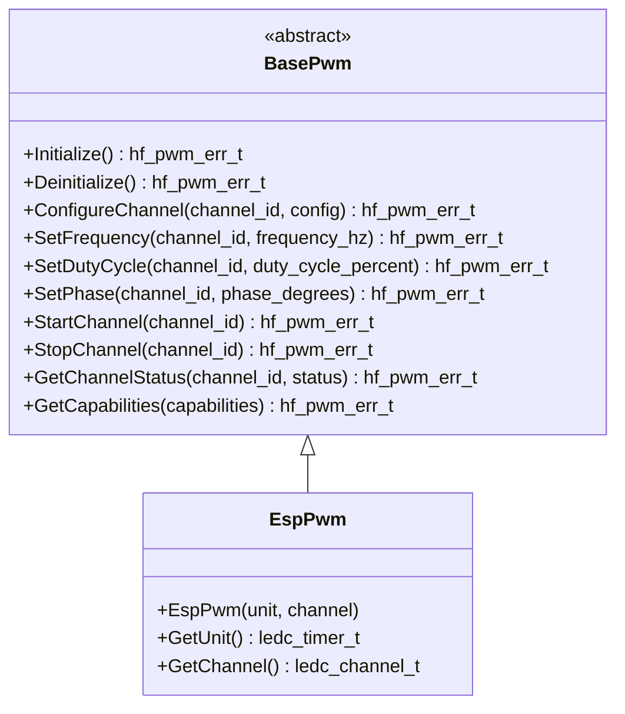

# ⚡ BasePwm API Reference

<div align="center">


**🎛️ Unified PWM abstraction for precise pulse-width modulation control**

</div>

---

## 📚 **Table of Contents**

- [🎯 **Overview**](#-overview)
- [🏗️ **Class Hierarchy**](#️-class-hierarchy)
- [📋 **Error Codes**](#-error-codes)
- [🔧 **Core API**](#-core-api)
- [📊 **Data Structures**](#-data-structures)
- [💡 **Usage Examples**](#-usage-examples)
- [🧪 **Best Practices**](#-best-practices)

---

## 🎯 **Overview**

The `BasePwm` class provides a comprehensive PWM abstraction that serves as the unified interface for all pulse-width modulation operations in the HardFOC system. It supports multi-channel operation, precise frequency and duty cycle control, and works across different PWM implementations.

### ✨ **Key Features**

- 🎛️ **Multi-Channel Support** - Simultaneous operation on multiple PWM channels
- ⚡ **Precise Frequency Control** - Configurable frequency from Hz to MHz
- 📊 **Duty Cycle Control** - 0-100% duty cycle with high resolution
- 🔄 **Phase Control** - Configurable phase relationships between channels
- 🛡️ **Robust Error Handling** - Comprehensive validation and error reporting
- 🏎️ **Performance Optimized** - Hardware-accelerated PWM generation
- 🔌 **Platform Agnostic** - Works with various PWM hardware implementations
- 📈 **Real-time Control** - Dynamic frequency and duty cycle updates

### ⚡ **Supported Applications**

| Application | Frequency Range | Duty Cycle | Description |
|-------------|----------------|------------|-------------|
| **Motor Control** | 1-50 kHz | 0-100% | Precise motor speed and torque control |
| **LED Dimming** | 100 Hz-1 kHz | 0-100% | Smooth LED brightness control |
| **Audio Generation** | 20 Hz-20 kHz | 0-100% | Digital audio signal generation |
| **Power Conversion** | 10-500 kHz | 0-100% | DC-DC converter control |
| **Servo Control** | 50 Hz | 5-10% | Standard servo pulse generation |

---

## 🏗️ **Class Hierarchy**



---

## 📋 **Error Codes**

### ✅ **Success Codes**

| Code | Value | Description |
|------|-------|-------------|
| `PWM_SUCCESS` | 0 | ✅ Operation completed successfully |

### ❌ **General Error Codes**

| Code | Value | Description | Resolution |
|------|-------|-------------|------------|
| `PWM_ERR_FAILURE` | 1 | ❌ General operation failure | Check hardware and configuration |
| `PWM_ERR_NOT_INITIALIZED` | 2 | ⚠️ PWM not initialized | Call Initialize() first |
| `PWM_ERR_ALREADY_INITIALIZED` | 3 | ⚠️ PWM already initialized | Check initialization state |
| `PWM_ERR_INVALID_PARAMETER` | 4 | 🚫 Invalid parameter | Validate input parameters |
| `PWM_ERR_NULL_POINTER` | 5 | 🚫 Null pointer provided | Check pointer validity |
| `PWM_ERR_OUT_OF_MEMORY` | 6 | 💾 Memory allocation failed | Check system memory |

### 🔧 **Channel Error Codes**

| Code | Value | Description | Resolution |
|------|-------|-------------|------------|
| `PWM_ERR_INVALID_CHANNEL` | 7 | 🚫 Invalid PWM channel | Use valid channel numbers |
| `PWM_ERR_CHANNEL_BUSY` | 8 | 🔄 Channel already in use | Wait or use different channel |
| `PWM_ERR_CHANNEL_NOT_AVAILABLE` | 9 | ⚠️ Channel not available | Check channel availability |
| `PWM_ERR_CHANNEL_NOT_CONFIGURED` | 10 | ⚙️ Channel not configured | Configure channel first |
| `PWM_ERR_CHANNEL_ALREADY_RUNNING` | 11 | 🔄 Channel already running | Stop channel first |

### ⚡ **Frequency Error Codes**

| Code | Value | Description | Resolution |
|------|-------|-------------|------------|
| `PWM_ERR_FREQUENCY_TOO_HIGH` | 12 | 📈 Frequency too high | Reduce frequency |
| `PWM_ERR_FREQUENCY_TOO_LOW` | 13 | 📉 Frequency too low | Increase frequency |
| `PWM_ERR_INVALID_FREQUENCY` | 14 | 🚫 Invalid frequency | Use valid frequency range |
| `PWM_ERR_FREQUENCY_NOT_SUPPORTED` | 15 | 🚫 Frequency not supported | Check hardware capabilities |

### 📊 **Duty Cycle Error Codes**

| Code | Value | Description | Resolution |
|------|-------|-------------|------------|
| `PWM_ERR_DUTY_CYCLE_TOO_HIGH` | 16 | 📈 Duty cycle too high | Reduce duty cycle |
| `PWM_ERR_DUTY_CYCLE_TOO_LOW` | 17 | 📉 Duty cycle too low | Increase duty cycle |
| `PWM_ERR_INVALID_DUTY_CYCLE` | 18 | 🚫 Invalid duty cycle | Use 0-100% range |
| `PWM_ERR_DUTY_CYCLE_NOT_SUPPORTED` | 19 | 🚫 Duty cycle not supported | Check hardware capabilities |

### 🔄 **Phase Error Codes**

| Code | Value | Description | Resolution |
|------|-------|-------------|------------|
| `PWM_ERR_PHASE_TOO_HIGH` | 20 | 📈 Phase too high | Reduce phase angle |
| `PWM_ERR_PHASE_TOO_LOW` | 21 | 📉 Phase too low | Increase phase angle |
| `PWM_ERR_INVALID_PHASE` | 22 | 🚫 Invalid phase | Use 0-360° range |
| `PWM_ERR_PHASE_NOT_SUPPORTED` | 23 | 🚫 Phase not supported | Check hardware capabilities |

### 🌐 **Hardware Error Codes**

| Code | Value | Description | Resolution |
|------|-------|-------------|------------|
| `PWM_ERR_HARDWARE_FAULT` | 24 | 💥 Hardware fault | Check power and connections |
| `PWM_ERR_COMMUNICATION_FAILURE` | 25 | 📡 Communication failure | Check bus connections |
| `PWM_ERR_DEVICE_NOT_RESPONDING` | 26 | 🔇 Device not responding | Check device power |
| `PWM_ERR_RESOURCE_BUSY` | 27 | 🔄 Resource busy | Wait for resource availability |

---

## 🔧 **Core API**

### 🏗️ **Initialization Methods**

```cpp
/**
 * @brief Initialize the PWM peripheral
 * @return hf_pwm_err_t error code
 * 
 * 📝 Sets up PWM hardware, configures channels, and prepares for operation.
 * Must be called before any PWM operations.
 * 
 * @example
 * EspPwm pwm(LEDC_TIMER_0, LEDC_CHANNEL_0);
 * hf_pwm_err_t result = pwm.Initialize();
 * if (result == hf_pwm_err_t::PWM_SUCCESS) {
 *     // PWM ready for use
 * }
 */
virtual hf_pwm_err_t Initialize() noexcept = 0;

/**
 * @brief Deinitialize the PWM peripheral
 * @return hf_pwm_err_t error code
 * 
 * 🧹 Cleanly shuts down PWM hardware and releases resources.
 */
virtual hf_pwm_err_t Deinitialize() noexcept = 0;

/**
 * @brief Check if PWM is initialized
 * @return true if initialized, false otherwise
 * 
 * ❓ Query initialization status without side effects.
 */
[[nodiscard]] bool IsInitialized() const noexcept;

/**
 * @brief Ensure PWM is initialized (lazy initialization)
 * @return true if initialized successfully, false otherwise
 * 
 * 🔄 Automatically initializes PWM if not already initialized.
 */
bool EnsureInitialized() noexcept;
```

### ⚙️ **Channel Configuration**

```cpp
/**
 * @brief Configure a PWM channel
 * @param channel_id Channel identifier
 * @param config Channel configuration structure
 * @return hf_pwm_err_t error code
 * 
 * ⚙️ Configures channel parameters including GPIO pin, frequency,
 * duty cycle, and phase settings.
 * 
 * @example
 * hf_pwm_channel_config_t config;
 * config.gpio_pin = 18;
 * config.frequency_hz = 1000;      // 1 kHz
 * config.duty_cycle_percent = 50;  // 50% duty cycle
 * config.phase_degrees = 0;        // 0° phase
 * 
 * hf_pwm_err_t result = pwm.ConfigureChannel(0, config);
 */
virtual hf_pwm_err_t ConfigureChannel(uint8_t channel_id,
                                    const hf_pwm_channel_config_t &config) noexcept = 0;
```

### ⚡ **Frequency Control**

```cpp
/**
 * @brief Set PWM frequency for a channel
 * @param channel_id Channel identifier
 * @param frequency_hz Frequency in Hz
 * @return hf_pwm_err_t error code
 * 
 * ⚡ Sets the PWM frequency for the specified channel.
 * Frequency range depends on hardware capabilities.
 * 
 * @example
 * // Set 20 kHz for motor control
 * hf_pwm_err_t result = pwm.SetFrequency(0, 20000);
 * if (result == hf_pwm_err_t::PWM_SUCCESS) {
 *     printf("✅ Frequency set to 20 kHz\n");
 * }
 */
virtual hf_pwm_err_t SetFrequency(uint8_t channel_id, float frequency_hz) noexcept = 0;

/**
 * @brief Get current PWM frequency for a channel
 * @param channel_id Channel identifier
 * @param frequency_hz [out] Current frequency in Hz
 * @return hf_pwm_err_t error code
 * 
 * 📊 Retrieves the current frequency setting for a channel.
 */
virtual hf_pwm_err_t GetFrequency(uint8_t channel_id, float &frequency_hz) const noexcept = 0;
```

### 📊 **Duty Cycle Control**

```cpp
/**
 * @brief Set PWM duty cycle for a channel
 * @param channel_id Channel identifier
 * @param duty_cycle_percent Duty cycle as percentage (0-100)
 * @return hf_pwm_err_t error code
 * 
 * 📊 Sets the PWM duty cycle for the specified channel.
 * Duty cycle range is 0-100%.
 * 
 * @example
 * // Set 75% duty cycle
 * hf_pwm_err_t result = pwm.SetDutyCycle(0, 75.0f);
 * if (result == hf_pwm_err_t::PWM_SUCCESS) {
 *     printf("✅ Duty cycle set to 75%%\n");
 * }
 */
virtual hf_pwm_err_t SetDutyCycle(uint8_t channel_id, float duty_cycle_percent) noexcept = 0;

/**
 * @brief Get current PWM duty cycle for a channel
 * @param channel_id Channel identifier
 * @param duty_cycle_percent [out] Current duty cycle as percentage
 * @return hf_pwm_err_t error code
 * 
 * 📊 Retrieves the current duty cycle setting for a channel.
 */
virtual hf_pwm_err_t GetDutyCycle(uint8_t channel_id, float &duty_cycle_percent) const noexcept = 0;
```

### 🔄 **Phase Control**

```cpp
/**
 * @brief Set PWM phase for a channel
 * @param channel_id Channel identifier
 * @param phase_degrees Phase in degrees (0-360)
 * @return hf_pwm_err_t error code
 * 
 * 🔄 Sets the PWM phase for the specified channel.
 * Phase range is 0-360 degrees.
 * 
 * @example
 * // Set 180° phase shift
 * hf_pwm_err_t result = pwm.SetPhase(0, 180.0f);
 * if (result == hf_pwm_err_t::PWM_SUCCESS) {
 *     printf("✅ Phase set to 180°\n");
 * }
 */
virtual hf_pwm_err_t SetPhase(uint8_t channel_id, float phase_degrees) noexcept = 0;

/**
 * @brief Get current PWM phase for a channel
 * @param channel_id Channel identifier
 * @param phase_degrees [out] Current phase in degrees
 * @return hf_pwm_err_t error code
 * 
 * 🔄 Retrieves the current phase setting for a channel.
 */
virtual hf_pwm_err_t GetPhase(uint8_t channel_id, float &phase_degrees) const noexcept = 0;
```

### 🎛️ **Channel Control**

```cpp
/**
 * @brief Start PWM output on a channel
 * @param channel_id Channel identifier
 * @return hf_pwm_err_t error code
 * 
 * 🎛️ Starts PWM output on the specified channel.
 * Channel must be configured before starting.
 * 
 * @example
 * hf_pwm_err_t result = pwm.StartChannel(0);
 * if (result == hf_pwm_err_t::PWM_SUCCESS) {
 *     printf("✅ PWM channel 0 started\n");
 * }
 */
virtual hf_pwm_err_t StartChannel(uint8_t channel_id) noexcept = 0;

/**
 * @brief Stop PWM output on a channel
 * @param channel_id Channel identifier
 * @return hf_pwm_err_t error code
 * 
 * 🎛️ Stops PWM output on the specified channel.
 */
virtual hf_pwm_err_t StopChannel(uint8_t channel_id) noexcept = 0;

/**
 * @brief Check if a channel is running
 * @param channel_id Channel identifier
 * @return true if channel is running, false otherwise
 * 
 * ❓ Query channel running status.
 */
virtual bool IsChannelRunning(uint8_t channel_id) const noexcept = 0;
```

### 📊 **Status and Capabilities**

```cpp
/**
 * @brief Get channel status information
 * @param channel_id Channel identifier
 * @param status [out] Status information structure
 * @return hf_pwm_err_t error code
 * 
 * 📊 Retrieves comprehensive status information about a channel.
 */
virtual hf_pwm_err_t GetChannelStatus(uint8_t channel_id,
                                    hf_pwm_channel_status_t &status) const noexcept = 0;

/**
 * @brief Get PWM capabilities
 * @param capabilities [out] Capability information structure
 * @return hf_pwm_err_t error code
 * 
 * 📋 Retrieves hardware capabilities and limitations.
 */
virtual hf_pwm_err_t GetCapabilities(hf_pwm_capabilities_t &capabilities) const noexcept = 0;
```

---

## 📊 **Data Structures**

### ⚙️ **Channel Configuration**

```cpp
struct hf_pwm_channel_config_t {
    hf_pin_num_t gpio_pin;           ///< GPIO pin for PWM output
    float frequency_hz;              ///< PWM frequency in Hz
    float duty_cycle_percent;        ///< Duty cycle as percentage (0-100)
    float phase_degrees;             ///< Phase in degrees (0-360)
    hf_pwm_polarity_t polarity;      ///< Output polarity
    hf_pwm_resolution_t resolution;  ///< PWM resolution
};
```

### 📊 **Channel Status**

```cpp
struct hf_pwm_channel_status_t {
    bool is_configured;        ///< Channel is configured
    bool is_running;           ///< Channel is currently running
    float current_frequency;   ///< Current frequency in Hz
    float current_duty_cycle;  ///< Current duty cycle percentage
    float current_phase;       ///< Current phase in degrees
    hf_pwm_err_t last_error;   ///< Last error that occurred
    uint32_t timestamp_us;     ///< Timestamp of last operation
};
```

### 📋 **PWM Capabilities**

```cpp
struct hf_pwm_capabilities_t {
    uint8_t max_channels;           ///< Maximum number of channels
    float min_frequency_hz;         ///< Minimum frequency
    float max_frequency_hz;         ///< Maximum frequency
    float min_duty_cycle_percent;   ///< Minimum duty cycle
    float max_duty_cycle_percent;   ///< Maximum duty cycle
    uint16_t resolution_bits;       ///< PWM resolution in bits
    bool supports_phase_control;    ///< Supports phase control
    bool supports_synchronization;  ///< Supports channel synchronization
};
```

### 📈 **PWM Statistics**

```cpp
struct hf_pwm_statistics_t {
    uint32_t total_channels;        ///< Total channels configured
    uint32_t active_channels;       ///< Currently active channels
    uint32_t frequency_changes;     ///< Total frequency changes
    uint32_t duty_cycle_changes;    ///< Total duty cycle changes
    uint32_t phase_changes;         ///< Total phase changes
    uint32_t start_operations;      ///< Total start operations
    uint32_t stop_operations;       ///< Total stop operations
    uint32_t configuration_errors;  ///< Configuration errors
    uint32_t runtime_errors;        ///< Runtime errors
};
```

---

## 💡 **Usage Examples**

### 🎛️ **Basic PWM Control**

```cpp
#include "mcu/esp32/EspPwm.h"

class BasicPwmController {
private:
    EspPwm pwm_;
    
public:
    bool initialize() {
        // Initialize PWM with timer 0, channel 0
        pwm_ = EspPwm(LEDC_TIMER_0, LEDC_CHANNEL_0);
        
        if (!pwm_.EnsureInitialized()) {
            printf("❌ PWM initialization failed\n");
            return false;
        }
        
        // Configure channel
        hf_pwm_channel_config_t config;
        config.gpio_pin = 18;           // PWM output pin
        config.frequency_hz = 1000;     // 1 kHz
        config.duty_cycle_percent = 50; // 50% duty cycle
        config.phase_degrees = 0;       // 0° phase
        config.polarity = hf_pwm_polarity_t::Normal;
        config.resolution = hf_pwm_resolution_t::PWM_12BIT;
        
        hf_pwm_err_t result = pwm_.ConfigureChannel(0, config);
        if (result != hf_pwm_err_t::PWM_SUCCESS) {
            printf("❌ Channel configuration failed: %s\n", HfPwmErrToString(result));
            return false;
        }
        
        printf("✅ PWM initialized successfully\n");
        return true;
    }
    
    void set_duty_cycle(float duty_cycle) {
        hf_pwm_err_t result = pwm_.SetDutyCycle(0, duty_cycle);
        if (result == hf_pwm_err_t::PWM_SUCCESS) {
            printf("✅ Duty cycle set to %.1f%%\n", duty_cycle);
        } else {
            printf("❌ Duty cycle set failed: %s\n", HfPwmErrToString(result));
        }
    }
    
    void set_frequency(float frequency_hz) {
        hf_pwm_err_t result = pwm_.SetFrequency(0, frequency_hz);
        if (result == hf_pwm_err_t::PWM_SUCCESS) {
            printf("✅ Frequency set to %.1f Hz\n", frequency_hz);
        } else {
            printf("❌ Frequency set failed: %s\n", HfPwmErrToString(result));
        }
    }
    
    void start() {
        hf_pwm_err_t result = pwm_.StartChannel(0);
        if (result == hf_pwm_err_t::PWM_SUCCESS) {
            printf("✅ PWM started\n");
        } else {
            printf("❌ PWM start failed: %s\n", HfPwmErrToString(result));
        }
    }
    
    void stop() {
        hf_pwm_err_t result = pwm_.StopChannel(0);
        if (result == hf_pwm_err_t::PWM_SUCCESS) {
            printf("✅ PWM stopped\n");
        } else {
            printf("❌ PWM stop failed: %s\n", HfPwmErrToString(result));
        }
    }
};
```

### 🚗 **Motor Speed Control**

```cpp
#include "mcu/esp32/EspPwm.h"

class MotorController {
private:
    EspPwm pwm_;
    static constexpr float MIN_FREQUENCY = 1000;   // 1 kHz minimum
    static constexpr float MAX_FREQUENCY = 50000;  // 50 kHz maximum
    static constexpr float MIN_DUTY = 0.0f;        // 0% minimum
    static constexpr float MAX_DUTY = 100.0f;      // 100% maximum
    
public:
    bool initialize() {
        pwm_ = EspPwm(LEDC_TIMER_0, LEDC_CHANNEL_0);
        
        if (!pwm_.EnsureInitialized()) {
            return false;
        }
        
        // Configure for motor control
        hf_pwm_channel_config_t config;
        config.gpio_pin = 26;           // Motor control pin
        config.frequency_hz = 20000;    // 20 kHz for motor control
        config.duty_cycle_percent = 0;  // Start at 0%
        config.phase_degrees = 0;
        config.polarity = hf_pwm_polarity_t::Normal;
        config.resolution = hf_pwm_resolution_t::PWM_12BIT;
        
        hf_pwm_err_t result = pwm_.ConfigureChannel(0, config);
        if (result != hf_pwm_err_t::PWM_SUCCESS) {
            printf("❌ Motor PWM configuration failed\n");
            return false;
        }
        
        // Start PWM output
        result = pwm_.StartChannel(0);
        if (result != hf_pwm_err_t::PWM_SUCCESS) {
            printf("❌ Motor PWM start failed\n");
            return false;
        }
        
        printf("✅ Motor controller initialized\n");
        return true;
    }
    
    void set_speed(float speed_percent) {
        // Clamp speed to valid range
        speed_percent = std::max(MIN_DUTY, std::min(MAX_DUTY, speed_percent));
        
        hf_pwm_err_t result = pwm_.SetDutyCycle(0, speed_percent);
        if (result == hf_pwm_err_t::PWM_SUCCESS) {
            printf("🚗 Motor speed: %.1f%%\n", speed_percent);
        } else {
            printf("❌ Speed set failed: %s\n", HfPwmErrToString(result));
        }
    }
    
    void set_frequency(float frequency_hz) {
        // Clamp frequency to valid range
        frequency_hz = std::max(MIN_FREQUENCY, std::min(MAX_FREQUENCY, frequency_hz));
        
        hf_pwm_err_t result = pwm_.SetFrequency(0, frequency_hz);
        if (result == hf_pwm_err_t::PWM_SUCCESS) {
            printf("⚡ Motor frequency: %.1f Hz\n", frequency_hz);
        } else {
            printf("❌ Frequency set failed: %s\n", HfPwmErrToString(result));
        }
    }
    
    void emergency_stop() {
        // Set duty cycle to 0 for immediate stop
        pwm_.SetDutyCycle(0, 0.0f);
        printf("🛑 Emergency stop activated\n");
    }
    
    void ramp_speed(float target_speed, float ramp_time_seconds) {
        float current_speed;
        pwm_.GetDutyCycle(0, current_speed);
        
        float speed_step = (target_speed - current_speed) / (ramp_time_seconds * 10);
        float delay_ms = ramp_time_seconds * 1000 / 10;
        
        printf("🔄 Ramping speed from %.1f%% to %.1f%% over %.1fs\n", 
               current_speed, target_speed, ramp_time_seconds);
        
        for (float speed = current_speed; 
             (speed_step > 0 && speed < target_speed) || 
             (speed_step < 0 && speed > target_speed); 
             speed += speed_step) {
            
            set_speed(speed);
            vTaskDelay(pdMS_TO_TICKS(delay_ms));
        }
        
        // Ensure final target is reached
        set_speed(target_speed);
    }
};
```

### 💡 **LED Dimming Control**

```cpp
#include "mcu/esp32/EspPwm.h"

class LedController {
private:
    EspPwm pwm_;
    static constexpr float DIMMING_FREQUENCY = 1000;  // 1 kHz for LED dimming
    
public:
    bool initialize() {
        pwm_ = EspPwm(LEDC_TIMER_1, LEDC_CHANNEL_0);
        
        if (!pwm_.EnsureInitialized()) {
            return false;
        }
        
        // Configure for LED dimming
        hf_pwm_channel_config_t config;
        config.gpio_pin = 25;           // LED control pin
        config.frequency_hz = DIMMING_FREQUENCY;
        config.duty_cycle_percent = 0;  // Start off
        config.phase_degrees = 0;
        config.polarity = hf_pwm_polarity_t::Normal;
        config.resolution = hf_pwm_resolution_t::PWM_12BIT;
        
        hf_pwm_err_t result = pwm_.ConfigureChannel(0, config);
        if (result != hf_pwm_err_t::PWM_SUCCESS) {
            printf("❌ LED PWM configuration failed\n");
            return false;
        }
        
        // Start PWM output
        result = pwm_.StartChannel(0);
        if (result != hf_pwm_err_t::PWM_SUCCESS) {
            printf("❌ LED PWM start failed\n");
            return false;
        }
        
        printf("✅ LED controller initialized\n");
        return true;
    }
    
    void set_brightness(float brightness_percent) {
        // Clamp brightness to valid range
        brightness_percent = std::max(0.0f, std::min(100.0f, brightness_percent));
        
        hf_pwm_err_t result = pwm_.SetDutyCycle(0, brightness_percent);
        if (result == hf_pwm_err_t::PWM_SUCCESS) {
            printf("💡 LED brightness: %.1f%%\n", brightness_percent);
        } else {
            printf("❌ Brightness set failed: %s\n", HfPwmErrToString(result));
        }
    }
    
    void fade_in(float duration_seconds) {
        printf("🌅 Fading in over %.1fs\n", duration_seconds);
        
        float step_delay = duration_seconds * 1000 / 100;  // 100 steps
        
        for (int i = 0; i <= 100; i++) {
            set_brightness(i);
            vTaskDelay(pdMS_TO_TICKS(step_delay));
        }
    }
    
    void fade_out(float duration_seconds) {
        printf("🌇 Fading out over %.1fs\n", duration_seconds);
        
        float step_delay = duration_seconds * 1000 / 100;  // 100 steps
        
        for (int i = 100; i >= 0; i--) {
            set_brightness(i);
            vTaskDelay(pdMS_TO_TICKS(step_delay));
        }
    }
    
    void blink(float on_time_seconds, float off_time_seconds, int cycles) {
        printf("✨ Blinking %d times\n", cycles);
        
        for (int i = 0; i < cycles; i++) {
            set_brightness(100);  // Full on
            vTaskDelay(pdMS_TO_TICKS(on_time_seconds * 1000));
            
            set_brightness(0);    // Full off
            vTaskDelay(pdMS_TO_TICKS(off_time_seconds * 1000));
        }
    }
};
```

### 🎵 **Audio Tone Generation**

```cpp
#include "mcu/esp32/EspPwm.h"

class AudioGenerator {
private:
    EspPwm pwm_;
    static constexpr float AUDIO_FREQUENCY = 440;  // A4 note
    
public:
    bool initialize() {
        pwm_ = EspPwm(LEDC_TIMER_2, LEDC_CHANNEL_0);
        
        if (!pwm_.EnsureInitialized()) {
            return false;
        }
        
        // Configure for audio generation
        hf_pwm_channel_config_t config;
        config.gpio_pin = 27;           // Audio output pin
        config.frequency_hz = AUDIO_FREQUENCY;
        config.duty_cycle_percent = 50; // 50% duty cycle for audio
        config.phase_degrees = 0;
        config.polarity = hf_pwm_polarity_t::Normal;
        config.resolution = hf_pwm_resolution_t::PWM_12BIT;
        
        hf_pwm_err_t result = pwm_.ConfigureChannel(0, config);
        if (result != hf_pwm_err_t::PWM_SUCCESS) {
            printf("❌ Audio PWM configuration failed\n");
            return false;
        }
        
        printf("✅ Audio generator initialized\n");
        return true;
    }
    
    void play_note(float frequency_hz, float duration_seconds) {
        // Set frequency for the note
        hf_pwm_err_t result = pwm_.SetFrequency(0, frequency_hz);
        if (result != hf_pwm_err_t::PWM_SUCCESS) {
            printf("❌ Frequency set failed: %s\n", HfPwmErrToString(result));
            return;
        }
        
        // Start playing
        result = pwm_.StartChannel(0);
        if (result != hf_pwm_err_t::PWM_SUCCESS) {
            printf("❌ Audio start failed: %s\n", HfPwmErrToString(result));
            return;
        }
        
        printf("🎵 Playing %.1f Hz for %.1fs\n", frequency_hz, duration_seconds);
        
        // Play for specified duration
        vTaskDelay(pdMS_TO_TICKS(duration_seconds * 1000));
        
        // Stop playing
        pwm_.StopChannel(0);
    }
    
    void play_melody(const std::vector<std::pair<float, float>>& notes) {
        printf("🎼 Playing melody with %zu notes\n", notes.size());
        
        for (size_t i = 0; i < notes.size(); i++) {
            float frequency = notes[i].first;
            float duration = notes[i].second;
            
            printf("🎵 Note %zu: %.1f Hz for %.1fs\n", i + 1, frequency, duration);
            play_note(frequency, duration);
            
            // Small pause between notes
            vTaskDelay(pdMS_TO_TICKS(50));
        }
    }
    
    void play_scale() {
        // C major scale frequencies
        std::vector<float> frequencies = {
            261.63f,  // C4
            293.66f,  // D4
            329.63f,  // E4
            349.23f,  // F4
            392.00f,  // G4
            440.00f,  // A4
            493.88f,  // B4
            523.25f   // C5
        };
        
        std::vector<std::pair<float, float>> scale;
        for (float freq : frequencies) {
            scale.push_back({freq, 0.5f});  // 0.5 second per note
        }
        
        play_melody(scale);
    }
};
```

---

## 🧪 **Best Practices**

### ✅ **Recommended Patterns**

```cpp
// ✅ Always check initialization
if (!pwm.EnsureInitialized()) {
    printf("❌ PWM initialization failed\n");
    return false;
}

// ✅ Validate parameters before setting
float frequency = 20000;  // 20 kHz
if (frequency < 1000 || frequency > 50000) {
    printf("❌ Frequency out of range\n");
    return;
}

// ✅ Handle configuration errors gracefully
hf_pwm_err_t result = pwm.ConfigureChannel(channel_id, config);
if (result != hf_pwm_err_t::PWM_SUCCESS) {
    printf("⚠️ Configuration error: %s\n", HfPwmErrToString(result));
    // Implement error recovery or fallback
}

// ✅ Check channel status before operations
hf_pwm_channel_status_t status;
if (pwm.GetChannelStatus(channel_id, status) == hf_pwm_err_t::PWM_SUCCESS) {
    if (!status.is_configured) {
        printf("⚠️ Channel not configured\n");
        return;
    }
}

// ✅ Use appropriate frequency ranges
// Motor control: 1-50 kHz
// LED dimming: 100 Hz-1 kHz
// Audio: 20 Hz-20 kHz

// ✅ Monitor statistics for system health
hf_pwm_statistics_t stats;
if (pwm.GetStatistics(stats) == hf_pwm_err_t::PWM_SUCCESS) {
    if (stats.runtime_errors > 10) {
        printf("⚠️ High PWM error rate detected\n");
    }
}
```

### ❌ **Common Pitfalls**

```cpp
// ❌ Don't ignore initialization
pwm.SetDutyCycle(0, 50);  // May fail silently

// ❌ Don't use invalid frequency ranges
pwm.SetFrequency(0, 0.1f);    // Too low
pwm.SetFrequency(0, 1000000); // Too high

// ❌ Don't use invalid duty cycles
pwm.SetDutyCycle(0, -10);  // Negative duty cycle
pwm.SetDutyCycle(0, 150);  // Over 100%

// ❌ Don't assume all channels are available
pwm.ConfigureChannel(99, config);  // Invalid channel

// ❌ Don't forget to stop channels when done
pwm.StartChannel(0);
// Missing: pwm.StopChannel(0);

// ❌ Don't use without error checking in critical applications
// Always check return values in safety-critical systems
```

### 🎯 **Performance Optimization**

```cpp
// 🚀 Use appropriate resolution for application
// 8-bit: 256 levels, good for LED dimming
// 12-bit: 4096 levels, good for motor control
// 16-bit: 65536 levels, high precision applications

// 🚀 Minimize frequency changes for efficiency
// Set frequency once, then only change duty cycle

// 🚀 Use hardware-accelerated PWM when available
// ESP32 LEDC provides hardware PWM generation

// 🚀 Batch operations for multiple channels
// Configure all channels before starting

// 🚀 Use appropriate polarity for your application
// Normal: Idle low, active high
// Inverted: Idle high, active low
```

---

## 🔗 **Related Documentation**

- [🔒 **SfPwm**](SfPwm.md) - Thread-safe PWM wrapper
- [⚙️ **EspPwm**](EspPwm.md) - ESP32-C6 implementation
- [🎛️ **Hardware Types**](HardwareTypes.md) - Platform-agnostic types

---

<div align="center">

**⚡ BasePwm - Precision Pulse-Width Modulation for HardFOC**

*Part of the HardFOC Internal Interface Wrapper Documentation*

</div> 