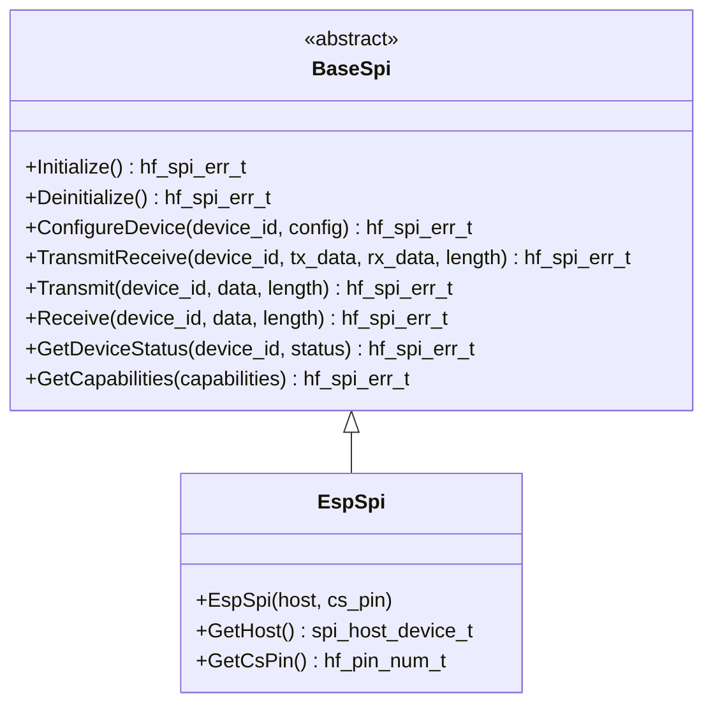

# 🔌 BaseSpi API Reference

<div align="center">


**🔄 Unified SPI abstraction for high-speed serial communication**

**📋 Navigation**

[← Previous: BaseI2c](BaseI2c.md) | [Back to API Index](README.md) | [Next: BaseUart →](BaseUart.md)

</div>

---

## 📚 **Table of Contents**

- [🎯 **Overview**](#-overview)
- [🏗️ **Class Hierarchy**](#-class-hierarchy)
- [📋 **Error Codes**](#-error-codes)
- [🔧 **Core API**](#-core-api)
- [📊 **Data Structures**](#-data-structures)
- [📊 **Usage Examples**](#-usage-examples)
- [🧪 **Best Practices**](#-best-practices)

---

## 🎯 **Overview**

The `BaseSpi` class provides a comprehensive SPI abstraction that serves as the unified interface
for all Serial Peripheral Interface operations in the HardFOC system.
It supports multi-device communication, configurable modes, and high-speed data transfer.

### ✨ **Key Features**

- 🔄 **Multi-Device Support** - Simultaneous communication with multiple SPI devices
- ⚡ **High-Speed Transfer** - Configurable clock frequencies up to 80 MHz
- 🎛️ **Flexible Modes** - Support for all SPI modes (0, 1, 2, 3)
- 📊 **DMA Support** - Hardware-accelerated data transfer
- 🛡️ **Robust Error Handling** - Comprehensive validation and error reporting
- 🏎️ **Performance Optimized** - Minimal overhead for critical applications
- 🔌 **Platform Agnostic** - Works with various SPI hardware implementations
- 📈 **Real-time Control** - Low-latency communication for time-critical applications

### 🔌 **Supported Applications**

| Application | Speed | Description |

|-------------|-------|-------------|

| **Sensor Communication** | 1-10 MHz | Temperature, pressure, IMU sensors |

| **Display Control** | 10-40 MHz | LCD, OLED, TFT displays |

| **Memory Access** | 20-80 MHz | Flash, EEPROM, FRAM |

| **Motor Control** | 1-20 MHz | Motor driver ICs |

| **Audio Codecs** | 1-50 MHz | Digital audio interfaces |

---

## 🏗️ **Class Hierarchy**



---

## 📋 **Error Codes**

### ✅ **Success Codes**

| Code | Value | Description |

|------|-------|-------------|

| `SPI_SUCCESS` | 0 | ✅ Operation completed successfully |

### ❌ **General Error Codes**

| Code | Value | Description | Resolution |

|------|-------|-------------|------------|

| `SPI_ERR_FAILURE` | 1 | ❌ General operation failure | Check hardware and configuration |

| `SPI_ERR_NOT_INITIALIZED` | 2 | ⚠️ SPI not initialized | Call Initialize() first |

| `SPI_ERR_ALREADY_INITIALIZED` | 3 | ⚠️ SPI already initialized | Check initialization state |

| `SPI_ERR_INVALID_PARAMETER` | 4 | 🚫 Invalid parameter | Validate input parameters |

| `SPI_ERR_NULL_POINTER` | 5 | 🚫 Null pointer provided | Check pointer validity |

| `SPI_ERR_OUT_OF_MEMORY` | 6 | 💾 Memory allocation failed | Check system memory |

### 🔧 **Device Error Codes**

| Code | Value | Description | Resolution |

|------|-------|-------------|------------|

| `SPI_ERR_INVALID_DEVICE` | 7 | 🚫 Invalid SPI device | Use valid device numbers |

| `SPI_ERR_DEVICE_BUSY` | 8 | 🔄 Device already in use | Wait or use different device |

| `SPI_ERR_DEVICE_NOT_AVAILABLE` | 9 | ⚠️ Device not available | Check device availability |

| `SPI_ERR_DEVICE_NOT_CONFIGURED` | 10 | ⚙️ Device not configured | Configure device first |

| `SPI_ERR_DEVICE_NOT_RESPONDING` | 11 | 🔇 Device not responding | Check device power |

### ⚡ **Transfer Error Codes**

| Code | Value | Description | Resolution |

|------|-------|-------------|------------|

| `SPI_ERR_TRANSFER_TIMEOUT` | 12 | ⏰ Transfer timeout | Check clock frequency and device |

| `SPI_ERR_TRANSFER_FAILURE` | 13 | ❌ Transfer failed | Check connections and device state |

| `SPI_ERR_TRANSFER_INCOMPLETE` | 14 | 📊 Transfer incomplete | Check data length and buffer size |

| `SPI_ERR_TRANSFER_ABORTED` | 15 | ⏹️ Transfer aborted | Check abort conditions |

### 🎛️ **Configuration Error Codes**

| Code | Value | Description | Resolution |

|------|-------|-------------|------------|

| `SPI_ERR_INVALID_CONFIGURATION` | 16 | ⚙️ Invalid configuration | Check configuration parameters |

| `SPI_ERR_UNSUPPORTED_MODE` | 17 | 🚫 Unsupported SPI mode | Use supported mode |

| `SPI_ERR_UNSUPPORTED_FREQUENCY` | 18 | 🚫 Unsupported frequency | Use supported frequency range |

| `SPI_ERR_UNSUPPORTED_DATA_SIZE` | 19 | 🚫 Unsupported data size | Use supported data size |

| `SPI_ERR_PIN_CONFLICT` | 20 | 🔌 Pin already in use | Use different pins |

### 🌐 **Hardware Error Codes**

| Code | Value | Description | Resolution |

|------|-------|-------------|------------|

| `SPI_ERR_HARDWARE_FAULT` | 21 | 💥 Hardware fault | Check power and connections |

| `SPI_ERR_COMMUNICATION_FAILURE` | 22 | 📡 Communication failure | Check bus connections |

| `SPI_ERR_DMA_ERROR` | 23 | 💾 DMA error | Check DMA configuration |

| `SPI_ERR_RESOURCE_BUSY` | 24 | 🔄 Resource busy | Wait for resource availability |

---

## 🔧 **Core API**

### 🏗️ **Initialization Methods**

```cpp
/**
 * @brief Initialize the SPI peripheral
 * @return hf_spi_err_t error code
 * 
 * 📝 Sets up SPI hardware, configures devices, and prepares for communication.
 * Must be called before any SPI operations.
 * 
 * @example
 * EspSpi spi(SPI2_HOST, 5);  // SPI2, CS on pin 5
 * hf_spi_err_t result = spi.Initialize();
 * if (result == hf_spi_err_t::SPI_SUCCESS) {
 *     // SPI ready for use
 * }
 */
virtual hf_spi_err_t Initialize() noexcept = 0;

/**
 * @brief Deinitialize the SPI peripheral
 * @return hf_spi_err_t error code
 * 
 * 🧹 Cleanly shuts down SPI hardware and releases resources.
 */
virtual hf_spi_err_t Deinitialize() noexcept = 0;

/**
 * @brief Check if SPI is initialized
 * @return true if initialized, false otherwise
 * 
 * ❓ Query initialization status without side effects.
 */
[[nodiscard]] bool IsInitialized() const noexcept;

/**
 * @brief Ensure SPI is initialized (lazy initialization)
 * @return true if initialized successfully, false otherwise
 * 
 * 🔄 Automatically initializes SPI if not already initialized.
 */
bool EnsureInitialized() noexcept;
```

### ⚙️ **Device Configuration**

```cpp
/**
 * @brief Configure an SPI device
 * @param device_id Device identifier
 * @param config Device configuration structure
 * @return hf_spi_err_t error code
 * 
 * ⚙️ Configures device parameters including mode, frequency, data size,
 * and pin assignments.
 * 
 * @example
 * hf_spi_device_config_t config;
 * config.mode = hf_spi_mode_t::MODE_0;
 * config.frequency_hz = 1000000;  // 1 MHz
 * config.data_size = hf_spi_data_size_t::DATA_8BIT;
 * config.cs_pin = 5;
 * config.cs_active_low = true;
 * 
 * hf_spi_err_t result = spi.ConfigureDevice(0, config);
 */
virtual hf_spi_err_t ConfigureDevice(uint8_t device_id,
                                   const hf_spi_device_config_t &config) noexcept = 0;
```

### 🔄 **Data Transfer Methods**

```cpp
/**
 * @brief Transmit and receive data simultaneously
 * @param device_id Device identifier
 * @param tx_data Transmit data buffer
 * @param rx_data Receive data buffer
 * @param length Number of bytes to transfer
 * @return hf_spi_err_t error code
 * 
 * 🔄 Performs full-duplex SPI transfer. Both transmit and receive
 * buffers must be at least 'length' bytes.
 * 
 * @example
 * uint8_t tx_data[] = {0x01, 0x02, 0x03};
 * uint8_t rx_data[3];
 * hf_spi_err_t result = spi.TransmitReceive(0, tx_data, rx_data, 3);
 * if (result == hf_spi_err_t::SPI_SUCCESS) {
 *     printf("Received: %02X %02X %02X\n", rx_data[0], rx_data[1], rx_data[2]);
 * }
 */
virtual hf_spi_err_t TransmitReceive(uint8_t device_id, const uint8_t *tx_data,
                                   uint8_t *rx_data, size_t length) noexcept = 0;

/**
 * @brief Transmit data only
 * @param device_id Device identifier
 * @param data Transmit data buffer
 * @param length Number of bytes to transmit
 * @return hf_spi_err_t error code
 * 
 * 📤 Performs SPI transmit operation. Receive data is discarded.
 * 
 * @example
 * uint8_t command[] = {0xAA, 0x55, 0x01};
 * hf_spi_err_t result = spi.Transmit(0, command, 3);
 */
virtual hf_spi_err_t Transmit(uint8_t device_id, const uint8_t *data,
                            size_t length) noexcept = 0;

/**
 * @brief Receive data only
 * @param device_id Device identifier
 * @param data Receive data buffer
 * @param length Number of bytes to receive
 * @return hf_spi_err_t error code
 * 
 * 📥 Performs SPI receive operation. Transmit data is zeros.
 * 
 * @example
 * uint8_t response[4];
 * hf_spi_err_t result = spi.Receive(0, response, 4);
 */
virtual hf_spi_err_t Receive(uint8_t device_id, uint8_t *data,
                           size_t length) noexcept = 0;
```

### 📊 **Status and Capabilities**

```cpp
/**
 * @brief Get device status information
 * @param device_id Device identifier
 * @param status [out] Status information structure
 * @return hf_spi_err_t error code
 * 
 * 📊 Retrieves comprehensive status information about a device.
 */
virtual hf_spi_err_t GetDeviceStatus(uint8_t device_id,
                                   hf_spi_device_status_t &status) const noexcept = 0;

/**
 * @brief Get SPI capabilities
 * @param capabilities [out] Capability information structure
 * @return hf_spi_err_t error code
 * 
 * 📋 Retrieves hardware capabilities and limitations.
 */
virtual hf_spi_err_t GetCapabilities(hf_spi_capabilities_t &capabilities) const noexcept = 0;
```

---

## 📊 **Data Structures**

### ⚙️ **Device Configuration**

```cpp
struct hf_spi_device_config_t {
    hf_spi_mode_t mode;              ///< SPI mode (0-3)
    uint32_t frequency_hz;           ///< Clock frequency in Hz
    hf_spi_data_size_t data_size;    ///< Data size (8, 16, 32 bit)
    hf_pin_num_t cs_pin;             ///< Chip select pin
    bool cs_active_low;              ///< CS active low (true) or high (false)
    hf_spi_bit_order_t bit_order;    ///< Bit order (MSB or LSB first)
    uint32_t timeout_ms;             ///< Transfer timeout in milliseconds
    bool use_dma;                    ///< Use DMA for transfers
};
```

### 📊 **Device Status**

```cpp
struct hf_spi_device_status_t {
    bool is_configured;        ///< Device is configured
    bool is_busy;              ///< Device is currently busy
    hf_spi_mode_t current_mode; ///< Current SPI mode
    uint32_t current_frequency; ///< Current frequency in Hz
    uint32_t bytes_transferred; ///< Total bytes transferred
    uint32_t transfer_errors;   ///< Number of transfer errors
    hf_spi_err_t last_error;    ///< Last error that occurred
    uint32_t timestamp_us;      ///< Timestamp of last operation
};
```

### 📋 **SPI Capabilities**

```cpp
struct hf_spi_capabilities_t {
    uint8_t max_devices;           ///< Maximum number of devices
    uint32_t min_frequency_hz;     ///< Minimum frequency
    uint32_t max_frequency_hz;     ///< Maximum frequency
    uint8_t supported_modes;       ///< Bit mask of supported modes
    uint8_t supported_data_sizes;  ///< Bit mask of supported data sizes
    bool supports_dma;             ///< Supports DMA transfers
    bool supports_quad_spi;        ///< Supports quad SPI
    uint32_t max_transfer_size;    ///< Maximum transfer size in bytes
};
```

### 📈 **SPI Statistics**

```cpp
struct hf_spi_statistics_t {
    uint32_t total_transfers;      ///< Total transfers performed
    uint32_t successful_transfers; ///< Successful transfers
    uint32_t failed_transfers;     ///< Failed transfers
    uint32_t bytes_transmitted;    ///< Total bytes transmitted
    uint32_t bytes_received;       ///< Total bytes received
    uint32_t average_transfer_time_us; ///< Average transfer time
    uint32_t max_transfer_time_us; ///< Maximum transfer time
    uint32_t min_transfer_time_us; ///< Minimum transfer time
    uint32_t timeout_errors;       ///< Timeout errors
    uint32_t communication_errors; ///< Communication errors
};
```

---

## 📊 **Usage Examples**

### 📡 **Sensor Communication**

```cpp
#include "mcu/esp32/EspSpi.h"
#include "utils/memory_utils.h"

class SensorController {
private:
    EspSpi spi*;
    static constexpr uint8_t SENSOR_DEVICE = 0;
    
public:
    bool initialize() {
        spi* = EspSpi(SPI2_HOST, 5);  // SPI2, CS on pin 5
        
        if (!spi*.EnsureInitialized()) {
            printf("❌ SPI initialization failed\n");
            return false;
        }
        
        // Configure for sensor communication
        hf_spi_device_config_t config;
        config.mode = hf_spi_mode_t::MODE_0;
        config.frequency_hz = 1000000;  // 1 MHz
        config.data_size = hf_spi_data_size_t::DATA_8BIT;
        config.cs_pin = 5;
        config.cs_active_low = true;
        config.bit_order = hf_spi_bit_order_t::MSB_FIRST;
        config.timeout_ms = 100;
        config.use_dma = false;
        
        hf_spi_err_t result = spi*.ConfigureDevice(SENSOR_DEVICE, config);
        if (result != hf_spi_err_t::SPI_SUCCESS) {
            printf("❌ Sensor configuration failed: %s\n", HfSpiErrToString(result));
            return false;
        }
        
        printf("✅ Sensor controller initialized\n");
        return true;
    }
    
    uint16_t read_temperature() {
        // Send temperature read command
        uint8_t tx_cmd[] = {0x03, 0x00, 0x00};  // Read temperature command
        uint8_t rx_data[3];
        
        hf_spi_err_t result = spi*.TransmitReceive(SENSOR_DEVICE, tx_cmd, rx_data, 3);
        if (result != hf_spi_err_t::SPI_SUCCESS) {
            printf("❌ Temperature read failed: %s\n", HfSpiErrToString(result));
            return 0xFFFF;  // Error value
        }
        
        // Convert response to temperature (example conversion)
        uint16_t raw_temp = (rx_data[1] << 8) | rx_data[2];
        float temperature = (raw_temp * 175.0f / 65535.0f) - 45.0f;
        
        printf("🌡️ Temperature: %.1f°C\n", temperature);
        return raw_temp;
    }
    
    void write_config(uint8_t config_register, uint8_t value) {
        // Send configuration write command
        uint8_t tx_data[] = {0x02, config_register, value};  // Write command
        uint8_t rx_data[3];
        
        hf_spi_err_t result = spi*.TransmitReceive(SENSOR_DEVICE, tx_data, rx_data, 3);
        if (result == hf_spi_err_t::SPI_SUCCESS) {
            printf("✅ Config written: 0x%02X = 0x%02X\n", config_register, value);
        } else {
            printf("❌ Config write failed: %s\n", HfSpiErrToString(result));
        }
    }
    
    void read_sensor_data(uint8_t* data, size_t length) {
        // Read sensor data using nothrow allocation
        uint8_t tx_cmd[] = {0x04, 0x00};  // Read data command
        auto rx_data = hf::utils::make_unique_array_nothrow<uint8_t>(length + 2);
        if (!rx_data) {
            printf("❌ Failed to allocate memory for receive buffer\n");
            return;
        }
        
        hf_spi_err_t result = spi*.TransmitReceive(SENSOR_DEVICE, tx_cmd, rx_data.get(), length + 2);
        if (result == hf_spi_err_t::SPI_SUCCESS) {
            // Copy data (skip command bytes)
            memcpy(data, rx_data.get() + 2, length);
            printf("📊 Read %zu bytes of sensor data\n", length);
        } else {
            printf("❌ Sensor data read failed: %s\n", HfSpiErrToString(result));
        }
        
        // rx_data automatically cleaned up when going out of scope
    }
};
```

### 🖥️ **Display Control**

```cpp
#include "mcu/esp32/EspSpi.h"
#include "utils/memory_utils.h"

class DisplayController {
private:
    EspSpi spi*;
    static constexpr uint8_t DISPLAY_DEVICE = 0;
    static constexpr uint16_t DISPLAY_WIDTH = 240;
    static constexpr uint16_t DISPLAY_HEIGHT = 320;
    
public:
    bool initialize() {
        spi* = EspSpi(SPI2_HOST, 15);  // SPI2, CS on pin 15
        
        if (!spi*.EnsureInitialized()) {
            return false;
        }
        
        // Configure for display communication
        hf_spi_device_config_t config;
        config.mode = hf_spi_mode_t::MODE_0;
        config.frequency_hz = 40000000;  // 40 MHz for display
        config.data_size = hf_spi_data_size_t::DATA_8BIT;
        config.cs_pin = 15;
        config.cs_active_low = true;
        config.bit_order = hf_spi_bit_order_t::MSB_FIRST;
        config.timeout_ms = 1000;
        config.use_dma = true;  // Use DMA for large transfers
        
        hf_spi_err_t result = spi*.ConfigureDevice(DISPLAY_DEVICE, config);
        if (result != hf_spi_err_t::SPI_SUCCESS) {
            printf("❌ Display configuration failed\n");
            return false;
        }
        
        // Initialize display
        init_display();
        printf("✅ Display controller initialized\n");
        return true;
    }
    
private:
    void init_display() {
        // Display initialization sequence
        uint8_t init_commands[] = {
            0x01, 0x00,  // Software reset
            0x11, 0x00,  // Sleep out
            0x29, 0x00   // Display on
        };
        
        for (size_t i = 0; i < sizeof(init_commands); i += 2) {
            send_command(init_commands[i]);
            if (init_commands[i + 1] != 0) {
                send_data(&init_commands[i + 1], 1);
            }
            vTaskDelay(pdMS_TO_TICKS(10));
        }
    }
    
    void send_command(uint8_t command) {
        // Set DC pin low for command
        gpio_set_level(16, 0);  // DC pin on GPIO 16
        
        uint8_t rx_data;
        hf_spi_err_t result = spi*.TransmitReceive(DISPLAY_DEVICE, &command, &rx_data, 1);
        if (result != hf_spi_err_t::SPI_SUCCESS) {
            printf("❌ Command send failed: %s\n", HfSpiErrToString(result));
        }
    }
    
    void send_data(const uint8_t* data, size_t length) {
        // Set DC pin high for data
        gpio_set_level(16, 1);  // DC pin on GPIO 16
        
        auto rx_data = hf::utils::make_unique_array_nothrow<uint8_t>(length);
        if (!rx_data) {
            printf("❌ Failed to allocate memory for receive buffer\n");
            return;
        }
        
        hf_spi_err_t result = spi*.TransmitReceive(DISPLAY_DEVICE, data, rx_data.get(), length);
        if (result != hf_spi_err_t::SPI_SUCCESS) {
            printf("❌ Data send failed: %s\n", HfSpiErrToString(result));
        }
        
        // rx_data automatically cleaned up when going out of scope
    }
    
public:
    void set_window(uint16_t x_start, uint16_t y_start, uint16_t x_end, uint16_t y_end) {
        // Set display window for drawing
        uint8_t caset_cmd[] = {0x2A, 0x00, (x_start >> 8) & 0xFF, x_start & 0xFF,
                              0x00, (x_end >> 8) & 0xFF, x_end & 0xFF};
        uint8_t raset_cmd[] = {0x2B, 0x00, (y_start >> 8) & 0xFF, y_start & 0xFF,
                              0x00, (y_end >> 8) & 0xFF, y_end & 0xFF};
        
        send_command(0x2A);  // Column address set
        send_data(caset_cmd + 1, 6);
        
        send_command(0x2B);  // Row address set
        send_data(raset_cmd + 1, 6);
        
        send_command(0x2C);  // Memory write
    }
    
    void fill_screen(uint16_t color) {
        set_window(0, 0, DISPLAY_WIDTH - 1, DISPLAY_HEIGHT - 1);
        
        // Prepare color data
        uint8_t color_data[2] = {(color >> 8) & 0xFF, color & 0xFF};
        
        // Fill screen with color
        for (int i = 0; i < DISPLAY_WIDTH * DISPLAY_HEIGHT; i++) {
            send_data(color_data, 2);
        }
    }
    
    void draw_pixel(uint16_t x, uint16_t y, uint16_t color) {
        set_window(x, y, x, y);
        
        uint8_t color_data[2] = {(color >> 8) & 0xFF, color & 0xFF};
        send_data(color_data, 2);
    }
};
```

### 💾 **Memory Access**

```cpp
#include "mcu/esp32/EspSpi.h"
#include "utils/memory_utils.h"

class MemoryController {
private:
    EspSpi spi*;
    static constexpr uint8_t MEMORY_DEVICE = 0;
    static constexpr uint32_t MEMORY_SIZE = 1024 * 1024;  // 1MB
    
public:
    bool initialize() {
        spi* = EspSpi(SPI2_HOST, 5);  // SPI2, CS on pin 5
        
        if (!spi*.EnsureInitialized()) {
            return false;
        }
        
        // Configure for memory access
        hf_spi_device_config_t config;
        config.mode = hf_spi_mode_t::MODE_0;
        config.frequency_hz = 80000000;  // 80 MHz for fast memory access
        config.data_size = hf_spi_data_size_t::DATA_8BIT;
        config.cs_pin = 5;
        config.cs_active_low = true;
        config.bit_order = hf_spi_bit_order_t::MSB_FIRST;
        config.timeout_ms = 100;
        config.use_dma = true;
        
        hf_spi_err_t result = spi*.ConfigureDevice(MEMORY_DEVICE, config);
        if (result != hf_spi_err_t::SPI_SUCCESS) {
            printf("❌ Memory configuration failed\n");
            return false;
        }
        
        printf("✅ Memory controller initialized\n");
        return true;
    }
    
    bool read_memory(uint32_t address, uint8_t* data, size_t length) {
        // Send read command using nothrow allocation
        uint8_t tx_cmd[] = {0x03, (address >> 16) & 0xFF, (address >> 8) & 0xFF, address & 0xFF};
        auto rx_data = hf::utils::make_unique_array_nothrow<uint8_t>(length + 4);
        if (!rx_data) {
            printf("❌ Failed to allocate memory for receive buffer\n");
            return false;
        }
        
        hf_spi_err_t result = spi*.TransmitReceive(MEMORY_DEVICE, tx_cmd, rx_data.get(), length + 4);
        if (result == hf_spi_err_t::SPI_SUCCESS) {
            // Copy data (skip command bytes)
            memcpy(data, rx_data.get() + 4, length);
            printf("📖 Read %zu bytes from address 0x%06X\n", length, address);
            return true;
        } else {
            printf("❌ Memory read failed: %s\n", HfSpiErrToString(result));
            return false;
        }
        // rx_data automatically cleaned up when going out of scope
    }
    
    bool write_memory(uint32_t address, const uint8_t* data, size_t length) {
        // Send write enable command
        uint8_t write_enable = 0x06;
        uint8_t rx_data;
        hf_spi_err_t result = spi*.TransmitReceive(MEMORY_DEVICE, &write_enable, &rx_data, 1);
        if (result != hf_spi_err_t::SPI_SUCCESS) {
            printf("❌ Write enable failed\n");
            return false;
        }
        
        // Send write command using nothrow allocation
        auto tx_data = hf::utils::make_unique_array_nothrow<uint8_t>(length + 4);
        if (!tx_data) {
            printf("❌ Failed to allocate memory for transmit buffer\n");
            return false;
        }
        
        tx_data[0] = 0x02;  // Page program command
        tx_data[1] = (address >> 16) & 0xFF;
        tx_data[2] = (address >> 8) & 0xFF;
        tx_data[3] = address & 0xFF;
        memcpy(tx_data.get() + 4, data, length);
        
        result = spi*.Transmit(MEMORY_DEVICE, tx_data.get(), length + 4);
        if (result == hf_spi_err_t::SPI_SUCCESS) {
            printf("✍️ Wrote %zu bytes to address 0x%06X\n", length, address);
            return true;
        } else {
            printf("❌ Memory write failed: %s\n", HfSpiErrToString(result));
            return false;
        }
        // tx_data automatically cleaned up when going out of scope
    }
    
    bool erase_sector(uint32_t address) {
        // Send write enable command
        uint8_t write_enable = 0x06;
        uint8_t rx_data;
        hf_spi_err_t result = spi*.TransmitReceive(MEMORY_DEVICE, &write_enable, &rx_data, 1);
        if (result != hf_spi_err_t::SPI_SUCCESS) {
            printf("❌ Write enable failed\n");
            return false;
        }
        
        // Send sector erase command
        uint8_t erase_cmd[] = {0x20, (address >> 16) & 0xFF, (address >> 8) & 0xFF, address & 0xFF};
        result = spi*.Transmit(MEMORY_DEVICE, erase_cmd, 4);
        if (result == hf_spi_err_t::SPI_SUCCESS) {
            printf("🗑️ Erased sector at address 0x%06X\n", address);
            return true;
        } else {
            printf("❌ Sector erase failed: %s\n", HfSpiErrToString(result));
            return false;
        }
    }
    
    uint32_t read_device_id() {
        uint8_t tx_cmd[] = {0x90, 0x00, 0x00, 0x00};  // Read ID command
        uint8_t rx_data[4];
        
        hf_spi_err_t result = spi*.TransmitReceive(MEMORY_DEVICE, tx_cmd, rx_data, 4);
        if (result == hf_spi_err_t::SPI_SUCCESS) {
            uint32_t device_id = (rx_data[1] << 16) | (rx_data[2] << 8) | rx_data[3];
            printf("🆔 Device ID: 0x%06X\n", device_id);
            return device_id;
        } else {
            printf("❌ Device ID read failed: %s\n", HfSpiErrToString(result));
            return 0;
        }
    }
};
```

---

## 🧪 **Best Practices**

### ✅ **Recommended Patterns**

```cpp
// ✅ Always check initialization
if (!spi.EnsureInitialized()) {
    printf("❌ SPI initialization failed\n");
    return false;
}

// ✅ Validate device configuration
hf_spi_capabilities_t caps;
if (spi.GetCapabilities(caps) == hf_spi_err_t::SPI_SUCCESS) {
    if (device_id >= caps.max_devices) {
        printf("❌ Device %u exceeds maximum (%u)\n", device_id, caps.max_devices);
        return;
    }
}

// ✅ Use appropriate frequency for your application
// Sensors: 1-10 MHz
// Displays: 10-40 MHz
// Memory: 20-80 MHz

// ✅ Handle transfer errors gracefully
hf_spi_err_t result = spi.TransmitReceive(device_id, tx_data, rx_data, length);
if (result != hf_spi_err_t::SPI_SUCCESS) {
    printf("⚠️ SPI Error: %s\n", HfSpiErrToString(result));
    // Implement retry logic or error recovery
}

// ✅ Use DMA for large transfers
config.use_dma = (length > 32);  // Use DMA for transfers > 32 bytes

// ✅ Check device status before operations
hf_spi_device_status_t status;
if (spi.GetDeviceStatus(device_id, status) == hf_spi_err_t::SPI_SUCCESS) {
    if (status.is_busy) {
        printf("⏳ Device %u is busy\n", device_id);
        return;
    }
}
```

### ❌ **Common Pitfalls**

```cpp
// ❌ Don't ignore initialization
spi.TransmitReceive(0, tx_data, rx_data, length);  // May fail silently

// ❌ Don't use invalid frequencies
spi.ConfigureDevice(0, {mode: MODE_0, frequency_hz: 100000000});  // Too high

// ❌ Don't use invalid device numbers
spi.ConfigureDevice(99, config);  // Invalid device

// ❌ Don't ignore transfer timeouts
// Large transfers may timeout - check return values

// ❌ Don't assume all modes are supported
// Check capabilities before using specific modes

// ❌ Don't forget to handle CS pin manually when needed
// Some devices require manual CS control
```

### 🎯 **Performance Optimization**

```cpp
// 🚀 Use appropriate frequency for your application
// Higher frequency = faster transfers but may cause errors

// 🚀 Use DMA for large transfers
// DMA reduces CPU overhead for transfers > 32 bytes

// 🚀 Minimize CS toggling
// Keep CS low for multiple transfers to the same device

// 🚀 Use appropriate data size
// 8-bit: Most common, good compatibility
// 16-bit: Faster for 16-bit data
// 32-bit: Fastest for 32-bit data

// 🚀 Batch operations when possible
// Configure all devices before starting transfers

// 🚀 Use appropriate timeout values
// Short timeouts for fast devices
// Longer timeouts for slow devices
```

---

## 🔗 **Navigation**

### **Documentation Structure**

- **[🏠 Main Documentation](../README.md)** - Complete system overview
- **[📋 API Interfaces](README.md)** - Base classes and interfaces overview
- **[🔧 ESP32 Implementations](../esp_api/README.md)** - Hardware-specific implementations
- **[🧪 Test Suites](../../examples/esp32/docs/README.md)** - Testing and validation

### **Related Documentation**

- **[EspSpi Implementation](../esp_api/EspSpi.md)** - ESP32-C6 SPI implementation
- **[SPI Comprehensive Tests](../../examples/esp32/docs/README_SPI_TEST.md)** - Complete SPI validation
- **[Hardware Types](HardwareTypes.md)** - Type definitions and validation
- **[ESP-IDF SPI Master Driver](https://docs.espressif.com/projects/esp-idf/en/release-v5.5/esp32c6/api-reference/peripherals/spi_master.html)** - Official ESP-IDF docs

---

<div align="center">

**📋 Navigation**

[← Previous: BaseI2c](BaseI2c.md) | [Back to API Index](README.md) | [Next: BaseUart →](BaseUart.md)

</div>

**🔌 BaseSpi - High-Speed Serial Communication for HardFOC**

*Part of the HardFOC Internal Interface Wrapper Documentation*

</div> 