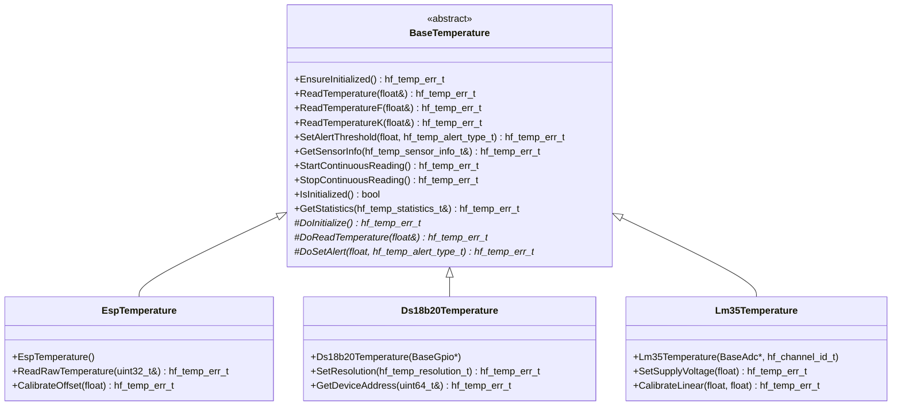

# 🌡️ BaseTemperature API Reference

<div align="center">


**🎯 Unified temperature sensing abstraction for all thermal monitoring operations**

</div>

---

## 📚 **Table of Contents**

- [🎯 **Overview**](#-overview)
- [🏗️ **Class Hierarchy**](#️-class-hierarchy)
- [📋 **Error Codes**](#-error-codes)
- [🔧 **Core API**](#-core-api)
- [📊 **Data Structures**](#-data-structures)
- [🌡️ **Temperature Units**](#️-temperature-units)
- [📊 **Usage Examples**](#-usage-examples)
- [🧪 **Best Practices**](#-best-practices)

---

## 🎯 **Overview**

The `BaseTemperature` class provides a comprehensive temperature sensing abstraction that serves as the unified interface for all thermal monitoring operations in the HardFOC system. It supports multiple sensor types, calibration, alert thresholds, and temperature unit conversions across different hardware implementations.

### ✨ **Key Features**

- 🌡️ **Multi-Sensor Support** - Support for various temperature sensor types
- 🎯 **Hardware Abstraction** - Works with internal and external temperature sensors
- ⚡ **High-Precision Reading** - Accurate temperature measurements with calibration
- 🔄 **Unit Conversion** - Celsius, Fahrenheit, and Kelvin support
- 📈 **Alert System** - Configurable temperature thresholds and alerts
- 🛡️ **Robust Error Handling** - Comprehensive validation and error reporting
- 🏎️ **Performance Optimized** - Minimal overhead for real-time applications
- 🔌 **Platform Agnostic** - Works across different MCU platforms

### 📊 **Supported Hardware**

| Implementation | Sensor Type | Range | Resolution | Accuracy |
|----------------|-------------|-------|------------|----------|
| `EspTemperature` | ESP32-C6 Internal | -40°C to +125°C | 0.1°C | ±2°C |
| `Ds18b20Temperature` | Digital OneWire | -55°C to +125°C | 0.0625°C | ±0.5°C |
| `Lm35Temperature` | Analog Linear | -55°C to +150°C | 0.1°C | ±1°C |
| `Ntc10kTemperature` | Analog Thermistor | -40°C to +125°C | 0.1°C | ±1°C |

---

## 🏗️ **Class Hierarchy**



---

## 📋 **Error Codes**

### 🚨 **Temperature Error Enumeration**

```cpp
enum class hf_temp_err_t : hf_u32_t {
    // Success codes
    TEMP_SUCCESS = 0,
    
    // General errors
    TEMP_ERR_FAILURE = 1,
    TEMP_ERR_NOT_INITIALIZED = 2,
    TEMP_ERR_ALREADY_INITIALIZED = 3,
    TEMP_ERR_INVALID_PARAMETER = 4,
    TEMP_ERR_NULL_POINTER = 5,
    TEMP_ERR_OUT_OF_MEMORY = 6,
    
    // Sensor specific errors
    TEMP_ERR_SENSOR_NOT_AVAILABLE = 7,
    TEMP_ERR_SENSOR_BUSY = 8,
    TEMP_ERR_SENSOR_DISABLED = 9,
    TEMP_ERR_SENSOR_NOT_READY = 10,
    
    // Reading errors
    TEMP_ERR_READ_FAILED = 11,
    TEMP_ERR_READ_TIMEOUT = 12,
    TEMP_ERR_READ_CRC_ERROR = 13,
    TEMP_ERR_TEMPERATURE_OUT_OF_RANGE = 14,
    
    // Calibration errors
    TEMP_ERR_CALIBRATION_FAILED = 15,
    TEMP_ERR_CALIBRATION_INVALID = 16,
    TEMP_ERR_CALIBRATION_NOT_AVAILABLE = 17,
    
    // Alert errors
    TEMP_ERR_ALERT_NOT_SUPPORTED = 18,
    TEMP_ERR_ALERT_THRESHOLD_INVALID = 19,
    TEMP_ERR_ALERT_ALREADY_SET = 20,
    
    // Communication errors
    TEMP_ERR_COMMUNICATION_FAILURE = 21,
    TEMP_ERR_DEVICE_NOT_RESPONDING = 22,
    TEMP_ERR_BUS_ERROR = 23,
    
    // System errors
    TEMP_ERR_SYSTEM_ERROR = 24,
    TEMP_ERR_PERMISSION_DENIED = 25,
    TEMP_ERR_OPERATION_ABORTED = 26
};
```

### 📊 **Error Code Categories**

| Category | Range | Description |
|----------|-------|-------------|
| **Success** | 0 | Successful operation |
| **General** | 1-6 | Basic initialization and parameter errors |
| **Sensor** | 7-10 | Sensor availability and status errors |
| **Reading** | 11-14 | Temperature measurement errors |
| **Calibration** | 15-17 | Calibration and accuracy errors |
| **Alert** | 18-20 | Temperature alert configuration errors |
| **Communication** | 21-23 | Sensor communication errors |
| **System** | 24-26 | System-level errors |

---

## 🔧 **Core API**

### 🎯 **Essential Methods**

#### **Initialization**
```cpp
/**
 * @brief Ensure the temperature sensor is initialized
 * @return hf_temp_err_t Error code
 */
virtual hf_temp_err_t EnsureInitialized() = 0;

/**
 * @brief Check if the temperature sensor is initialized
 * @return bool True if initialized
 */
virtual bool IsInitialized() const = 0;
```

#### **Temperature Reading**
```cpp
/**
 * @brief Read temperature in Celsius
 * @param temperature_c Output temperature in degrees Celsius
 * @return hf_temp_err_t Error code
 */
virtual hf_temp_err_t ReadTemperature(float& temperature_c) = 0;

/**
 * @brief Read temperature in Fahrenheit
 * @param temperature_f Output temperature in degrees Fahrenheit
 * @return hf_temp_err_t Error code
 */
virtual hf_temp_err_t ReadTemperatureF(float& temperature_f) = 0;

/**
 * @brief Read temperature in Kelvin
 * @param temperature_k Output temperature in Kelvin
 * @return hf_temp_err_t Error code
 */
virtual hf_temp_err_t ReadTemperatureK(float& temperature_k) = 0;
```

#### **Alert Management**
```cpp
/**
 * @brief Set temperature alert threshold
 * @param threshold_c Threshold temperature in Celsius
 * @param alert_type Type of alert (high/low/both)
 * @return hf_temp_err_t Error code
 */
virtual hf_temp_err_t SetAlertThreshold(float threshold_c, 
                                      hf_temp_alert_type_t alert_type) = 0;

/**
 * @brief Check if alert condition is active
 * @param alert_active Output alert status
 * @return hf_temp_err_t Error code
 */
virtual hf_temp_err_t IsAlertActive(bool& alert_active) = 0;
```

#### **Continuous Monitoring**
```cpp
/**
 * @brief Start continuous temperature reading
 * @param interval_ms Reading interval in milliseconds
 * @return hf_temp_err_t Error code
 */
virtual hf_temp_err_t StartContinuousReading(hf_u32_t interval_ms = 1000) = 0;

/**
 * @brief Stop continuous temperature reading
 * @return hf_temp_err_t Error code
 */
virtual hf_temp_err_t StopContinuousReading() = 0;
```

---

## 📊 **Data Structures**

### 🌡️ **Temperature Alert Types**

```cpp
enum class hf_temp_alert_type_t : hf_u8_t {
    TEMP_ALERT_NONE = 0,        ///< No alert
    TEMP_ALERT_HIGH = 1,        ///< High temperature alert
    TEMP_ALERT_LOW = 2,         ///< Low temperature alert
    TEMP_ALERT_BOTH = 3         ///< Both high and low alerts
};
```

### 📊 **Sensor Information**

```cpp
struct hf_temp_sensor_info_t {
    hf_u32_t sensor_id;                    ///< Unique sensor identifier
    char sensor_name[32];                  ///< Sensor name string
    float min_temperature_c;               ///< Minimum measurable temperature
    float max_temperature_c;               ///< Maximum measurable temperature
    float resolution_c;                    ///< Temperature resolution
    float accuracy_c;                      ///< Temperature accuracy
    hf_u32_t response_time_ms;             ///< Sensor response time
    bool supports_alerts;                  ///< Alert capability
    bool supports_continuous;              ///< Continuous reading capability
};
```

### 📈 **Temperature Statistics**

```cpp
struct hf_temp_statistics_t {
    hf_u32_t total_reads;                  ///< Total number of reads
    hf_u32_t successful_reads;             ///< Successful reads count
    hf_u32_t failed_reads;                 ///< Failed reads count
    float min_temperature_c;               ///< Minimum recorded temperature
    float max_temperature_c;               ///< Maximum recorded temperature
    float avg_temperature_c;               ///< Average temperature
    hf_u32_t last_read_time_ms;            ///< Last reading timestamp
    hf_u32_t total_alerts_triggered;       ///< Total alerts triggered
};
```

---

## 🌡️ **Temperature Units**

### 🔄 **Unit Conversion Functions**

```cpp
/**
 * @brief Convert Celsius to Fahrenheit
 * @param celsius Temperature in Celsius
 * @return float Temperature in Fahrenheit
 */
static inline float CelsiusToFahrenheit(float celsius) {
    return (celsius * 9.0f / 5.0f) + 32.0f;
}

/**
 * @brief Convert Celsius to Kelvin
 * @param celsius Temperature in Celsius
 * @return float Temperature in Kelvin
 */
static inline float CelsiusToKelvin(float celsius) {
    return celsius + 273.15f;
}

/**
 * @brief Convert Fahrenheit to Celsius
 * @param fahrenheit Temperature in Fahrenheit
 * @return float Temperature in Celsius
 */
static inline float FahrenheitToCelsius(float fahrenheit) {
    return (fahrenheit - 32.0f) * 5.0f / 9.0f;
}
```

---

## 📊 **Usage Examples**

### 🔥 **Basic Temperature Reading**

```cpp
#include "inc/mcu/esp32/EspTemperature.h"

class ThermalMonitor {
private:
    EspTemperature temp_sensor_;
    
public:
    bool initialize() {
        return temp_sensor_.EnsureInitialized() == hf_temp_err_t::TEMP_SUCCESS;
    }
    
    void read_temperature() {
        float temperature_c;
        
        if (temp_sensor_.ReadTemperature(temperature_c) == hf_temp_err_t::TEMP_SUCCESS) {
            printf("🌡️ Temperature: %.2f°C\n", temperature_c);
            
            // Convert to other units
            float temp_f = BaseTemperature::CelsiusToFahrenheit(temperature_c);
            float temp_k = BaseTemperature::CelsiusToKelvin(temperature_c);
            
            printf("   Fahrenheit: %.2f°F\n", temp_f);
            printf("   Kelvin: %.2f K\n", temp_k);
        } else {
            printf("❌ Failed to read temperature\n");
        }
    }
};
```

### 🚨 **Temperature Alert System**

```cpp
#include "inc/external/Ds18b20Temperature.h"

class TemperatureAlertSystem {
private:
    Ds18b20Temperature temp_sensor_;
    bool alert_callback_registered_;
    
public:
    TemperatureAlertSystem(BaseGpio* one_wire_pin) 
        : temp_sensor_(one_wire_pin)
        , alert_callback_registered_(false) {}
    
    bool setup_thermal_protection() {
        // Initialize sensor
        if (temp_sensor_.EnsureInitialized() != hf_temp_err_t::TEMP_SUCCESS) {
            return false;
        }
        
        // Set high temperature alert at 85°C
        if (temp_sensor_.SetAlertThreshold(85.0f, 
                                         hf_temp_alert_type_t::TEMP_ALERT_HIGH) 
            != hf_temp_err_t::TEMP_SUCCESS) {
            return false;
        }
        
        // Set low temperature alert at -10°C
        if (temp_sensor_.SetAlertThreshold(-10.0f, 
                                         hf_temp_alert_type_t::TEMP_ALERT_LOW) 
            != hf_temp_err_t::TEMP_SUCCESS) {
            return false;
        }
        
        printf("🛡️ Thermal protection enabled (-10°C to 85°C)\n");
        return true;
    }
    
    void monitor_alerts() {
        bool alert_active;
        
        if (temp_sensor_.IsAlertActive(alert_active) == hf_temp_err_t::TEMP_SUCCESS) {
            if (alert_active) {
                float current_temp;
                temp_sensor_.ReadTemperature(current_temp);
                
                printf("🚨 TEMPERATURE ALERT: %.2f°C\n", current_temp);
                
                // Implement emergency response
                if (current_temp > 85.0f) {
                    printf("⚠️ OVERHEATING - Shutting down system\n");
                    emergency_shutdown();
                } else if (current_temp < -10.0f) {
                    printf("⚠️ FREEZING - Activating heater\n");
                    activate_heater();
                }
            }
        }
    }
    
private:
    void emergency_shutdown() {
        // Implement emergency shutdown logic
    }
    
    void activate_heater() {
        // Implement heater activation logic
    }
};
```

### 📊 **Multi-Sensor Temperature Monitoring**

```cpp
#include "inc/external/Lm35Temperature.h"
#include "inc/external/Ntc10kTemperature.h"

class MultiSensorTempSystem {
private:
    EspTemperature internal_temp_;
    Lm35Temperature ambient_temp_;
    Ntc10kTemperature motor_temp_;
    
    struct TemperatureReading {
        float internal;
        float ambient;
        float motor;
        hf_u32_t timestamp;
    };
    
public:
    MultiSensorTempSystem(BaseAdc* adc) 
        : ambient_temp_(adc, ADC_CHANNEL_0)
        , motor_temp_(adc, ADC_CHANNEL_1) {}
    
    bool initialize() {
        bool success = true;
        
        success &= (internal_temp_.EnsureInitialized() == hf_temp_err_t::TEMP_SUCCESS);
        success &= (ambient_temp_.EnsureInitialized() == hf_temp_err_t::TEMP_SUCCESS);
        success &= (motor_temp_.EnsureInitialized() == hf_temp_err_t::TEMP_SUCCESS);
        
        if (success) {
            printf("🌡️ Multi-sensor temperature system initialized\n");
        }
        
        return success;
    }
    
    TemperatureReading read_all_temperatures() {
        TemperatureReading reading = {};
        reading.timestamp = esp_timer_get_time() / 1000; // Convert to ms
        
        // Read internal temperature
        if (internal_temp_.ReadTemperature(reading.internal) != hf_temp_err_t::TEMP_SUCCESS) {
            reading.internal = NAN;
        }
        
        // Read ambient temperature
        if (ambient_temp_.ReadTemperature(reading.ambient) != hf_temp_err_t::TEMP_SUCCESS) {
            reading.ambient = NAN;
        }
        
        // Read motor temperature
        if (motor_temp_.ReadTemperature(reading.motor) != hf_temp_err_t::TEMP_SUCCESS) {
            reading.motor = NAN;
        }
        
        return reading;
    }
    
    void log_temperature_data() {
        TemperatureReading reading = read_all_temperatures();
        
        printf("📊 Temperature Report [%lu ms]:\n", reading.timestamp);
        printf("   Internal: %.2f°C\n", reading.internal);
        printf("   Ambient:  %.2f°C\n", reading.ambient);
        printf("   Motor:    %.2f°C\n", reading.motor);
        
        // Check for thermal issues
        if (reading.motor > 80.0f) {
            printf("⚠️ Motor overheating detected!\n");
        }
        
        if (reading.internal > 70.0f) {
            printf("⚠️ MCU overheating detected!\n");
        }
    }
    
    void start_continuous_monitoring(hf_u32_t interval_ms = 5000) {
        // Start continuous reading on all sensors
        internal_temp_.StartContinuousReading(interval_ms);
        ambient_temp_.StartContinuousReading(interval_ms);
        motor_temp_.StartContinuousReading(interval_ms);
        
        printf("🔄 Continuous temperature monitoring started (%lu ms interval)\n", interval_ms);
    }
};
```

---

## 🧪 **Best Practices**

### ✅ **Recommended Practices**

1. **🎯 Initialize Early**
   ```cpp
   // Initialize temperature sensors during system startup
   if (temp_sensor.EnsureInitialized() != hf_temp_err_t::TEMP_SUCCESS) {
       printf("❌ Temperature sensor initialization failed\n");
       // Handle initialization failure
   }
   ```

2. **🌡️ Use Appropriate Units**
   ```cpp
   // Be consistent with temperature units
   float temp_c;
   temp_sensor.ReadTemperature(temp_c);  // Always in Celsius
   
   // Convert when displaying to users
   float temp_f = BaseTemperature::CelsiusToFahrenheit(temp_c);
   printf("Temperature: %.1f°F\n", temp_f);
   ```

3. **🚨 Implement Thermal Protection**
   ```cpp
   // Set appropriate alert thresholds
   temp_sensor.SetAlertThreshold(85.0f, hf_temp_alert_type_t::TEMP_ALERT_HIGH);
   temp_sensor.SetAlertThreshold(-10.0f, hf_temp_alert_type_t::TEMP_ALERT_LOW);
   ```

4. **📊 Monitor Sensor Health**
   ```cpp
   // Regularly check sensor statistics
   hf_temp_statistics_t stats;
   if (temp_sensor.GetStatistics(stats) == hf_temp_err_t::TEMP_SUCCESS) {
       float success_rate = (float)stats.successful_reads / stats.total_reads;
       if (success_rate < 0.95f) {
           printf("⚠️ Temperature sensor reliability low: %.1f%%\n", success_rate * 100.0f);
       }
   }
   ```

### ❌ **Common Pitfalls**

1. **🚫 Not Checking Return Values**
   ```cpp
   // BAD: Ignoring error codes
   temp_sensor.ReadTemperature(temp);
   
   // GOOD: Always check return values
   if (temp_sensor.ReadTemperature(temp) != hf_temp_err_t::TEMP_SUCCESS) {
       // Handle error appropriately
   }
   ```

2. **🚫 Using Wrong Temperature Units**
   ```cpp
   // BAD: Mixing temperature units
   float temp_f;
   temp_sensor.ReadTemperature(temp_f);  // This returns Celsius!
   
   // GOOD: Use correct methods for units
   float temp_c, temp_f;
   temp_sensor.ReadTemperature(temp_c);    // Celsius
   temp_sensor.ReadTemperatureF(temp_f);   // Fahrenheit
   ```

3. **🚫 Ignoring Sensor Limitations**
   ```cpp
   // BAD: Not checking sensor range
   if (temperature > 100.0f) {
       // May be invalid for some sensors
   }
   
   // GOOD: Check sensor specifications
   hf_temp_sensor_info_t info;
   temp_sensor.GetSensorInfo(info);
   if (temperature > info.max_temperature_c) {
       printf("⚠️ Temperature exceeds sensor range\n");
   }
   ```

### 🎯 **Performance Tips**

1. **⚡ Use Continuous Reading for High-Frequency Monitoring**
   ```cpp
   // Start continuous reading for frequent updates
   temp_sensor.StartContinuousReading(100);  // 100ms interval
   ```

2. **🔄 Batch Multiple Sensor Reads**
   ```cpp
   // Read multiple sensors together for efficiency
   float temps[3];
   sensor1.ReadTemperature(temps[0]);
   sensor2.ReadTemperature(temps[1]);
   sensor3.ReadTemperature(temps[2]);
   ```

3. **📊 Use Statistics for Health Monitoring**
   ```cpp
   // Monitor sensor performance over time
   hf_temp_statistics_t stats;
   temp_sensor.GetStatistics(stats);
   ```

---

<div align="center">

**🌡️ Professional Temperature Monitoring for Critical Applications**

*Ensuring thermal safety and optimal performance across all operating conditions*

</div>