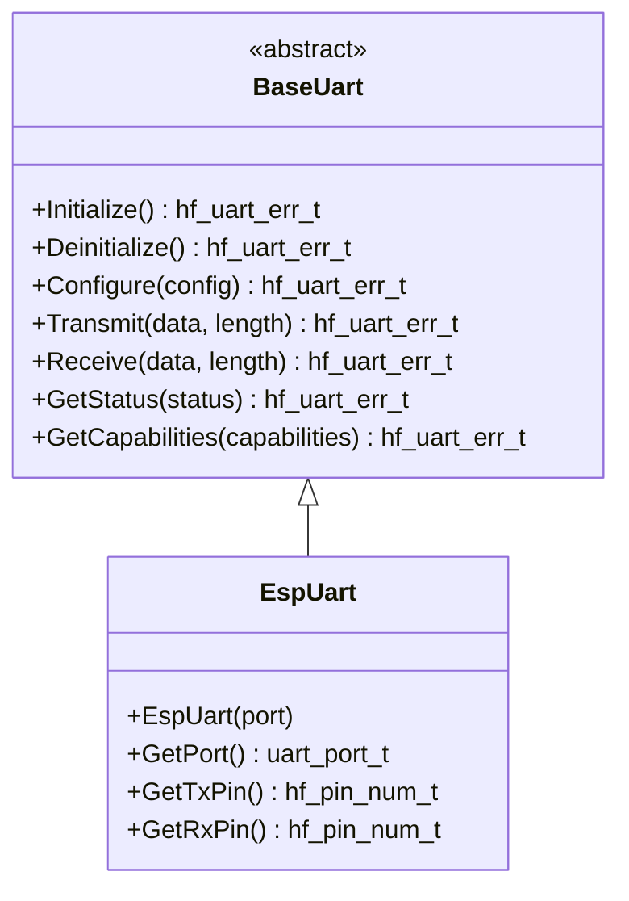

# 📡 BaseUart API Reference

<div align="center">


**📡 Unified UART abstraction for serial communication**

</div>

---

## 📚 **Table of Contents**

- [🎯 **Overview**](#-overview)
- [🏗️ **Class Hierarchy**](#️-class-hierarchy)
- [📋 **Error Codes**](#-error-codes)
- [🔧 **Core API**](#-core-api)
- [📊 **Data Structures**](#-data-structures)
- [📊 **Usage Examples**](#-usage-examples)
- [🧪 **Best Practices**](#-best-practices)

---

## 🎯 **Overview**

The `BaseUart` class provides a comprehensive UART abstraction that serves as the unified interface for all Universal Asynchronous Receiver-Transmitter operations in the HardFOC system. It supports configurable baud rates, data formats, and flow control.

### ✨ **Key Features**

- 📡 **Configurable Baud Rates** - Support for standard and custom baud rates
- 🔧 **Flexible Data Formats** - Configurable data bits, stop bits, and parity
- 🔄 **Flow Control** - Hardware and software flow control support
- 📊 **DMA Support** - Hardware-accelerated data transfer
- 🛡️ **Robust Error Handling** - Comprehensive validation and error reporting
- 🏎️ **Performance Optimized** - Minimal overhead for critical applications
- 🔌 **Platform Agnostic** - Works with various UART hardware implementations
- 📈 **Real-time Control** - Low-latency communication for time-critical applications

### 📡 **Supported Applications**

| Application | Baud Rate | Description |
|-------------|-----------|-------------|
| **Debug Output** | 115200 | Serial console and debugging |
| **GPS Communication** | 9600 | GPS module communication |
| **Bluetooth** | 115200 | Bluetooth module communication |
| **Modbus RTU** | 9600-115200 | Industrial protocol communication |
| **Sensor Communication** | 9600-115200 | Sensor data exchange |

---

## 🏗️ **Class Hierarchy**



---

## 📋 **Error Codes**

### ✅ **Success Codes**

| Code | Value | Description |
|------|-------|-------------|
| `UART_SUCCESS` | 0 | ✅ Operation completed successfully |

### ❌ **General Error Codes**

| Code | Value | Description | Resolution |
|------|-------|-------------|------------|
| `UART_ERR_FAILURE` | 1 | ❌ General operation failure | Check hardware and configuration |
| `UART_ERR_NOT_INITIALIZED` | 2 | ⚠️ UART not initialized | Call Initialize() first |
| `UART_ERR_ALREADY_INITIALIZED` | 3 | ⚠️ UART already initialized | Check initialization state |
| `UART_ERR_INVALID_PARAMETER` | 4 | 🚫 Invalid parameter | Validate input parameters |
| `UART_ERR_NULL_POINTER` | 5 | 🚫 Null pointer provided | Check pointer validity |
| `UART_ERR_OUT_OF_MEMORY` | 6 | 💾 Memory allocation failed | Check system memory |

### 📡 **Communication Error Codes**

| Code | Value | Description | Resolution |
|------|-------|-------------|------------|
| `UART_ERR_TRANSMIT_TIMEOUT` | 7 | ⏰ Transmit timeout | Check baud rate and flow control |
| `UART_ERR_RECEIVE_TIMEOUT` | 8 | ⏰ Receive timeout | Check data source and timing |
| `UART_ERR_TRANSMIT_FAILURE` | 9 | ❌ Transmit failed | Check connections and device state |
| `UART_ERR_RECEIVE_FAILURE` | 10 | ❌ Receive failed | Check connections and device state |
| `UART_ERR_FRAME_ERROR` | 11 | 📊 Frame error | Check baud rate and data format |
| `UART_ERR_PARITY_ERROR` | 12 | 🔍 Parity error | Check parity settings |

### ⚙️ **Configuration Error Codes**

| Code | Value | Description | Resolution |
|------|-------|-------------|------------|
| `UART_ERR_INVALID_CONFIGURATION` | 13 | ⚙️ Invalid configuration | Check configuration parameters |
| `UART_ERR_UNSUPPORTED_BAUD_RATE` | 14 | 🚫 Unsupported baud rate | Use supported baud rate |
| `UART_ERR_UNSUPPORTED_DATA_FORMAT` | 15 | 🚫 Unsupported data format | Use supported format |
| `UART_ERR_PIN_CONFLICT` | 16 | 🔌 Pin already in use | Use different pins |
| `UART_ERR_RESOURCE_BUSY` | 17 | 🔄 Resource busy | Wait for resource availability |

### 🌐 **Hardware Error Codes**

| Code | Value | Description | Resolution |
|------|-------|-------------|------------|
| `UART_ERR_HARDWARE_FAULT` | 18 | 💥 Hardware fault | Check power and connections |
| `UART_ERR_COMMUNICATION_FAILURE` | 19 | 📡 Communication failure | Check bus connections |
| `UART_ERR_DMA_ERROR` | 20 | 💾 DMA error | Check DMA configuration |
| `UART_ERR_BUFFER_OVERFLOW` | 21 | 📈 Buffer overflow | Increase buffer size |

---

## 🔧 **Core API**

### 🏗️ **Initialization Methods**

```cpp
/**
 * @brief Initialize the UART peripheral
 * @return hf_uart_err_t error code
 * 
 * 📝 Sets up UART hardware, configures pins, and prepares for communication.
 * Must be called before any UART operations.
 * 
 * @example
 * EspUart uart(UART_NUM_0);
 * hf_uart_err_t result = uart.Initialize();
 * if (result == hf_uart_err_t::UART_SUCCESS) {
 *     // UART ready for use
 * }
 */
virtual hf_uart_err_t Initialize() noexcept = 0;

/**
 * @brief Deinitialize the UART peripheral
 * @return hf_uart_err_t error code
 * 
 * 🧹 Cleanly shuts down UART hardware and releases resources.
 */
virtual hf_uart_err_t Deinitialize() noexcept = 0;

/**
 * @brief Check if UART is initialized
 * @return true if initialized, false otherwise
 * 
 * ❓ Query initialization status without side effects.
 */
[[nodiscard]] bool IsInitialized() const noexcept;

/**
 * @brief Ensure UART is initialized (lazy initialization)
 * @return true if initialized successfully, false otherwise
 * 
 * 🔄 Automatically initializes UART if not already initialized.
 */
bool EnsureInitialized() noexcept;
```

### ⚙️ **Configuration Methods**

```cpp
/**
 * @brief Configure UART parameters
 * @param config UART configuration structure
 * @return hf_uart_err_t error code
 * 
 * ⚙️ Configures UART parameters including baud rate, data format,
 * flow control, and pin assignments.
 * 
 * @example
 * hf_uart_config_t config;
 * config.baud_rate = 115200;
 * config.data_bits = hf_uart_data_bits_t::DATA_8BIT;
 * config.stop_bits = hf_uart_stop_bits_t::STOP_1BIT;
 * config.parity = hf_uart_parity_t::PARITY_NONE;
 * config.flow_control = hf_uart_flow_control_t::FLOW_NONE;
 * config.tx_pin = 1;
 * config.rx_pin = 3;
 * 
 * hf_uart_err_t result = uart.Configure(config);
 */
virtual hf_uart_err_t Configure(const hf_uart_config_t &config) noexcept = 0;

/**
 * @brief Get current UART configuration
 * @param config [out] Current configuration structure
 * @return hf_uart_err_t error code
 * 
 * 📊 Retrieves the current UART configuration.
 */
virtual hf_uart_err_t GetConfiguration(hf_uart_config_t &config) const noexcept = 0;
```

### 📤 **Transmission Methods**

```cpp
/**
 * @brief Transmit data
 * @param data Data buffer to transmit
 * @param length Number of bytes to transmit
 * @return hf_uart_err_t error code
 * 
 * 📤 Transmits data over UART. Blocks until transmission is complete
 * or timeout occurs.
 * 
 * @example
 * const char* message = "Hello, World!\r\n";
 * hf_uart_err_t result = uart.Transmit(
 *     reinterpret_cast<const uint8_t*>(message), strlen(message));
 * if (result == hf_uart_err_t::UART_SUCCESS) {
 *     printf("✅ Message transmitted\n");
 * }
 */
virtual hf_uart_err_t Transmit(const uint8_t *data, size_t length) noexcept = 0;

/**
 * @brief Transmit data with timeout
 * @param data Data buffer to transmit
 * @param length Number of bytes to transmit
 * @param timeout_ms Timeout in milliseconds
 * @return hf_uart_err_t error code
 * 
 * 📤 Transmits data with specified timeout.
 */
virtual hf_uart_err_t Transmit(const uint8_t *data, size_t length, 
                              uint32_t timeout_ms) noexcept = 0;

/**
 * @brief Get number of bytes available for transmission
 * @return Number of bytes that can be transmitted
 * 
 * 📊 Returns the number of bytes that can be transmitted without blocking.
 */
virtual size_t GetTransmitSpace() const noexcept = 0;
```

### 📥 **Reception Methods**

```cpp
/**
 * @brief Receive data
 * @param data Buffer to store received data
 * @param length Number of bytes to receive
 * @return hf_uart_err_t error code
 * 
 * 📥 Receives data from UART. Blocks until requested number of bytes
 * is received or timeout occurs.
 * 
 * @example
 * uint8_t buffer[64];
 * hf_uart_err_t result = uart.Receive(buffer, 64);
 * if (result == hf_uart_err_t::UART_SUCCESS) {
 *     printf("📥 Received %zu bytes\n", 64);
 * }
 */
virtual hf_uart_err_t Receive(uint8_t *data, size_t length) noexcept = 0;

/**
 * @brief Receive data with timeout
 * @param data Buffer to store received data
 * @param length Number of bytes to receive
 * @param timeout_ms Timeout in milliseconds
 * @return hf_uart_err_t error code
 * 
 * 📥 Receives data with specified timeout.
 */
virtual hf_uart_err_t Receive(uint8_t *data, size_t length, 
                             uint32_t timeout_ms) noexcept = 0;

/**
 * @brief Get number of bytes available for reception
 * @return Number of bytes available to receive
 * 
 * 📊 Returns the number of bytes available to receive without blocking.
 */
virtual size_t GetReceiveSpace() const noexcept = 0;

/**
 * @brief Flush receive buffer
 * @return hf_uart_err_t error code
 * 
 * 🧹 Clears all data in the receive buffer.
 */
virtual hf_uart_err_t FlushReceive() noexcept = 0;
```

### 📊 **Status and Capabilities**

```cpp
/**
 * @brief Get UART status information
 * @param status [out] Status information structure
 * @return hf_uart_err_t error code
 * 
 * 📊 Retrieves comprehensive status information about UART.
 */
virtual hf_uart_err_t GetStatus(hf_uart_status_t &status) const noexcept = 0;

/**
 * @brief Get UART capabilities
 * @param capabilities [out] Capability information structure
 * @return hf_uart_err_t error code
 * 
 * 📋 Retrieves hardware capabilities and limitations.
 */
virtual hf_uart_err_t GetCapabilities(hf_uart_capabilities_t &capabilities) const noexcept = 0;
```

---

## 📊 **Data Structures**

### ⚙️ **UART Configuration**

```cpp
struct hf_uart_config_t {
    uint32_t baud_rate;                    ///< Baud rate in bits per second
    hf_uart_data_bits_t data_bits;         ///< Number of data bits
    hf_uart_stop_bits_t stop_bits;         ///< Number of stop bits
    hf_uart_parity_t parity;               ///< Parity setting
    hf_uart_flow_control_t flow_control;   ///< Flow control setting
    hf_pin_num_t tx_pin;                   ///< Transmit pin
    hf_pin_num_t rx_pin;                   ///< Receive pin
    hf_pin_num_t rts_pin;                  ///< RTS pin (-1 if not used)
    hf_pin_num_t cts_pin;                  ///< CTS pin (-1 if not used)
    uint32_t timeout_ms;                   ///< Default timeout in milliseconds
    bool use_dma;                          ///< Use DMA for transfers
    size_t rx_buffer_size;                 ///< Receive buffer size
    size_t tx_buffer_size;                 ///< Transmit buffer size
};
```

### 📊 **UART Status**

```cpp
struct hf_uart_status_t {
    bool is_initialized;        ///< UART is initialized
    bool is_configured;         ///< UART is configured
    uint32_t current_baud_rate; ///< Current baud rate
    size_t rx_bytes_available;  ///< Bytes available to receive
    size_t tx_space_available;  ///< Space available for transmission
    uint32_t rx_errors;         ///< Number of receive errors
    uint32_t tx_errors;         ///< Number of transmit errors
    hf_uart_err_t last_error;   ///< Last error that occurred
    uint32_t timestamp_us;      ///< Timestamp of last operation
};
```

### 📋 **UART Capabilities**

```cpp
struct hf_uart_capabilities_t {
    uint8_t max_ports;              ///< Maximum number of UART ports
    uint32_t min_baud_rate;         ///< Minimum baud rate
    uint32_t max_baud_rate;         ///< Maximum baud rate
    uint8_t supported_data_bits;    ///< Bit mask of supported data bits
    uint8_t supported_stop_bits;    ///< Bit mask of supported stop bits
    uint8_t supported_parity;       ///< Bit mask of supported parity
    bool supports_flow_control;     ///< Supports hardware flow control
    bool supports_dma;              ///< Supports DMA transfers
    size_t max_buffer_size;         ///< Maximum buffer size
    uint32_t max_timeout_ms;        ///< Maximum timeout value
};
```

### 📈 **UART Statistics**

```cpp
struct hf_uart_statistics_t {
    uint32_t total_transmissions;   ///< Total transmissions performed
    uint32_t successful_transmissions; ///< Successful transmissions
    uint32_t failed_transmissions;  ///< Failed transmissions
    uint32_t total_receptions;      ///< Total receptions performed
    uint32_t successful_receptions; ///< Successful receptions
    uint32_t failed_receptions;     ///< Failed receptions
    uint32_t bytes_transmitted;     ///< Total bytes transmitted
    uint32_t bytes_received;        ///< Total bytes received
    uint32_t frame_errors;          ///< Number of frame errors
    uint32_t parity_errors;         ///< Number of parity errors
    uint32_t buffer_overflows;      ///< Number of buffer overflows
    uint32_t average_transmit_time_us; ///< Average transmit time
    uint32_t max_transmit_time_us;  ///< Maximum transmit time
    uint32_t min_transmit_time_us;  ///< Minimum transmit time
};
```

---

## 📊 **Usage Examples**

### 📡 **Basic Serial Communication**

```cpp
#include "mcu/esp32/EspUart.h"

class SerialCommunicator {
private:
    EspUart uart_;
    
public:
    bool initialize() {
        uart_ = EspUart(UART_NUM_0);
        
        if (!uart_.EnsureInitialized()) {
            printf("❌ UART initialization failed\n");
            return false;
        }
        
        // Configure for standard serial communication
        hf_uart_config_t config;
        config.baud_rate = 115200;
        config.data_bits = hf_uart_data_bits_t::DATA_8BIT;
        config.stop_bits = hf_uart_stop_bits_t::STOP_1BIT;
        config.parity = hf_uart_parity_t::PARITY_NONE;
        config.flow_control = hf_uart_flow_control_t::FLOW_NONE;
        config.tx_pin = 1;  // GPIO 1
        config.rx_pin = 3;  // GPIO 3
        config.rts_pin = -1;  // Not used
        config.cts_pin = -1;  // Not used
        config.timeout_ms = 1000;
        config.use_dma = false;
        config.rx_buffer_size = 1024;
        config.tx_buffer_size = 1024;
        
        hf_uart_err_t result = uart_.Configure(config);
        if (result != hf_uart_err_t::UART_SUCCESS) {
            printf("❌ UART configuration failed: %s\n", HfUartErrToString(result));
            return false;
        }
        
        printf("✅ Serial communicator initialized\n");
        return true;
    }
    
    void send_message(const char* message) {
        size_t length = strlen(message);
        hf_uart_err_t result = uart_.Transmit(
            reinterpret_cast<const uint8_t*>(message), length);
        
        if (result == hf_uart_err_t::UART_SUCCESS) {
            printf("📤 Sent: %s", message);
        } else {
            printf("❌ Send failed: %s\n", HfUartErrToString(result));
        }
    }
    
    void receive_message(char* buffer, size_t max_length) {
        hf_uart_err_t result = uart_.Receive(
            reinterpret_cast<uint8_t*>(buffer), max_length);
        
        if (result == hf_uart_err_t::UART_SUCCESS) {
            buffer[max_length] = '\0';  // Null terminate
            printf("📥 Received: %s", buffer);
        } else {
            printf("❌ Receive failed: %s\n", HfUartErrToString(result));
        }
    }
    
    void echo_loop() {
        char buffer[256];
        printf("🔄 Starting echo loop...\n");
        
        while (true) {
            // Check if data is available
            if (uart_.GetReceiveSpace() > 0) {
                hf_uart_err_t result = uart_.Receive(
                    reinterpret_cast<uint8_t*>(buffer), 255, 100);
                
                if (result == hf_uart_err_t::UART_SUCCESS) {
                    buffer[255] = '\0';
                    printf("📥 Echo: %s", buffer);
                    
                    // Echo back
                    uart_.Transmit(reinterpret_cast<const uint8_t*>(buffer), 
                                 strlen(buffer));
                }
            }
            
            vTaskDelay(pdMS_TO_TICKS(10));
        }
    }
};
```

### 🗺️ **GPS Communication**

```cpp
#include "mcu/esp32/EspUart.h"

class GpsController {
private:
    EspUart uart_;
    static constexpr size_t GPS_BUFFER_SIZE = 512;
    char gps_buffer_[GPS_BUFFER_SIZE];
    
public:
    bool initialize() {
        uart_ = EspUart(UART_NUM_1);
        
        if (!uart_.EnsureInitialized()) {
            return false;
        }
        
        // Configure for GPS communication
        hf_uart_config_t config;
        config.baud_rate = 9600;  // Standard GPS baud rate
        config.data_bits = hf_uart_data_bits_t::DATA_8BIT;
        config.stop_bits = hf_uart_stop_bits_t::STOP_1BIT;
        config.parity = hf_uart_parity_t::PARITY_NONE;
        config.flow_control = hf_uart_flow_control_t::FLOW_NONE;
        config.tx_pin = 17;  // GPS TX
        config.rx_pin = 16;  // GPS RX
        config.rts_pin = -1;
        config.cts_pin = -1;
        config.timeout_ms = 5000;  // 5 second timeout
        config.use_dma = false;
        config.rx_buffer_size = GPS_BUFFER_SIZE;
        config.tx_buffer_size = 256;
        
        hf_uart_err_t result = uart_.Configure(config);
        if (result != hf_uart_err_t::UART_SUCCESS) {
            printf("❌ GPS configuration failed\n");
            return false;
        }
        
        printf("✅ GPS controller initialized\n");
        return true;
    }
    
    bool read_gps_data() {
        // Read GPS data with timeout
        hf_uart_err_t result = uart_.Receive(
            reinterpret_cast<uint8_t*>(gps_buffer_), GPS_BUFFER_SIZE - 1, 1000);
        
        if (result == hf_uart_err_t::UART_SUCCESS) {
            gps_buffer_[GPS_BUFFER_SIZE - 1] = '\0';
            
            // Parse NMEA sentences
            parse_nmea_data(gps_buffer_);
            return true;
        } else if (result == hf_uart_err_t::UART_ERR_RECEIVE_TIMEOUT) {
            printf("⏰ GPS timeout - no data received\n");
            return false;
        } else {
            printf("❌ GPS read failed: %s\n", HfUartErrToString(result));
            return false;
        }
    }
    
private:
    void parse_nmea_data(const char* data) {
        // Simple NMEA parser - look for GPRMC sentences
        char* line = strtok(const_cast<char*>(data), "\r\n");
        while (line != nullptr) {
            if (strncmp(line, "$GPRMC", 6) == 0) {
                parse_gprmc(line);
            } else if (strncmp(line, "$GPGGA", 6) == 0) {
                parse_gpgga(line);
            }
            line = strtok(nullptr, "\r\n");
        }
    }
    
    void parse_gprmc(const char* sentence) {
        // Parse GPRMC sentence for time, date, position, speed
        printf("📍 GPRMC: %s\n", sentence);
        // Add actual parsing logic here
    }
    
    void parse_gpgga(const char* sentence) {
        // Parse GPGGA sentence for position and altitude
        printf("🌍 GPGGA: %s\n", sentence);
        // Add actual parsing logic here
    }
    
public:
    void send_gps_command(const char* command) {
        // Send command to GPS module
        size_t length = strlen(command);
        hf_uart_err_t result = uart_.Transmit(
            reinterpret_cast<const uint8_t*>(command), length);
        
        if (result == hf_uart_err_t::UART_SUCCESS) {
            printf("📤 GPS Command: %s", command);
        } else {
            printf("❌ GPS command failed: %s\n", HfUartErrToString(result));
        }
    }
    
    void gps_monitoring_task() {
        printf("🗺️ Starting GPS monitoring...\n");
        
        while (true) {
            if (read_gps_data()) {
                // Data received and parsed
                vTaskDelay(pdMS_TO_TICKS(100));
            } else {
                // No data or error
                vTaskDelay(pdMS_TO_TICKS(1000));
            }
        }
    }
};
```

### 🔵 **Bluetooth Communication**

```cpp
#include "mcu/esp32/EspUart.h"

class BluetoothController {
private:
    EspUart uart_;
    static constexpr size_t BT_BUFFER_SIZE = 1024;
    char bt_buffer_[BT_BUFFER_SIZE];
    
public:
    bool initialize() {
        uart_ = EspUart(UART_NUM_2);
        
        if (!uart_.EnsureInitialized()) {
            return false;
        }
        
        // Configure for Bluetooth communication
        hf_uart_config_t config;
        config.baud_rate = 115200;  // Standard BT baud rate
        config.data_bits = hf_uart_data_bits_t::DATA_8BIT;
        config.stop_bits = hf_uart_stop_bits_t::STOP_1BIT;
        config.parity = hf_uart_parity_t::PARITY_NONE;
        config.flow_control = hf_uart_flow_control_t::FLOW_NONE;
        config.tx_pin = 25;  // BT TX
        config.rx_pin = 26;  // BT RX
        config.rts_pin = -1;
        config.cts_pin = -1;
        config.timeout_ms = 1000;
        config.use_dma = true;  // Use DMA for BT
        config.rx_buffer_size = BT_BUFFER_SIZE;
        config.tx_buffer_size = BT_BUFFER_SIZE;
        
        hf_uart_err_t result = uart_.Configure(config);
        if (result != hf_uart_err_t::UART_SUCCESS) {
            printf("❌ Bluetooth configuration failed\n");
            return false;
        }
        
        printf("✅ Bluetooth controller initialized\n");
        return true;
    }
    
    void send_data(const char* data) {
        size_t length = strlen(data);
        hf_uart_err_t result = uart_.Transmit(
            reinterpret_cast<const uint8_t*>(data), length);
        
        if (result == hf_uart_err_t::UART_SUCCESS) {
            printf("📤 BT Sent: %s", data);
        } else {
            printf("❌ BT send failed: %s\n", HfUartErrToString(result));
        }
    }
    
    bool receive_data(char* buffer, size_t max_length) {
        hf_uart_err_t result = uart_.Receive(
            reinterpret_cast<uint8_t*>(buffer), max_length - 1, 100);
        
        if (result == hf_uart_err_t::UART_SUCCESS) {
            buffer[max_length - 1] = '\0';
            printf("📥 BT Received: %s", buffer);
            return true;
        } else if (result == hf_uart_err_t::UART_ERR_RECEIVE_TIMEOUT) {
            return false;  // No data available
        } else {
            printf("❌ BT receive failed: %s\n", HfUartErrToString(result));
            return false;
        }
    }
    
    void bluetooth_chat_task() {
        printf("🔵 Starting Bluetooth chat...\n");
        
        char input_buffer[256];
        char output_buffer[256];
        
        while (true) {
            // Check for incoming data
            if (receive_data(input_buffer, sizeof(input_buffer))) {
                // Process received data
                snprintf(output_buffer, sizeof(output_buffer), 
                        "Echo: %s", input_buffer);
                send_data(output_buffer);
            }
            
            // Check for local input (simulated)
            if (/* local input available */) {
                snprintf(output_buffer, sizeof(output_buffer), 
                        "Local: Hello from ESP32!\n");
                send_data(output_buffer);
            }
            
            vTaskDelay(pdMS_TO_TICKS(100));
        }
    }
};
```

### 🏭 **Modbus RTU Communication**

```cpp
#include "mcu/esp32/EspUart.h"

class ModbusController {
private:
    EspUart uart_;
    static constexpr uint8_t MODBUS_SLAVE_ADDRESS = 1;
    static constexpr size_t MODBUS_BUFFER_SIZE = 256;
    uint8_t modbus_buffer_[MODBUS_BUFFER_SIZE];
    
public:
    bool initialize() {
        uart_ = EspUart(UART_NUM_1);
        
        if (!uart_.EnsureInitialized()) {
            return false;
        }
        
        // Configure for Modbus RTU
        hf_uart_config_t config;
        config.baud_rate = 9600;  // Standard Modbus baud rate
        config.data_bits = hf_uart_data_bits_t::DATA_8BIT;
        config.stop_bits = hf_uart_stop_bits_t::STOP_1BIT;
        config.parity = hf_uart_parity_t::PARITY_EVEN;  // Modbus standard
        config.flow_control = hf_uart_flow_control_t::FLOW_NONE;
        config.tx_pin = 17;
        config.rx_pin = 16;
        config.rts_pin = -1;
        config.cts_pin = -1;
        config.timeout_ms = 1000;
        config.use_dma = false;
        config.rx_buffer_size = MODBUS_BUFFER_SIZE;
        config.tx_buffer_size = MODBUS_BUFFER_SIZE;
        
        hf_uart_err_t result = uart_.Configure(config);
        if (result != hf_uart_err_t::UART_SUCCESS) {
            printf("❌ Modbus configuration failed\n");
            return false;
        }
        
        printf("✅ Modbus controller initialized\n");
        return true;
    }
    
    bool read_holding_registers(uint8_t slave_addr, uint16_t start_addr, 
                               uint16_t count, uint16_t* data) {
        // Build Modbus RTU read holding registers request
        uint8_t request[8];
        request[0] = slave_addr;           // Slave address
        request[1] = 0x03;                 // Function code (read holding registers)
        request[2] = (start_addr >> 8) & 0xFF;  // Starting address high
        request[3] = start_addr & 0xFF;         // Starting address low
        request[4] = (count >> 8) & 0xFF;       // Quantity high
        request[5] = count & 0xFF;              // Quantity low
        
        // Calculate CRC
        uint16_t crc = calculate_crc16(request, 6);
        request[6] = crc & 0xFF;           // CRC low
        request[7] = (crc >> 8) & 0xFF;    // CRC high
        
        // Send request
        hf_uart_err_t result = uart_.Transmit(request, 8);
        if (result != hf_uart_err_t::UART_SUCCESS) {
            printf("❌ Modbus request failed: %s\n", HfUartErrToString(result));
            return false;
        }
        
        // Receive response
        size_t response_length = 5 + count * 2;  // Header + data + CRC
        result = uart_.Receive(modbus_buffer_, response_length, 1000);
        
        if (result == hf_uart_err_t::UART_SUCCESS) {
            // Verify response
            if (modbus_buffer_[0] == slave_addr && modbus_buffer_[1] == 0x03) {
                // Extract data
                for (int i = 0; i < count; i++) {
                    data[i] = (modbus_buffer_[3 + i * 2] << 8) | 
                              modbus_buffer_[4 + i * 2];
                }
                printf("✅ Read %d holding registers\n", count);
                return true;
            } else {
                printf("❌ Invalid Modbus response\n");
                return false;
            }
        } else {
            printf("❌ Modbus response failed: %s\n", HfUartErrToString(result));
            return false;
        }
    }
    
    bool write_single_register(uint8_t slave_addr, uint16_t addr, uint16_t value) {
        // Build Modbus RTU write single register request
        uint8_t request[8];
        request[0] = slave_addr;           // Slave address
        request[1] = 0x06;                 // Function code (write single register)
        request[2] = (addr >> 8) & 0xFF;   // Register address high
        request[3] = addr & 0xFF;          // Register address low
        request[4] = (value >> 8) & 0xFF;  // Value high
        request[5] = value & 0xFF;         // Value low
        
        // Calculate CRC
        uint16_t crc = calculate_crc16(request, 6);
        request[6] = crc & 0xFF;           // CRC low
        request[7] = (crc >> 8) & 0xFF;    // CRC high
        
        // Send request
        hf_uart_err_t result = uart_.Transmit(request, 8);
        if (result != hf_uart_err_t::UART_SUCCESS) {
            printf("❌ Modbus write request failed: %s\n", HfUartErrToString(result));
            return false;
        }
        
        // Receive response (should be echo of request)
        result = uart_.Receive(modbus_buffer_, 8, 1000);
        
        if (result == hf_uart_err_t::UART_SUCCESS) {
            if (memcmp(request, modbus_buffer_, 8) == 0) {
                printf("✅ Wrote register 0x%04X = 0x%04X\n", addr, value);
                return true;
            } else {
                printf("❌ Invalid Modbus write response\n");
                return false;
            }
        } else {
            printf("❌ Modbus write response failed: %s\n", HfUartErrToString(result));
            return false;
        }
    }
    
private:
    uint16_t calculate_crc16(const uint8_t* data, size_t length) {
        uint16_t crc = 0xFFFF;
        
        for (size_t i = 0; i < length; i++) {
            crc ^= data[i];
            for (int j = 0; j < 8; j++) {
                if (crc & 0x0001) {
                    crc = (crc >> 1) ^ 0xA001;
                } else {
                    crc = crc >> 1;
                }
            }
        }
        
        return crc;
    }
};
```

---

## 🧪 **Best Practices**

### ✅ **Recommended Patterns**

```cpp
// ✅ Always check initialization
if (!uart.EnsureInitialized()) {
    printf("❌ UART initialization failed\n");
    return false;
}

// ✅ Use appropriate baud rates
// Debug: 115200
// GPS: 9600
// Bluetooth: 115200
// Modbus: 9600-115200

// ✅ Handle timeouts gracefully
hf_uart_err_t result = uart.Receive(buffer, length, 1000);
if (result == hf_uart_err_t::UART_ERR_RECEIVE_TIMEOUT) {
    printf("⏰ No data received within timeout\n");
    return false;
}

// ✅ Check buffer space before operations
if (uart.GetReceiveSpace() > 0) {
    // Data available to receive
}

if (uart.GetTransmitSpace() >= length) {
    // Space available to transmit
}

// ✅ Use appropriate data formats
// Most applications: 8N1 (8 data bits, no parity, 1 stop bit)
// Modbus: 8E1 (8 data bits, even parity, 1 stop bit)

// ✅ Monitor statistics for system health
hf_uart_statistics_t stats;
if (uart.GetStatistics(stats) == hf_uart_err_t::UART_SUCCESS) {
    if (stats.frame_errors > 10) {
        printf("⚠️ High frame error rate detected\n");
    }
}
```

### ❌ **Common Pitfalls**

```cpp
// ❌ Don't ignore initialization
uart.Transmit(data, length);  // May fail silently

// ❌ Don't use mismatched baud rates
// Both devices must use the same baud rate

// ❌ Don't ignore buffer overflows
// Check buffer space before large transfers

// ❌ Don't use without error checking in critical applications
// Always check return values in safety-critical systems

// ❌ Don't forget to handle flow control
// Some devices require hardware flow control

// ❌ Don't assume all data formats are supported
// Check capabilities before using specific formats
```

### 🎯 **Performance Optimization**

```cpp
// 🚀 Use DMA for large transfers
config.use_dma = (transfer_size > 64);  // Use DMA for transfers > 64 bytes

// 🚀 Use appropriate buffer sizes
// Small buffers: Lower memory usage, more frequent interrupts
// Large buffers: Higher memory usage, fewer interrupts

// 🚀 Minimize timeout values
// Short timeouts for fast devices
// Longer timeouts for slow devices

// 🚀 Use appropriate baud rates
// Higher baud rate = faster communication but may cause errors

// 🚀 Batch operations when possible
// Send multiple commands in one transfer

// 🚀 Use flow control when needed
// Prevents buffer overflows in high-speed communication
```

---

## 🔗 **Related Documentation**

- [⚙️ **EspUart**](../esp_api/EspUart.md) - ESP32-C6 implementation
- [🎛️ **Hardware Types**](HardwareTypes.md) - Platform-agnostic types

---

<div align="center">

**📡 BaseUart - Reliable Serial Communication for HardFOC**

*Part of the HardFOC Internal Interface Wrapper Documentation*

</div> 