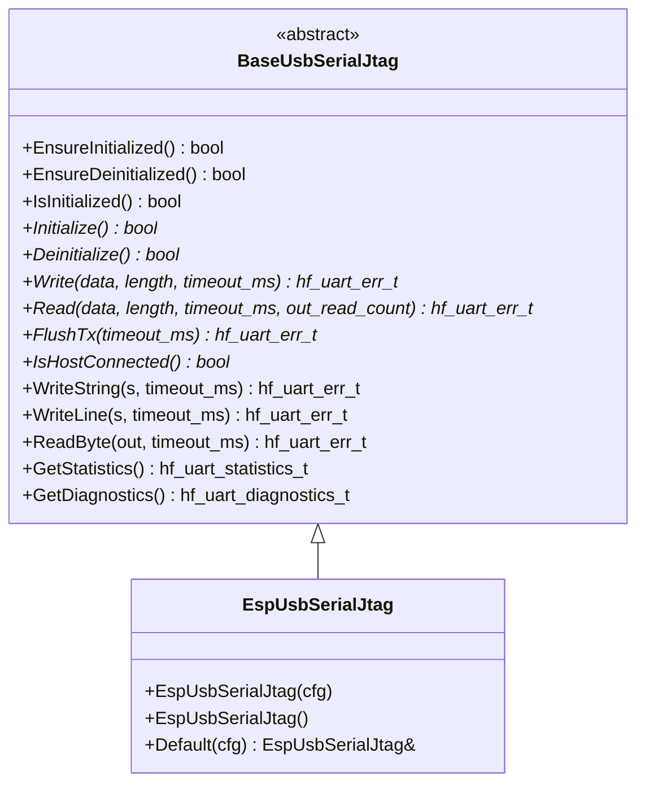

# 🔌 BaseUsbSerialJtag API Reference
**🔌 Built-in USB Serial/JTAG controller abstraction (CDC-ACM virtual COM port over native USB)**

## 📚 **Table of Contents**

- [🎯 Overview](#-overview)
- [🆚 BaseUsbSerialJtag vs. BaseUart](#-baseusbserialjtag-vs-baseuart)
- [🏗️ Class Hierarchy](#-class-hierarchy)
- [⚙️ Configuration](#-configuration)
- [🔧 Core API](#-core-api)
- [📋 Error Codes](#-error-codes)
- [📊 Usage Examples](#-usage-examples)
- [🧪 Best Practices](#-best-practices)
- [🔗 See Also](#-see-also)

---

## 🎯 **Overview**

`BaseUsbSerialJtag` is a peer abstraction to [`BaseUart`](BaseUart.md) for the
**built-in USB Serial/JTAG controller** found on several Espressif chips
(ESP32-S3, ESP32-C3, ESP32-C6, ESP32-H2, ESP32-P4). The controller is a
fixed-function silicon block that, via the native USB jack, exposes:

- A **CDC-ACM Virtual COM Port** for bidirectional console traffic — appears
  as `/dev/ttyACM*` on Linux, `COM*` on Windows, `/dev/cu.usbmodem*` on macOS.
- A **JTAG endpoint** for OpenOCD-driven debugging.
- The download path used by `idf.py flash` (auto download-mode via DTR/RTS).

All three multiplex over a single USB cable, simultaneously. This makes the
controller ideal for compact dev kits where you only have one USB connector
and want flashing + console + debugging without a USB-to-UART bridge or an
external JTAG adapter.

This base class wraps the controller behind the same lazy-init / Read / Write
/ Flush shape as [`BaseUart`](BaseUart.md), so application code (consoles,
simple line-protocols) can hold a `BaseUsbSerialJtag*` interchangeably with a
`BaseUart*` behind a thin adapter.

---

## 🆚 **BaseUsbSerialJtag vs. BaseUart**

| Concern                | `BaseUart`                                      | `BaseUsbSerialJtag`                                       |
|------------------------|-------------------------------------------------|-----------------------------------------------------------|
| Transport              | TTL UART pins (e.g. GPIO43/44)                  | Native USB D+/D− pads (e.g. ESP32-S3 GPIO19/20, fixed)    |
| Baud rate / parity     | Configurable                                    | N/A — USB CDC framing                                     |
| Flow control           | Hardware (RTS/CTS) or software (XON/XOFF)       | None at the application level (USB handles it)            |
| Pin assignment         | Flexible via GPIO matrix                        | **Hard-wired** to chip USB pads                           |
| Number of instances    | One per UART controller (UART0…N)               | One per chip (singleton-friendly)                         |
| RS-485 / IrDA / etc.   | Supported                                       | Not applicable                                            |
| Suitable for           | RS-485 sensors, GPS, modems, debug bridges      | Operator console, log output, REPL/CLI over native USB    |
| Coexists with `printf` | Only if `CONFIG_ESP_CONSOLE_UART_*` selects it  | Yes when `CONFIG_ESP_CONSOLE_USB_SERIAL_JTAG=y`           |

If your code only needs to push/pull text, both APIs look the same. If your
code needs to set baud, pin, parity, or flow control, you want
[`BaseUart`](BaseUart.md).

---

## 🏗️ **Class Hierarchy**



The class is intentionally a **peer of `BaseUart`** — not a derived class —
because the controller has no baud / parity / pin / flow-control surface.
Reusing the `BaseUart` contract would have meant returning
`UART_ERR_UNSUPPORTED_OPERATION` from ~80% of the API.

---

## ⚙️ **Configuration**

### `hf_usb_serial_jtag_config_t`

```cpp
struct hf_usb_serial_jtag_config_t {
    hf_u32_t tx_buffer_size{256};            // > 0
    hf_u32_t rx_buffer_size{256};            // > 0
    bool     non_blocking_when_disconnected{true};
};
```

| Field                              | Default | Notes                                                                                      |
|------------------------------------|--------:|--------------------------------------------------------------------------------------------|
| `tx_buffer_size`                   | 256     | Driver-internal TX ring. Larger values absorb log bursts when the host is slow to drain.   |
| `rx_buffer_size`                   | 256     | Driver-internal RX ring.                                                                   |
| `non_blocking_when_disconnected`   | `true`  | When `true`, `Read()` honors `timeout_ms` even if no host is enumerated (typical console). |

The controller has no other electrical parameters — there is no baud rate to
set and the data pins are fixed.

---

## 🔧 **Core API**

### Lifecycle

| Method                 | Description                                                              |
|------------------------|--------------------------------------------------------------------------|
| `EnsureInitialized()`  | Idempotent install of the platform driver. Returns `true` on success.    |
| `EnsureDeinitialized()`| Idempotent teardown of the platform driver.                              |
| `IsInitialized()`      | Lifecycle latch; cheap, never re-enters the driver.                      |
| `Initialize()`         | (pure virtual) Subclass install hook called by `EnsureInitialized()`.    |
| `Deinitialize()`       | (pure virtual) Subclass teardown hook called by `EnsureDeinitialized()`. |

### I/O

| Method                                                                       | Returns                                              |
|------------------------------------------------------------------------------|------------------------------------------------------|
| `Write(data, length, timeout_ms = 0)`                                        | `UART_SUCCESS` if all bytes accepted by TX ring; `UART_ERR_TIMEOUT` if only some accepted; otherwise an error code. |
| `Read(data, length, timeout_ms = 0, out_read_count = nullptr)`               | `UART_SUCCESS` when ≥1 byte was read (count via `out_read_count`); `UART_ERR_TIMEOUT` when none arrived. |
| `FlushTx(timeout_ms = 0)`                                                    | Blocks until the TX ring is drained to the host (or times out). |
| `IsHostConnected()`                                                          | `true` iff the host is enumerating / accepting SOF packets. `false` when only powered (e.g. a power bank). |

### Convenience helpers (non-virtual)

| Helper                                          | Description                                          |
|-------------------------------------------------|------------------------------------------------------|
| `WriteString(s, timeout_ms = 0)`                | NUL-terminated string, no automatic newline.         |
| `WriteLine(s, timeout_ms = 0)`                  | NUL-terminated string then `"\r\n"`.                 |
| `ReadByte(out, timeout_ms = 0)`                 | One-byte convenience around `Read()`.                |
| `GetStatistics()` / `GetDiagnostics()`          | Optional telemetry; default impls return zeroed values. |

---

## 📋 **Error Codes**

All operations return [`hf_uart_err_t`](BaseUart.md#-error-codes), the same
enum used by `BaseUart`. The ones you'll see in practice:

| Code                          | When                                                                 |
|-------------------------------|----------------------------------------------------------------------|
| `UART_SUCCESS`                | Operation completed.                                                 |
| `UART_ERR_NULL_POINTER`       | `data` / `s` argument was `nullptr`.                                 |
| `UART_ERR_NOT_INITIALIZED`    | Called before `EnsureInitialized()` / `Initialize()` succeeded.      |
| `UART_ERR_TIMEOUT`            | TX ring full (write) or no bytes available (read) before `timeout_ms`. |
| `UART_ERR_TRANSMISSION_FAILED`| Underlying driver returned a negative byte count (write).            |
| `UART_ERR_RECEPTION_FAILED`   | Underlying driver returned a negative byte count (read).             |
| `UART_ERR_FAILURE`            | Generic failure (e.g. `FlushTx` reported an unexpected error).       |

---

## 📊 **Usage Examples**

### Minimal write/read loop

```cpp
#include "base/BaseUsbSerialJtag.h"

void run_console(BaseUsbSerialJtag& serial) noexcept {
    if (!serial.EnsureInitialized()) {
        return;
    }

    serial.WriteLine("hello over native USB");

    uint8_t b{};
    while (true) {
        const auto e = serial.ReadByte(b, /*timeout_ms=*/100);
        if (e == hf_uart_err_t::UART_SUCCESS) {
            // echo
            (void)serial.Write(&b, 1);
        } else if (e != hf_uart_err_t::UART_ERR_TIMEOUT) {
            break;
        }
    }
}
```

### Backend-agnostic transport (UART **or** USB Serial/JTAG)

```cpp
class ConsoleSerialTransport {
public:
    bool Init(BaseUart& uart) noexcept            { uart_ = &uart; return uart_->EnsureInitialized(); }
    bool Init(BaseUsbSerialJtag& usb) noexcept    { usb_  = &usb;  return usb_->EnsureInitialized(); }

    bool WriteLine(const char* s) noexcept {
        if (uart_) return uart_->WriteString(s) == hf_uart_err_t::UART_SUCCESS
                       && uart_->WriteString("\r\n") == hf_uart_err_t::UART_SUCCESS;
        if (usb_)  return usb_->WriteLine(s)   == hf_uart_err_t::UART_SUCCESS;
        return false;
    }

private:
    BaseUart*          uart_{nullptr};
    BaseUsbSerialJtag* usb_{nullptr};
};
```

### Host detection

```cpp
if (!serial.IsHostConnected()) {
    // Skip noisy logs when nothing is enumerated, so the TX ring doesn't
    // fill up while we're plugged into a phone charger / power bank.
    return;
}
serial.WriteLine("host is here");
```

---

## 🧪 **Best Practices**

- **Use lazy lifecycle.** Always go through `EnsureInitialized()` rather than
  calling `Initialize()` directly — multiple subsystems may share the
  controller (e.g. operator console + log redirection) and the latch is the
  single contract that survives ordering changes.
- **Don't second-install.** If `CONFIG_ESP_CONSOLE_USB_SERIAL_JTAG=y` is set,
  the IDF console already installed the driver before `app_main()` runs.
  Concrete subclasses (`EspUsbSerialJtag`) detect this and share the
  installation; do not call the platform install API directly.
- **Treat `IsHostConnected()` as a hint, not a gate.** Bytes you write while
  disconnected sit in the TX ring and stream to the host the moment it
  enumerates — useful for capturing early-boot logs after a cold plug-in.
  But don't push so much that the ring overflows.
- **Multiple writers OK, single reader preferred.** Most platforms allow
  concurrent `Write()` from multiple tasks (the ring is internally locked),
  but interleaving multiple `Read()` callers requires an external mutex if
  ordering matters.
- **Reuse the singleton.** `EspUsbSerialJtag::Default()` returns a
  process-wide instance. Avoid constructing additional `EspUsbSerialJtag`
  objects — there is only one underlying silicon block.

---

## 🔗 **See Also**

- [`BaseUart`](BaseUart.md) — peer abstraction for classic UART controllers.
- [`EspUsbSerialJtag`](../esp_api/EspUsbSerialJtag.md) — concrete ESP32-family
  implementation.
- ESP-IDF: [USB Serial/JTAG Console](https://docs.espressif.com/projects/esp-idf/en/latest/esp32s3/api-guides/usb-serial-jtag-console.html)
- ESP-IDF: [`usb_serial_jtag` driver API](https://docs.espressif.com/projects/esp-idf/en/latest/esp32s3/api-reference/peripherals/usb_serial_jtag.html)
