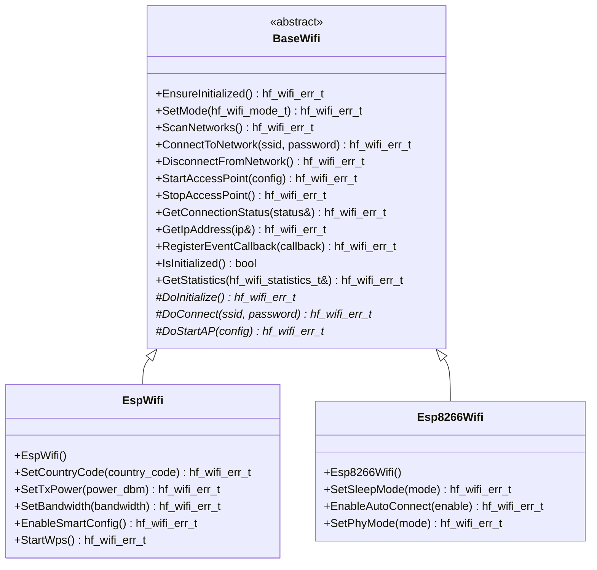

# 📶 BaseWifi API Reference

<div align="center">


**🎯 Unified WiFi abstraction for wireless networking and internet connectivity**

</div>

---

## 📚 **Table of Contents**

- [🎯 **Overview**](#-overview)
- [🏗️ **Class Hierarchy**](#️-class-hierarchy)
- [📋 **Error Codes**](#-error-codes)
- [🔧 **Core API**](#-core-api)
- [📊 **Data Structures**](#-data-structures)
- [📶 **WiFi Modes**](#-wifi-modes)
- [📊 **Usage Examples**](#-usage-examples)
- [🧪 **Best Practices**](#-best-practices)

---

## 🎯 **Overview**

The `BaseWifi` class provides a comprehensive WiFi abstraction that serves as the unified interface for all wireless networking operations in the HardFOC system. It supports both station (client) and access point modes, network scanning, connection management, security configurations, and internet connectivity across different hardware implementations.

### ✨ **Key Features**

- 📶 **Dual Mode Support** - Both Station and Access Point modes
- 🔍 **Network Scanning** - Discover and analyze available networks
- 🔐 **Advanced Security** - WPA/WPA2/WPA3 support with enterprise features
- 📡 **Connection Management** - Robust connection handling with auto-reconnection
- 🌐 **Internet Connectivity** - Full TCP/IP stack integration
- 📊 **Signal Monitoring** - RSSI, channel analysis, and network diagnostics
- 🛡️ **Robust Error Handling** - Comprehensive validation and error reporting
- 🏎️ **Performance Optimized** - Minimal overhead for real-time applications
- 🔌 **Platform Agnostic** - Works across different MCU platforms

### 📊 **Supported Hardware**

| Implementation | Station | Access Point | Max Clients | Frequency | Security |
|----------------|---------|--------------|-------------|-----------|----------|
| `EspWifi` | ✅ | ✅ | 10 clients | 2.4GHz + 5GHz | WPA3 |
| `Esp8266Wifi` | ✅ | ✅ | 4 clients | 2.4GHz | WPA2 |
| `Rp2040Wifi` | ✅ | ❌ | N/A | 2.4GHz | WPA2 |

---

## 🏗️ **Class Hierarchy**



---

## 📋 **Error Codes**

### 🚨 **WiFi Error Enumeration**

```cpp
enum class hf_wifi_err_t : hf_u32_t {
    // Success codes
    WIFI_SUCCESS = 0,
    
    // General errors
    WIFI_ERR_FAILURE = 1,
    WIFI_ERR_NOT_INITIALIZED = 2,
    WIFI_ERR_ALREADY_INITIALIZED = 3,
    WIFI_ERR_INVALID_PARAMETER = 4,
    WIFI_ERR_NULL_POINTER = 5,
    WIFI_ERR_OUT_OF_MEMORY = 6,
    
    // Network errors
    WIFI_ERR_NETWORK_NOT_FOUND = 7,
    WIFI_ERR_CONNECTION_FAILED = 8,
    WIFI_ERR_CONNECTION_TIMEOUT = 9,
    WIFI_ERR_CONNECTION_LOST = 10,
    WIFI_ERR_AUTHENTICATION_FAILED = 11,
    WIFI_ERR_DHCP_FAILED = 12,
    
    // Access Point errors
    WIFI_ERR_AP_START_FAILED = 13,
    WIFI_ERR_AP_ALREADY_STARTED = 14,
    WIFI_ERR_AP_NOT_STARTED = 15,
    WIFI_ERR_CLIENT_LIMIT_REACHED = 16,
    
    // Scanning errors
    WIFI_ERR_SCAN_FAILED = 17,
    WIFI_ERR_SCAN_TIMEOUT = 18,
    WIFI_ERR_SCAN_IN_PROGRESS = 19,
    
    // Security errors
    WIFI_ERR_INVALID_PASSWORD = 20,
    WIFI_ERR_ENCRYPTION_FAILED = 21,
    WIFI_ERR_SECURITY_MISMATCH = 22,
    WIFI_ERR_WPS_FAILED = 23,
    
    // Configuration errors
    WIFI_ERR_INVALID_MODE = 24,
    WIFI_ERR_INVALID_CHANNEL = 25,
    WIFI_ERR_INVALID_COUNTRY_CODE = 26,
    WIFI_ERR_INVALID_BANDWIDTH = 27,
    
    // System errors
    WIFI_ERR_SYSTEM_ERROR = 28,
    WIFI_ERR_PERMISSION_DENIED = 29,
    WIFI_ERR_OPERATION_ABORTED = 30
};
```

### 📊 **Error Code Categories**

| Category | Range | Description |
|----------|-------|-------------|
| **Success** | 0 | Successful operation |
| **General** | 1-6 | Basic initialization and parameter errors |
| **Network** | 7-12 | Network connection and communication errors |
| **Access Point** | 13-16 | Access Point operation errors |
| **Scanning** | 17-19 | Network scanning errors |
| **Security** | 20-23 | Authentication and security errors |
| **Configuration** | 24-27 | Configuration and setting errors |
| **System** | 28-30 | System-level errors |

---

## 🔧 **Core API**

### 🎯 **Essential Methods**

#### **Initialization & Configuration**
```cpp
/**
 * @brief Ensure the WiFi controller is initialized
 * @return hf_wifi_err_t Error code
 */
virtual hf_wifi_err_t EnsureInitialized() = 0;

/**
 * @brief Set WiFi operating mode
 * @param mode WiFi mode (Station, AP, or AP+STA)
 * @return hf_wifi_err_t Error code
 */
virtual hf_wifi_err_t SetMode(hf_wifi_mode_t mode) = 0;

/**
 * @brief Check if WiFi is initialized
 * @return bool True if initialized
 */
virtual bool IsInitialized() const = 0;
```

#### **Network Scanning**
```cpp
/**
 * @brief Start network scanning
 * @param scan_time_ms Scan duration in milliseconds
 * @return hf_wifi_err_t Error code
 */
virtual hf_wifi_err_t ScanNetworks(hf_u32_t scan_time_ms = 5000) = 0;

/**
 * @brief Get scan results
 * @param networks Output array of scanned networks
 * @param max_networks Maximum networks to return
 * @param actual_count Actual number of networks found
 * @return hf_wifi_err_t Error code
 */
virtual hf_wifi_err_t GetScanResults(hf_wifi_network_t* networks,
                                   hf_u32_t max_networks,
                                   hf_u32_t& actual_count) = 0;
```

#### **Station Mode (Client)**
```cpp
/**
 * @brief Connect to a WiFi network
 * @param ssid Network SSID
 * @param password Network password (can be empty for open networks)
 * @param security_type Security type (optional, auto-detected if not specified)
 * @return hf_wifi_err_t Error code
 */
virtual hf_wifi_err_t ConnectToNetwork(const char* ssid,
                                     const char* password = nullptr,
                                     hf_wifi_security_t security_type = WIFI_SECURITY_AUTO) = 0;

/**
 * @brief Disconnect from current network
 * @return hf_wifi_err_t Error code
 */
virtual hf_wifi_err_t DisconnectFromNetwork() = 0;

/**
 * @brief Get connection status
 * @param status Output connection status
 * @return hf_wifi_err_t Error code
 */
virtual hf_wifi_err_t GetConnectionStatus(hf_wifi_connection_status_t& status) = 0;
```

#### **Access Point Mode**
```cpp
/**
 * @brief Start WiFi Access Point
 * @param config AP configuration
 * @return hf_wifi_err_t Error code
 */
virtual hf_wifi_err_t StartAccessPoint(const hf_wifi_ap_config_t& config) = 0;

/**
 * @brief Stop WiFi Access Point
 * @return hf_wifi_err_t Error code
 */
virtual hf_wifi_err_t StopAccessPoint() = 0;

/**
 * @brief Get connected clients list
 * @param clients Output array of connected clients
 * @param max_clients Maximum clients to return
 * @param actual_count Actual number of connected clients
 * @return hf_wifi_err_t Error code
 */
virtual hf_wifi_err_t GetConnectedClients(hf_wifi_client_t* clients,
                                        hf_u32_t max_clients,
                                        hf_u32_t& actual_count) = 0;
```

#### **Network Information**
```cpp
/**
 * @brief Get current IP address
 * @param ip_address Output IP address
 * @return hf_wifi_err_t Error code
 */
virtual hf_wifi_err_t GetIpAddress(hf_u32_t& ip_address) = 0;

/**
 * @brief Get signal strength (RSSI)
 * @param rssi Output signal strength in dBm
 * @return hf_wifi_err_t Error code
 */
virtual hf_wifi_err_t GetRssi(hf_i8_t& rssi) = 0;
```

---

## 📊 **Data Structures**

### 📶 **WiFi Mode Types**

```cpp
enum class hf_wifi_mode_t : hf_u8_t {
    WIFI_MODE_DISABLED = 0,         ///< WiFi disabled
    WIFI_MODE_STATION = 1,          ///< Station mode (client)
    WIFI_MODE_ACCESS_POINT = 2,     ///< Access Point mode
    WIFI_MODE_AP_STA = 3            ///< Both AP and Station modes
};
```

### 🔐 **Security Types**

```cpp
enum class hf_wifi_security_t : hf_u8_t {
    WIFI_SECURITY_OPEN = 0,         ///< Open network (no security)
    WIFI_SECURITY_WEP = 1,          ///< WEP security (deprecated)
    WIFI_SECURITY_WPA_PSK = 2,      ///< WPA Personal
    WIFI_SECURITY_WPA2_PSK = 3,     ///< WPA2 Personal
    WIFI_SECURITY_WPA3_PSK = 4,     ///< WPA3 Personal
    WIFI_SECURITY_WPA2_ENTERPRISE = 5, ///< WPA2 Enterprise
    WIFI_SECURITY_WPA3_ENTERPRISE = 6, ///< WPA3 Enterprise
    WIFI_SECURITY_AUTO = 255        ///< Auto-detect security type
};
```

### 📡 **Network Information**

```cpp
struct hf_wifi_network_t {
    char ssid[33];                          ///< Network SSID (null-terminated)
    hf_u8_t bssid[6];                       ///< BSSID (MAC address)
    hf_i8_t rssi;                           ///< Signal strength (dBm)
    hf_u8_t channel;                        ///< WiFi channel (1-14)
    hf_wifi_security_t security_type;       ///< Security type
    bool is_hidden;                         ///< Hidden network flag
    hf_u32_t frequency;                     ///< Frequency in MHz
};
```

### 🏠 **Access Point Configuration**

```cpp
struct hf_wifi_ap_config_t {
    char ssid[33];                          ///< AP SSID
    char password[64];                      ///< AP password (empty for open)
    hf_u8_t channel;                        ///< WiFi channel (1-14)
    hf_wifi_security_t security_type;       ///< Security type
    hf_u8_t max_clients;                    ///< Maximum connected clients
    bool ssid_hidden;                       ///< Hide SSID broadcast
    hf_u32_t beacon_interval_ms;            ///< Beacon interval (default 100ms)
    hf_i8_t tx_power_dbm;                   ///< Transmit power (dBm)
};
```

### 👤 **Connected Client Information**

```cpp
struct hf_wifi_client_t {
    hf_u8_t mac_address[6];                 ///< Client MAC address
    hf_u32_t ip_address;                    ///< Assigned IP address
    hf_i8_t rssi;                           ///< Signal strength from client
    hf_u32_t connection_time_ms;            ///< Connection duration
    hf_u32_t bytes_sent;                    ///< Bytes sent to client
    hf_u32_t bytes_received;                ///< Bytes received from client
};
```

### 📈 **WiFi Statistics**

```cpp
struct hf_wifi_statistics_t {
    hf_u32_t total_connections;             ///< Total connection attempts
    hf_u32_t successful_connections;        ///< Successful connections
    hf_u32_t failed_connections;            ///< Failed connections
    hf_u32_t total_disconnections;          ///< Total disconnections
    hf_u32_t total_bytes_sent;              ///< Total bytes transmitted
    hf_u32_t total_bytes_received;          ///< Total bytes received
    hf_u32_t scan_count;                    ///< Total network scans
    hf_u32_t networks_found;                ///< Total networks found
    hf_u32_t ap_clients_served;             ///< Total AP clients served
    hf_u32_t uptime_ms;                     ///< WiFi uptime in milliseconds
};
```

---

## 📶 **WiFi Modes**

### 📱 **Station Mode (Client)**

Station mode connects to existing WiFi networks:

```cpp
// Configure for Station mode
wifi.SetMode(hf_wifi_mode_t::WIFI_MODE_STATION);

// Connect to home network
wifi.ConnectToNetwork("MyHomeWifi", "mypassword123", 
                     hf_wifi_security_t::WIFI_SECURITY_WPA2_PSK);
```

**Use Cases:**
- **IoT devices** connecting to home/office networks
- **Internet access** for data logging and remote control
- **Cloud connectivity** for firmware updates and monitoring

### 🏠 **Access Point Mode**

Access Point mode creates a WiFi hotspot:

```cpp
// Configure AP settings
hf_wifi_ap_config_t ap_config = {
    .ssid = "HardFOC_Controller",
    .password = "hardfoc123",
    .channel = 6,
    .security_type = hf_wifi_security_t::WIFI_SECURITY_WPA2_PSK,
    .max_clients = 4,
    .ssid_hidden = false,
    .beacon_interval_ms = 100,
    .tx_power_dbm = 20
};

wifi.SetMode(hf_wifi_mode_t::WIFI_MODE_ACCESS_POINT);
wifi.StartAccessPoint(ap_config);
```

**Use Cases:**
- **Configuration interfaces** for device setup
- **Local web servers** for control and monitoring
- **Direct device-to-device** communication

### 🔄 **Dual Mode (AP + Station)**

Simultaneous AP and Station operation:

```cpp
// Enable dual mode
wifi.SetMode(hf_wifi_mode_t::WIFI_MODE_AP_STA);

// Connect to internet AND provide local hotspot
wifi.ConnectToNetwork("InternetWifi", "password");
wifi.StartAccessPoint(ap_config);
```

**Use Cases:**
- **WiFi bridge/repeater** functionality
- **Local configuration** while maintaining internet access
- **Mesh networking** applications

---

## 📊 **Usage Examples**

### 🌐 **Internet-Connected IoT Device**

```cpp
#include "inc/mcu/esp32/EspWifi.h"

class IoTDevice {
private:
    EspWifi wifi_;
    bool is_connected_;
    
public:
    IoTDevice() : is_connected_(false) {}
    
    bool initialize() {
        // Initialize WiFi in station mode
        if (wifi_.EnsureInitialized() != hf_wifi_err_t::WIFI_SUCCESS) {
            return false;
        }
        
        if (wifi_.SetMode(hf_wifi_mode_t::WIFI_MODE_STATION) != hf_wifi_err_t::WIFI_SUCCESS) {
            return false;
        }
        
        // Register event callback for connection events
        wifi_.RegisterEventCallback([this](hf_wifi_event_t& event) {
            this->handle_wifi_event(event);
        });
        
        return true;
    }
    
    bool connect_to_wifi(const char* ssid, const char* password) {
        printf("🔗 Connecting to WiFi network: %s\n", ssid);
        
        hf_wifi_err_t result = wifi_.ConnectToNetwork(ssid, password);
        
        if (result == hf_wifi_err_t::WIFI_SUCCESS) {
            printf("✅ WiFi connection initiated\n");
            
            // Wait for connection to establish
            for (int i = 0; i < 20; i++) {
                vTaskDelay(pdMS_TO_TICKS(500));
                
                hf_wifi_connection_status_t status;
                if (wifi_.GetConnectionStatus(status) == hf_wifi_err_t::WIFI_SUCCESS) {
                    if (status == WIFI_CONNECTED) {
                        hf_u32_t ip;
                        wifi_.GetIpAddress(ip);
                        printf("✅ Connected! IP: %d.%d.%d.%d\n",
                               (ip >> 0) & 0xFF, (ip >> 8) & 0xFF,
                               (ip >> 16) & 0xFF, (ip >> 24) & 0xFF);
                        is_connected_ = true;
                        return true;
                    }
                }
            }
            
            printf("⏰ Connection timeout\n");
            return false;
        } else {
            printf("❌ WiFi connection failed: %d\n", static_cast<int>(result));
            return false;
        }
    }
    
    void scan_networks() {
        printf("🔍 Scanning for WiFi networks...\n");
        
        if (wifi_.ScanNetworks(10000) != hf_wifi_err_t::WIFI_SUCCESS) {
            printf("❌ Network scan failed\n");
            return;
        }
        
        hf_wifi_network_t networks[20];
        hf_u32_t network_count;
        
        if (wifi_.GetScanResults(networks, 20, network_count) == hf_wifi_err_t::WIFI_SUCCESS) {
            printf("📶 Found %lu networks:\n", network_count);
            
            for (hf_u32_t i = 0; i < network_count; i++) {
                const char* security_str = get_security_string(networks[i].security_type);
                printf("   %s [Ch:%d] %ddBm %s%s\n",
                       networks[i].ssid,
                       networks[i].channel,
                       networks[i].rssi,
                       security_str,
                       networks[i].is_hidden ? " (Hidden)" : "");
            }
        }
    }
    
    void send_telemetry_data(float temperature, float humidity) {
        if (!is_connected_) {
            printf("❌ Not connected to WiFi\n");
            return;
        }
        
        // Create JSON payload
        char json_data[256];
        snprintf(json_data, sizeof(json_data),
                "{"
                "\"device_id\":\"hardfoc_001\","
                "\"timestamp\":%lu,"
                "\"temperature\":%.2f,"
                "\"humidity\":%.2f"
                "}",
                esp_timer_get_time() / 1000,
                temperature,
                humidity);
        
        printf("📤 Sending telemetry: %s\n", json_data);
        
        // Implementation would include HTTP client to send data
        // This is a placeholder for the actual HTTP/MQTT implementation
    }
    
private:
    void handle_wifi_event(hf_wifi_event_t& event) {
        switch (event.type) {
            case WIFI_EVENT_CONNECTED:
                printf("✅ WiFi connected to %s\n", event.ssid);
                break;
                
            case WIFI_EVENT_DISCONNECTED:
                printf("❌ WiFi disconnected\n");
                is_connected_ = false;
                // Implement reconnection logic
                break;
                
            case WIFI_EVENT_IP_ASSIGNED:
                printf("📡 IP address assigned: %d.%d.%d.%d\n",
                       (event.ip_address >> 0) & 0xFF, (event.ip_address >> 8) & 0xFF,
                       (event.ip_address >> 16) & 0xFF, (event.ip_address >> 24) & 0xFF);
                is_connected_ = true;
                break;
        }
    }
    
    const char* get_security_string(hf_wifi_security_t security) {
        switch (security) {
            case hf_wifi_security_t::WIFI_SECURITY_OPEN: return "Open";
            case hf_wifi_security_t::WIFI_SECURITY_WEP: return "WEP";
            case hf_wifi_security_t::WIFI_SECURITY_WPA_PSK: return "WPA";
            case hf_wifi_security_t::WIFI_SECURITY_WPA2_PSK: return "WPA2";
            case hf_wifi_security_t::WIFI_SECURITY_WPA3_PSK: return "WPA3";
            default: return "Unknown";
        }
    }
};
```

### 🏠 **WiFi Configuration Access Point**

```cpp
#include "inc/mcu/esp32/EspWifi.h"

class ConfigurationAP {
private:
    EspWifi wifi_;
    bool ap_started_;
    std::vector<hf_wifi_client_t> connected_clients_;
    
public:
    ConfigurationAP() : ap_started_(false) {}
    
    bool start_configuration_portal() {
        // Initialize WiFi in AP mode
        if (wifi_.EnsureInitialized() != hf_wifi_err_t::WIFI_SUCCESS) {
            return false;
        }
        
        if (wifi_.SetMode(hf_wifi_mode_t::WIFI_MODE_ACCESS_POINT) != hf_wifi_err_t::WIFI_SUCCESS) {
            return false;
        }
        
        // Configure AP settings
        hf_wifi_ap_config_t ap_config = {
            .ssid = "HardFOC-Setup",
            .password = "hardfoc123",
            .channel = 6,
            .security_type = hf_wifi_security_t::WIFI_SECURITY_WPA2_PSK,
            .max_clients = 4,
            .ssid_hidden = false,
            .beacon_interval_ms = 100,
            .tx_power_dbm = 20
        };
        
        hf_wifi_err_t result = wifi_.StartAccessPoint(ap_config);
        
        if (result == hf_wifi_err_t::WIFI_SUCCESS) {
            ap_started_ = true;
            printf("✅ Configuration AP started: %s\n", ap_config.ssid);
            printf("🔐 Password: %s\n", ap_config.password);
            printf("📡 Connect to configure your device\n");
            
            // Register event callback
            wifi_.RegisterEventCallback([this](hf_wifi_event_t& event) {
                this->handle_ap_event(event);
            });
            
            return true;
        } else {
            printf("❌ Failed to start AP: %d\n", static_cast<int>(result));
            return false;
        }
    }
    
    void monitor_clients() {
        if (!ap_started_) return;
        
        hf_wifi_client_t clients[10];
        hf_u32_t client_count;
        
        if (wifi_.GetConnectedClients(clients, 10, client_count) == hf_wifi_err_t::WIFI_SUCCESS) {
            if (client_count != connected_clients_.size()) {
                printf("👥 Connected clients: %lu\n", client_count);
                
                for (hf_u32_t i = 0; i < client_count; i++) {
                    printf("   📱 %02X:%02X:%02X:%02X:%02X:%02X - %d.%d.%d.%d\n",
                           clients[i].mac_address[0], clients[i].mac_address[1],
                           clients[i].mac_address[2], clients[i].mac_address[3],
                           clients[i].mac_address[4], clients[i].mac_address[5],
                           (clients[i].ip_address >> 0) & 0xFF,
                           (clients[i].ip_address >> 8) & 0xFF,
                           (clients[i].ip_address >> 16) & 0xFF,
                           (clients[i].ip_address >> 24) & 0xFF);
                }
                
                // Update connected clients list
                connected_clients_.clear();
                for (hf_u32_t i = 0; i < client_count; i++) {
                    connected_clients_.push_back(clients[i]);
                }
            }
        }
    }
    
    void stop_configuration_portal() {
        if (ap_started_) {
            wifi_.StopAccessPoint();
            ap_started_ = false;
            connected_clients_.clear();
            printf("🔴 Configuration AP stopped\n");
        }
    }
    
    void show_statistics() {
        hf_wifi_statistics_t stats;
        if (wifi_.GetStatistics(stats) == hf_wifi_err_t::WIFI_SUCCESS) {
            printf("📊 WiFi AP Statistics:\n");
            printf("   Clients Served: %lu\n", stats.ap_clients_served);
            printf("   Data Sent: %lu bytes\n", stats.total_bytes_sent);
            printf("   Data Received: %lu bytes\n", stats.total_bytes_received);
            printf("   Uptime: %lu ms\n", stats.uptime_ms);
        }
    }
    
private:
    void handle_ap_event(hf_wifi_event_t& event) {
        switch (event.type) {
            case WIFI_EVENT_AP_CLIENT_CONNECTED:
                printf("✅ Client connected: %02X:%02X:%02X:%02X:%02X:%02X\n",
                       event.client_mac[0], event.client_mac[1], event.client_mac[2],
                       event.client_mac[3], event.client_mac[4], event.client_mac[5]);
                break;
                
            case WIFI_EVENT_AP_CLIENT_DISCONNECTED:
                printf("❌ Client disconnected: %02X:%02X:%02X:%02X:%02X:%02X\n",
                       event.client_mac[0], event.client_mac[1], event.client_mac[2],
                       event.client_mac[3], event.client_mac[4], event.client_mac[5]);
                break;
        }
    }
};
```

### 🔄 **WiFi Bridge/Repeater**

```cpp
#include "inc/mcu/esp32/EspWifi.h"

class WifiBridge {
private:
    EspWifi wifi_;
    bool internet_connected_;
    bool ap_started_;
    
public:
    WifiBridge() : internet_connected_(false), ap_started_(false) {}
    
    bool initialize() {
        if (wifi_.EnsureInitialized() != hf_wifi_err_t::WIFI_SUCCESS) {
            return false;
        }
        
        // Enable dual mode (AP + Station)
        return wifi_.SetMode(hf_wifi_mode_t::WIFI_MODE_AP_STA) == hf_wifi_err_t::WIFI_SUCCESS;
    }
    
    bool setup_bridge(const char* upstream_ssid, const char* upstream_password,
                     const char* local_ssid, const char* local_password) {
        
        // First, connect to upstream network for internet access
        printf("🔗 Connecting to upstream network: %s\n", upstream_ssid);
        
        hf_wifi_err_t result = wifi_.ConnectToNetwork(upstream_ssid, upstream_password);
        if (result != hf_wifi_err_t::WIFI_SUCCESS) {
            printf("❌ Failed to connect to upstream network\n");
            return false;
        }
        
        // Wait for connection
        vTaskDelay(pdMS_TO_TICKS(5000));
        
        hf_wifi_connection_status_t status;
        if (wifi_.GetConnectionStatus(status) != hf_wifi_err_t::WIFI_SUCCESS || 
            status != WIFI_CONNECTED) {
            printf("❌ Upstream connection failed\n");
            return false;
        }
        
        internet_connected_ = true;
        printf("✅ Connected to upstream network\n");
        
        // Now start local access point
        hf_wifi_ap_config_t ap_config = {
            .ssid = "",
            .password = "",
            .channel = 6,
            .security_type = hf_wifi_security_t::WIFI_SECURITY_WPA2_PSK,
            .max_clients = 8,
            .ssid_hidden = false,
            .beacon_interval_ms = 100,
            .tx_power_dbm = 17  // Slightly lower power to avoid interference
        };
        
        strncpy(ap_config.ssid, local_ssid, sizeof(ap_config.ssid) - 1);
        strncpy(ap_config.password, local_password, sizeof(ap_config.password) - 1);
        
        result = wifi_.StartAccessPoint(ap_config);
        if (result == hf_wifi_err_t::WIFI_SUCCESS) {
            ap_started_ = true;
            printf("✅ Local AP started: %s\n", local_ssid);
            printf("🌉 WiFi bridge is operational\n");
            return true;
        } else {
            printf("❌ Failed to start local AP\n");
            return false;
        }
    }
    
    void monitor_bridge_status() {
        // Check upstream connection
        hf_wifi_connection_status_t status;
        if (wifi_.GetConnectionStatus(status) == hf_wifi_err_t::WIFI_SUCCESS) {
            if (status != WIFI_CONNECTED && internet_connected_) {
                printf("⚠️ Upstream connection lost, attempting reconnection\n");
                internet_connected_ = false;
                // Implement reconnection logic here
            } else if (status == WIFI_CONNECTED && !internet_connected_) {
                printf("✅ Upstream connection restored\n");
                internet_connected_ = true;
            }
        }
        
        // Monitor local clients
        if (ap_started_) {
            hf_wifi_client_t clients[10];
            hf_u32_t client_count;
            
            if (wifi_.GetConnectedClients(clients, 10, client_count) == hf_wifi_err_t::WIFI_SUCCESS) {
                static hf_u32_t last_client_count = 0;
                if (client_count != last_client_count) {
                    printf("👥 Local clients: %lu\n", client_count);
                    last_client_count = client_count;
                }
            }
        }
        
        // Get signal strength
        hf_i8_t rssi;
        if (wifi_.GetRssi(rssi) == hf_wifi_err_t::WIFI_SUCCESS) {
            static hf_i8_t last_rssi = 0;
            if (abs(rssi - last_rssi) > 5) {  // Report significant changes
                printf("📶 Upstream signal: %ddBm\n", rssi);
                last_rssi = rssi;
            }
        }
    }
    
    void show_bridge_statistics() {
        printf("🌉 WiFi Bridge Status:\n");
        printf("   Internet: %s\n", internet_connected_ ? "✅ Connected" : "❌ Disconnected");
        printf("   Local AP: %s\n", ap_started_ ? "✅ Active" : "❌ Inactive");
        
        hf_wifi_statistics_t stats;
        if (wifi_.GetStatistics(stats) == hf_wifi_err_t::WIFI_SUCCESS) {
            printf("   Data Bridged: %lu bytes in, %lu bytes out\n",
                   stats.total_bytes_received, stats.total_bytes_sent);
            printf("   Connection Success Rate: %.1f%%\n",
                   (float)stats.successful_connections / stats.total_connections * 100.0f);
        }
    }
};
```

---

## 🧪 **Best Practices**

### ✅ **Recommended Practices**

1. **🎯 Choose Appropriate Mode**
   ```cpp
   // For IoT devices needing internet
   wifi.SetMode(hf_wifi_mode_t::WIFI_MODE_STATION);
   
   // For configuration interfaces
   wifi.SetMode(hf_wifi_mode_t::WIFI_MODE_ACCESS_POINT);
   
   // For bridge/repeater functionality
   wifi.SetMode(hf_wifi_mode_t::WIFI_MODE_AP_STA);
   ```

2. **🔐 Use Strong Security**
   ```cpp
   // Always use WPA2 or WPA3
   hf_wifi_ap_config_t config = {
       .security_type = hf_wifi_security_t::WIFI_SECURITY_WPA3_PSK,
       .password = "strong_password_123!"
   };
   ```

3. **📡 Handle Connection Events**
   ```cpp
   wifi.RegisterEventCallback([](hf_wifi_event_t& event) {
       switch (event.type) {
           case WIFI_EVENT_CONNECTED:
               printf("✅ WiFi connected\n");
               break;
           case WIFI_EVENT_DISCONNECTED:
               printf("❌ WiFi disconnected, reconnecting...\n");
               // Implement auto-reconnection
               break;
       }
   });
   ```

4. **📊 Monitor Signal Quality**
   ```cpp
   hf_i8_t rssi;
   wifi.GetRssi(rssi);
   if (rssi < -70) {
       printf("⚠️ Weak WiFi signal: %ddBm\n", rssi);
       // Consider switching to different network or channel
   }
   ```

### ❌ **Common Pitfalls**

1. **🚫 Not Checking Connection Status**
   ```cpp
   // BAD: Assuming connection is always active
   send_data_to_server(data);
   
   // GOOD: Always verify connection
   hf_wifi_connection_status_t status;
   if (wifi.GetConnectionStatus(status) == WIFI_SUCCESS && status == WIFI_CONNECTED) {
       send_data_to_server(data);
   }
   ```

2. **🚫 Using Weak Security**
   ```cpp
   // BAD: Open or WEP networks
   wifi.ConnectToNetwork("OpenNetwork", nullptr, WIFI_SECURITY_OPEN);
   
   // GOOD: Use WPA2/WPA3
   wifi.ConnectToNetwork("SecureNetwork", "password", WIFI_SECURITY_WPA2_PSK);
   ```

3. **🚫 Ignoring Power Management**
   ```cpp
   // BAD: Always on, drains battery
   wifi.SetMode(WIFI_MODE_STATION);
   
   // GOOD: Use power saving features for battery devices
   wifi.SetPowerSaveMode(WIFI_POWER_SAVE_MIN_MODEM);
   ```

### 🎯 **Performance Tips**

1. **⚡ Optimize Channel Selection**
   ```cpp
   // Scan for best channel before starting AP
   wifi.ScanNetworks();
   hf_u8_t best_channel = find_least_congested_channel();
   ap_config.channel = best_channel;
   ```

2. **📶 Set Appropriate Transmit Power**
   ```cpp
   // Higher power for better range, lower for battery saving
   wifi.SetTxPower(17);  // Good balance for most applications
   ```

3. **🔄 Implement Smart Reconnection**
   ```cpp
   // Exponential backoff for reconnection attempts
   void reconnect_with_backoff() {
       static int retry_count = 0;
       int delay_ms = std::min(1000 * (1 << retry_count), 30000);
       vTaskDelay(pdMS_TO_TICKS(delay_ms));
       
       if (wifi.ConnectToNetwork(ssid, password) == WIFI_SUCCESS) {
           retry_count = 0;  // Reset on success
       } else {
           retry_count++;
       }
   }
   ```

---

<div align="center">

**📶 Professional WiFi Networking for Modern IoT Applications**

*Enabling seamless wireless connectivity with robust security and optimal performance*

</div>