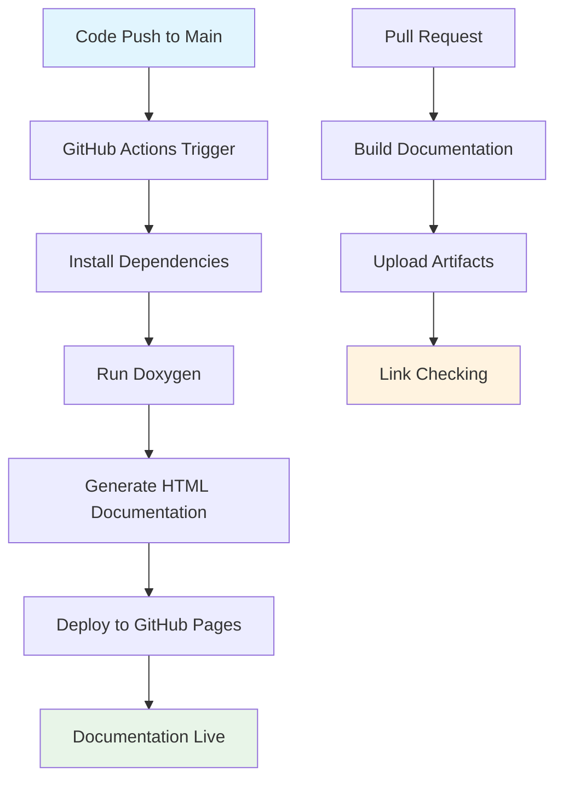
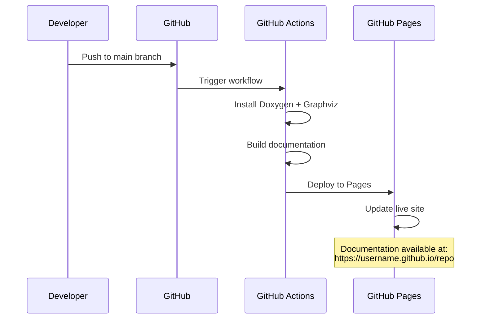

# 🕸️ GitHub Pages Documentation Workflow

<div align="center">


**📚 Automated documentation publishing with Doxygen and GitHub Actions**

</div>

---

## 📚 **Table of Contents**

- [🎯 **Overview**](#-overview)
- [🏗️ **Workflow Architecture**](#️-workflow-architecture)
- [⚙️ **Configuration Files**](#️-configuration-files)
- [🔄 **Workflow Process**](#-workflow-process)
- [🛠️ **Local Development**](#️-local-development)
- [🚀 **Deployment Process**](#-deployment-process)
- [🔧 **Troubleshooting**](#-troubleshooting)

---

## 🎯 **Overview**

The HardFOC Internal Interface Wrapper uses GitHub Pages to automatically generate and publish comprehensive documentation. The system combines Doxygen for API documentation generation with GitHub Actions for automated building and deployment.

### ✨ **Key Features**

- **🤖 Automated**: Documentation builds and deploys automatically on code changes
- **📊 Comprehensive**: Combines API docs, guides, and examples
- **🔄 Always Current**: Documentation stays synchronized with code
- **🌐 Accessible**: Available online at your GitHub Pages URL
- **📱 Responsive**: Mobile-friendly documentation layout

### 🏆 **Benefits**

- **📝 No Manual Work**: Documentation updates automatically
- **🔗 Link Checking**: Broken links are detected in CI
- **📊 Visual Diagrams**: Mermaid diagrams and Graphviz support
- **🎨 Professional Look**: Clean, modern documentation theme

---

## 🏗️ **Workflow Architecture**



### 🔧 **Components**

| Component | Purpose | Configuration |
|-----------|---------|---------------|
| **Doxygen** | API documentation generation | `Doxyfile` |
| **GitHub Actions** | CI/CD automation | `.github/workflows/` |
| **GitHub Pages** | Static site hosting | Repository settings |
| **Link Checker** | Validate documentation links | `docs/check_docs.py` |

---

## ⚙️ **Configuration Files**

### 📄 **Doxyfile Configuration**

The `Doxyfile` controls how Doxygen generates documentation:

```bash
# Project information
PROJECT_NAME           = "HardFOC Internal Interface Wrapper"
PROJECT_NUMBER         = "v1.0.0"
PROJECT_BRIEF          = "Platform-agnostic hardware abstraction layer"

# Input files
INPUT                  = inc src examples README.md
RECURSIVE              = YES
FILE_PATTERNS          = *.h *.cpp *.md

# Output configuration
OUTPUT_DIRECTORY       = docs
HTML_OUTPUT            = html
USE_MDFILE_AS_MAINPAGE = README.md

# Appearance
GENERATE_TREEVIEW      = YES
DISABLE_INDEX         = NO
FULL_SIDEBAR          = NO
HTML_EXTRA_STYLESHEET  = docs/doxygen/doxygen-awesome.css
PROJECT_LOGO          = docs/doxygen/logo.png
```

### 🚀 **GitHub Actions Workflows**

#### **Main Documentation Workflow** (`.github/workflows/docs.yml`)

```yaml
name: Docs

on:
  push:
    branches: [main]
  pull_request:
    branches: [main]
  workflow_dispatch:

jobs:
  build-docs:
    runs-on: ubuntu-latest
    steps:
      - uses: actions/checkout@v4
      - name: Install Doxygen
        run: sudo apt-get update && sudo apt-get install -y doxygen graphviz
      - name: Build documentation
        run: doxygen Doxyfile
      - name: Upload documentation
        uses: actions/upload-artifact@v4
        with:
          name: docs-html
          path: docs/html
          retention-days: 7
      - name: Deploy to GitHub Pages
        if: github.ref == 'refs/heads/main' && github.event_name != 'pull_request'
        uses: peaceiris/actions-gh-pages@v3
        with:
          github_token: ${{ secrets.GITHUB_TOKEN }}
          publish_dir: docs/html
```

#### **Deployment Workflow** (`.github/workflows/deploy-docs.yml`)

```yaml
name: Deploy Docs

on:
  push:
    branches: [main]

jobs:
  deploy:
    runs-on: ubuntu-latest
    steps:
      - uses: actions/checkout@v4
      - name: Install Doxygen
        run: sudo apt-get update && sudo apt-get install -y doxygen graphviz
      - name: Build Docs
        run: doxygen Doxyfile
      - name: Deploy to GitHub Pages
        uses: peaceiris/actions-gh-pages@v3
        with:
          github_token: ${{ secrets.GITHUB_TOKEN }}
          publish_dir: docs/html
```

#### **Link Checker** (`.github/workflows/doc-link-check.yml`)

```yaml
name: Documentation Link Check

on:
  pull_request:
  workflow_dispatch:

jobs:
  link-check:
    runs-on: ubuntu-latest
    steps:
      - uses: actions/checkout@v4
      - name: Run link checker
        run: python3 docs/check_docs.py docs/index.md
```

---

## 🔄 **Workflow Process**

### 📊 **Development Workflow**

1. **🔧 Code Changes**: Developer makes changes to code or documentation
2. **📤 Push/PR**: Changes are pushed or submitted as pull request
3. **🤖 CI Trigger**: GitHub Actions automatically start
4. **🔍 Validation**: Links are checked, documentation builds
5. **✅ Review**: PR can be reviewed with documentation preview
6. **🚀 Merge**: On merge to main, documentation deploys automatically

### 🎯 **Automatic Deployment**



---

## 🛠️ **Local Development**

### 📋 **Prerequisites**

Install required tools for local documentation development:

```bash
# Ubuntu/Debian
sudo apt-get update
sudo apt-get install -y doxygen graphviz

# macOS
brew install doxygen graphviz

# Windows (using chocolatey)
choco install doxygen.install graphviz
```

### 🔧 **Generate Documentation Locally**

```bash
# Clone the repository
git clone https://github.com/hardfoc/hf-internal-interface-wrap.git
cd hf-internal-interface-wrap

# Generate documentation
doxygen Doxyfile

# View documentation
# Linux/macOS
open docs/html/index.html

# Windows
start docs/html/index.html

# Or use a simple HTTP server
python3 -m http.server 8080 -d docs/html
# Then visit http://localhost:8080
```

### 🔍 **Check Documentation Links**

```bash
# Check all documentation for broken links
python3 docs/check_docs.py docs/

# Check specific files
python3 docs/check_docs.py README.md
python3 docs/check_docs.py docs/index.md
```

### 📝 **Preview Changes**

Before pushing changes, preview documentation locally:

```bash
# Make changes to documentation files
# ...

# Regenerate documentation
doxygen Doxyfile

# Check for issues
python3 docs/check_docs.py docs/

# View updated documentation
open docs/html/index.html
```

---

## 🚀 **Deployment Process**

### 🎯 **Automatic Deployment**

Documentation deploys automatically when:

- ✅ Code is pushed to `main` branch
- ✅ All checks pass (build, link validation)
- ✅ Doxygen successfully generates HTML

### 🔧 **Manual Deployment**

You can manually trigger deployment:

1. **Via GitHub Interface**:
   - Go to Actions tab in your repository
   - Select "Docs" workflow
   - Click "Run workflow"

2. **Via Git Commands**:
   ```bash
   # Trigger workflow with empty commit
   git commit --allow-empty -m "Trigger documentation rebuild"
   git push origin main
   ```

### 🌐 **Accessing Documentation**

Once deployed, documentation is available at:

```
https://username.github.io/repository-name/
```

For example:
```
https://hardfoc.github.io/hf-internal-interface-wrap/
```

---

## 🔧 **Troubleshooting**

### ❌ **Common Issues**

#### **1. Doxygen Build Fails**

```
Error: Project logo 'docs/doxygen/logo.png' specified by PROJECT_LOGO does not exist!
```

**Solution**: Create missing assets or update Doxyfile paths.

#### **2. GitHub Pages Not Updating**

**Possible causes**:
- Repository Pages settings incorrect
- Branch protection rules
- Workflow permissions

**Solution**:
1. Check repository Settings → Pages
2. Ensure source is "GitHub Actions"
3. Verify workflow permissions

#### **3. Broken Links Detected**

```
docs/index.md:25 missing file ComponentMap.md
Found 26 broken links
```

**Solution**: Fix broken links or update link checker exclusions.

#### **4. Documentation Not Accessible**

**Check**:
- Repository is public (or you have access)
- GitHub Pages is enabled
- Correct URL format

### 🛠️ **Debugging Steps**

1. **Check Workflow Logs**:
   - Go to Actions tab
   - Click on failed workflow
   - Review step-by-step logs

2. **Validate Doxyfile**:
   ```bash
   doxygen -g Doxyfile.template
   diff Doxyfile Doxyfile.template
   ```

3. **Test Locally**:
   ```bash
   doxygen Doxyfile
   python3 docs/check_docs.py docs/
   ```

4. **Verify Permissions**:
   - Repository Settings → Actions → Workflow permissions
   - Ensure "Read and write permissions" is selected

### 📞 **Getting Help**

If you encounter issues:

1. **Check workflow logs** in GitHub Actions
2. **Review Doxygen warnings** in build output
3. **Validate links** with the checker script
4. **Test locally** before pushing changes

---

## 🎨 **Customization**

### 🎨 **Styling**

Customize documentation appearance by:

1. **Modifying Doxyfile**:
   ```bash
   HTML_EXTRA_STYLESHEET = docs/doxygen/custom.css
   HTML_HEADER = docs/doxygen/header.html
   HTML_FOOTER = docs/doxygen/footer.html
   ```

2. **Adding Custom CSS**:
   ```css
   /* docs/doxygen/custom.css */
   .title {
       color: #2196F3;
       font-weight: bold;
   }
   ```

### 📊 **Additional Features**

Enable advanced features in Doxyfile:

```bash
# Generate class diagrams
HAVE_DOT = YES
CLASS_DIAGRAMS = YES
COLLABORATION_GRAPH = YES

# Generate call graphs
CALL_GRAPH = YES
CALLER_GRAPH = YES

# Include source code
SOURCE_BROWSER = YES
INLINE_SOURCES = NO
```

---

<div align="center">

**🕸️ GitHub Pages provides powerful, automated documentation hosting**

*Keep your documentation current and accessible with minimal effort*

</div>