# 🔒 Thread Safety Guide

<div align="center">


**🎯 Safe multi-threaded programming with HardFOC interfaces**

</div>

---

## 📚 **Table of Contents**

- [🎯 **Overview**](#-overview)
- [🏗️ **Thread-Safe Architecture**](#️-thread-safe-architecture)
- [🔒 **Thread-Safe Wrappers**](#-thread-safe-wrappers)
- [⚡ **Performance Considerations**](#-performance-considerations)
- [🛠️ **Implementation Patterns**](#️-implementation-patterns)
- [💡 **Common Use Cases**](#-common-use-cases)
- [🔧 **Best Practices**](#-best-practices)

---

## 🎯 **Overview**

Multi-threaded embedded systems require careful coordination to ensure safe access to shared hardware resources. The HardFOC Internal Interface Wrapper provides thread-safe wrappers that enable concurrent access to hardware interfaces without data races or undefined behavior.

### ✨ **Key Benefits**

- **🔒 Data Race Prevention**: Eliminates concurrent access issues
- **📊 Resource Coordination**: Manages shared hardware access
- **⚡ Performance Optimization**: Minimal synchronization overhead
- **🛡️ Deadlock Prevention**: Careful lock ordering and timeout mechanisms
- **🎯 Ease of Use**: Simple, drop-in replacements for base classes

### 🏆 **Thread Safety Guarantees**

- **✅ Atomic Operations**: Individual method calls are atomic
- **✅ State Consistency**: Hardware state remains consistent
- **✅ Resource Protection**: Hardware resources are properly arbitrated
- **✅ Exception Safety**: Thread-safe even when exceptions occur

---

## 🏗️ **Thread-Safe Architecture**

### 📊 **Layered Design**

```mermaid
graph TB
    subgraph "🎯 Application Threads"
        T1[Control Thread]
        T2[Monitoring Thread]
        T3[Communication Thread]
    end
    
    subgraph "🔒 Thread-Safe Layer"
        SF1[SfGpio]
        SF2[SfAdc]
        SF3[SfI2cBus]
    end
    
    subgraph "🏛️ Base Layer"
        B1[BaseGpio]
        B2[BaseAdc]
        B3[BaseI2c]
    end
    
    subgraph "⚙️ Implementation Layer"
        I1[EspGpio]
        I2[EspAdc]
        I3[EspI2c]
    end
    
    T1 --> SF1
    T1 --> SF2
    T2 --> SF2
    T2 --> SF3
    T3 --> SF3
    
    SF1 --> B1
    SF2 --> B2
    SF3 --> B3
    
    B1 --> I1
    B2 --> I2
    B3 --> I3
```



### 🎯 **Synchronization Strategy**

| Interface | Synchronization Method | Granularity | Performance Impact |
|-----------|----------------------|-------------|-------------------|
| **GPIO** | Mutex per pin | Per operation | Very low |
| **ADC** | Atomic operations | Per channel | Minimal |
| **I2C** | Bus-level mutex | Per transaction | Low |
| **SPI** | Transfer-level mutex | Per transfer | Low |
| **UART** | Buffer protection | Per read/write | Minimal |
| **CAN** | Message queue locks | Per message | Very low |

---

## 🔒 **Thread-Safe Wrappers**

### 🔌 **SfGpio - Thread-Safe GPIO**

```cpp
#include "thread_safe/SfGpio.h"
#include "mcu/esp32/EspGpio.h"

// Create thread-safe GPIO wrapper
auto esp_gpio = std::make_unique<EspGpio>(GPIO_NUM_2, 
                                          hf_gpio_direction_t::HF_GPIO_DIRECTION_OUTPUT);
SfGpio safe_gpio(std::move(esp_gpio));

// Thread-safe operations
void ControlThread() {
    while (true) {
        safe_gpio.SetHigh();   // Thread-safe
        vTaskDelay(pdMS_TO_TICKS(500));
        safe_gpio.SetLow();    // Thread-safe
        vTaskDelay(pdMS_TO_TICKS(500));
    }
}

void MonitorThread() {
    while (true) {
        bool state = safe_gpio.Read();  // Thread-safe
        printf("GPIO state: %s\n", state ? "HIGH" : "LOW");
        vTaskDelay(pdMS_TO_TICKS(100));
    }
}
```

### 📊 **SfAdc - Thread-Safe ADC**

```cpp
#include "thread_safe/SfAdc.h"
#include "mcu/esp32/EspAdc.h"

// Create thread-safe ADC wrapper
auto esp_adc = std::make_unique<EspAdc>(ADC_UNIT_1, ADC_ATTEN_DB_11);
SfAdc safe_adc(std::move(esp_adc));

// High-frequency control thread
void FastControlThread() {
    while (true) {
        float voltage;
        hf_adc_err_t result = safe_adc.ReadChannelV(0, voltage);
        if (IsSuccess(result)) {
            ProcessControlLoop(voltage);
        }
        vTaskDelay(pdMS_TO_TICKS(1));  // 1kHz control loop
    }
}

// Lower-frequency monitoring thread
void MonitoringThread() {
    while (true) {
        // Batch read multiple channels atomically
        std::vector<hf_channel_id_t> channels = {0, 1, 2};
        std::vector<hf_u16_t> readings;
        std::vector<float> voltages;
        
        hf_adc_err_t result = safe_adc.ReadMultipleChannels(
            channels, readings, voltages
        );
        
        if (IsSuccess(result)) {
            LogSensorData(voltages);
        }
        
        vTaskDelay(pdMS_TO_TICKS(100));  // 10Hz monitoring
    }
}
```

### 🔄 **SfI2cBus - Thread-Safe I2C**

```cpp
#include "thread_safe/SfI2cBus.h"
#include "mcu/esp32/EspI2c.h"

// Create thread-safe I2C bus wrapper
auto esp_i2c = std::make_unique<EspI2c>(I2C_NUM_0, GPIO_NUM_21, GPIO_NUM_22);
SfI2cBus safe_i2c(std::move(esp_i2c));

// Sensor reading thread
void SensorThread() {
    constexpr hf_u8_t TEMP_SENSOR_ADDR = 0x48;
    constexpr hf_u8_t PRESSURE_SENSOR_ADDR = 0x77;
    
    while (true) {
        // Read temperature sensor
        hf_u8_t temp_data[2];
        hf_i2c_err_t result = safe_i2c.ReadFrom(TEMP_SENSOR_ADDR, 
                                                temp_data, sizeof(temp_data));
        if (IsSuccess(result)) {
            ProcessTemperature(temp_data);
        }
        
        // Read pressure sensor
        hf_u8_t pressure_data[3];
        result = safe_i2c.ReadFrom(PRESSURE_SENSOR_ADDR, 
                                   pressure_data, sizeof(pressure_data));
        if (IsSuccess(result)) {
            ProcessPressure(pressure_data);
        }
        
        vTaskDelay(pdMS_TO_TICKS(100));
    }
}

// Configuration thread
void ConfigThread() {
    constexpr hf_u8_t SENSOR_ADDR = 0x48;
    
    // Configure sensor registers
    hf_u8_t config_data[] = {0x01, 0x60};  // Config register + value
    hf_i2c_err_t result = safe_i2c.WriteTo(SENSOR_ADDR, 
                                           config_data, sizeof(config_data));
    if (IsError(result)) {
        printf("Failed to configure sensor\n");
    }
}
```

---

## ⚡ **Performance Considerations**

### 📊 **Synchronization Overhead**

Thread-safe wrappers are designed for minimal performance impact:

```cpp
// Performance measurements (ESP32-C6 @ 160MHz)
Operation               | Base Class | Thread-Safe | Overhead
------------------------|------------|-------------|----------
GPIO Read               | 0.5 μs     | 0.7 μs      | +40%
GPIO Write              | 0.6 μs     | 0.8 μs      | +33%
ADC Single Read         | 15 μs      | 15.2 μs     | +1.3%
I2C Transaction (1 byte)| 45 μs      | 46 μs       | +2.2%
SPI Transfer (4 bytes)  | 8 μs       | 8.5 μs      | +6.3%
```

### 🎯 **Lock-Free Optimizations**

Critical operations use lock-free techniques where possible:

```cpp
class SfAdc {
private:
    std::atomic<bool> reading_in_progress_{false};
    std::unique_ptr<BaseAdc> adc_;
    
public:
    hf_adc_err_t ReadChannelV(hf_channel_id_t channel, float& voltage) {
        // Fast path: try lock-free read for single channel
        bool expected = false;
        if (reading_in_progress_.compare_exchange_weak(expected, true)) {
            // Got exclusive access
            hf_adc_err_t result = adc_->ReadChannelV(channel, voltage);
            reading_in_progress_.store(false);
            return result;
        }
        
        // Fallback: use mutex for concurrent access
        std::lock_guard<std::mutex> lock(mutex_);
        return adc_->ReadChannelV(channel, voltage);
    }
};
```

### ⚡ **Batch Operations**

Reduce lock overhead with batch operations:

```cpp
// ❌ Bad - Multiple lock acquisitions
for (auto channel : channels) {
    safe_adc.ReadChannelV(channel, voltages[channel]);  // Lock per call
}

// ✅ Good - Single lock for batch operation
safe_adc.ReadMultipleChannels(channels, readings, voltages);  // One lock
```

---

## 🛠️ **Implementation Patterns**

### 🎯 **Pattern 1: Producer-Consumer**

```cpp
class SensorDataQueue {
private:
    std::queue<SensorReading> queue_;
    std::mutex mutex_;
    std::condition_variable cv_;
    static constexpr size_t MAX_QUEUE_SIZE = 100;
    
public:
    bool Push(const SensorReading& reading) {
        std::lock_guard<std::mutex> lock(mutex_);
        if (queue_.size() >= MAX_QUEUE_SIZE) {
            return false;  // Queue full
        }
        queue_.push(reading);
        cv_.notify_one();
        return true;
    }
    
    bool Pop(SensorReading& reading, uint32_t timeout_ms = 1000) {
        std::unique_lock<std::mutex> lock(mutex_);
        if (cv_.wait_for(lock, std::chrono::milliseconds(timeout_ms),
                        [this] { return !queue_.empty(); })) {
            reading = queue_.front();
            queue_.pop();
            return true;
        }
        return false;  // Timeout
    }
};

// Producer thread (high frequency)
void ProducerThread() {
    SfAdc safe_adc(std::move(esp_adc));
    SensorDataQueue queue;
    
    while (true) {
        float voltage;
        if (IsSuccess(safe_adc.ReadChannelV(0, voltage))) {
            SensorReading reading = {GetCurrentTimeMs(), voltage};
            if (!queue.Push(reading)) {
                printf("Warning: sensor queue full\n");
            }
        }
        vTaskDelay(pdMS_TO_TICKS(10));  // 100Hz sampling
    }
}

// Consumer thread (lower frequency)
void ConsumerThread() {
    SensorDataQueue queue;
    
    while (true) {
        SensorReading reading;
        if (queue.Pop(reading, 5000)) {  // 5 second timeout
            ProcessSensorData(reading);
            LogToStorage(reading);
        } else {
            printf("Warning: no sensor data received\n");
        }
    }
}
```

### 🔄 **Pattern 2: Resource Pool**

```cpp
template<typename T>
class ResourcePool {
private:
    std::vector<std::unique_ptr<T>> resources_;
    std::queue<T*> available_;
    std::mutex mutex_;
    std::condition_variable cv_;
    
public:
    ResourcePool(size_t count) {
        for (size_t i = 0; i < count; ++i) {
            auto resource = std::make_unique<T>();
            available_.push(resource.get());
            resources_.push_back(std::move(resource));
        }
    }
    
    T* Acquire(uint32_t timeout_ms = 1000) {
        std::unique_lock<std::mutex> lock(mutex_);
        if (cv_.wait_for(lock, std::chrono::milliseconds(timeout_ms),
                        [this] { return !available_.empty(); })) {
            T* resource = available_.front();
            available_.pop();
            return resource;
        }
        return nullptr;  // Timeout
    }
    
    void Release(T* resource) {
        std::lock_guard<std::mutex> lock(mutex_);
        available_.push(resource);
        cv_.notify_one();
    }
};

// RAII wrapper for automatic release
template<typename T>
class ResourceGuard {
private:
    ResourcePool<T>& pool_;
    T* resource_;
    
public:
    ResourceGuard(ResourcePool<T>& pool, uint32_t timeout_ms = 1000)
        : pool_(pool), resource_(pool.Acquire(timeout_ms)) {}
    
    ~ResourceGuard() {
        if (resource_) {
            pool_.Release(resource_);
        }
    }
    
    T* Get() const { return resource_; }
    bool IsValid() const { return resource_ != nullptr; }
};

// Usage
ResourcePool<SfI2cBus> i2c_pool(2);  // Pool of 2 I2C buses

void WorkerThread() {
    while (true) {
        ResourceGuard<SfI2cBus> guard(i2c_pool);
        if (guard.IsValid()) {
            SfI2cBus* i2c = guard.Get();
            
            // Use I2C bus safely
            hf_u8_t data[4];
            i2c->ReadFrom(0x48, data, sizeof(data));
            
            // Resource automatically released when guard goes out of scope
        } else {
            printf("Failed to acquire I2C resource\n");
        }
        
        vTaskDelay(pdMS_TO_TICKS(100));
    }
}
```

### 🎯 **Pattern 3: State Machine**

```cpp
enum class MotorState {
    STOPPED,
    STARTING,
    RUNNING,
    STOPPING,
    ERROR
};

class ThreadSafeMotorController {
private:
    std::atomic<MotorState> state_{MotorState::STOPPED};
    SfGpio enable_pin_;
    SfPwm speed_control_;
    SfAdc current_sensor_;
    std::mutex state_mutex_;
    
public:
    bool StartMotor() {
        std::lock_guard<std::mutex> lock(state_mutex_);
        
        if (state_.load() != MotorState::STOPPED) {
            return false;  // Can only start from stopped state
        }
        
        state_.store(MotorState::STARTING);
        
        // Enable motor hardware
        if (IsError(enable_pin_.SetHigh())) {
            state_.store(MotorState::ERROR);
            return false;
        }
        
        // Start with low speed
        if (IsError(speed_control_.SetDutyCycle(100))) {  // 10%
            enable_pin_.SetLow();
            state_.store(MotorState::ERROR);
            return false;
        }
        
        state_.store(MotorState::RUNNING);
        return true;
    }
    
    void MonitoringThread() {
        while (true) {
            MotorState current_state = state_.load();
            
            if (current_state == MotorState::RUNNING) {
                // Check motor current
                float current;
                if (IsSuccess(current_sensor_.ReadChannelV(0, current))) {
                    if (current > MAX_CURRENT) {
                        EmergencyStop();
                    }
                } else {
                    // Sensor failure - stop motor
                    EmergencyStop();
                }
            }
            
            vTaskDelay(pdMS_TO_TICKS(10));  // 100Hz monitoring
        }
    }
    
    void EmergencyStop() {
        state_.store(MotorState::ERROR);
        enable_pin_.SetLow();
        speed_control_.SetDutyCycle(0);
    }
};
```

---

## 💡 **Common Use Cases**

### 🎛️ **Multi-Zone Motor Control**

```cpp
class MultiZoneController {
private:
    std::vector<std::unique_ptr<SfPwm>> motor_controllers_;
    std::vector<std::unique_ptr<SfAdc>> current_sensors_;
    std::shared_mutex zone_mutex_;
    
public:
    void SetZoneSpeed(size_t zone, float speed_percent) {
        std::shared_lock<std::shared_mutex> lock(zone_mutex_);
        
        if (zone < motor_controllers_.size()) {
            uint32_t duty = static_cast<uint32_t>(speed_percent * 10.0f);
            motor_controllers_[zone]->SetDutyCycle(duty);
        }
    }
    
    std::vector<float> GetAllZoneCurrents() {
        std::shared_lock<std::shared_mutex> lock(zone_mutex_);
        
        std::vector<float> currents;
        for (auto& sensor : current_sensors_) {
            float current;
            if (IsSuccess(sensor->ReadChannelV(0, current))) {
                currents.push_back(current);
            } else {
                currents.push_back(-1.0f);  // Error indicator
            }
        }
        return currents;
    }
};
```

### 📊 **Distributed Sensor Network**

```cpp
class SensorNetwork {
private:
    std::map<std::string, std::unique_ptr<SfI2cBus>> i2c_buses_;
    std::map<std::string, SensorReading> latest_readings_;
    std::shared_mutex readings_mutex_;
    
public:
    void SensorThread(const std::string& sensor_name, uint8_t i2c_address) {
        auto& i2c_bus = i2c_buses_[sensor_name];
        
        while (true) {
            uint8_t data[4];
            hf_i2c_err_t result = i2c_bus->ReadFrom(i2c_address, 
                                                   data, sizeof(data));
            
            if (IsSuccess(result)) {
                SensorReading reading = ParseSensorData(data);
                
                // Update latest reading atomically
                {
                    std::unique_lock<std::shared_mutex> lock(readings_mutex_);
                    latest_readings_[sensor_name] = reading;
                }
            }
            
            vTaskDelay(pdMS_TO_TICKS(100));
        }
    }
    
    std::map<std::string, SensorReading> GetAllReadings() {
        std::shared_lock<std::shared_mutex> lock(readings_mutex_);
        return latest_readings_;  // Copy while locked
    }
};
```

---

## 🔧 **Best Practices**

### ✅ **Do's**

1. **Use RAII for automatic resource management**
2. **Prefer atomic operations for simple state**
3. **Use condition variables for efficient waiting**
4. **Keep critical sections as short as possible**
5. **Use shared_mutex for reader-writer scenarios**
6. **Design for timeout-based operations**

### ❌ **Don'ts**

1. **Don't nest locks unless absolutely necessary**
2. **Don't hold locks during I/O operations**
3. **Don't use busy-waiting for synchronization**
4. **Don't ignore timeout values in blocking operations**
5. **Don't access hardware directly in multi-threaded code**

### 🎯 **Performance Tips**

```cpp
// ✅ Good - Minimize lock scope
{
    std::lock_guard<std::mutex> lock(mutex_);
    shared_data = new_value;
}  // Lock released here
ProcessData(shared_data);  // Don't hold lock during processing

// ✅ Good - Use atomic for simple operations
std::atomic<bool> error_flag{false};
// No need for mutex for simple boolean

// ✅ Good - Batch operations
std::vector<float> voltages;
safe_adc.ReadMultipleChannels(channels, readings, voltages);

// ✅ Good - Use condition variables
std::unique_lock<std::mutex> lock(mutex_);
cv.wait(lock, [&] { return data_ready; });
```

### 🛡️ **Deadlock Prevention**

```cpp
// Always acquire locks in consistent order
class DualResourceController {
private:
    SfGpio& gpio_;
    SfAdc& adc_;
    std::mutex gpio_mutex_;
    std::mutex adc_mutex_;
    
public:
    void OperationA() {
        // Always acquire GPIO mutex first, then ADC mutex
        std::lock_guard<std::mutex> gpio_lock(gpio_mutex_);
        std::lock_guard<std::mutex> adc_lock(adc_mutex_);
        
        // Safe to use both resources
        gpio_.SetHigh();
        float value;
        adc_.ReadChannelV(0, value);
    }
    
    void OperationB() {
        // Same order: GPIO first, then ADC
        std::lock_guard<std::mutex> gpio_lock(gpio_mutex_);
        std::lock_guard<std::mutex> adc_lock(adc_mutex_);
        
        float value;
        adc_.ReadChannelV(1, value);
        gpio_.SetLow();
    }
};
```

---

<div align="center">

**🔒 Thread safety enables robust multi-threaded embedded applications**

*Use these patterns and thread-safe wrappers to build reliable concurrent motor control systems*

</div>