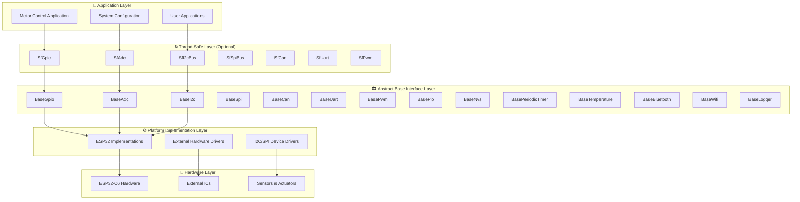

# 🚀 HardFOC Internal Interface Wrapper Documentation

<div align="center">


**🏎️ Comprehensive Hardware Abstraction Layer for High-Performance Motor Control**

[](https://www.espressif.com/en/products/socs/esp32-c6)
[](https://en.cppreference.com/w/cpp/17)
[](#thread-safe-wrappers)
[](docs/index.md)

</div>

---

## 📚 **Table of Contents**

- [🎯 **Overview**](#-overview)
- [🏗️ **Architecture**](#️-architecture) 
- [🔧 **Type System**](#-type-system)
- [📖 **API Reference**](#-api-reference)
  - [🏛️ **Core Interfaces**](#️-core-interfaces)
  - [📡 **Communication Interfaces**](#-communication-interfaces)
  - [🌐 **Wireless Interfaces**](#-wireless-interfaces)
  - [🛠️ **System Interfaces**](#️-system-interfaces)
- [🚀 **Quick Start**](#-quick-start)
- [📋 **User Guides**](#-user-guides)
- [📊 **Examples**](#-examples)
- [🔧 **Development**](#-development)

---

## 🎯 **Overview**

The **HardFOC Internal Interface Wrapper** provides a comprehensive, platform-agnostic hardware abstraction layer specifically designed for motor control applications. It offers unified APIs across different MCU platforms while maintaining high performance, thread safety, and extensive hardware support.

### ✨ **Key Features**

- 🎛️ **Unified APIs** - Consistent interface across all hardware platforms and implementations
- ⚡ **High Performance** - Optimized for real-time motor control applications with minimal overhead  
- 🔒 **Thread Safe Options** - Built-in synchronization for multi-threaded environments
- 🔌 **Platform Agnostic** - Easy porting between different MCU families and external hardware
- 📊 **ESP32-C6 Optimized** - Full support for ESP32-C6 capabilities and peripherals
- 🛡️ **Robust Error Handling** - Comprehensive error codes and validation across all interfaces
- 💾 **Memory Efficient** - Minimal overhead with lazy initialization and optimized data structures
- 🌐 **Wireless Support** - Complete WiFi and Bluetooth implementation with modern protocols
- 📊 **Rich Diagnostics** - Built-in logging, monitoring, and performance tracking

### 🎯 **Supported Hardware Platforms**

| Platform | GPIO | ADC | PWM | I2C | SPI | UART | CAN | WiFi | Bluetooth | Temperature |
|----------|------|-----|-----|-----|-----|------|-----|------|-----------|-------------|
| **ESP32-C6** | ✅ | ✅ | ✅ | ✅ | ✅ | ✅ | ✅ | ✅ | ✅ | ✅ |
| **External ICs** | ✅ | ✅ | ✅ | ✅ | ✅ | ❌ | ✅ | ❌ | ❌ | ✅ |
| **I2C Expanders** | ✅ | ✅ | ❌ | ❌ | ❌ | ❌ | ❌ | ❌ | ❌ | ✅ |
| **SPI Devices** | ✅ | ✅ | ✅ | ❌ | ❌ | ❌ | ✅ | ❌ | ❌ | ✅ |

---

## 🏗️ **Architecture**

The HardFOC Internal Interface Wrapper follows a sophisticated layered architecture that maximizes flexibility, maintainability, and performance:



### 🎯 **Design Principles**

1. **🔄 Layered Architecture** - Clean separation between abstraction, implementation, and hardware
2. **🔒 Optional Thread Safety** - Thread-safe wrappers available for concurrent access patterns
3. **⚡ Performance First** - Minimal overhead with direct hardware access when needed
4. **🔌 Platform Independence** - Easy porting to new MCU platforms and external hardware
5. **🛡️ Comprehensive Error Handling** - Detailed error reporting and validation at every layer
6. **🔧 Consistent Type System** - Unified platform-agnostic types across all interfaces
7. **📊 Rich Diagnostics** - Built-in monitoring, logging, and performance analysis

---

## 🔧 **Type System**

The HardFOC Internal Interface Wrapper implements a comprehensive type wrapping system that ensures consistency, portability, and type safety across all hardware interfaces.

### 🎯 **Core Benefits**

- **🔒 Type Consistency** - All interfaces use the same wrapped type system
- **🔄 Portability** - Easy adaptation to different platforms and architectures  
- **🎯 Clarity** - Clear distinction between platform types and wrapped types
- **🛡️ Safety** - Prevents type mismatches and improves compile-time checking
- **📊 Hardware Abstraction** - Unified types for pins, channels, ports, and timing

### 📊 **Type Definitions**

```cpp
// Core integer type wrappers
using hf_u8_t = uint8_t;    // 8-bit unsigned integer
using hf_u16_t = uint16_t;  // 16-bit unsigned integer
using hf_u32_t = uint32_t;  // 32-bit unsigned integer
using hf_u64_t = uint64_t;  // 64-bit unsigned integer
using hf_i8_t = int8_t;     // 8-bit signed integer
using hf_i16_t = int16_t;   // 16-bit signed integer
using hf_i32_t = int32_t;   // 32-bit signed integer
using hf_i64_t = int64_t;   // 64-bit signed integer

// Hardware-specific semantic types
using hf_pin_num_t = hf_i32_t;      // GPIO pin numbers
using hf_channel_id_t = hf_u32_t;   // ADC/PWM/DMA channels
using hf_port_num_t = hf_u32_t;     // Communication ports (I2C, SPI, UART)
using hf_time_t = hf_u32_t;         // Time values in milliseconds
using hf_frequency_hz_t = hf_u32_t; // Frequency values in Hz
using hf_voltage_mv_t = hf_u32_t;   // Voltage values in millivolts
using hf_current_ma_t = hf_u32_t;   // Current values in milliamps
using hf_temperature_c_t = hf_i32_t; // Temperature in Celsius (scaled)
```

### 📚 **Documentation**

For detailed information about the type wrapping system:
- [🔧 **HardwareTypes.h**](../inc/base/HardwareTypes.h) - Complete type definitions
- [📊 **Type System Guide**](guides/type-system.md) - Comprehensive usage guide

---

## 📖 **API Reference**

### 🏛️ **Core Interfaces**

| Interface | Description | Key Features | Status |
|-----------|-------------|--------------|---------|
| [`BaseGpio`](api/BaseGpio.md) | 🔌 Digital I/O Operations | Dynamic modes, interrupts, pull resistors | ✅ Complete |
| [`BaseAdc`](api/BaseAdc.md) | 📊 Analog-to-Digital Conversion | Multi-channel, calibration, voltage conversion | ✅ Complete |
| [`BasePwm`](api/BasePwm.md) | 🎛️ Pulse Width Modulation | Multi-channel, frequency control, duty cycle | ✅ Complete |
| [`BasePio`](api/BasePio.md) | 📻 Programmable I/O | Custom protocols, precise timing, encoding | ✅ Complete |

### 📡 **Communication Interfaces**

| Interface | Description | Key Features | Status |
|-----------|-------------|--------------|---------|
| [`BaseI2c`](api/BaseI2c.md) | 🔄 I2C Communication | Master mode, device scanning, error recovery | ✅ Complete |
| [`BaseSpi`](api/BaseSpi.md) | ⚡ SPI Communication | Full-duplex, configurable modes, DMA support | ✅ Complete |
| [`BaseUart`](api/BaseUart.md) | 📡 UART Communication | Async I/O, flow control, configurable parameters | ✅ Complete |
| [`BaseCan`](api/BaseCan.md) | 🚗 CAN Bus Communication | Standard/Extended frames, filtering, error handling | ✅ Complete |

### 🌐 **Wireless Interfaces**

| Interface | Description | Key Features | Status |
|-----------|-------------|--------------|---------|
| [`BaseWifi`](api/BaseWifi.md) | 📶 WiFi Communication | Station/AP modes, WPA3 security, event handling | ✅ Complete |
| [`BaseBluetooth`](api/BaseBluetooth.md) | 📲 Bluetooth Communication | Classic & BLE, pairing, service discovery | ✅ Complete |

### 🛠️ **System Interfaces**

| Interface | Description | Key Features | Status |
|-----------|-------------|--------------|---------|
| [`BaseNvs`](api/BaseNvs.md) | 💾 Non-Volatile Storage | Key-value storage, encryption, wear leveling | ✅ Complete |
| [`BasePeriodicTimer`](api/BasePeriodicTimer.md) | ⏰ Periodic Timers | Callback scheduling, high precision, multi-timer | ✅ Complete |
| [`BaseTemperature`](api/BaseTemperature.md) | 🌡️ Temperature Sensing | Multi-sensor support, calibration, alerts | ✅ Complete |
| [`BaseLogger`](api/BaseLogger.md) | 📝 System Logging | Multi-level logging, thread-safe, performance monitoring | ✅ Complete |

---

## 🚀 **Quick Start**

### 📋 **Prerequisites**

- **ESP-IDF v5.0+** for ESP32-C6 development
- **C++17** compatible compiler (GCC 8+ or Clang 7+)
- **CMake 3.16+** for build system management

### ⚙️ **Installation**

1. **Add to your CMakeLists.txt:**
```cmake
# Include the HardFOC Interface Wrapper
idf_component_register(
    SRCS "main.cpp"
    INCLUDE_DIRS "."
    REQUIRES hf_internal_interface_wrap
)
```

2. **Include headers in your code:**
```cpp
// Core interfaces
#include "inc/base/BaseGpio.h"
#include "inc/base/BaseAdc.h"
#include "inc/base/BasePwm.h"

// ESP32 implementations
#include "inc/mcu/esp32/EspGpio.h"
#include "inc/mcu/esp32/EspAdc.h"
#include "inc/mcu/esp32/EspPwm.h"

// Thread-safe wrappers (optional)
#include "inc/thread_safe/SfGpio.h"
#include "inc/thread_safe/SfAdc.h"
```

### 🎯 **Basic Usage Examples**

#### 🔌 **GPIO Control**
```cpp
#include "inc/mcu/esp32/EspGpio.h"

// Create GPIO instance for LED control
EspGpio led_pin(GPIO_NUM_2, hf_gpio_direction_t::HF_GPIO_DIRECTION_OUTPUT);

void setup() {
    // Initialize GPIO (lazy initialization)
    led_pin.EnsureInitialized();
    led_pin.SetActiveState(hf_gpio_active_state_t::HF_GPIO_ACTIVE_HIGH);
}

void loop() {
    led_pin.SetActive();    // Turn LED on
    vTaskDelay(500);
    led_pin.SetInactive();  // Turn LED off
    vTaskDelay(500);
}
```

#### 📊 **ADC Reading**
```cpp
#include "inc/mcu/esp32/EspAdc.h"

// Create ADC instance
EspAdc adc(ADC_UNIT_1, ADC_ATTEN_DB_11);

void setup() {
    adc.EnsureInitialized();
}

void read_sensor() {
    float voltage;
    hf_u16_t raw_value;
    
    // Read voltage directly
    if (adc.ReadChannelV(ADC_CHANNEL_0, voltage) == hf_adc_err_t::ADC_SUCCESS) {
        printf("Sensor voltage: %.3f V\n", voltage);
    }
    
    // Read raw ADC value
    if (adc.ReadChannelRaw(ADC_CHANNEL_0, raw_value) == hf_adc_err_t::ADC_SUCCESS) {
        printf("Raw ADC value: %u\n", raw_value);
    }
}
```

#### 🎛️ **PWM Generation**
```cpp
#include "inc/mcu/esp32/EspPwm.h"

// Create PWM instance for motor control
EspPwm motor_pwm(LEDC_CHANNEL_0, GPIO_NUM_5);

void setup() {
    motor_pwm.EnsureInitialized();
    motor_pwm.SetFrequency(1000); // 1kHz PWM frequency
}

void control_motor(float speed_percent) {
    // Set duty cycle (0-100%)
    motor_pwm.SetDutyCyclePercent(speed_percent);
}
```

#### 🌡️ **Temperature Monitoring**
```cpp
#include "inc/mcu/esp32/EspTemperature.h"

EspTemperature temp_sensor;

void setup() {
    temp_sensor.EnsureInitialized();
}

void monitor_temperature() {
    float temperature_c;
    
    if (temp_sensor.ReadTemperature(temperature_c) == hf_temp_err_t::TEMP_SUCCESS) {
        printf("Temperature: %.2f°C\n", temperature_c);
        
        // Check for overheating
        if (temperature_c > 85.0f) {
            printf("⚠️ Temperature warning: %.2f°C\n", temperature_c);
            // Implement thermal protection
        }
    }
}
```

---

## 📋 **User Guides**

### 🎯 **Interface-Specific Guides**

| Guide | Description | Level | Coverage |
|-------|-------------|-------|----------|
| [🔌 **GPIO Operations**](guides/gpio-guide.md) | Complete GPIO usage, interrupts, and configurations | Beginner | All GPIO operations |
| [📊 **ADC & Voltage Measurement**](guides/adc-guide.md) | ADC configuration, calibration, and multi-channel usage | Intermediate | All ADC features |
| [🎛️ **PWM Generation**](guides/pwm-guide.md) | Motor control, signal generation, and advanced PWM | Intermediate | All PWM capabilities |
| [🔄 **I2C Communication**](guides/i2c-guide.md) | I2C device integration and multi-master setups | Intermediate | Complete I2C protocol |
| [⚡ **SPI Communication**](guides/spi-guide.md) | High-speed SPI operations and device management | Intermediate | Full SPI capabilities |
| [📡 **UART Communication**](guides/uart-guide.md) | Serial communication, protocols, and data handling | Intermediate | Complete UART features |
| [🚗 **CAN Bus Integration**](guides/can-guide.md) | Automotive CAN communication and network management | Advanced | Full CAN protocol |
| [📻 **Programmable I/O**](guides/pio-guide.md) | Custom protocols and precise timing control | Advanced | Complete PIO system |

### 🌐 **Wireless Communication Guides**

| Guide | Description | Level | Coverage |
|-------|-------------|-------|----------|
| [📶 **WiFi Integration**](guides/wifi-guide.md) | WiFi setup, security, and network management | Intermediate | Complete WiFi stack |
| [📲 **Bluetooth Communication**](guides/bluetooth-guide.md) | BLE and Classic Bluetooth implementation | Advanced | Full Bluetooth support |

### 🛠️ **System Guides**

| Guide | Description | Level | Coverage |
|-------|-------------|-------|----------|
| [💾 **Non-Volatile Storage**](guides/nvs-guide.md) | Configuration persistence and data management | Intermediate | Complete NVS system |
| [⏰ **Timer Management**](guides/timer-guide.md) | Periodic callbacks and time-critical operations | Intermediate | All timer features |
| [🌡️ **Temperature Monitoring**](guides/temperature-guide.md) | Multi-sensor setup and thermal management | Intermediate | Complete temp system |
| [📝 **Logging System**](guides/logging-guide.md) | System debugging and performance monitoring | Beginner | Full logging capabilities |

### 🔧 **Development Guides**

| Guide | Description | Audience | Focus |
|-------|-------------|----------|--------|
| [🏗️ **Porting Guide**](guides/porting-guide.md) | Adding new MCU platforms and hardware | Developers | Platform extension |
| [🧪 **Testing Framework**](guides/testing-guide.md) | Unit testing and hardware validation | QA Engineers | Quality assurance |
| [⚡ **Performance Optimization**](guides/performance-guide.md) | Real-time optimization and profiling | Advanced Users | Performance tuning |
| [🛡️ **Error Handling**](guides/error-handling.md) | Robust error management patterns | All Users | Error management |
| [🔒 **Thread Safety**](guides/thread-safety.md) | Multi-threaded programming patterns | Advanced Users | Concurrency |

---

## 📊 **Examples**

### 🎯 **Basic Interface Examples**

- [🔌 **Simple GPIO Control**](examples/basic-gpio.md) - LED control and button reading
- [📊 **ADC Voltage Monitoring**](examples/basic-adc.md) - Sensor data acquisition and processing
- [🎛️ **PWM Motor Control**](examples/basic-pwm.md) - Speed control and direction management
- [🔄 **I2C Device Communication**](examples/basic-i2c.md) - Temperature sensor integration
- [⚡ **SPI Device Integration**](examples/basic-spi.md) - External ADC communication
- [📡 **UART Data Transfer**](examples/basic-uart.md) - Serial communication protocols

### 🌐 **Wireless Communication Examples**

- [📶 **WiFi Station Setup**](examples/wifi-station.md) - Internet connectivity and web services
- [📲 **Bluetooth Device Control**](examples/bluetooth-control.md) - BLE device management
- [🌐 **WiFi Access Point**](examples/wifi-ap.md) - Local network creation and management

### 🚀 **Advanced Integration Examples**

- [🏭 **Complete Motor Control System**](examples/motor-control-system.md) - Multi-interface motor controller
- [🚗 **CAN Bus Gateway**](examples/can-gateway.md) - Message filtering and routing system
- [📻 **WS2812 LED Control**](examples/ws2812-pio.md) - Programmable I/O for LED strips
- [🔒 **Multi-threaded Sensor Hub**](examples/sensor-hub.md) - Thread-safe sensor management
- [🌡️ **Thermal Management System**](examples/thermal-management.md) - Temperature monitoring and control
- [📊 **Data Logger with WiFi**](examples/data-logger-wifi.md) - Remote data logging system

### 🧪 **Production-Ready Examples**

- [🏭 **Industrial I/O Module**](examples/industrial-io.md) - Complete industrial control system
- [🚀 **Real-time Data Acquisition**](examples/real-time-daq.md) - High-speed data capture
- [🎯 **Custom Protocol Implementation**](examples/custom-protocol.md) - PIO-based protocol development
- [🔐 **Secure IoT Gateway**](examples/secure-iot-gateway.md) - Complete IoT solution with security

---

## 🔧 **Development**

### 🛠️ **Building**

```bash
# Configure ESP-IDF environment
. $IDF_PATH/export.sh

# Configure project
idf.py menuconfig

# Build the project
idf.py build

# Flash and monitor
idf.py -p /dev/ttyUSB0 flash monitor
```

### 🧪 **Testing**

```bash
# Run unit tests (if available)
idf.py test

# Hardware-in-the-loop testing
idf.py -p /dev/ttyUSB0 flash monitor
```

### 📊 **Documentation Generation**

```bash
# Generate Doxygen documentation
doxygen Doxyfile

# View generated documentation
open docs/html/index.html
```

### 🔧 **Configuration Options**

The wrapper supports extensive configuration through ESP-IDF's menuconfig:

- **Interface Selection** - Enable/disable specific interfaces
- **Buffer Sizes** - Configure communication buffer sizes
- **Performance Tuning** - Optimize for speed vs. memory usage
- **Security Settings** - Configure WiFi and Bluetooth security
- **Debug Options** - Enable comprehensive logging and diagnostics

---

## 📝 **License**

This project is licensed under the **GNU General Public License v3.0** - see the [LICENSE](../LICENSE) file for details.

---

## 🤝 **Contributing**

We welcome contributions! Please see our [Contributing Guide](CONTRIBUTING.md) for details on:

- 📋 Code style and standards
- 🧪 Testing requirements  
- 📖 Documentation updates
- 🐛 Bug reporting and fixes
- ✨ Feature requests and implementation

---

## 📞 **Support**

- 📖 **Documentation** - This comprehensive guide and API reference
- 🐛 **Issues** - [GitHub Issues](../../issues) for bug reports and feature requests
- 💬 **Discussions** - [GitHub Discussions](../../discussions) for questions and community support
- 📧 **Email** - [support@hardfoc.com](mailto:support@hardfoc.com) for direct support

---

<div align="center">

**🏎️ Built with ❤️ for High-Performance Motor Control Applications**

*Empowering innovation through robust, flexible, and performant hardware abstraction*

*Copyright © 2025 HardFOC Team. All rights reserved.*

</div>
