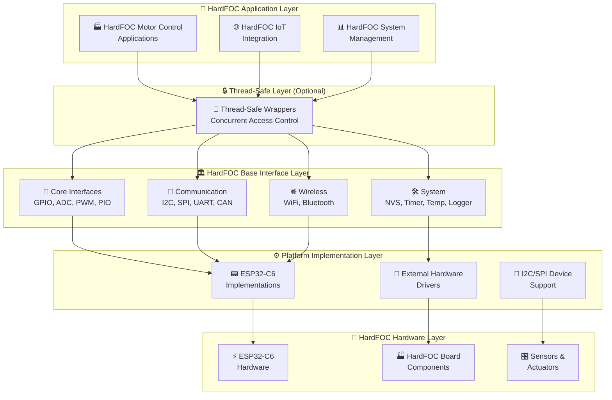
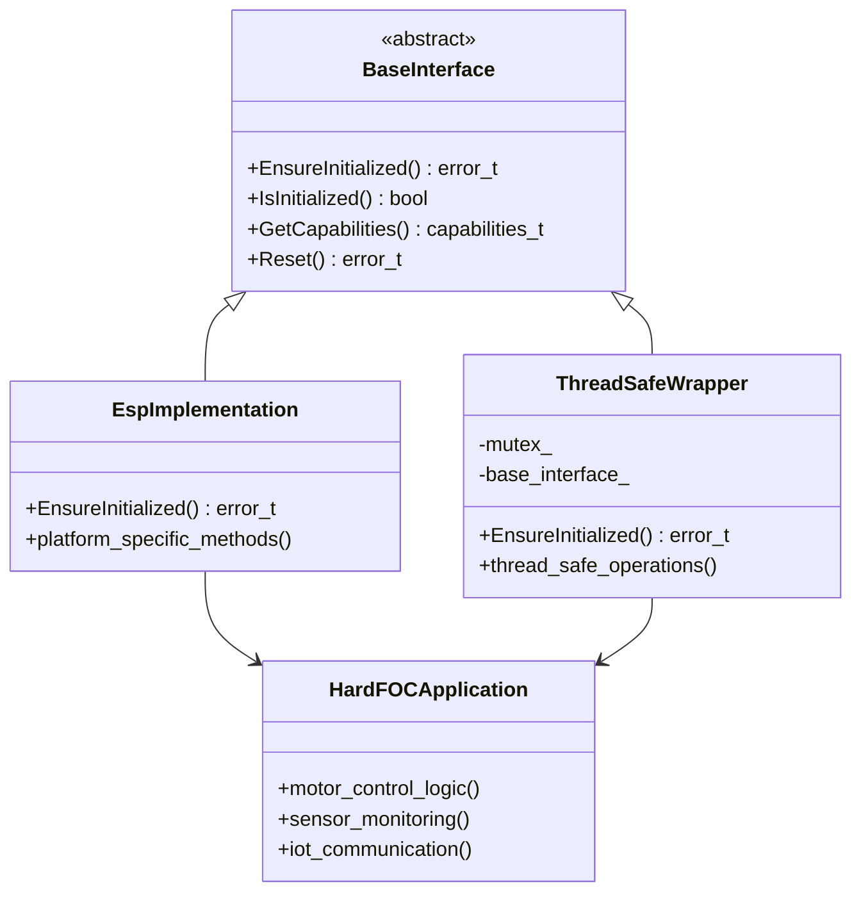

# 🚀 HardFOC Internal Interface Wrapper

<div align="center">


**🎯 Comprehensive Hardware Abstraction Layer for HardFOC Motor Controller Boards**

*Professional, platform-agnostic interface wrapper specifically designed for HardFOC motor controller boards with complete wireless, communication, and sensor support*

</div>

---

## 📚 **Table of Contents**

- [🎯 **Overview**](#-overview)
- [🏗️ **Architecture**](#️-architecture)
- [🔧 **Type System**](#-type-system)
- [✨ **Key Features**](#-key-features)
- [🔌 **Supported Hardware**](#-supported-hardware)
- [🏛️ **Design Principles**](#️-design-principles)
- [📋 **API Reference**](#-api-reference)
- [🚀 **Quick Start**](#-quick-start)
- [📖 **User Guides**](#-user-guides)
- [📊 **Examples**](#-examples)
- [🔧 **Building**](#-building)
- [🤝 **Contributing**](#-contributing)
- [📄 **License**](#-license)

---

## 🎯 **Overview**

The **HardFOC Internal Interface Wrapper** is a comprehensive, production-ready hardware abstraction layer specifically designed for **HardFOC motor controller boards**. It provides unified APIs across different MCU platforms while maintaining the high performance, thread safety, and extensive hardware support that HardFOC motor controller boards require.

### 🎯 **Primary Goals for HardFOC Boards**

- **🔌 Unified Interface** - Consistent APIs across all HardFOC motor controller board peripherals
- **⚡ Real-Time Performance** - Optimized for critical HardFOC motor control timing requirements
- **🌐 Modern Connectivity** - Complete WiFi and Bluetooth support for IoT-enabled HardFOC boards
- **🛡️ Production Ready** - Professional-grade error handling and monitoring for HardFOC applications
- **📈 Scalable Architecture** - From simple HardFOC prototypes to complex industrial systems
- **🔧 Easy Integration** - Seamless integration with existing HardFOC motor control applications

---

## 🏗️ **Architecture**

The wrapper follows a sophisticated multi-layered architecture optimized for HardFOC motor controller boards:



### 🔄 **Interface Inheritance Pattern for HardFOC**

All HardFOC interfaces follow a consistent inheritance pattern:



---

## 🔧 **Type System**

The wrapper uses a comprehensive type system designed for maximum portability and consistency across HardFOC motor controller boards:

### 🎯 **Core Types for HardFOC Applications**

```cpp
// Platform-agnostic integer types for HardFOC boards
using hf_u8_t = uint8_t;    // 8-bit unsigned
using hf_u16_t = uint16_t;  // 16-bit unsigned  
using hf_u32_t = uint32_t;  // 32-bit unsigned
using hf_u64_t = uint64_t;  // 64-bit unsigned
using hf_i8_t = int8_t;     // 8-bit signed
using hf_i16_t = int16_t;   // 16-bit signed
using hf_i32_t = int32_t;   // 32-bit signed
using hf_i64_t = int64_t;   // 64-bit signed
```

### 🏭 **HardFOC Hardware-Specific Types**

```cpp
// Hardware abstraction types for HardFOC motor controller boards
using hf_pin_num_t = hf_i32_t;          // GPIO pin numbers
using hf_channel_id_t = hf_u32_t;       // ADC/PWM/DMA channels
using hf_time_t = hf_u64_t;             // Time values in microseconds
using hf_frequency_hz_t = hf_u32_t;     // Frequency values in Hz

// HardFOC motor control semantic types
using hf_voltage_mv_t = hf_u32_t;       // Voltage in millivolts
using hf_current_ma_t = hf_u32_t;       // Current in milliamps
using hf_temperature_c_t = hf_i32_t;    // Temperature in Celsius (scaled by 100)
using hf_speed_rpm_t = hf_u32_t;        // Motor speed in RPM
using hf_torque_nm_t = hf_u32_t;        // Torque in Newton-meters (scaled)
```

📖 **Complete Documentation**: [Type System Guide](TypeWrappingSystem.md) | [Implementation Status](TypeWrappingStatus.md)

---

## ✨ **Key Features**

### 🔌 **Comprehensive Hardware Support for HardFOC Boards**
- **14 Complete Base Interfaces** - From GPIO to wireless communication for HardFOC applications
- **ESP32-C6 Optimized** - Full support for all ESP32-C6 peripherals used in HardFOC boards
- **External Hardware Integration** - I2C/SPI device support for HardFOC expansion boards
- **Motor Control Optimized** - Specialized features for HardFOC motor controller applications

### ⚡ **Performance & Reliability for HardFOC**
- **Real-Time Optimized** - Designed for critical HardFOC motor control timing
- **Lazy Initialization** - Resources allocated only when needed on HardFOC boards
- **Thread-Safe Options** - Optional concurrent access support for HardFOC applications
- **Comprehensive Error Handling** - Detailed error reporting for HardFOC reliability

### 🌐 **Modern Connectivity for HardFOC IoT**
- **WiFi Station/AP Modes** - Complete networking for HardFOC IoT integration
- **Bluetooth Classic & BLE** - Mobile and IoT connectivity for HardFOC boards
- **Cloud Integration Ready** - Built-in features for HardFOC cloud connectivity
- **Remote Monitoring** - Advanced logging and diagnostics for HardFOC systems

### 📊 **Professional Features for HardFOC Systems**
- **Rich Diagnostics** - Performance monitoring and system health for HardFOC boards
- **Configuration Management** - Non-volatile settings storage for HardFOC applications
- **Advanced Logging** - Multi-level, multi-output logging for HardFOC debugging
- **Thermal Management** - Temperature monitoring and protection for HardFOC boards

---

## 🔌 **Supported Hardware**

### 📊 **HardFOC Platform Support Matrix**

| **HardFOC Hardware Platform** | **GPIO** | **ADC** | **PWM** | **I2C** | **SPI** | **UART** | **CAN** | **WiFi** | **BT** | **Temp** | **NVS** | **Timer** | **PIO** | **Logger** |
|-------------------------------|----------|---------|---------|---------|---------|----------|---------|----------|--------|----------|---------|-----------|---------|------------|
| **ESP32-C6 (Primary MCU)**   | ✅       | ✅      | ✅      | ✅      | ✅      | ✅       | ✅      | ✅       | ✅     | ✅       | ✅      | ✅        | ✅      | ✅         |
| **I2C Expansion Devices**    | ✅       | ✅      | ❌      | ❌      | ❌      | ❌       | ❌      | ❌       | ❌     | ✅       | ❌      | ❌        | ❌      | ❌         |
| **SPI Expansion Devices**    | ✅       | ✅      | ✅      | ❌      | ❌      | ❌       | ✅      | ❌       | ❌     | ✅       | ❌      | ❌        | ❌      | ❌         |
| **External Controllers**     | ✅       | ✅      | ✅      | ✅      | ✅      | ❌       | ✅      | ❌       | ❌     | ✅       | ✅      | ❌        | ❌      | ❌         |

### 🎛️ **HardFOC Board Components**

| **Component Type** | **Interface** | **Example Devices** | **HardFOC Board Usage** |
|-------------------|---------------|-------------------|------------------------|
| **Motor Drivers** | SPI, GPIO | **TMC9660 (Primary)**, TMC2209, DRV8825 | Advanced motor control on HardFOC boards |
| **Current Sensors** | ADC, I2C | ACS712, INA219, Hall effect | Motor current monitoring for HardFOC |
| **Position Encoders** | PIO, I2C, SPI | AS5600, AMT103, Quadrature | Precise position feedback for HardFOC |
| **Temperature Sensors** | I2C, 1-Wire, ADC | DS18B20, LM35, NTC | Thermal protection for HardFOC boards |
| **Communication** | CAN, UART, WiFi | MCP2515, ESP32 WiFi/BT | HardFOC network connectivity |
| **Storage** | SPI, I2C | SD Cards, EEPROM, Flash | HardFOC configuration and data logging |

### 🏭 **TMC9660 - Primary Motor Controller for HardFOC**

The **TMC9660** is the primary motor controller chosen for HardFOC boards, offering advanced features specifically designed for high-performance motor control applications:

#### 🎯 **TMC9660 Key Features**
- **🔧 Advanced Motor Control** - Sophisticated field-oriented control (FOC) algorithms
- **📡 SPI Communication** - High-speed digital interface for precise control commands
- **⚡ High Current Capability** - Supports high-power motor applications with efficient switching
- **🎛️ Configurable Parameters** - Extensive motor parameter customization via SPI registers
- **🛡️ Built-in Protection** - Overcurrent, overtemperature, and undervoltage protection
- **📊 Real-time Feedback** - Motor status, current, and diagnostic information
- **🔄 Position & Velocity Control** - Closed-loop control with encoder feedback support
- **🎵 Silent Operation** - Advanced algorithms for reduced motor noise and vibration

#### 📋 **TMC9660 Integration with HardFOC Wrapper**
The HardFOC wrapper provides seamless integration with TMC9660 through the **BaseSpi** interface:

```cpp
// TMC9660 SPI communication example
EspSpi tmc9660_spi{SPI2_HOST, GPIO_NUM_18, GPIO_NUM_19, GPIO_NUM_5};

// Configure TMC9660 motor parameters
void configure_tmc9660_motor() {
    // Set motor current limits
    hf_u8_t current_cmd[] = {0x10, 0x00, 0x00, 0x00, 0x05, 0x00};  // 5A max current
    tmc9660_spi.WriteRead(current_cmd, nullptr, sizeof(current_cmd));
    
    // Set velocity control parameters
    hf_u8_t velocity_cmd[] = {0x13, 0x00, 0x00, 0x01, 0x00, 0x00};  // Max velocity
    tmc9660_spi.WriteRead(velocity_cmd, nullptr, sizeof(velocity_cmd));
    
    // Enable FOC mode
    hf_u8_t foc_cmd[] = {0x16, 0x00, 0x00, 0x00, 0x00, 0x01};  // FOC enable
    tmc9660_spi.WriteRead(foc_cmd, nullptr, sizeof(foc_cmd));
}
```

---

## 🏛️ **Design Principles**

### 🎯 **HardFOC-Specific Design Goals**

1. **🔌 Consistency** - Uniform APIs across all HardFOC motor controller board interfaces
2. **⚡ Performance** - Optimized for real-time HardFOC motor control requirements  
3. **🛡️ Reliability** - Comprehensive error handling for critical HardFOC applications
4. **📈 Scalability** - From simple HardFOC prototypes to complex industrial systems
5. **🔧 Simplicity** - Easy-to-use APIs for rapid HardFOC development
6. **🌐 Modern** - Built-in IoT connectivity for next-generation HardFOC boards

### 🏗️ **Architectural Patterns for HardFOC**

- **Abstract Base Classes** - Define consistent interfaces for all HardFOC peripherals
- **Platform Implementations** - Hardware-specific optimizations for HardFOC boards
- **Optional Thread Safety** - Concurrent access support for complex HardFOC applications
- **Lazy Resource Management** - Efficient memory usage on resource-constrained HardFOC boards
- **Comprehensive Error Handling** - Detailed error reporting for HardFOC reliability
- **Semantic Type System** - Motor control domain-specific types for HardFOC clarity

---

## 📋 **API Reference**

### 🏛️ **Core Interfaces for HardFOC Boards**

| **Interface** | **Key Features** | **HardFOC Use Cases** | **Status** |
|---------------|------------------|----------------------|------------|
| [**`BaseGpio`**](api/BaseGpio.md) | Digital I/O, interrupts, pull resistors | Enable pins, limit switches, indicators on HardFOC boards | ✅ Complete |
| [**`BaseAdc`**](api/BaseAdc.md) | Multi-channel, calibration, voltage conversion | Current sensing, position feedback for HardFOC systems | ✅ Complete |
| [**`BasePwm`**](api/BasePwm.md) | Multi-channel, frequency control, duty cycle | Motor speed control, servo control for HardFOC applications | ✅ Complete |
| [**`BasePio`**](api/BasePio.md) | Custom protocols, precise timing, encoding | Encoder reading, custom protocols for HardFOC boards | ✅ Complete |

### 📡 **Communication Interfaces for HardFOC Systems**

| **Interface** | **Key Features** | **HardFOC Use Cases** | **Status** |
|---------------|------------------|----------------------|------------|
| [**`BaseI2c`**](api/BaseI2c.md) | Master mode, device scanning, error recovery | Sensor communication, display control for HardFOC boards | ✅ Complete |
| [**`BaseSpi`**](api/BaseSpi.md) | Full-duplex, configurable modes, DMA support | High-speed data, SD cards for HardFOC data logging | ✅ Complete |
| [**`BaseUart`**](api/BaseUart.md) | Async I/O, flow control, configurable parameters | Debug output, external communication for HardFOC systems | ✅ Complete |
| [**`BaseCan`**](api/BaseCan.md) | Standard/Extended frames, filtering, error handling | Industrial networking, multi-motor HardFOC coordination | ✅ Complete |

### 🌐 **Wireless Interfaces for HardFOC IoT**

| **Interface** | **Key Features** | **HardFOC Use Cases** | **Status** |
|---------------|------------------|----------------------|------------|
| [**`BaseWifi`**](api/BaseWifi.md) | Station/AP modes, WPA3 security, mesh networking | Cloud connectivity, remote monitoring for HardFOC boards | ✅ Complete |
| [**`BaseBluetooth`**](api/BaseBluetooth.md) | Classic & BLE, pairing, service discovery | Mobile apps, wireless configuration for HardFOC systems | ✅ Complete |

### 🛠️ **System Interfaces for HardFOC Applications**

| **Interface** | **Key Features** | **HardFOC Use Cases** | **Status** |
|---------------|------------------|----------------------|------------|
| [**`BaseNvs`**](api/BaseNvs.md) | Key-value storage, encryption, wear leveling | Configuration storage, calibration data for HardFOC boards | ✅ Complete |
| [**`BasePeriodicTimer`**](api/BasePeriodicTimer.md) | Callback scheduling, high precision, multi-timer | Control loops, sensor sampling for HardFOC applications | ✅ Complete |
| [**`BaseTemperature`**](api/BaseTemperature.md) | Multi-sensor support, calibration, thermal protection | Thermal monitoring, safety protection for HardFOC boards | ✅ Complete |
| [**`BaseLogger`**](api/BaseLogger.md) | Multi-level logging, thread-safe, network output | System diagnostics, performance monitoring for HardFOC systems | ✅ Complete |

---

## 🚀 **Quick Start**

### 📋 **Prerequisites for HardFOC Development**

- **ESP-IDF v5.0+** for ESP32-C6 development
- **C++17** compatible compiler (GCC 8+ or Clang 7+)
- **CMake 3.16+** for HardFOC project management
- **HardFOC Motor Controller Board** with ESP32-C6

### ⚙️ **Installation for HardFOC Boards**

```bash
# Clone the HardFOC wrapper repository
git clone https://github.com/hardfoc/hf-internal-interface-wrap.git
cd hf-internal-interface-wrap

# Add to your HardFOC project
echo 'idf_component_register(
    SRCS "main.cpp"
    INCLUDE_DIRS "."
    REQUIRES hf_internal_interface_wrap
)' >> CMakeLists.txt
```

### 🎯 **Basic HardFOC TMC9660 Motor Control Example**

```cpp
#include "inc/mcu/esp32/EspGpio.h"
#include "inc/mcu/esp32/EspSpi.h"
#include "inc/mcu/esp32/EspAdc.h"
#include "inc/mcu/esp32/EspTemperature.h"

class HardFOCController {
    EspGpio motor_enable_{GPIO_NUM_2, hf_gpio_direction_t::HF_GPIO_DIRECTION_OUTPUT};
    EspSpi tmc9660_spi_{SPI2_HOST, GPIO_NUM_18, GPIO_NUM_19, GPIO_NUM_5};  // SCLK, MISO, MOSI
    EspAdc current_sensor_{ADC_UNIT_1, ADC_ATTEN_DB_11};
    EspTemperature temp_monitor_{};
    
public:
    bool initialize() {
        // Initialize all HardFOC board components
        bool success = true;
        success &= (motor_enable_.EnsureInitialized() == hf_gpio_err_t::GPIO_SUCCESS);
        success &= (tmc9660_spi_.EnsureInitialized() == hf_spi_err_t::SPI_SUCCESS);
        success &= (current_sensor_.EnsureInitialized() == hf_adc_err_t::ADC_SUCCESS);
        success &= (temp_monitor_.EnsureInitialized() == hf_temp_err_t::TEMP_SUCCESS);
        
        if (success) {
            configure_tmc9660();  // Configure TMC9660 motor controller
        }
        return success;
    }
    
    void set_motor_speed(float speed_percent) {
        // Safety checks for HardFOC operation
        float temperature, current;
        temp_monitor_.ReadTemperature(temperature);
        current_sensor_.ReadChannelV(ADC_CHANNEL_0, current);
        
        if (temperature > 85.0f || current > 10.0f) {
            emergency_stop();  // HardFOC safety protection
            return;
        }
        
        // Send velocity command to TMC9660 via SPI
        send_tmc9660_velocity_command(speed_percent);
    }
    
    void emergency_stop() {
        motor_enable_.SetInactive();
        send_tmc9660_stop_command();  // Stop TMC9660 immediately
    }
    
private:
    void configure_tmc9660() {
        // Configure TMC9660 motor controller settings
        hf_u8_t config_data[] = {0x80, 0x00, 0x00, 0x01};
        tmc9660_spi_.WriteRead(config_data, nullptr, sizeof(config_data));
    }
    
    void send_tmc9660_velocity_command(float speed_percent) {
        // Convert speed to TMC9660 velocity command
        hf_u32_t velocity = static_cast<hf_u32_t>(speed_percent * 1000);
        hf_u8_t cmd[] = {0x00, 0x03,  // Velocity register
                         static_cast<hf_u8_t>(velocity >> 24),
                         static_cast<hf_u8_t>(velocity >> 16),
                         static_cast<hf_u8_t>(velocity >> 8),
                         static_cast<hf_u8_t>(velocity)};
        tmc9660_spi_.WriteRead(cmd, nullptr, sizeof(cmd));
    }
    
    void send_tmc9660_stop_command() {
        hf_u8_t stop_cmd[] = {0x00, 0x03, 0x00, 0x00, 0x00, 0x00};
        tmc9660_spi_.WriteRead(stop_cmd, nullptr, sizeof(stop_cmd));
    }
};
```

### 📊 **HardFOC ADC Monitoring Example**

```cpp
#include "inc/mcu/esp32/EspAdc.h"
#include "inc/mcu/esp32/EspLogger.h"

void monitor_hardfoc_sensors() {
    EspAdc adc{ADC_UNIT_1, ADC_ATTEN_DB_11};
    EspLogger logger{};
    
    // Initialize HardFOC monitoring
    if (adc.EnsureInitialized() != hf_adc_err_t::ADC_SUCCESS) {
        logger.LogError("HARDFOC", "Failed to initialize HardFOC ADC");
        return;
    }
    
    float voltage, current;
    
    // Read HardFOC motor voltage
    if (adc.ReadChannelV(ADC_CHANNEL_0, voltage) == hf_adc_err_t::ADC_SUCCESS) {
        logger.LogInfo("HARDFOC", "Motor Voltage: %.2fV", voltage);
    }
    
    // Read HardFOC motor current
    if (adc.ReadChannelV(ADC_CHANNEL_1, current) == hf_adc_err_t::ADC_SUCCESS) {
        logger.LogInfo("HARDFOC", "Motor Current: %.2fA", current);
    }
}
```

### 🌡️ **HardFOC Temperature Monitoring Example**

```cpp
#include "inc/mcu/esp32/EspTemperature.h"
#include "inc/mcu/esp32/EspGpio.h"

void protect_hardfoc_from_overheating() {
    EspTemperature temp_sensor{};
    EspGpio cooling_fan{GPIO_NUM_3, hf_gpio_direction_t::HF_GPIO_DIRECTION_OUTPUT};
    
    // Initialize HardFOC thermal protection
    temp_sensor.EnsureInitialized();
    cooling_fan.EnsureInitialized();
    
    float temperature;
    temp_sensor.ReadTemperature(temperature);
    
    // HardFOC thermal management
    if (temperature > 70.0f) {
        cooling_fan.SetActive();  // Turn on HardFOC cooling fan
    } else if (temperature < 60.0f) {
        cooling_fan.SetInactive(); // Turn off HardFOC cooling fan
    }
}
```

---

## 📖 **User Guides**

### 🎯 **Interface-Specific Guides for HardFOC**
- [🔌 **GPIO Configuration Guide**](guides/gpio-configuration.md) - Digital I/O setup for HardFOC boards
- [📊 **ADC Calibration Guide**](guides/adc-calibration.md) - Precise sensor readings for HardFOC systems
- [🎛️ **PWM Motor Control Guide**](guides/pwm-motor-control.md) - Motor speed control for HardFOC applications
- [📡 **Communication Setup Guide**](guides/communication-setup.md) - I2C/SPI/UART configuration for HardFOC boards
- [📻 **PIO Custom Protocols Guide**](guides/pio-custom-protocols.md) - Advanced timing protocols for HardFOC

### 🌐 **Wireless Communication Guides for HardFOC IoT**
- [📶 **WiFi Integration Guide**](guides/wifi-integration.md) - Internet connectivity for HardFOC boards
- [📲 **Bluetooth Setup Guide**](guides/bluetooth-setup.md) - Mobile app integration with HardFOC systems
- [🌉 **IoT Gateway Guide**](guides/iot-gateway.md) - Cloud connectivity for HardFOC motor controllers
- [🔐 **Wireless Security Guide**](guides/wireless-security.md) - Secure communication for HardFOC applications

### 🛠️ **System Guides for HardFOC Applications**
- [💾 **NVS Configuration Guide**](guides/nvs-configuration.md) - Persistent storage for HardFOC settings
- [⏰ **Timer Management Guide**](guides/timer-management.md) - Precise timing for HardFOC control loops
- [🌡️ **Temperature Monitoring Guide**](temperature_sensor_guide.md) - Thermal protection for HardFOC boards
- [📝 **Logging & Diagnostics Guide**](guides/logging-diagnostics.md) - System monitoring for HardFOC applications

---

## 📊 **Examples**

### 🎯 **Basic Interface Examples for HardFOC**
- [🔌 **HardFOC GPIO Control**](examples/basic/hardfoc_gpio_control.cpp) - LED and button control
- [📊 **HardFOC ADC Monitoring**](examples/basic/hardfoc_adc_monitoring.cpp) - Sensor data acquisition
- [🎛️ **HardFOC PWM Generation**](examples/basic/hardfoc_pwm_generation.cpp) - Motor speed control
- [🌡️ **HardFOC Temperature Sensing**](examples/basic/hardfoc_temperature_sensing.cpp) - Thermal monitoring

### 🌐 **Wireless Examples for HardFOC IoT**
- [📶 **HardFOC WiFi Station**](examples/wireless/hardfoc_wifi_station.cpp) - Internet connectivity
- [🏠 **HardFOC WiFi Access Point**](examples/wireless/hardfoc_wifi_ap.cpp) - Local network creation
- [📲 **HardFOC Bluetooth BLE**](examples/wireless/hardfoc_bluetooth_ble.cpp) - Mobile app integration
- [📻 **HardFOC Bluetooth Classic**](examples/wireless/hardfoc_bluetooth_classic.cpp) - Serial communication

### 🚀 **Advanced Integration Examples for HardFOC**
- [🏭 **Complete HardFOC TMC9660 Controller**](examples/advanced/complete_hardfoc_tmc9660_controller.cpp) - Full-featured TMC9660 system
- [🌉 **HardFOC IoT Gateway**](examples/advanced/hardfoc_iot_gateway.cpp) - WiFi bridge with monitoring
- [📊 **HardFOC Multi-Sensor Logger**](examples/advanced/hardfoc_multi_sensor_logger.cpp) - Data collection system
- [🔐 **Secure HardFOC Communication**](examples/advanced/secure_hardfoc_communication.cpp) - Encrypted data transfer

### 🧪 **Production-Ready Examples for HardFOC**
- [🏭 **Industrial HardFOC Control System**](examples/production/industrial_hardfoc_control.cpp) - Complete industrial solution
- [🚗 **Automotive HardFOC Interface**](examples/production/automotive_hardfoc_interface.cpp) - CAN bus integration
- [📡 **Remote HardFOC Monitoring**](examples/production/remote_hardfoc_monitoring.cpp) - Cloud-connected system
- [🔧 **HardFOC Diagnostic System**](examples/production/hardfoc_diagnostic_system.cpp) - Advanced diagnostics

---

## 🔧 **Building**

### 🏗️ **Standard Build Process for HardFOC Projects**

```bash
# Set up ESP-IDF environment for HardFOC development
. $IDF_PATH/export.sh

# Configure HardFOC project options
idf.py menuconfig

# Build HardFOC project
idf.py build

# Flash to HardFOC board and monitor
idf.py -p /dev/ttyUSB0 flash monitor

# Run HardFOC-specific tests
idf.py -p /dev/ttyUSB0 test
```

### ⚙️ **HardFOC Project Configuration**

Configure specific features for your HardFOC motor controller board:

- **Interface Selection** - Enable only the interfaces your HardFOC board uses
- **Performance Tuning** - Optimize for HardFOC real-time requirements
- **Memory Configuration** - Configure buffers for HardFOC applications
- **Wireless Settings** - WiFi and Bluetooth configuration for HardFOC IoT
- **Debug Options** - Logging levels for HardFOC development

---

## 🤝 **Contributing**

We welcome contributions to improve HardFOC motor controller board support! Please see our [Contributing Guidelines](CONTRIBUTING.md).

### 🎯 **Areas for HardFOC Development**
- **New Hardware Support** - Additional HardFOC board variants
- **Performance Optimization** - Real-time improvements for HardFOC applications
- **Example Applications** - More HardFOC use case demonstrations
- **Documentation** - Enhanced guides for HardFOC development
- **Testing** - Hardware validation with HardFOC boards

---

## 📄 **License**

This project is licensed under the **GNU General Public License v3.0** - see the [LICENSE](../LICENSE) file for details.

The GPL-3.0 license ensures that improvements to the HardFOC wrapper remain open source and benefit the entire HardFOC community.

---

<div align="center">

**🚀 Built for the HardFOC Community**

*Enabling next-generation HardFOC motor controller board development with professional hardware abstraction*

---

**🔗 Quick Links**

[🚀 Quick Start](#-quick-start) | [📋 API Reference](#-api-reference) | [📊 Examples](#-examples) | [🤝 Contributing](#-contributing)

**📞 Support**

[💬 GitHub Discussions](../../discussions) | [🐛 Issue Tracker](../../issues) | [📧 HardFOC Support](mailto:support@hardfoc.com)

</div>
