# 🚀 HardFOC Internal Interface Wrapper Documentation

<div align="center">


**🏎️ Platform-Agnostic Hardware Abstraction Layer for High-Performance Motor Control**

[](https://www.espressif.com/en/products/socs/esp32-c6)
[](https://en.cppreference.com/w/cpp/17)
[](docs/guides/thread-safety.md)
[](docs/index.md)

</div>

---

## 📚 **Table of Contents**

- [🎯 **Overview**](#-overview)
- [🏗️ **Architecture**](#️-architecture) 
- [🔧 **Type System**](#-type-system)
- [READ: **API Reference**](#-api-reference)
- [🚀 **Quick Start**](#-quick-start)
- [🗺️ **Component Map**](ComponentMap.md)
- [📋 **User Guides**](#-user-guides)
- [INFO: **Examples**](#-examples)
- [🔧 **Development**](#-development)
- [🕸️ **GitHub Pages**](guides/github-pages.md)

---

## 🎯 **Overview**

The **HardFOC Internal Interface Wrapper** provides a comprehensive, platform-agnostic hardware abstraction layer for motor control applications. It offers unified APIs across different MCU platforms while maintaining high performance and thread safety.

### ✨ **Key Features**

- 🎛️ **Unified APIs** - Consistent interface across all hardware platforms
- ⚡ **High Performance** - Optimized for real-time motor control applications  
- 🔒 **Thread Safe** - Built-in synchronization for multi-threaded environments
- 🔌 **Platform Agnostic** - Easy porting between different MCU families
- INFO: **ESP32-C6 Optimized** - Full support for ESP32-C6 capabilities
- 🛡️ **Robust Error Handling** - Comprehensive error codes and validation
- 💾 **Memory Efficient** - Minimal overhead with lazy initialization

### 🎯 **Supported Hardware**

| Component | Base Class | MCU Implementation | Thread-Safe Wrapper |
|-----------|------------|-------------------|---------------------|
| 🔌 **GPIO** | `BaseGpio` | `McuDigitalGpio` | `SfGpio` |
| INFO: **ADC** | `BaseAdc` | `McuAdc` | `SfAdc` |
| 🔄 **I2C** | `BaseI2c` | `McuI2c` | `SfI2cBus` |
| ⚡ **SPI** | `BaseSpi` | `McuSpi` | `SfSpiBus` |
| 📡 **UART** | `BaseUart` | `McuUart` | `SfUartDriver` |
| 🚗 **CAN** | `BaseCan` | `McuCan` | `SfCan` |
| 🎛️ **PWM** | `BasePwm` | `McuPwm` | `SfPwm` |
| 📻 **PIO** | `BasePio` | `McuPio` | - |

---

## 🏗️ **Architecture**

```mermaid
graph TB
    subgraph "🎯 Application Layer"
        A[Your Application Code]
    end
    
    subgraph "🔒 Thread-Safe Layer"
        B[SfGpio] 
        C[SfAdc]
        D[SfI2cBus]
        E[SfSpiBus]
        F[SfCan]
    end
    
    subgraph "🏛️ Abstract Base Layer"
        G[BaseGpio]
        H[BaseAdc] 
        I[BaseI2c]
        J[BaseSpi]
        K[BaseCan]
    end
    
    subgraph "⚙️ MCU Implementation Layer"
        L[McuDigitalGpio]
        M[McuAdc]
        N[McuI2c]
        O[McuSpi]
        P[McuCan]
    end
    
    subgraph "🔧 Hardware Layer"
        Q[ESP32-C6 Hardware]
    end
    
    A --> B
    A --> C
    A --> D
    A --> E
    A --> F
    
    B --> G
    C --> H
    D --> I
    E --> J
    F --> K
    
    G --> L
    H --> M
    I --> N
    J --> O
    K --> P
    
    L --> Q
    M --> Q
    N --> Q
    O --> Q
    P --> Q
```



### 🎯 **Design Principles**

1. **🔄 Layered Architecture** - Clean separation between abstraction and implementation
2. **🔒 Thread Safety** - Optional thread-safe wrappers for concurrent access
3. **⚡ Performance First** - Minimal overhead with direct hardware access when needed
4. **🔌 Platform Independence** - Easy porting to new MCU platforms
5. **🛡️ Robust Error Handling** - Comprehensive error reporting and validation
6. **🔧 Type Wrapping System** - Consistent platform-agnostic types across all interfaces

---

## 🔧 **Type System**

The HardFOC Internal Interface Wrapper implements a comprehensive type wrapping system that ensures consistency and portability across all hardware interfaces.

### 🎯 **Key Benefits**

- **🔒 Type Consistency**: All interfaces use the same wrapped type system
- **🔄 Portability**: Easy to adapt to different platforms and architectures  
- **🎯 Clarity**: Clear distinction between platform types and wrapped types
- **🛡️ Safety**: Prevents type mismatches and improves compile-time checking

### INFO: **Type Definitions**

```cpp
// Integer type wrappers
using hf_u8_t = uint8_t;    // 8-bit unsigned
using hf_u16_t = uint16_t;  // 16-bit unsigned
using hf_u32_t = uint32_t;  // 32-bit unsigned
using hf_u64_t = uint64_t;  // 64-bit unsigned
using hf_i8_t = int8_t;     // 8-bit signed
using hf_i16_t = int16_t;   // 16-bit signed
using hf_i32_t = int32_t;   // 32-bit signed
using hf_i64_t = int64_t;   // 64-bit signed

// Hardware-specific types
using hf_pin_num_t = hf_i32_t;      // GPIO pin numbers
using hf_channel_id_t = hf_u32_t;   // ADC/PWM channels
using hf_port_num_t = hf_u32_t;     // Communication ports
using hf_time_t = hf_u32_t;         // Time in milliseconds
using hf_frequency_hz_t = hf_u32_t; // Frequency in Hz
```

### 📚 **Documentation**

For detailed information about the type wrapping system, see:
- [🔧 **Type Wrapping System Guide**](TypeWrappingSystem.md) - Comprehensive guide with examples
- [INFO: **HardwareTypes.h**](../inc/base/HardwareTypes.h) - Core type definitions

---

## READ: **API Reference**

### 🏛️ **Base Classes**

| Class | Description | Key Features |
|-------|-------------|--------------|
| [`BaseGpio`](api/BaseGpio.md) | 🔌 GPIO abstraction | Dynamic mode switching, pull resistors, interrupts |
| [`BaseAdc`](api/BaseAdc.md) | INFO: ADC abstraction | Multi-channel, calibration, voltage conversion |
| [`BaseI2c`](api/BaseI2c.md) | 🔄 I2C communication | Master mode, device scanning, error recovery |
| [`BaseSpi`](api/BaseSpi.md) | ⚡ SPI communication | Full-duplex, configurable modes, DMA support |
| [`BaseUart`](api/BaseUart.md) | 📡 UART communication | Async I/O, flow control, configurable parameters |
| [`BaseCan`](api/BaseCan.md) | 🚗 CAN bus communication | Standard/Extended frames, filtering, error handling |
| [`BasePwm`](api/BasePwm.md) | 🎛️ PWM generation | Multi-channel, frequency control, duty cycle |
| [`BasePio`](api/BasePio.md) | 📻 Programmable I/O | Custom protocols, precise timing, hardware encoding |

### ⚙️ **MCU Implementations**

| Class | Description | Platform Support |
|-------|-------------|------------------|
| [`McuDigitalGpio`](api/McuDigitalGpio.md) | 🔌 ESP32-C6 GPIO | Native GPIO pins with validation |
| [`McuAdc`](api/McuAdc.md) | INFO: ESP32-C6 ADC | ADC1/ADC2 with calibration |
| [`McuI2c`](api/McuI2c.md) | 🔄 ESP32-C6 I2C | Hardware I2C controller |
| [`McuSpi`](api/McuSpi.md) | ⚡ ESP32-C6 SPI | SPI2/SPI3 with DMA support |
| [`McuUart`](api/McuUart.md) | 📡 ESP32-C6 UART | Hardware UART with DMA |
| [`McuCan`](api/McuCan.md) | 🚗 ESP32-C6 TWAI | TWAI controller integration |
| [`McuPwm`](api/McuPwm.md) | 🎛️ ESP32-C6 LEDC | LEDC peripheral wrapper |
| [`McuPio`](api/McuPio.md) | 📻 ESP32-C6 RMT | RMT-based programmable I/O |

### 🔒 **Thread-Safe Wrappers**

| Class | Description | Synchronization |
|-------|-------------|-----------------|
| [`SfGpio`](api/SfGpio.md) | 🔌 Thread-safe GPIO | Mutex protection |
| [`SfAdc`](api/SfAdc.md) | INFO: Thread-safe ADC | Lock-free reads, batch operations |
| [`SfI2cBus`](api/SfI2cBus.md) | 🔄 Thread-safe I2C | Transaction-level locking |
| [`SfSpiBus`](api/SfSpiBus.md) | ⚡ Thread-safe SPI | Transfer-level locking |
| [`SfUartDriver`](api/SfUartDriver.md) | 📡 Thread-safe UART | Buffer-level protection |
| [`SfCan`](api/SfCan.md) | 🚗 Thread-safe CAN | Message queue protection |
| [`SfPwm`](api/SfPwm.md) | 🎛️ Thread-safe PWM | Channel-level locking |

### 🛠️ **Utility Classes**

| Class | Description | Use Case |
|-------|-------------|----------|
| [`McuTypes`](api/McuTypes.md) | 🎯 Platform type definitions | Cross-platform compatibility |
| [`DigitalOutputGuard`](api/DigitalOutputGuard.md) | 🛡️ RAII GPIO management | Automatic pin cleanup |
| [`NvsStorage`](api/NvsStorage.md) | 💾 Non-volatile storage | Configuration persistence |
| [`PeriodicTimer`](api/PeriodicTimer.md) | ⏰ Periodic callbacks | Scheduled operations |

---

## 🚀 **Quick Start**

### 📋 **Prerequisites**

- **ESP-IDF v5.5+** for ESP32-C6 support
- **C++17** compatible compiler
- **CMake 3.16+** for building

### ⚙️ **Installation**

1. **Add to your CMakeLists.txt:**
```cmake
# Include the internal interface wrapper
add_subdirectory(path/to/hf-internal-interface-wrap)
target_link_libraries(your_target hf_internal_interface_wrap)
```

2. **Include headers in your code:**
```cpp
#include "mcu/McuDigitalGpio.h"
#include "thread_safe/SfI2cBus.h"
#include "mcu/McuAdc.h"
```

### 🎯 **Basic Usage**

```cpp
#include "mcu/McuDigitalGpio.h"
#include "mcu/McuAdc.h"
#include "thread_safe/SfI2cBus.h"

// 🔌 GPIO Example
McuDigitalGpio led_pin(GPIO_NUM_2);
led_pin.SetAsOutput();
led_pin.SetHigh();

// INFO: ADC Example  
McuAdc adc;
uint16_t raw_value = adc.ReadRaw(ADC_UNIT_1, ADC_CHANNEL_0);
float voltage = adc.ReadVoltage(ADC_UNIT_1, ADC_CHANNEL_0);

// 🔄 I2C Example (Thread-Safe)
SfI2cBus i2c_bus;
i2c_bus.Initialize(I2C_NUM_0, 400000);
uint8_t data[4];
i2c_bus.ReadFrom(0x48, data, sizeof(data));
```

---

## 📋 **User Guides**

### 🎯 **Essential Guides**

| Guide | Description | Level |
|-------|-------------|-------|
| [🔌 **GPIO Operations**](guides/gpio-guide.md) | Complete GPIO usage guide | Beginner |
| [INFO: **ADC & Voltage Measurement**](guides/adc-guide.md) | ADC configuration and calibration | Intermediate |
| [🔄 **I2C Communication**](guides/i2c-guide.md) | I2C device integration | Intermediate |
| [⚡ **SPI Communication**](guides/spi-guide.md) | High-speed SPI operations | Intermediate |
| [🚗 **CAN Bus Integration**](guides/can-guide.md) | Automotive CAN communication | Advanced |
| [🔒 **Thread Safety**](guides/thread-safety.md) | Multi-threaded programming | Advanced |
| [🎛️ **PWM Generation**](guides/pwm-guide.md) | Motor control and signal generation | Intermediate |
| [📻 **Programmable I/O**](guides/pio-guide.md) | Custom protocols and timing | Advanced |

### 🔧 **Development Guides**

| Guide | Description | Audience |
|-------|-------------|----------|
| [🏗️ **Porting Guide**](guides/porting-guide.md) | Adding new MCU platforms | Developers |
| [TEST: **Testing Framework**](guides/testing-guide.md) | Unit testing and validation | QA Engineers |
| [⚡ **Performance Optimization**](guides/performance-guide.md) | Real-time optimization | Advanced Users |
| [🛡️ **Error Handling**](guides/error-handling.md) | Robust error management | All Users |
| [🕸️ **GitHub Pages Workflow**](guides/github-pages.md) | Publish docs automatically | All Users |

---

## INFO: **Examples**

### 🎯 **Basic Examples**

- [🔌 **Simple GPIO Control**](examples/basic-gpio.md) - LED control and button reading
- [INFO: **ADC Voltage Monitoring**](examples/basic-adc.md) - Sensor data acquisition
- [🔄 **I2C Device Communication**](examples/basic-i2c.md) - Temperature sensor integration

### 🚀 **Advanced Examples**

- [🎛️ **Motor Control System**](examples/motor-control.md) - Complete PWM-based motor control
- [🚗 **CAN Bus Gateway**](examples/can-gateway.md) - CAN message filtering and routing
- [📻 **WS2812 LED Control**](examples/ws2812-pio.md) - Programmable I/O for LED strips
- [🔒 **Multi-threaded Sensor Hub**](examples/sensor-hub.md) - Thread-safe sensor management

### TEST: **Integration Examples**

- [🏭 **Industrial I/O Module**](examples/industrial-io.md) - Complete I/O system
- [🚀 **Real-time Data Logger**](examples/data-logger.md) - High-speed data acquisition
- [🎯 **Custom Protocol Implementation**](examples/custom-protocol.md) - PIO-based protocols

---

## 🔧 **Development**

### 🛠️ **Building**

```bash
# Configure ESP-IDF environment
. $IDF_PATH/export.sh

# Build the project
idf.py build

# Flash the firmware
idf.py -p /dev/ttyUSB0 flash monitor
```

### TEST: **Testing**

Unit tests are not included in this repository.

### INFO: **Documentation Generation**

```bash
# Generate Doxygen documentation
doxygen Doxyfile

# View documentation
open html/index.html
```

---

## 📝 **License**

This project is licensed under the **GNU General Public License v3.0** - see the [LICENSE](../LICENSE) file for details.

---

## 🤝 **Contributing**

We welcome contributions! Please see our [Contributing Guide](CONTRIBUTING.md) for details on:

- 📋 Code style and standards
- TEST: Testing requirements  
- READ: Documentation updates
- 🐛 Bug reporting
- ✨ Feature requests

---

## 📞 **Support**

- READ: **Documentation**: This comprehensive guide
- 🐛 **Issues**: [GitHub Issues](../../issues)
- 💬 **Discussions**: [GitHub Discussions](../../discussions)
- 📧 **Email**: [support@hardfoc.com](mailto:support@hardfoc.com)

---

<div align="center">

**🏎️ Built with ❤️ for High-Performance Motor Control Applications**

*Copyright © 2025 HardFOC Team. All rights reserved.*

</div>
